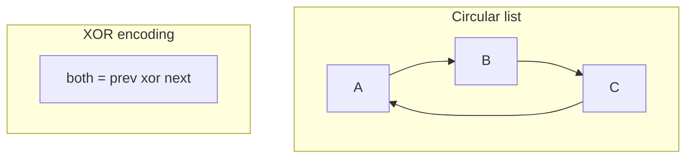
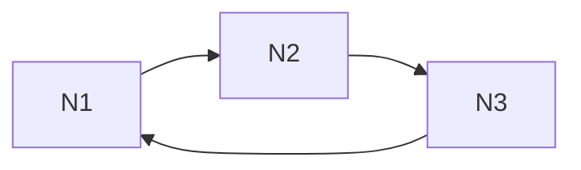
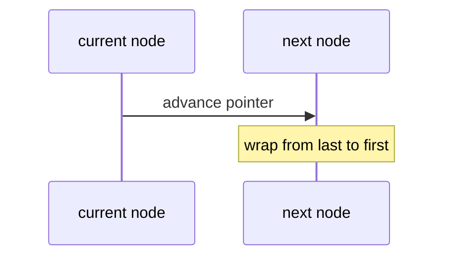

# Circular Lists and XOR Lists Concepts

## Overview

A **circular linked list** closes the chain: the last node's `next` points to the first (and in doubly circular, `prev` links wrap). **Round-robin** schedulers, buffer pools, and Josephus-problem models use circular traversal without null termination.

An **XOR linked list** stores a single ** ptrdiff field** per node encoding both neighbors via `prev XOR next`, halving pointer storage in theory—at the cost of non-portable pointer arithmetic, no direct backward walk without context, and practical obsolescence on modern systems with 64-bit pointers and sanitizers.

This note covers **concepts** for interviews and systems literacy—not a production default.

## Learning Objectives

- Implement circular singly/doubly lists with sentinel or head pointer discipline
- Explain round-robin iteration termination via cycle detection
- Derive XOR list navigation given one endpoint and direction
- Articulate why XOR lists rarely appear in production today
- Compare circular buffer (module 01) vs circular linked list roles

## Prerequisites

- [[04-Data-Structures/02-Linked-Structures/Doubly Linked Lists and Sentinels|Doubly Linked Lists and Sentinels]]
- [[01-Computer-Science/03-Memory-and-Addressing/Pointers References and Aliasing|Pointers References and Aliasing]]

## Difficulty

`advanced`

## Estimated Time

- Reading: 2 hours
- Exercises: 2 hours
- Mini project: 3 hours

## History

Circular lists model **ring networks** and **scheduling tokens**. XOR lists were proposed to save memory when pointers dominated object size (embedded, old 16-bit systems). Modern **cache locality**, **ASLR**, **GC**, and **sanitizer** requirements largely eliminated XOR lists from application code; circular **array** rings ([[04-Data-Structures/01-Contiguous-Sequences/Ring Buffers as Contiguous Queues|ring buffers]]) dominate throughput-sensitive FIFO use cases.

## Problem It Solves

| Need | Circular linked | Alternative |
| --- | --- | --- |
| Round-robin fair scheduling | Walk forever with one pointer | Array ring + index |
| Constant-memory rotating winners | No null sentinel | Deque rotate |
| Theoretical min pointers | XOR list | Doubly linked (practical) |

## Internal Implementation

**Circular singly** with dummy head optional:

- last.next = first
- traverse until return to start (track steps or use head reference)

**XOR list** node stores `both = address(prev) XOR address(next)`; traversing from `prev` and current:

- `next = prev XOR both`



## Mermaid Diagrams

### Structure: circular vs linear termination



### Sequence: round-robin scheduler step



## Examples

### Minimal Example

TypeScript — circular singly (conceptual, not production default):

```typescript
type Node<T> = { value: T; next: Node<T> };

export class CircularList<T> {
  constructor(private tail: Node<T> | null = null) {}

  append(value: T): void {
    const node: Node<T> = { value, next: null! };
    if (!this.tail) {
      node.next = node;
      this.tail = node;
      return;
    }
    node.next = this.tail.next;
    this.tail.next = node;
    this.tail = node;
  }

  rotate(): T | undefined {
    if (!this.tail) return undefined;
    const head = this.tail.next;
    const value = head.value;
    this.tail.next = head.next;
    if (head === this.tail) this.tail = null;
    return value;
  }
}
```

Python — round-robin iterator pattern:

```python
from collections import deque


def round_robin(tasks: list[str], rounds: int) -> list[str]:
    q = deque(tasks)
    out: list[str] = []
    for _ in range(rounds):
        if not q:
            break
        task = q.popleft()
        out.append(task)
        q.append(task)  # circular fairness via deque
    return out


assert round_robin(["a", "b", "c"], 5) == ["a", "b", "c", "a", "b"]
```

### Production-Shaped Example

Prefer **ring buffer** over circular linked list for NIC-style FIFO:

```typescript
// See Ring Buffers note — contiguous, cache-friendly
import { RingBuffer } from "./ring-buffer";

export class PacketQueue<T> {
  private readonly ring = new RingBuffer<T>(4096);
  enqueue(pkt: T): boolean {
    return this.ring.tryEnqueue(pkt);
  }
}
```

XOR list: document as **historical** in code review checklist only.

## Operation Complexity

| Structure | insert | delete at known node | traverse n nodes | pointers/node |
| --- | --- | --- | --- | --- |
| Circular SLL | O(1) at tail | O(1) with refs | O(n) | 1 |
| Circular DLL | O(1) | O(1) | O(n) | 2 |
| XOR list | O(1) | O(1) with context | O(n) | 1 (encoded) |
| Ring buffer | O(1) enqueue | O(1) dequeue | O(n) scan | 0 (indices) |

## Invariants

Circular list:

1. Walk from any node returns to start after exactly `n` steps
2. `n == 0` represented by null tail/head consistently

XOR list (conceptual):

1. `both = xor(prev, next)` at each node
2. Traversal requires previous node address; starting endpoint needs external pointer

## Trade-offs

| Dimension | Upside | Downside | When it matters |
| --- | --- | --- | --- |
| Circular linked | Natural round-robin | Pointer chasing | Schedulers (concept) |
| XOR list | Saves one pointer field | Unsafe, hard debug | Historical embedded |
| Ring buffer array | Locality, bounded | Fixed cap | Production FIFO |
| GC languages | — | XOR impractical | JS/Python avoid XOR |

### When to Use

- Circular **array** rings for bounded FIFO (default production)
- Circular linked lists in teaching, OS theory, competitive puzzles
- XOR lists: interview curiosity, not greenfield code

### When Not to Use

- XOR lists in managed memory languages or teams without sanitizer discipline
- Circular linked for million-element scans
- Any latency-critical queue without measuring vs ring buffer

## Exercises

1. Count nodes in circular list without infinite loop (use head reference + counter).
2. Implement Josephus problem with circular list and with deque — compare.
3. On paper, XOR-navigate three nodes given start prev=null.
4. List reasons ASLR/GC break naive XOR list in C++ application code.
5. When does circular **array** strictly dominate circular **linked**?

## Mini Project

Round-robin task scheduler simulation: circular linked vs deque vs ring buffer — latency and LOC comparison memo.

## Portfolio Project

Add **Concepts** gallery entry in [[04-Data-Structures/projects/Structures Workbench/README|Structures Workbench]] for circular/XOR with "do not use in prod" banner.

## Interview Questions

1. Difference circular linked list vs ring buffer?
2. How stop traversal on circular list?
3. XOR list — what is stored per node?
4. Why XOR lists fell out of favor?
5. Use case for circular list in scheduling?

### Stretch / Staff-Level

1. Prove XOR navigation correctness given prev and current.
2. Lock-free circular queue: linked vs array (module 13 preview).

## Common Mistakes

- Infinite loop without cycle guard in circular walk
- Implementing XOR list in languages with moving GC
- Choosing circular linked for throughput-bound queues
- Confusing circular **index** wrap with circular **pointer** wrap semantics

## Best Practices

- Default to [[04-Data-Structures/01-Contiguous-Sequences/Ring Buffers as Contiguous Queues|ring buffers]] for FIFO
- Use deque round-robin in Python/TS stdlib for fairness demos
- Treat XOR as historical interview topic with safety caveats
- Document termination condition on any circular walk

## Summary

Circular linked lists close the pointer chain for round-robin and cyclic models; XOR lists compress doubly linked information into one field using XOR arithmetic but sacrifice safety and debuggability. Production systems favor contiguous ring buffers for bounded FIFO workloads; circular and XOR linked structures remain conceptual tools for schedulers, puzzles, and understanding pointer tricks—not default engineering choices.

## Further Reading

- [[04-Data-Structures/01-Contiguous-Sequences/Ring Buffers as Contiguous Queues|Ring Buffers as Contiguous Queues]]
- [[04-Data-Structures/02-Linked-Structures/Doubly Linked Lists and Sentinels|Doubly Linked Lists and Sentinels]]
- Wikipedia — XOR linked list (historical context)

## Related Notes

- [[04-Data-Structures/02-Linked-Structures/Linked vs Contiguous Trade-offs|Linked vs Contiguous Trade-offs]]
- [[04-Data-Structures/03-Stacks-Queues-and-Deques/Queues|Queues]]
- [[01-Computer-Science/03-Memory-and-Addressing/Pointers References and Aliasing|Pointers References and Aliasing]]

## Progress Checklist

- [ ] Explained from first principles
- [ ] Drew at least one Mermaid diagram
- [ ] Implemented a minimal version
- [ ] Documented trade-offs and non-goals
- [ ] Completed exercises
- [ ] Practiced interview questions aloud
- [ ] Linked prerequisites and dependents
