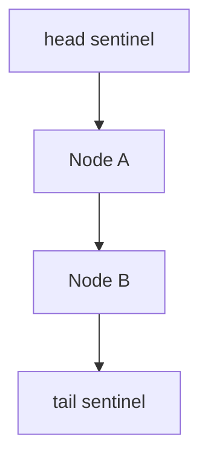
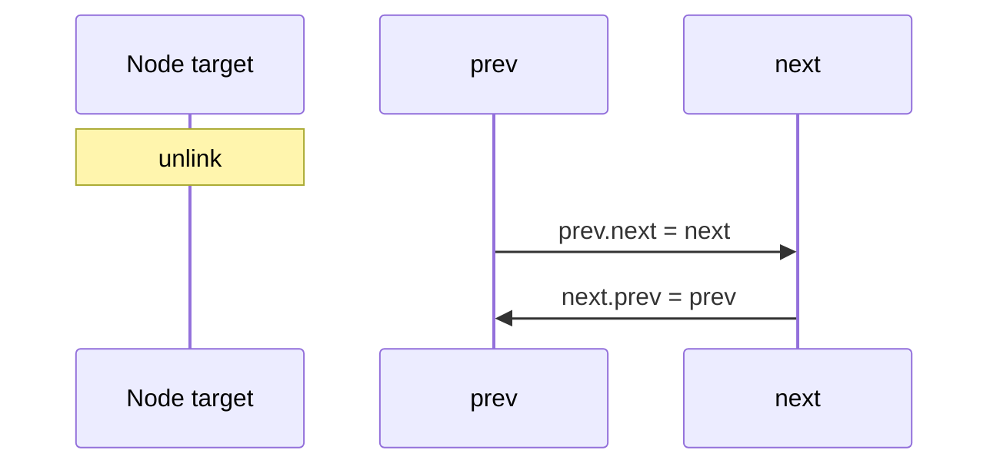

# Doubly Linked Lists and Sentinels

## Overview

A **doubly linked list (DLL)** adds a **prev** pointer to each node, enabling O(1) removal given a node reference without scanning from head. **Sentinel** (dummy head/tail) nodes eliminate special cases for empty lists and boundary inserts—production implementations (LRU caches, Linux `list_head`) rely on this pattern.

DLLs cost an extra pointer per node and more complex invariants than [[04-Data-Structures/02-Linked-Structures/Singly Linked Lists|SLL]], but simplify bidirectional traversal and O(1) deletion anywhere.

## Learning Objectives

- Implement insert/remove with four-pointer rewiring (`prev`/`next` of neighbors)
- Use sentinel nodes to unify edge cases
- Maintain bidirectional invariant checks in debug builds
- Map to LRU cache design (hash map + DLL preview in module 11)
- Compare memory and locality vs SLL and arrays

## Prerequisites

- [[04-Data-Structures/02-Linked-Structures/Singly Linked Lists|Singly Linked Lists]]
- [[04-Data-Structures/00-Orientation-and-Contracts/Invariants Representation and Debug Assertions|Invariants Representation and Debug Assertions]]

## Difficulty

`intermediate`

## Estimated Time

- Reading: 2 hours
- Exercises: 3 hours
- Mini project: 4 hours

## History

Doubly linked structures appear in early systems kernels for schedulers and buffer caches. The **sentinel trick** reduces branchy code—a pattern Knuth and later Linux kernel `list.h` codified. Java `LinkedList` and C++ `list` expose doubly linked semantics with iterator stability on splice.

## Problem It Solves

| Task | SLL | DLL + sentinel |
| --- | --- | --- |
| Delete given node ref | Need predecessor O(n) | O(1) with prev |
| Backward iteration | O(n) re-walk or stack | O(1) per step |
| Insert before node | Hard without prev | O(1) |
| Empty list edge cases | Many branches | Sentinel absorbs |

## Internal Implementation

Node: `{ value, prev, next }`  
Sentinel head/tail dummy nodes linked to each other when empty.


Insert `x` before node `y`:

- `x.next = y; x.prev = y.prev; y.prev.next = x; y.prev = x`

## Mermaid Diagrams

### Structure: sentinel sandwich



### Sequence: O(1) delete node



## Examples

### Minimal Example

TypeScript:

```typescript
type Node<T> = { value: T; prev: Node<T>; next: Node<T> };

export class DoublyLinkedList<T> {
  private readonly head: Node<T>;
  private readonly tail: Node<T>;
  private len = 0;

  constructor() {
    this.head = { value: null as T, prev: null!, next: null! };
    this.tail = { value: null as T, prev: null!, next: null! };
    this.head.next = this.tail;
    this.tail.prev = this.head;
  }

  pushBack(value: T): Node<T> {
    const node: Node<T> = { value, prev: this.tail.prev, next: this.tail };
    this.tail.prev.next = node;
    this.tail.prev = node;
    this.len++;
    return node;
  }

  remove(node: Node<T>): void {
    node.prev.next = node.next;
    node.next.prev = node.prev;
    this.len--;
  }
}
```

Python:

```python
class Node:
    __slots__ = ("value", "prev", "next")

    def __init__(self, value: object) -> None:
        self.value = value
        self.prev: Node | None = None
        self.next: Node | None = None


class DoublyLinkedList:
    def __init__(self) -> None:
        self._head = Node(None)  # sentinel
        self._tail = Node(None)  # sentinel
        self._head.next = self._tail
        self._tail.prev = self._head
        self._len = 0

    def push_back(self, value: object) -> Node:
        node = Node(value)
        prev = self._tail.prev
        assert prev is not None
        prev.next = node
        node.prev = prev
        node.next = self._tail
        self._tail.prev = node
        self._len += 1
        return node

    def remove(self, node: Node) -> None:
        assert node.prev and node.next
        node.prev.next = node.next
        node.next.prev = node.prev
        self._len -= 1
```

### Production-Shaped Example

LRU eviction chain skeleton (map detail in module 11):

```typescript
type LruNode<K, V> = { key: K; value: V; prev: LruNode<K, V>; next: LruNode<K, V> };

export class LruList<K, V> {
  private readonly head = { prev: null!, next: null! } as LruNode<K, V>;
  private readonly tail = { prev: null!, next: null! } as LruNode<K, V>;

  constructor() {
    this.head.next = this.tail;
    this.tail.prev = this.head;
  }

  moveToFront(node: LruNode<K, V>): void {
    this.detach(node);
    this.insertAfter(this.head, node);
  }
  // detach + insertAfter ...
}
```

Cross-link: [[04-Data-Structures/11-Caches-and-Eviction/LRU via Hash Map and Doubly Linked List|LRU via Hash Map and Doubly Linked List]].

## Operation Complexity

| Operation | Time | Space |
| --- | --- | --- |
| push front/back | O(1) | O(1) node |
| remove known node | O(1) | O(1) |
| search | O(n) | O(1) |
| index access | O(n) | — |
| Storage | — | O(n) × (value + 2 pointers) |

## Invariants

1. For every real node `n`: `n.prev.next === n` and `n.next.prev === n`
2. Sentinels never hold user values (or values ignored)
3. List acyclic between sentinels
4. `len` equals count of nodes between sentinels

## Trade-offs

| Dimension | Upside | Downside | When it matters |
| --- | --- | --- | --- |
| vs SLL | O(1) delete at node | Extra prev pointer | LRU, editor undo |
| vs array | Stable iterators on splice | Cache misses | Cache structures |
| Sentinels | Cleaner code | Two dummy nodes | Kernel-style lists |
| Intrusive DLL | Embed in structs | Type safety harder | C/Rust systems |

### When to Use

- LRU/LFU structures needing move-to-front
- Stable node references with frequent middle removal
- Bidirectional iteration

### When Not to Use

- Read-mostly sequential data (array wins)
- Memory-minimal embedded (SLL or array)

## Exercises

1. Implement `insertBefore` and `insertAfter` with sentinels.
2. Write `check()` verifying all bidirectional links.
3. Delete from empty list — show sentinel prevents null deref.
4. Implement LRU get/put with hash map + DLL (mini).
5. Compare node size: SLL vs DLL on 64-bit arch.

## Mini Project

Full doubly linked list + invariant tests; optional LRU cap layer.

## Portfolio Project

DLL + sentinel visualization in [[04-Data-Structures/projects/Structures Workbench/README|Structures Workbench]].

## Interview Questions

1. Why doubly linked for LRU?
2. Role of sentinel nodes?
3. O(1) delete given node pointer — steps?
4. Memory cost vs singly linked?
5. Iterator stability on DLL splice?

### Stretch / Staff-Level

1. Linux `list_head` intrusive pattern vs OO wrapper lists.
2. Thread-safe DLL — why hard without locks?

## Common Mistakes

- Forgetting to update both directions on insert
- Removing node without detaching from both neighbors
- Stale node reference after remove
- Special-casing empty list when sentinels would simplify

## Best Practices

- Always use sentinels in production DLL code paths
- Centralize `link`/`unlink` helpers
- Debug `check()` after mutations
- Document node ownership after removal

## Summary

Doubly linked lists add prev pointers and sentinel nodes so insertion, deletion, and bidirectional traversal at known nodes are O(1) with uniform edge-case code. Extra memory and pointer chasing limit their use for bulk analytics, but they remain the backbone of LRU caches and intrusive kernel lists where stable node identity and constant-time splicing dominate.

## Further Reading

- [[04-Data-Structures/11-Caches-and-Eviction/LRU via Hash Map and Doubly Linked List|LRU via Hash Map and Doubly Linked List]]
- Linux kernel list.h documentation
- [[04-Data-Structures/02-Linked-Structures/Singly Linked Lists|Singly Linked Lists]]

## Related Notes

- [[04-Data-Structures/02-Linked-Structures/Circular Lists and XOR Lists Concepts|Circular Lists and XOR Lists Concepts]]
- [[04-Data-Structures/02-Linked-Structures/Linked vs Contiguous Trade-offs|Linked vs Contiguous Trade-offs]]
- [[04-Data-Structures/00-Orientation-and-Contracts/Invariants Representation and Debug Assertions|Invariants Representation and Debug Assertions]]

## Progress Checklist

- [ ] Explained from first principles
- [ ] Drew at least one Mermaid diagram
- [ ] Implemented a minimal version
- [ ] Documented trade-offs and non-goals
- [ ] Completed exercises
- [ ] Practiced interview questions aloud
- [ ] Linked prerequisites and dependents
