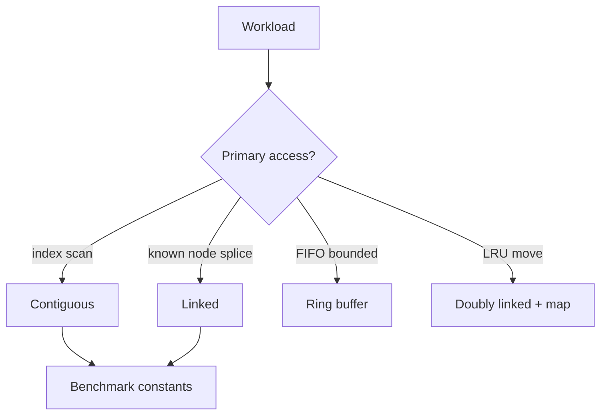
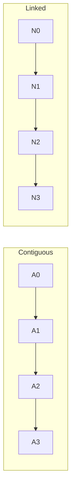
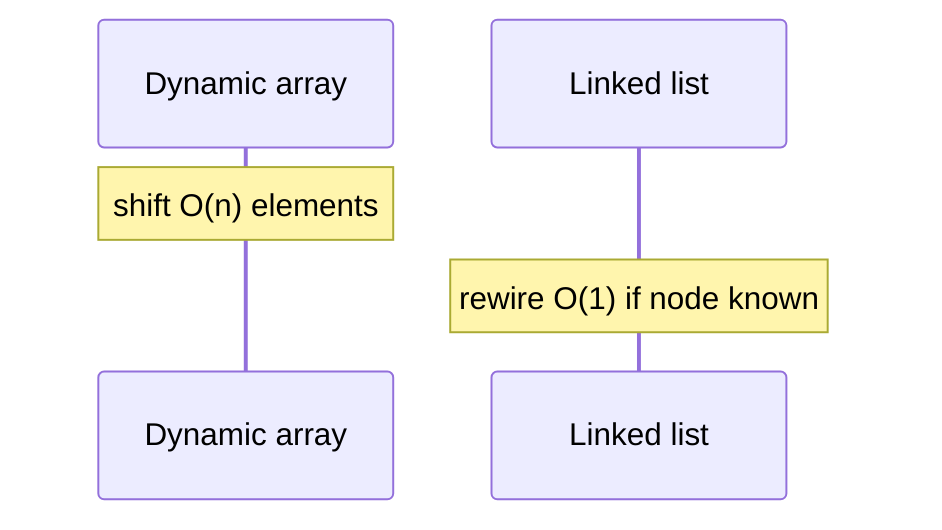

# Linked vs Contiguous Trade-offs

## Overview

**Contiguous** structures (arrays, vectors, ring buffers) store elements in consecutive address slots; **linked** structures scatter nodes connected by pointers. Asymptotic costs differ on paper—both offer O(1) insert at some position—but **constants, cache behavior, allocator pressure, and iterator stability** decide production winners.

This synthesis note compares modules **01** and **02** so later linear structures (stacks, queues, deques) and caches choose representations deliberately.

## Learning Objectives

- Build a decision matrix from access patterns to contiguous vs linked
- Quantify memory overhead (pointer per node, capacity slack)
- Explain cache miss implications on sequential traversal
- Match workloads: scan-heavy, splice-heavy, bounded FIFO, LRU
- Avoid LeetCode-default "linked list" without workload justification

## Prerequisites

- [[04-Data-Structures/01-Contiguous-Sequences/Dynamic Arrays and Amortized Growth|Dynamic Arrays and Amortized Growth]]
- [[04-Data-Structures/02-Linked-Structures/Singly Linked Lists|Singly Linked Lists]]
- [[04-Data-Structures/00-Orientation-and-Contracts/Memory Layout Locality and Allocation Patterns|Memory Layout Locality and Allocation Patterns]]

## Difficulty

`intermediate`

## Estimated Time

- Reading: 2 hours
- Exercises: 3 hours
- Mini project: 4 hours

## History

1980s–1990s curricula favored linked lists for dynamic memory teaching. 2000s+ **memory wall** and allocator profiling shifted guidance: **dynamic arrays default**, linked lists for specific splice/LRU patterns. Modern languages embed both (`Vec` vs `LinkedList`, Python `list` vs rarely used custom nodes).

## Problem It Solves

Teams debate structures without a shared framework:

| Question | This note answers |
| --- | --- |
| "Insert is O(1) so use linked list" | Only at known node; search may be O(n); cache cost |
| "Array insert is O(n) always bad" | Append/back is O(1) amortized; scans win |
| "Deque must be linked" | Ring buffer or chunked array often wins |

## Internal Implementation

Decision flow:



## Mermaid Diagrams

### Structure: memory layout contrast



### Sequence: insert middle comparison



## Examples

### Minimal Example

TypeScript — benchmark harness skeleton:

```typescript
function sumArray(a: number[]): number {
  let s = 0;
  for (let i = 0; i < a.length; i++) s += a[i]!;
  return s;
}

type Node = { v: number; next: Node | null };

function sumList(head: Node | null): number {
  let s = 0;
  let cur = head;
  while (cur) {
    s += cur.v;
    cur = cur.next;
  }
  return s;
}
```

Python:

```python
import time


def time_scan_array(n: int) -> float:
    xs = list(range(n))
    t0 = time.perf_counter()
    sum(xs)
    return time.perf_counter() - t0


def time_scan_list(n: int) -> float:
    head = None
    for i in range(n):
        head = {"v": i, "next": head}
    t0 = time.perf_counter()
    s, cur = 0, head
    while cur:
        s += cur["v"]
        cur = cur["next"]
    assert s == n * (n - 1) // 2
    return time.perf_counter() - t0
```

### Production-Shaped Example

Selection memo in code comments:

```typescript
/**
 * Event buffer: 50k/sec append-only, sequential drain each second.
 * CHOICE: RingBuffer (contiguous) — not LinkedQueue.
 * REASON: locality + fixed RSS cap; splice identity not required.
 * SEE: Linked vs Contiguous Trade-offs note.
 */
```

Cross-link: [[04-Data-Structures/14-Production-Selection/Structure Selection Decision Matrix|Structure Selection Decision Matrix]] (later module).

## Operation Complexity

Side-by-side (n elements):

| Operation | Dynamic array | Singly linked | Doubly linked |
| --- | --- | --- | --- |
| Access index i | O(1) | O(n) | O(n) |
| Scan all | O(n) fast constants | O(n) slow constants | O(n) slow |
| Push back | O(1) amortized | O(1) with tail | O(1) with tail |
| Insert middle | O(n) shift | O(1)* | O(1)* |
| Delete middle | O(n) | O(1)* | O(1)* |
| Memory | n × elem + slack | n × (elem+ptr) | n × (elem+2ptr) |

\*Requires pointer to position; finding it O(n).

## Invariants

Selection process invariants:

1. Document **primary operation mix** before choosing
2. Benchmark with **production object size** and allocation rate
3. Revisit choice when mix shifts (read-heavy → write-heavy)

## Trade-offs

| Dimension | Contiguous wins | Linked wins |
| --- | --- | --- |
| Sequential read | Cache lines | — |
| Index access | O(1) | — |
| Known-node splice | — | O(1) |
| Stable node identity | Moves on resize | Node address stable |
| Memory overhead | Slack capacity | Pointers + fragmentation |
| Allocator/GC | Fewer objects | Many small objects |

### When to Use Contiguous

- Append/back pop, index loops, numerical data, ring-buffer FIFO
- Known bounded capacity streaming

### When to Use Linked

- LRU/LFU intrusive chains with hash map
- Graph adjacency (variable degree)
- Frequent O(1) removal given stable node ref

### When Not to Use Linked

- Default dynamic sequence in application code
- Million-element aggregation pipelines

## Exercises

1. Fill decision matrix for: (a) log buffer, (b) LRU cache, (c) graph BFS queue.
2. Measure array vs list scan at n=10⁵, 10⁶ on your machine.
3. Estimate bytes for 100k `int` in array vs linked (64-bit).
4. Argue against linked list in coding interview without workload context.
5. When does `Array.splice` make array middle insert competitive?

## Mini Project

**Bake-off report**: same ADT (queue) as ring buffer, dynamic array queue (bad), linked queue — p50/p99 and RSS table.

## Portfolio Project

Decision wizard step in [[04-Data-Structures/projects/Structures Workbench/README|Structures Workbench]] recommending contiguous vs linked from workload quiz.

## Interview Questions

1. Array vs linked list — default choice and why?
2. Linked list O(1) insert — hidden costs?
3. Iterator invalidation differences?
4. When linked list beats array in real systems?
5. Ring buffer vs linked queue?

### Stretch / Staff-Level

1. Unrolled linked lists and B-tree nodes as middle ground.
2. SoA + index arrays vs linked for graph storage.

## Common Mistakes

- Teaching linked as universal dynamic sequence
- Ignoring tail pointer on linked append
- Using linked for CPU-bound scans
- Forgetting resize invalidates array iterators/views

## Best Practices

- Default contiguous; justify linked with measured splice/LRU need
- Document crossover n from benchmarks in module README
- Pair structure with allocator strategy (arena for graph builds)
- Link to [[04-Data-Structures/00-Orientation-and-Contracts/Complexity Tables Amortization and Practical Constants|complexity tables]]

## Summary

Contiguous structures win cache-friendly scans, indexing, and bounded ring FIFOs; linked structures win stable-node splices and LRU-style reordering at known nodes. Big-O alone misleads when search to find insertion point is linear and each node triggers allocation. Production engineering documents access patterns, measures constants, and picks ring buffers or vectors before linked lists unless identity or O(1) unlink at node reference is core to the design.

## Further Reading

- [[04-Data-Structures/00-Orientation-and-Contracts/Memory Layout Locality and Allocation Patterns|Memory Layout Locality and Allocation Patterns]]
- [[01-Computer-Science/02-Machine-Model/Cache Hierarchy and Locality|Cache Hierarchy and Locality]]
- Bjarne Stroustrup — vector vs list guidance

## Related Notes

- [[04-Data-Structures/01-Contiguous-Sequences/Ring Buffers as Contiguous Queues|Ring Buffers as Contiguous Queues]]
- [[04-Data-Structures/02-Linked-Structures/Doubly Linked Lists and Sentinels|Doubly Linked Lists and Sentinels]]
- [[04-Data-Structures/03-Stacks-Queues-and-Deques/Deques|Deques]]
- [[04-Data-Structures/14-Production-Selection/Structure Selection Decision Matrix|Structure Selection Decision Matrix]]

## Progress Checklist

- [ ] Explained from first principles
- [ ] Drew at least one Mermaid diagram
- [ ] Implemented a minimal version
- [ ] Documented trade-offs and non-goals
- [ ] Completed exercises
- [ ] Practiced interview questions aloud
- [ ] Linked prerequisites and dependents
