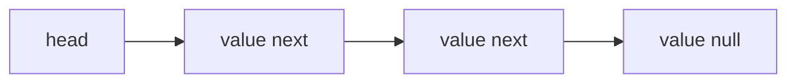
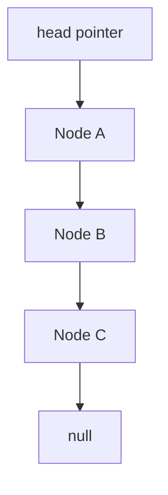
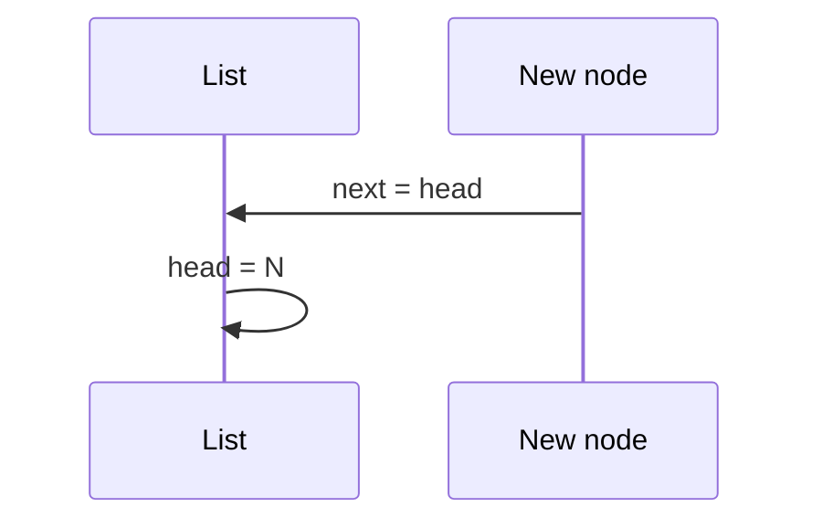

# Singly Linked Lists

## Overview

A **singly linked list (SLL)** stores elements in **nodes** `{ value, next }` where each node points to the successor. The list is accessed via a **head** pointer; traversal follows `next` chains. Insert/delete at a **known node** (or at head) is O(1); search by value is O(n).

SLLs trade **cache locality** for **stable node identity** and O(1) splices without shifting contiguous memory.

## Learning Objectives

- Implement head insert, delete, and search with correct pointer updates
- Analyze memory overhead vs dynamic arrays
- Avoid losing nodes when rewiring `next`
- Implement iterative and recursive traversal with stack depth awareness
- Recognize when SLL loses to contiguous structures on real hardware

## Prerequisites

- [[01-Computer-Science/03-Memory-and-Addressing/Pointers References and Aliasing|Pointers References and Aliasing]]
- [[04-Data-Structures/00-Orientation-and-Contracts/Memory Layout Locality and Allocation Patterns|Memory Layout Locality and Allocation Patterns]]

## Difficulty

`beginner`

## Estimated Time

- Reading: 2 hours
- Exercises: 3 hours
- Mini project: 4 hours

## History

Lisp **cons cells** (1958) popularized linked lists as a primary sequential structure. For decades, linked lists were taught as default dynamic sequences until **cache-aware analysis** and dynamic arrays reasserted dominance for most workloads—while SLLs remain vital for **intrusive lists**, **graph adjacency**, and **allocator free lists**.

## Problem It Solves

SLL excels when:

- Insert/delete at a known position without shifting n elements
- Structure size unbounded and middle insertion rare but pointer already known
- Need stable node references (LRU chain nodes—see module 11 preview)

Fails when:

- Random access or scan-heavy analytics (use [[04-Data-Structures/01-Contiguous-Sequences/Dynamic Arrays and Amortized Growth|dynamic array]])
- Cache-sensitive iteration over large n

## Internal Implementation



Operations:

- **prepend**: new.next = head; head = new
- **delete after prev**: prev.next = prev.next.next (requires prev pointer for O(1) delete at node)

## Mermaid Diagrams

### Structure



### Sequence: prepend



## Examples

### Minimal Example

TypeScript:

```typescript
type Node<T> = { value: T; next: Node<T> | null };

export class SinglyLinkedList<T> {
  private head: Node<T> | null = null;
  private len = 0;

  prepend(value: T): void {
    this.head = { value, next: this.head };
    this.len++;
  }

  find(value: T): Node<T> | null {
    let cur = this.head;
    while (cur) {
      if (cur.value === value) return cur;
      cur = cur.next;
    }
    return null;
  }
}
```

Python:

```python
from dataclasses import dataclass


@dataclass
class Node:
    value: object
    next: "Node | None" = None


class SinglyLinkedList:
    def __init__(self) -> None:
        self.head: Node | None = None
        self._len = 0

    def prepend(self, value: object) -> None:
        self.head = Node(value, self.head)
        self._len += 1

    def find(self, value: object) -> Node | None:
        cur = self.head
        while cur:
            if cur.value == value:
                return cur
            cur = cur.next
        return None
```

### Production-Shaped Example

Intrusive task list node embedded in work item (stable pointer for cancel):

```typescript
export type Task = {
  id: string;
  next: Task | null;
  payload: Uint8Array;
};

export function removeTask(head: Task | null, target: Task): Task | null {
  if (!head) return null;
  if (head === target) return head.next;
  let prev = head;
  while (prev.next && prev.next !== target) prev = prev.next;
  if (prev.next) prev.next = prev.next.next;
  return head;
}
```

Cross-link: [[04-Data-Structures/02-Linked-Structures/Linked vs Contiguous Trade-offs|Linked vs Contiguous Trade-offs]].

## Operation Complexity

| Operation | Time | Notes |
| --- | --- | --- |
| prepend | O(1) | |
| search by value | O(n) | |
| insert after known node | O(1) | must hold node ref |
| delete at head | O(1) | |
| delete arbitrary | O(n) find + O(1) splice | |
| index i access | O(n) | no random access |
| Space | O(n) | + pointer per node |

## Invariants

1. List is acyclic (no cycles unless intentional circular variant)
2. `len` equals number of nodes reachable from head
3. Last node's `next` is null (standard SLL)
4. All nodes reachable from head belong to this list (no shared cycles across lists without documentation)

## Trade-offs

| Dimension | Upside | Downside | When it matters |
| --- | --- | --- | --- |
| vs array | O(1) splice at node | Poor scan locality | LRU, intrusive queues |
| Memory | No reallocation copy | Extra pointer + alloc | Small n vs large n |
| GC languages | Node churn | Allocation pressure | High insert rate |
| Recursion | Elegant | Stack overflow on long list | Deep lists |

### When to Use

- Known-node insertion/deletion
- Unbounded size with infrequent index access
- Building block for adjacency lists

### When Not to Use

- Index-heavy workloads
- Cache-bound sequential processing of millions of elements

## Exercises

1. Implement `append` — why O(n) without tail pointer?
2. Add tail pointer; make append O(1).
3. Detect cycle in list (Floyd).
4. Reverse list iteratively in O(n) time O(1) space.
5. Compare RSS for 100k integers in list vs array.

## Mini Project

Dual-language SLL with shared test vectors: prepend, find, delete, reverse.

## Portfolio Project

SLL module in [[04-Data-Structures/projects/Structures Workbench/README|Structures Workbench]] with locality comparison chart vs vector.

## Interview Questions

1. O(1) prepend but O(n) access by index — why?
2. Delete node given only pointer to node in SLL?
3. Detect cycle?
4. Memory overhead vs array?
5. When prefer SLL in production?

### Stretch / Staff-Level

1. Lock-free singly linked stack — hazard pointers preview.
2. Unrolled linked list concept.

## Common Mistakes

- Losing rest of list when setting head incorrectly
- O(n²) append without tail
- Infinite loop on accidental cycle
- Using SLL for hot path scans

## Best Practices

- Maintain tail pointer if append-heavy
- Iterative over recursive for unbounded depth
- `check()` acyclicity in debug builds
- Document node ownership/lifetime

## Summary

Singly linked lists chain nodes through next pointers, enabling O(1) head operations and O(1) splices at known nodes at the cost of O(n) search and poor sequential locality. They remain the right tool when stable node identity and constant-time removal matter more than cache-friendly scans—otherwise prefer contiguous sequences from module 01.

## Further Reading

- [[04-Data-Structures/02-Linked-Structures/Doubly Linked Lists and Sentinels|Doubly Linked Lists and Sentinels]]
- [[04-Data-Structures/02-Linked-Structures/Linked vs Contiguous Trade-offs|Linked vs Contiguous Trade-offs]]
- CLRS — linked list operations

## Related Notes

- [[04-Data-Structures/08-Graphs-as-Representation/Adjacency Lists|Adjacency Lists]]
- [[04-Data-Structures/03-Stacks-Queues-and-Deques/Queues|Queues]]
- [[04-Data-Structures/00-Orientation-and-Contracts/Invariants Representation and Debug Assertions|Invariants Representation and Debug Assertions]]

## Progress Checklist

- [ ] Explained from first principles
- [ ] Drew at least one Mermaid diagram
- [ ] Implemented a minimal version
- [ ] Documented trade-offs and non-goals
- [ ] Completed exercises
- [ ] Practiced interview questions aloud
- [ ] Linked prerequisites and dependents
