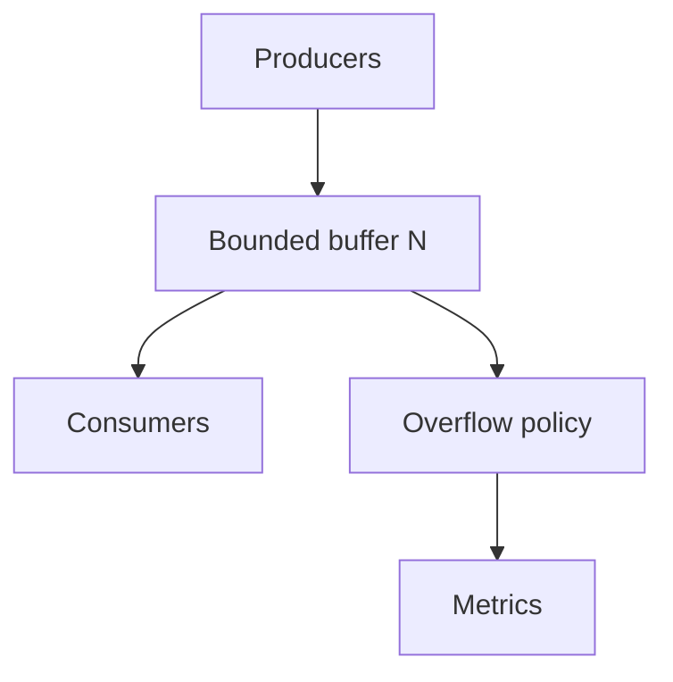
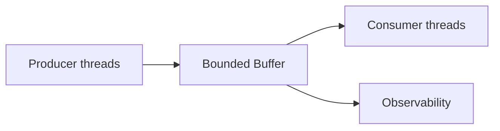
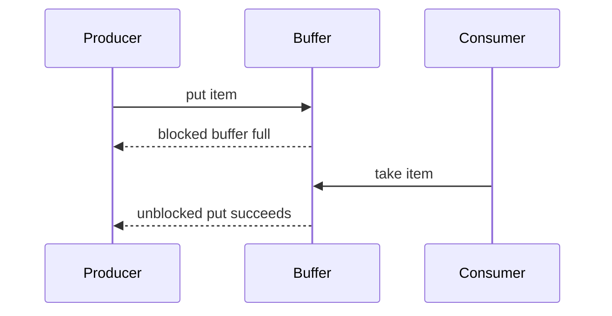

# Bounded Buffers and Producer-Consumer Interfaces

## Overview

A **bounded buffer** is a fixed-capacity queue connecting **producers** (enqueue) and **consumers** (dequeue). When full, producers must **block**, **drop**, or **evict** according to explicit **overflow policy**—this is **backpressure**, essential for stable systems under burst load.

The pattern appears in OS pipe buffers, thread pools, async channels, logging pipelines, and stream processing—distinct from unbounded in-memory queues that hide overload until OOM. Service-level product queues (Kafka, SQS) belong in [[07-Backend/README|Backend]]; here we focus on **in-process contracts and ring-buffer mechanics**.

## Learning Objectives

- Design producer/consumer APIs with try/block/drop/evict policies
- Implement bounded buffer on [[04-Data-Structures/01-Contiguous-Sequences/Ring Buffers as Contiguous Queues|ring buffer]] storage
- Explain race conditions without synchronization ([[01-Computer-Science/05-Concurrency-Fundamentals/Race Conditions|Race Conditions]])
- Instrument drops, high water mark, and wait time for operability
- Map single-producer single-consumer vs multi-producer multi-consumer requirements

## Prerequisites

- [[04-Data-Structures/03-Stacks-Queues-and-Deques/Queues|Queues]]
- [[04-Data-Structures/01-Contiguous-Sequences/Ring Buffers as Contiguous Queues|Ring Buffers as Contiguous Queues]]
- [[01-Computer-Science/05-Concurrency-Fundamentals/Race Conditions|Race Conditions]]

## Difficulty

`advanced`

## Estimated Time

- Reading: 2.5 hours
- Exercises: 3 hours
- Mini project: 5 hours

## History

Dijkstra's semaphores formalized bounded buffer synchronization (1960s). Producer-consumer is a classic **operating systems** pattern. Modern frameworks (Reactive Streams `request(n)`, gRPC flow control, async `Channel` capacity) reinvent the same backpressure principle at network scale—this note grounds the in-memory core.

## Problem It Solves

| Unbounded queue failure | Bounded buffer response |
| --- | --- |
| Memory exhaustion under spike | Cap + drop/block policy |
| Unbounded downstream latency | Slow consumer signals full |
| Silent data loss without metrics | Expose drops/evictions |
| Thundering herd on retry | Block with timeout |

## Internal Implementation

Components:

1. **Storage** — ring buffer of capacity N
2. **Policy** — block | drop-newest | drop-oldest | reject with error
3. **Synchronization** — mutex/condvar (MPMC) or lock-free (SPSC) — details in module 13
4. **Metrics** — enqueued, dequeued, dropped, max occupancy



## Mermaid Diagrams

### Structure: producer-consumer coupling



### Sequence: block on full



## Examples

### Minimal Example

TypeScript — non-blocking bounded buffer:

```typescript
export enum OverflowPolicy {
  Reject = "reject",
  DropOldest = "drop-oldest",
}

export class BoundedBuffer<T> {
  private readonly ring: (T | undefined)[];
  private head = 0;
  private size = 0;

  constructor(
    private readonly capacity: number,
    private readonly policy: OverflowPolicy = OverflowPolicy.Reject,
    readonly metrics = { produced: 0, consumed: 0, dropped: 0, maxSize: 0 },
  ) {
    this.ring = new Array(capacity);
  }

  tryPut(item: T): boolean {
    if (this.size >= this.capacity) {
      if (this.policy === OverflowPolicy.Reject) {
        this.metrics.dropped++;
        return false;
      }
      this.tryTake(); // drop oldest
      this.metrics.dropped++;
    }
    const tail = (this.head + this.size) % this.capacity;
    this.ring[tail] = item;
    this.size++;
    this.metrics.produced++;
    this.metrics.maxSize = Math.max(this.metrics.maxSize, this.size);
    return true;
  }

  tryTake(): T | undefined {
    if (this.size === 0) return undefined;
    const item = this.ring[this.head] as T;
    this.ring[this.head] = undefined;
    this.head = (this.head + 1) % this.capacity;
    this.size--;
    this.metrics.consumed++;
    return item;
  }
}
```

Python — `queue.Queue` with maxsize (blocking):

```python
import queue
import threading


def worker(q: queue.Queue[int], out: list[int]) -> None:
    while True:
        item = q.get()
        if item == -1:
            q.task_done()
            break
        out.append(item)
        q.task_done()


def demo() -> None:
    q: queue.Queue[int] = queue.Queue(maxsize=3)
    results: list[int] = []
    t = threading.Thread(target=worker, args=(q, results))
    t.start()
    for i in range(5):
        q.put(i)  # blocks when full — backpressure
    q.put(-1)
    t.join()
    assert results == [0, 1, 2, 3, 4]
```

### Production-Shaped Example

Async channel with timeout and metrics (conceptual TypeScript):

```typescript
export interface BufferMetrics {
  depth: number;
  drops: number;
  waitMsP99: number;
}

export interface ProducerConsumer<T> {
  offer(item: T, timeoutMs: number): boolean;
  poll(timeoutMs: number): Promise<T | undefined>;
  metrics(): BufferMetrics;
}
```

Document policy in runbook: **Reject** for billing events, **DropOldest** for video frames.

Cross-link: [[04-Data-Structures/00-Orientation-and-Contracts/Interface Design Capacity Errors and Iteration|Interface Design]].

## Operation Complexity

| Operation | SPSC lock-free | Mutex MPMC | Notes |
| --- | --- | --- | --- |
| put/take | O(1) | O(1) + contention | Contention dominates |
| metrics read | O(1) atomic | O(1) under lock | Export to Prometheus |
| resize | N/A fixed cap | N/A | Changing N requires new buffer |

## Invariants

1. `0 <= size <= capacity` always
2. Element count matches producer-consumer accounting under defined loss policy
3. **Happens-before** between put and take when synchronized (consumer sees published item)
4. Drop-oldest policy: dequeuing oldest before insert preserves capacity bound without blocking

## Trade-offs

| Policy | Upside | Downside | When it matters |
| --- | --- | --- | --- |
| Block on full | No data loss | Latency cascade | Job queues |
| Reject | Fast fail | Caller must retry | API gateways |
| Drop newest | Keeps stale pipeline | Loses fresh data | Metrics sampling |
| Drop oldest | Keeps fresh | Loses history | Video/live stats |
| Unbounded | Simple API | OOM risk | Never in prod hot paths |

### When to Use

- Any pipeline stage faster than downstream
- Thread/async task handoff with memory caps
- Logging/metrics batchers

### When Not to Use

- Cross-service durability — use Backend messaging
- When lossless required without block — redesign consumer capacity

## Exercises

1. Simulate producers faster than consumers; chart depth over time for each overflow policy.
2. Identify data race in naive ring put/take without locks (two threads).
3. Define metrics alert when `maxSize > 0.8 * capacity` for 5 minutes.
4. Compare Python `Queue(maxsize=n)` block vs asyncio `Queue`.
5. Map Reactive Streams `request(n)` to bounded buffer semantics.

## Mini Project

SPSC bounded ring buffer with optional mutex wrapper; load test producing p99 wait times.

## Portfolio Project

Producer-consumer stage in [[04-Data-Structures/projects/Structures Workbench/README|Structures Workbench]] with policy switch and live metrics chart.

## Interview Questions

1. What is backpressure?
2. Bounded vs unbounded queue in production?
3. Drop-oldest vs block — trade-offs?
4. Why ring buffer for bounded queue storage?
5. SPSC vs MPMC — synchronization difference?

### Stretch / Staff-Level

1. Design lossless pipeline with bounded stages and autoscaling consumers.
2. False sharing on head/tail counters — mitigation preview.

## Common Mistakes

- Unbounded queue between microservices stages in one process
- No metrics on drops
- Blocking forever without timeout/cancellation
- Using non-thread-safe ring from multiple producers without sync

## Best Practices

- Choose overflow policy explicitly in API docs and runbooks
- Export depth, drops, wait time histograms
- Size buffer from measured producer/consumer rates (Little's Law intuition)
- Defer distributed queues to Backend; keep in-process buffer bounded

## Summary

Bounded buffers implement producer-consumer coupling with fixed capacity and explicit overflow policies that translate overload into block, reject, or controlled loss—backpressure that protects memory and downstream latency. Ring buffers provide efficient storage; correctness under concurrency requires synchronization analyzed in CS concurrency notes and DS module 13. Operability demands metrics on depth and drops, not silent failure modes.

## Further Reading

- [[01-Computer-Science/05-Concurrency-Fundamentals/Race Conditions|Race Conditions]]
- [[04-Data-Structures/13-Concurrency-Aware-Structures/Concurrent Queues|Concurrent Queues]]
- Reactive Streams specification (backpressure protocol)

## Related Notes

- [[04-Data-Structures/01-Contiguous-Sequences/Ring Buffers as Contiguous Queues|Ring Buffers as Contiguous Queues]]
- [[04-Data-Structures/03-Stacks-Queues-and-Deques/Queues|Queues]]
- [[04-Data-Structures/00-Orientation-and-Contracts/Interface Design Capacity Errors and Iteration|Interface Design Capacity Errors and Iteration]]
- [[07-Backend/README|Backend Track]] (distributed queues)

## Progress Checklist

- [ ] Explained from first principles
- [ ] Drew at least one Mermaid diagram
- [ ] Implemented a minimal version
- [ ] Documented trade-offs and non-goals
- [ ] Completed exercises
- [ ] Practiced interview questions aloud
- [ ] Linked prerequisites and dependents
