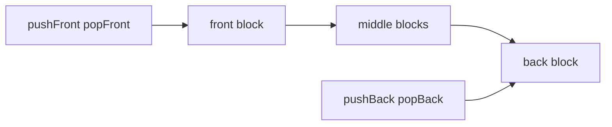
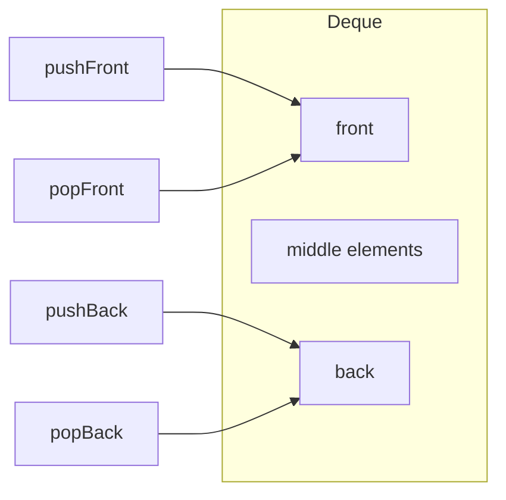
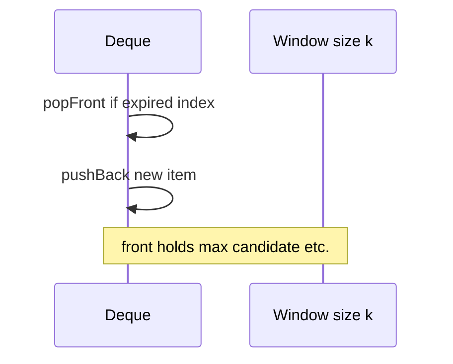

# Deques

## Overview

A **deque** (double-ended queue) ADT allows **push and pop at both front and back** in O(1) amortized time. It generalizes [[04-Data-Structures/03-Stacks-Queues-and-Deques/Stacks|Stacks]] (one end) and [[04-Data-Structures/03-Stacks-Queues-and-Deques/Queues|Queues]] (enqueue one side, dequeue other) while supporting patterns like sliding windows, work-stealing deques, and palindrome checks.

Implementations use **chunked blocks**, **circular buffers with growth**, or **doubly linked lists**—Python `collections.deque` and C++ `std::deque` are production references.

## Learning Objectives

- Implement deque operations on both ends with O(1) amortized bounds
- Explain why naive dynamic array fails on front insert (O(n) shift)
- Compare chunked deque vs ring buffer vs doubly linked deque
- Apply deque to sliding window max/min (algorithm handoff preview)
- Document iterator and snapshot semantics

## Prerequisites

- [[04-Data-Structures/03-Stacks-Queues-and-Deques/Stacks|Stacks]]
- [[04-Data-Structures/03-Stacks-Queues-and-Deques/Queues|Queues]]
- [[04-Data-Structures/01-Contiguous-Sequences/Dynamic Arrays and Amortized Growth|Dynamic Arrays and Amortized Growth]]

## Difficulty

`intermediate`

## Estimated Time

- Reading: 2 hours
- Exercises: 3 hours
- Mini project: 4 hours

## History

Deques appear in work-stealing schedulers (Cilk, Java ForkJoin) as ** Chase-Lev deques** for parallel task theft. STL `deque` (1990s) uses chunk map of fixed arrays. Python added `deque` in 2.4 as O(1) both-end operations replacing list hacks.

## Problem It Solves

| Need | Single-ended structure | Deque |
| --- | --- | --- |
| Stack only | stack | deque still ok |
| Queue only | queue/deque | deque |
| Push/pop both ends | list O(n) front | deque O(1) |
| Sliding window over stream | awkward | deque of candidates |

## Internal Implementation

**Chunked approach**: array of fixed-size blocks + front/back pointers within blocks—avoids whole-buffer shift.

**Ring buffer growth**: copy to larger ring on full—simpler but resize spikes.



## Mermaid Diagrams

### Structure: deque as two-ended access



### Sequence: sliding window maintenance



## Examples

### Minimal Example

TypeScript — pedagogical chunked deque sketch:

```typescript
export class SimpleDeque<T> {
  private chunks: T[][] = [[]];
  private frontIdx = 0;
  private backIdx = 0;
  private size = 0;
  private readonly block = 64;

  pushBack(value: T): void {
    let last = this.chunks[this.chunks.length - 1]!;
    if (last.length >= this.block) {
      last = [];
      this.chunks.push(last);
    }
    last.push(value);
    this.size++;
  }

  popFront(): T | undefined {
    if (this.size === 0) return undefined;
    const first = this.chunks[0]!;
    const v = first[this.frontIdx++];
    if (this.frontIdx >= first.length) {
      this.chunks.shift();
      this.frontIdx = 0;
    }
    this.size--;
    return v;
  }
}
```

Python — production deque usage:

```python
from collections import deque


def sliding_window_max(nums: list[int], k: int) -> list[int]:
    """Monotonic deque pattern — algorithm detail in Algorithms track."""
    dq: deque[int] = deque()
    out: list[int] = []
    for i, x in enumerate(nums):
        while dq and dq[0] <= i - k:
            dq.popleft()
        while dq and nums[dq[-1]] <= x:
            dq.pop()
        dq.append(i)
        if i >= k - 1:
            out.append(nums[dq[0]])
    return out


assert sliding_window_max([1, 3, -1, -3, 5, 3, 6, 7], 3) == [3, 3, 5, 5, 6, 7]
```

### Production-Shaped Example

Work-stealing deque interface (single-owner push/pop, steal from opposite end):

```typescript
export interface WorkStealingDeque<T> {
  pushBottom(task: T): void;
  popBottom(): T | undefined;
  stealTop(): T | undefined; // concurrent — module 13
}
```

Cross-link: [[04-Data-Structures/13-Concurrency-Aware-Structures/Concurrent Queues|Concurrent Queues]].

## Operation Complexity

| Operation | Chunked deque | Dynamic array | Doubly linked |
| --- | --- | --- | --- |
| pushFront/pushBack | O(1) amortized | front O(n), back O(1)* | O(1) |
| popFront/popBack | O(1) amortized | front O(n), back O(1) | O(1) |
| index i | O(1) or O(√n)† | O(1) | O(n) |
| Space | O(n) + chunk overhead | O(n) | O(n) + 2ptr |

\*Back amortized. †Implementation dependent (STL O(1) random access to chunks).

## Invariants

1. Logical order from front to back matches insertion order for queue-like use
2. `size` equals element count across chunks
3. Empty deque: no accessible elements; pop returns empty/error per API
4. Chunk invariants: elements within block densely packed per implementation rules

## Trade-offs

| Dimension | Upside | Downside | When it matters |
| --- | --- | --- | --- |
| vs list/array | O(1) both ends | More code | Python hot paths |
| vs ring buffer | Unbounded growth | Less predictable RSS | General FIFO |
| vs linked | Better locality than DLL | Chunk complexity | stdlib deque |
| Work-stealing | Parallel schedulers | Concurrency hard | Runtime design |

### When to Use

- Queue + stack patterns in one structure
- Sliding window algorithms on streams
- BFS with both-end ops rare but front pop required

### When Not to Use

- Only stack or only queue — simpler ADT suffices
- Random access heavy — prefer vector

## Exercises

1. Prove front insert on dynamic array is O(n).
2. Implement deque with circular buffer doubling on full.
3. Use deque for palindrome check on stream.
4. Benchmark Python list vs deque for 1M `appendleft`.
5. Sketch Chase-Lev deque roles (owner vs thief).

## Mini Project

Implement minimal deque in TS + Python; shared vectors for push/pop both ends and FIFO drain.

## Portfolio Project

Deque module with chunked vs ring implementation toggle in [[04-Data-Structures/projects/Structures Workbench/README|Structures Workbench]].

## Interview Questions

1. Deque vs queue vs stack?
2. Why list.pop(0) is bad in Python?
3. O(1) pushFront — how?
4. Use case for deque in sliding window?
5. std::deque vs std::vector?

### Stretch / Staff-Level

1. Chase-Lev work-stealing deque correctness sketch.
2. Amortized analysis for chunked deque front pop.

## Common Mistakes

- Using Python list as deque for left pops
- Assuming deque random access as cheap as vector (implementation-dependent)
- Ignoring thread safety on work-stealing deque
- Confusing deque with double-linked list only implementation

## Best Practices

- Use language deque (`collections.deque`, not list) for FIFO with front ops
- Document bounded vs unbounded growth policy
- For parallel theft, read concurrency module before rolling custom
- Prefer ring buffer if strictly bounded FIFO without front push

## Summary

Deques expose O(1) amortized mutation at both ends, unifying stack and queue patterns and enabling sliding-window techniques. Naive dynamic arrays fail on front operations due to shifting; chunked or ring-based deques restore constant-time behavior. Production code should default to mature stdlib deques unless bounded ring buffers or specialized work-stealing concurrency demands custom layouts.

## Further Reading

- [[04-Data-Structures/03-Stacks-Queues-and-Deques/Queues|Queues]]
- [[04-Data-Structures/01-Contiguous-Sequences/Ring Buffers as Contiguous Queues|Ring Buffers as Contiguous Queues]]
- Chase & Lev — dynamic circular work-stealing deque

## Related Notes

- [[04-Data-Structures/03-Stacks-Queues-and-Deques/Stacks|Stacks]]
- [[04-Data-Structures/02-Linked-Structures/Doubly Linked Lists and Sentinels|Doubly Linked Lists and Sentinels]]
- [[04-Data-Structures/13-Concurrency-Aware-Structures/Concurrent Queues|Concurrent Queues]]
- [[04-Data-Structures/02-Linked-Structures/Linked vs Contiguous Trade-offs|Linked vs Contiguous Trade-offs]]

## Progress Checklist

- [ ] Explained from first principles
- [ ] Drew at least one Mermaid diagram
- [ ] Implemented a minimal version
- [ ] Documented trade-offs and non-goals
- [ ] Completed exercises
- [ ] Practiced interview questions aloud
- [ ] Linked prerequisites and dependents
