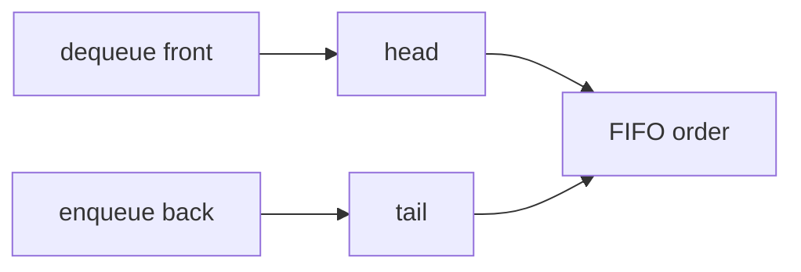
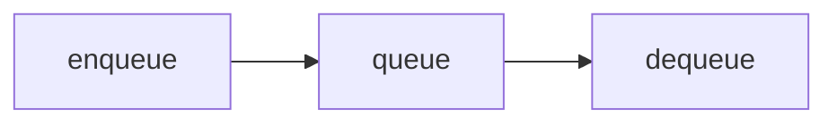
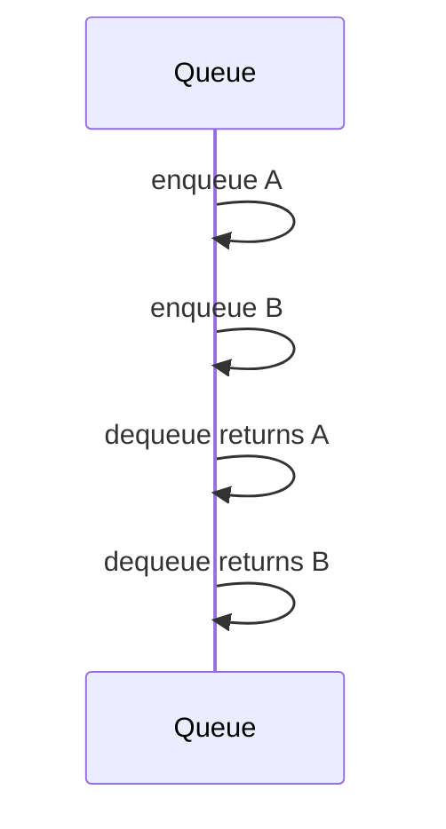

# Queues

## Overview

A **queue** is a **FIFO** (first-in, first-out) ADT: **enqueue** at the back, **dequeue** from the front. It models fair waiting lines, BFS frontiers (algorithm details in [[05-Algorithms/07-Graph-Traversal-and-DAGs/BFS|BFS]]), job schedulers, and message pipes.

Implementations span [[04-Data-Structures/01-Contiguous-Sequences/Ring Buffers as Contiguous Queues|ring buffers]] (bounded, fast), linked queues (unbounded with pointer overhead), and language deques (`collections.deque`) combining O(1) both ends.

## Learning Objectives

- Implement FIFO queue with ring buffer and linked tail/head
- Avoid O(n) `array.shift()` antipattern in JavaScript
- Document empty/full/backpressure semantics
- Compare bounded vs unbounded queue operability
- Choose queue representation using [[04-Data-Structures/02-Linked-Structures/Linked vs Contiguous Trade-offs|Linked vs Contiguous Trade-offs]]

## Prerequisites

- [[04-Data-Structures/00-Orientation-and-Contracts/Abstract Data Types vs Concrete Structures|Abstract Data Types vs Concrete Structures]]
- [[04-Data-Structures/01-Contiguous-Sequences/Ring Buffers as Contiguous Queues|Ring Buffers as Contiguous Queues]]
- [[04-Data-Structures/02-Linked-Structures/Singly Linked Lists|Singly Linked Lists]]

## Difficulty

`beginner`

## Estimated Time

- Reading: 2 hours
- Exercises: 3 hours
- Mini project: 4 hours

## History

Queue theory underpins operating system ready queues and telephony buffers. COBOL/JCL job queues popularized FIFO discipline in enterprise batch. Modern async runtimes use bounded queues for **backpressure** between stages.

## Problem It Solves

| Anti-pattern | Fix |
| --- | --- |
| `list.pop(0)` in Python loop | `deque` or ring buffer |
| Unbounded in-memory queue under burst | Bounded + metrics |
| Linked list without tail pointer | O(n) enqueue |

## Internal Implementation

Linked queue: maintain `head`, `tail`, `size`.  
Ring queue: see ring buffer note.



## Mermaid Diagrams

### Structure: FIFO flow



### Sequence: enqueue/dequeue



## Examples

### Minimal Example

TypeScript — linked queue with tail:

```typescript
type Node<T> = { value: T; next: Node<T> | null };

export class LinkedQueue<T> {
  private head: Node<T> | null = null;
  private tail: Node<T> | null = null;
  private len = 0;

  enqueue(value: T): void {
    const node: Node<T> = { value, next: null };
    if (this.tail) this.tail.next = node;
    else this.head = node;
    this.tail = node;
    this.len++;
  }

  dequeue(): T | undefined {
    if (!this.head) return undefined;
    const value = this.head.value;
    this.head = this.head.next;
    if (!this.head) this.tail = null;
    this.len--;
    return value;
  }
}
```

Python — stdlib deque (production default):

```python
from collections import deque


class Queue:
    def __init__(self) -> None:
        self._q: deque[object] = deque()

    def enqueue(self, value: object) -> None:
        self._q.append(value)

    def dequeue(self) -> object:
        if not self._q:
            raise IndexError("queue empty")
        return self._q.popleft()

    def __len__(self) -> int:
        return len(self._q)
```

### Production-Shaped Example

Bounded ring-backed queue with metrics:

```typescript
import { RingBuffer } from "../01-Contiguous-Sequences/ring-buffer"; // lab path

export class MetricsQueue<T> {
  private ring = new RingBuffer<T>(8192);
  readonly metrics = { dropped: 0, delivered: 0 };

  offer(item: T): boolean {
    if (!this.ring.tryEnqueue(item)) {
      this.metrics.dropped++;
      return false;
    }
    return true;
  }

  poll(): T | undefined {
    const v = this.ring.tryDequeue();
    if (v !== undefined) this.metrics.delivered++;
    return v;
  }
}
```

Cross-link: [[04-Data-Structures/03-Stacks-Queues-and-Deques/Bounded Buffers and Producer-Consumer Interfaces|Bounded Buffers]].

## Operation Complexity

| Operation | Ring buffer | Linked queue | Array+shift |
| --- | --- | --- | --- |
| enqueue | O(1) | O(1) | O(1) append |
| dequeue | O(1) | O(1) | O(n) shift |
| peek front | O(1) | O(1) | O(1) |
| Space | O(cap) | O(n) nodes | O(n) |

## Invariants

1. **FIFO**: dequeue order matches enqueue order
2. `size >= 0`; front element oldest
3. Bounded: `size <= capacity`
4. After dequeue, dequeued value not retained in structure

## Trade-offs

| Dimension | Upside | Downside | When it matters |
| --- | --- | --- | --- |
| Ring buffer | Locality, bounded RSS | Fixed cap | Streaming |
| Linked | Unbounded | Alloc churn | Low rate |
| deque | Balanced general use | Language-specific | Python services |
| Blocking queue | Consumer sync | Deadlock risk | Thread pipelines |

### When to Use

- Fair ordering, BFS, work lists, message passing
- Pipeline stages with backpressure

### When Not to Use

- LIFO — stack
- Priority — heap / priority queue module
- Random access — vector

## Exercises

1. Implement ring buffer queue; compare to linked for 1M ops.
2. Demonstrate O(n²) from repeated `shift()` on JS array.
3. Implement queue using two stacks — amortized costs?
4. Add `tryEnqueue` metrics for 99% full alert threshold.
5. Sketch BFS — queue role only (algorithms in other track).

## Mini Project

Dual-language queue passing shared FIFO test vectors; include overflow cases.

## Portfolio Project

Queue comparison panel in [[04-Data-Structures/projects/Structures Workbench/README|Structures Workbench]].

## Interview Questions

1. FIFO vs LIFO?
2. Implement queue with two stacks?
3. Why avoid array shift dequeue?
4. Bounded vs unbounded queue in production?
5. Ring buffer vs linked queue?

### Stretch / Staff-Level

1. MPMC queue design — handoff module 13.
2. Kafka vs in-memory queue — system boundary.

## Common Mistakes

- Using stack for BFS
- Forgetting tail pointer on linked enqueue
- Unbounded queues without memory monitoring
- Confusing priority queue with FIFO queue

## Best Practices

- Use deque/ring for production FIFO in managed languages
- Expose `offer/poll` or `tryEnqueue` for backpressure
- Metric drops and high water mark
- Document threading model

## Summary

Queues provide FIFO ordering with constant-time enqueue and dequeue when implemented as ring buffers or linked structures with tail pointers—never as array shift-from-front. Bounded queues enable backpressure and predictable memory; unbounded queues require explicit operational limits elsewhere. Representation choice follows contiguous-vs-linked analysis from module 02.

## Further Reading

- [[04-Data-Structures/01-Contiguous-Sequences/Ring Buffers as Contiguous Queues|Ring Buffers as Contiguous Queues]]
- [[04-Data-Structures/03-Stacks-Queues-and-Deques/Deques|Deques]]
- [[04-Data-Structures/03-Stacks-Queues-and-Deques/Bounded Buffers and Producer-Consumer Interfaces|Bounded Buffers and Producer-Consumer Interfaces]]

## Related Notes

- [[04-Data-Structures/03-Stacks-Queues-and-Deques/Stacks|Stacks]]
- [[04-Data-Structures/02-Linked-Structures/Linked vs Contiguous Trade-offs|Linked vs Contiguous Trade-offs]]
- [[04-Data-Structures/13-Concurrency-Aware-Structures/Concurrent Queues|Concurrent Queues]]

## Progress Checklist

- [ ] Explained from first principles
- [ ] Drew at least one Mermaid diagram
- [ ] Implemented a minimal version
- [ ] Documented trade-offs and non-goals
- [ ] Completed exercises
- [ ] Practiced interview questions aloud
- [ ] Linked prerequisites and dependents
