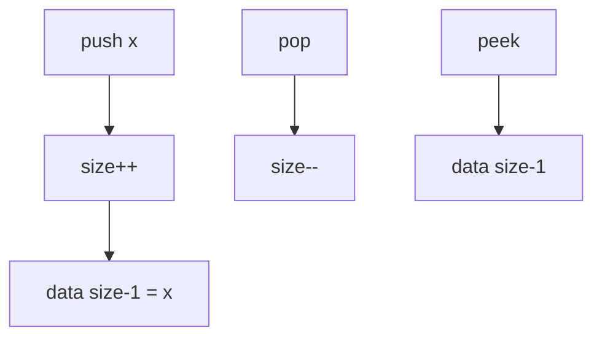
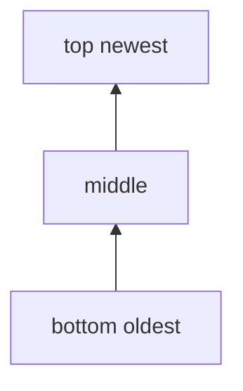
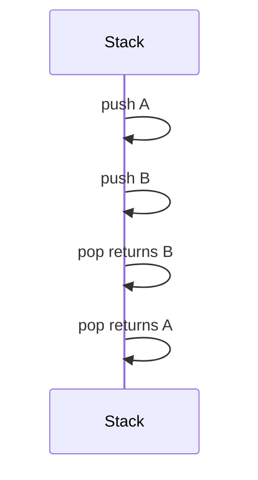

# Stacks

## Overview

A **stack** is a **LIFO** (last-in, first-out) ADT supporting **push** (add to top), **pop** (remove from top), and **peek** (inspect top without removal). It models nested execution: call stacks, undo histories, DFS (algorithm handoff in [[05-Algorithms/07-Graph-Traversal-and-DAGs/DFS|DFS]]), bracket matching, and expression evaluation.

Concrete implementations almost always use a [[04-Data-Structures/01-Contiguous-Sequences/Dynamic Arrays and Amortized Growth|dynamic array]] with push/pop at the back; linked lists are viable but rarely faster in practice.

## Learning Objectives

- Implement Stack ADT with array backing and optional linked backing
- State LIFO semantic invariants and underflow/overflow policies
- Map stack to call frame and undo patterns in production
- Analyze O(1) amortized operations and iterator restrictions
- Avoid exposing random access that violates stack semantics

## Prerequisites

- [[04-Data-Structures/00-Orientation-and-Contracts/Abstract Data Types vs Concrete Structures|Abstract Data Types vs Concrete Structures]]
- [[04-Data-Structures/01-Contiguous-Sequences/Dynamic Arrays and Amortized Growth|Dynamic Arrays and Amortized Growth]]

## Difficulty

`beginner`

## Estimated Time

- Reading: 1.5 hours
- Exercises: 2 hours
- Mini project: 3 hours

## History

Stack abstraction formalized with ALGOL block structure and push-down automata theory. Hardware **call stacks** in [[01-Computer-Science/04-Processes-and-Execution/Context Switching|process execution]] mirror the ADT. Forth and PostScript made stack-based programming a visible paradigm.

## Problem It Solves

| Problem | Stack role |
| --- | --- |
| Nested scopes / recursion | Call stack frames |
| Undo/redo (single direction) | Push actions, pop undo |
| Syntax validation | Match opening/closing tokens |
| DFS traversal | Explicit frontier (Algorithms track) |

Queue problems belong in [[04-Data-Structures/03-Stacks-Queues-and-Deques/Queues|Queues]].

## Internal Implementation

Array-backed stack fields: `data[]`, `size`. Top at `size-1`.



## Mermaid Diagrams

### Structure: LIFO ordering



### Sequence: push then pop



## Examples

### Minimal Example

TypeScript:

```typescript
export interface Stack<T> {
  push(value: T): void;
  pop(): T | undefined;
  peek(): T | undefined;
  readonly size: number;
}

export class ArrayStack<T> implements Stack<T> {
  private data: T[] = [];

  push(value: T): void {
    this.data.push(value);
  }

  pop(): T | undefined {
    return this.data.pop();
  }

  peek(): T | undefined {
    return this.data[this.data.length - 1];
  }

  get size(): number {
    return this.data.length;
  }
}
```

Python:

```python
class ArrayStack:
    def __init__(self) -> None:
        self._data: list[object] = []

    def push(self, value: object) -> None:
        self._data.append(value)

    def pop(self) -> object:
        if not self._data:
            raise IndexError("stack underflow")
        return self._data.pop()

    def peek(self) -> object:
        if not self._data:
            raise IndexError("stack empty")
        return self._data[-1]

    def __len__(self) -> int:
        return len(self._data)
```

### Production-Shaped Example

Bounded undo stack with drop-old policy:

```typescript
export class UndoStack {
  private readonly max: number;
  private stack: Array<() => void> = [];

  constructor(maxDepth: number) {
    this.max = maxDepth;
  }

  pushUndo(revert: () => void): void {
    this.stack.push(revert);
    if (this.stack.length > this.max) {
      this.stack.shift(); // drop oldest undo — document policy
    }
  }

  undo(): void {
    const fn = this.stack.pop();
    if (!fn) throw new Error("nothing to undo");
    fn();
  }
}
```

Cross-link: [[04-Data-Structures/00-Orientation-and-Contracts/Interface Design Capacity Errors and Iteration|Interface Design]].

## Operation Complexity

| Operation | Array stack | Linked stack |
| --- | --- | --- |
| push | O(1) amortized | O(1) |
| pop | O(1) | O(1) |
| peek | O(1) | O(1) |
| search bottom | O(n) | O(n) |
| Space | O(n) | O(n) + pointers |

## Invariants

1. **LIFO**: pop returns most recently pushed element still stored
2. `size >= 0`
3. No valid operation exposes arbitrary index without breaking ADT
4. After pop, popped element no longer in stack

## Trade-offs

| Dimension | Upside | Downside | When it matters |
| --- | --- | --- | --- |
| Array backing | Cache-friendly, simple | Rare resize spike | Default choice |
| Linked backing | No resize | Alloc per push | Theoretical |
| Bounded stack | Memory cap | Lost history | Undo depth |
| Throw on underflow | Explicit errors | Verbose callers | Libraries |

### When to Use

- LIFO semantics: parsing, undo, DFS explicit stack
- Temporary nested context (scopes, tags)

### When Not to Use

- Fair ordering (FIFO) — use queue
- Random access to all elements — use vector with clear API

## Exercises

1. Implement bracket matcher using stack.
2. Compare `ArrayStack` vs `ListStack` memory for 10k pushes.
3. Implement fixed-capacity stack with `tryPush`.
4. Simulate call stack depth limit (stack overflow concept).
5. Why not expose `get(i)` on public stack API?

## Mini Project

Expression evaluator (RPN or infix with stack) in TS + Python with shared test vectors.

## Portfolio Project

Stack lab in [[04-Data-Structures/projects/Structures Workbench/README|Structures Workbench]] with LIFO visualization.

## Interview Questions

1. Stack vs queue?
2. Implement queue using two stacks — costs?
3. Array vs linked stack?
4. Stack overflow vs underflow?
5. Real systems using stack ADT?

### Stretch / Staff-Level

1. Lock-free stack (Treiber stack) — ABA problem preview.
2. Stack depth limits in async runtime vs thread stack.

## Common Mistakes

- Using stack for BFS (needs queue)
- `shift()` on array simulating stack from wrong end
- Unbounded undo in memory-sensitive UI
- Confusing call stack with heap-allocated stack ADT

## Best Practices

- Array-backed default; document underflow behavior
- Cap undo/history stacks in production UIs
- Do not leak internal array for mutation
- Hand off graph DFS theory to Algorithms track

## Summary

Stacks enforce LIFO access with constant-time push, pop, and peek on standard implementations. Dynamic arrays provide the default backing store with excellent locality; linked variants rarely justify their allocation overhead. Production use requires explicit underflow handling and bounded depth where user actions or recursion could grow without limit.

## Further Reading

- [[04-Data-Structures/03-Stacks-Queues-and-Deques/Queues|Queues]]
- [[04-Data-Structures/03-Stacks-Queues-and-Deques/Deques|Deques]]
- [[01-Computer-Science/04-Processes-and-Execution/Context Switching|Context Switching]]

## Related Notes

- [[04-Data-Structures/00-Orientation-and-Contracts/Abstract Data Types vs Concrete Structures|Abstract Data Types vs Concrete Structures]]
- [[04-Data-Structures/02-Linked-Structures/Singly Linked Lists|Singly Linked Lists]]
- [[04-Data-Structures/01-Contiguous-Sequences/Fixed-Capacity Arrays|Fixed-Capacity Arrays]]

## Progress Checklist

- [ ] Explained from first principles
- [ ] Drew at least one Mermaid diagram
- [ ] Implemented a minimal version
- [ ] Documented trade-offs and non-goals
- [ ] Completed exercises
- [ ] Practiced interview questions aloud
- [ ] Linked prerequisites and dependents
