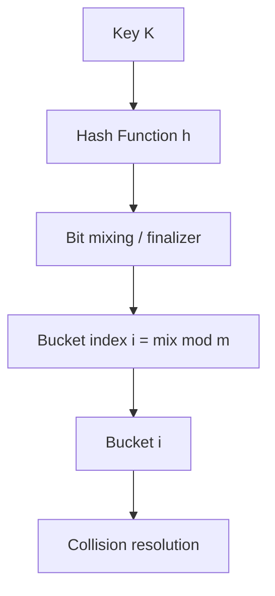
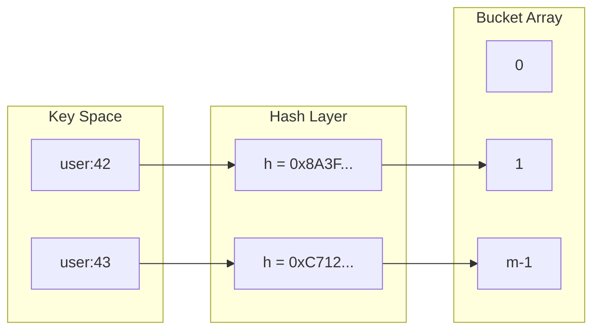
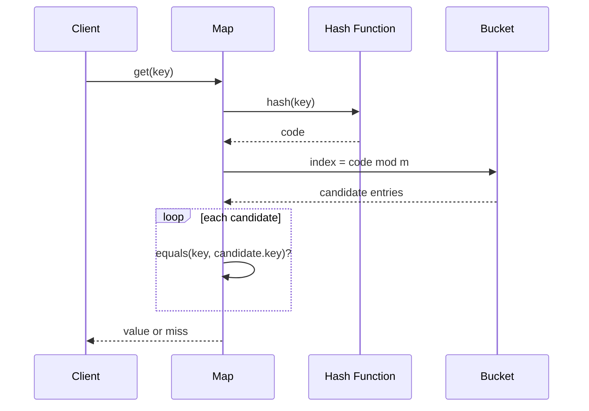

# Hash Functions Avalanche and Equality Contracts

## Overview

A **hash function** maps keys of arbitrary size to fixed-width **hash codes** (typically 32- or 64-bit integers) used to index a table of buckets. Hash tables achieve expected O(1) lookup only when hash codes are **cheap to compute**, **deterministic for equal keys**, and **spread keys across buckets** so collisions are rare.

The **equality contract** ties hashing to comparison: if `a.equals(b)` then `hash(a) == hash(b)` must hold; the converse is false (collisions are inevitable by the pigeonhole principle). Violating this contract produces "ghost" entries—keys that exist but cannot be found.

This note establishes the mathematical and language-level contracts that every hash table implementation in [[04-Data-Structures/04-Hash-Tables-and-Sets/Separate Chaining|Separate Chaining]] and [[04-Data-Structures/04-Hash-Tables-and-Sets/Open Addressing|Open Addressing]] depends on.

## Learning Objectives

- Define deterministic hashing, uniform distribution, and avalanche effect
- State and enforce the equals/hashCode invariant across composite keys
- Compare string hashing strategies (FNV-1a, MurmurHash, SipHash) by threat model
- Diagnose production bugs caused by mutable keys or inconsistent equality
- Map language semantics (Java, Python, TypeScript, Rust) to the same contract

## Prerequisites

- [[04-Data-Structures/00-Orientation-and-Contracts/Abstract Data Types vs Concrete Structures|Abstract Data Types vs Concrete Structures]]
- [[01-Computer-Science/01-Information-and-Representation/Integer Representation|Integer Representation]]
- [[01-Computer-Science/09-Correctness-and-Reliability/Invariants Assertions and Contracts|Invariants Assertions and Contracts]]

## Difficulty

`intermediate`

## Estimated Time

- Reading: 2 hours
- Exercises: 2 hours
- Mini project: 3 hours

## History

Hashing arose from symbol-table lookup in compilers (1960s). Knuth formalized open addressing and chaining. The **avalanche criterion** (1990s, cryptography literature) migrated into general-purpose hash design. **SipHash** (2012) responded to **hash-flooding DoS** attacks on web servers—see [[04-Data-Structures/04-Hash-Tables-and-Sets/Hash-Flooding DoS and Randomized Hashing|Hash-Flooding DoS and Randomized Hashing]].

## Problem It Solves

Without a disciplined hash/equality pair:

- `Map.get(key)` returns `undefined` despite `Map.has(key)` being true (broken contract)
- Clustering collapses expected O(1) to O(n) under adversarial or accidental key patterns
- Security: attacker-chosen keys force quadratic behavior in naive implementations
- Debugging: "it works in dev" when dev keys are random but prod keys share prefixes

## Internal Implementation

### Hash function properties

| Property | Meaning | Failure symptom |
| --- | --- | --- |
| Deterministic | Same key → same hash (within process lifetime for seeded hashes) | Unfindable entries |
| Cheap | O(key size) with small constants | CPU hot spot in lookup path |
| Uniform (approx.) | Low collision rate for key distribution | Long chains / probe sequences |
| Avalanche | Flip one input bit → ~half output bits flip | Prefix clustering on structured keys |

**Avalanche** matters for strings like `user-000001`, `user-000002`—a weak hash leaves them in adjacent buckets.

### Equality contract (formal)

For types used as hash keys:

1. **Reflexive**: `a.equals(a)`
2. **Symmetric**: `a.equals(b) ⇔ b.equals(a)`
3. **Transitive**: `a.equals(b) ∧ b.equals(c) ⇒ a.equals(c)`
4. **Consistent with hash**: `a.equals(b) ⇒ hash(a) == hash(b)`
5. **Stable while in table**: hash code must not change while key is stored

Property 5 forbids mutable fields participating in `equals`/`hashCode` unless the key is removed before mutation.

### Index derivation

Most tables use `bucketIndex = hash(key) mod bucketCount`, with **power-of-two** masking (`hash & (n-1)`) or **prime** modulus. Poor mixing before masking causes **striping**—only low bits of hash matter.



## Invariants

- **I1 (Determinism)**: For fixed key `k`, `h(k)` is identical across repeated calls until re-seeding policy changes.
- **I2 (Contract)**: `equal(a, b) ⇒ h(a) = h(b)`; assert in debug builds after `equals` changes.
- **I3 (Immutability)**: Keys in the table are immutable with respect to fields used in `equals`/`hash`.
- **I4 (Surjectivity goal)**: Over representative key samples, bucket occupancy variance stays within configured load factor bounds.

## Operation Complexity

| Operation | Time | Space | Notes |
| --- | --- | --- | --- |
| `hash(key)` | O(\|key\|) | O(1) | \|key\| = bytes or fields hashed |
| `equals(a, b)` | O(\|key\|) | O(1) | Must match hash contract |
| Table lookup (given hash) | O(1) expected | — | Depends on collision resolution; see chaining/open addressing notes |
| Rehash all keys | O(n · \|key\|) | O(n) | Triggered on resize |

Assumptions: good hash function, load factor bounded; see [[04-Data-Structures/00-Orientation-and-Contracts/Complexity Tables Amortization and Practical Constants|Complexity Tables Amortization and Practical Constants]].

## Mermaid Diagrams

### Structure: key → hash → bucket



### Sequence: lookup with equality check



## Examples

### Minimal Example

**TypeScript** — FNV-1a 32-bit for strings; explicit contract type:

```typescript
interface Hashable {
  hashCode(): number;
  equals(other: unknown): boolean;
}

function fnv1a32(data: string): number {
  let hash = 0x811c9dc5;
  for (let i = 0; i < data.length; i++) {
    hash ^= data.charCodeAt(i);
    hash = Math.imul(hash, 0x01000193);
  }
  return hash >>> 0;
}

class UserId implements Hashable {
  constructor(readonly id: string) {}

  hashCode(): number {
    return fnv1a32(this.id);
  }

  equals(other: unknown): boolean {
    return other instanceof UserId && other.id === this.id;
  }
}
```

**Python** — `__hash__` and `__eq__` on a frozen dataclass:

```python
from dataclasses import dataclass

@dataclass(frozen=True, slots=True)
class UserId:
    id: str

    def __hash__(self) -> int:
        return hash(self.id)  # str hash is salted per process (CPython 3.3+)

    def __eq__(self, other: object) -> bool:
        return isinstance(other, UserId) and self.id == other.id
```

### Production-Shaped Example

Composite cache key with stable hashing and avalanche-friendly mixing:

```typescript
function mix64(x: bigint): bigint {
  x ^= x >> 33n;
  x *= 0xff51afd7ed558ccdn;
  x ^= x >> 33n;
  x *= 0xc4ceb9fe1a85ec53n;
  x ^= x >> 33n;
  return x;
}

function cacheKeyHash(tenant: string, resource: string, version: number): number {
  const tenantH = fnv1a32(tenant);
  const resourceH = fnv1a32(resource);
  const combined = BigInt(tenantH) ^ (BigInt(resourceH) << 32n) ^ BigInt(version);
  return Number(mix64(combined) & 0xffffffffn);
}
```

```python
import hashlib

def cache_key_digest(tenant: str, resource: str, version: int) -> bytes:
    h = hashlib.blake2b(digest_size=16)
    h.update(tenant.encode())
    h.update(b"\0")
    h.update(resource.encode())
    h.update(version.to_bytes(4, "big"))
    return h.digest()  # use for consistent sharding, not Python's hash()
```

Never use Python's built-in `hash()` for cross-process sharding—it is salted per process.

## Trade-offs

| Dimension | Upside | Downside | When it matters |
| --- | --- | --- | --- |
| Fast non-crypto hash (FNV, xxHash) | Low latency | Predictable; DoS-vulnerable | Trusted internal keys |
| SipHash / BLAKE2 | Attack-resistant | Higher CPU | Public HTTP parsers, JSON keys |
| `hashCode` on all fields | Fewer false misses | Breaks if fields mutate | ORM entities as keys |
| Identity hash (`id(obj)`) | Stable for mutable objects | No value semantics | Interning, object registries |

### When to Use

- **Value-object keys** (IDs, tuples of primitives) with immutable equality fields
- **Per-process hash maps** with standard library hash after verifying threat model
- **Explicit mixing** before power-of-two bucket masking

### When Not to Use

- Do not hash secrets for **authentication**—use HMAC or constant-time compare
- Do not use object default hash for **value types** you defined
- Do not shard across machines with Python `hash()` without fixed algorithm

## Exercises

1. Prove: if `equals` is an equivalence relation and violates `equal ⇒ same hash`, show a concrete insert/lookup sequence that fails.
2. Implement FNV-1a and measure avalanche: flip each bit of a 32-bit input; count flipped output bits.
3. Write a broken `Point` class with mutable `(x,y)` in `equals`/`hash`; demonstrate map corruption after mutation.
4. Compare bucket distribution for `hash(i) = i` vs mixed hash on keys `0..9999` with 1024 buckets.
5. Design a composite key `(tenantId, objectId)` hash without collision amplification from shared prefixes.

## Mini Project

**Hash Contract Linter**

Build a static checker (or runtime wrapper) for TypeScript/Python classes: flags classes used as map keys if any `hash`/`equals` field is mutable or if `equals` and `hashCode` are not defined together.

## Portfolio Project

Integrate hash quality metrics into [[04-Data-Structures/projects/Hash Map Bake-Off/README|Hash Map Bake-Off]]: chi-squared bucket uniformity, max chain length, avalanche score.

## Interview Questions

1. State the equals/hashCode contract in one sentence.
2. Why can two unequal keys share the same hash code?
3. What is the avalanche effect and why does it reduce clustering?
4. Why must mutable objects not be hash map keys if equality depends on mutable state?
5. How does CPython's hash randomization defend against hash-flooding?

### Stretch / Staff-Level

1. Design a hash function for 128-bit UUIDs that preserves uniformity when only the time-low field varies sequentially.
2. Compare trade-offs of using `String.hashCode()` in Java vs `Objects.hash(...)` for composite keys in high-QPS services.

## Common Mistakes

- Defining `equals` without overriding `hashCode`/`__hash__`
- Using floating-point fields in hash without canonicalization (`-0.0` vs `0.0`)
- Hashing mutable arrays by reference while comparing by value
- Assuming `hash(x) mod m` is uniform when `m` shares factors with hash patterns

## Best Practices

- Prefer **immutable keys** (`frozen` dataclass, `readonly` fields)
- Centralize composite key hashing in one function; unit test distribution
- Use **cryptographic or keyed** hashes for attacker-controlled input
- Document whether equality is **value** or **identity** semantics
- Assert contract in debug: `assert equal(a,b) implies hash(a)==hash(b)`

## Summary

Hash functions compress keys into bucket indices; equality resolves collisions. The contract—equal keys must share hash codes, and hash codes must stay stable while stored—is non-negotiable. Avalanche and mixing prevent structured keys from collapsing buckets. Production systems choose hash algorithms by latency *and* by who controls the keys: internal IDs tolerate fast hashes; HTTP headers and JSON field names may not.

## Further Reading

- [[00-References/Data Structures/README|Data Structures References]]
- Knuth — *Sorting and Searching* (Vol. 3), hash functions chapter
- Aumasson and Bernstein — SipHash specification

## Related Notes

- [[04-Data-Structures/04-Hash-Tables-and-Sets/Separate Chaining|Separate Chaining]]
- [[04-Data-Structures/04-Hash-Tables-and-Sets/Open Addressing|Open Addressing]]
- [[04-Data-Structures/04-Hash-Tables-and-Sets/Hash-Flooding DoS and Randomized Hashing|Hash-Flooding DoS and Randomized Hashing]]
- [[04-Data-Structures/00-Orientation-and-Contracts/Invariants Representation and Debug Assertions|Invariants Representation and Debug Assertions]]
- [[01-Computer-Science/02-Machine-Model/Cache Hierarchy and Locality|Cache Hierarchy and Locality]]
- [[01-Computer-Science/08-Languages-and-Computation/Computational Complexity Primer|Computational Complexity Primer]]

## Progress Checklist

- [ ] Explained from first principles
- [ ] Drew at least one Mermaid diagram
- [ ] Implemented a minimal version
- [ ] Documented trade-offs and non-goals
- [ ] Completed exercises
- [ ] Practiced interview questions aloud
- [ ] Linked prerequisites and dependents
