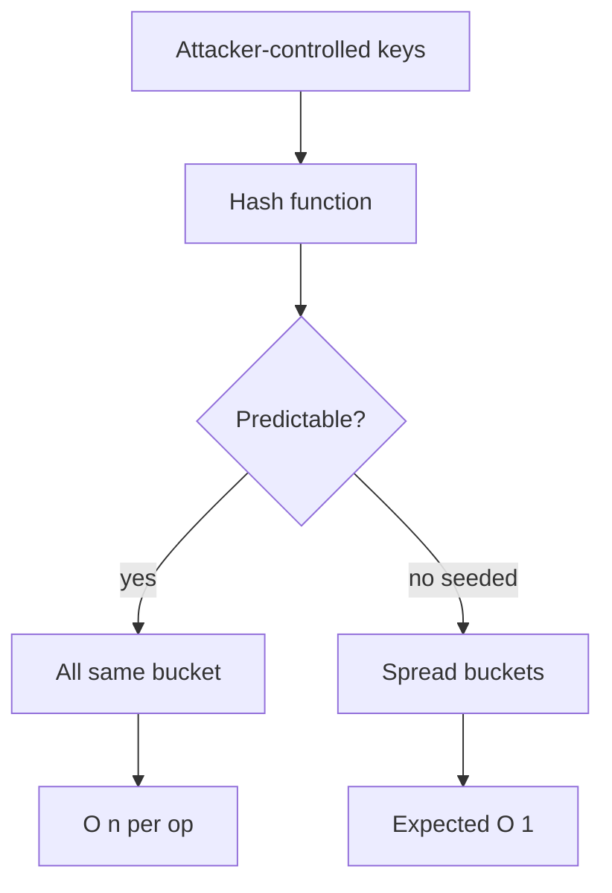
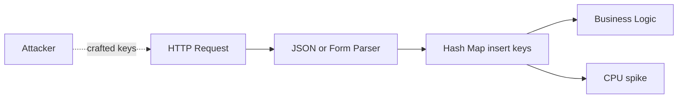
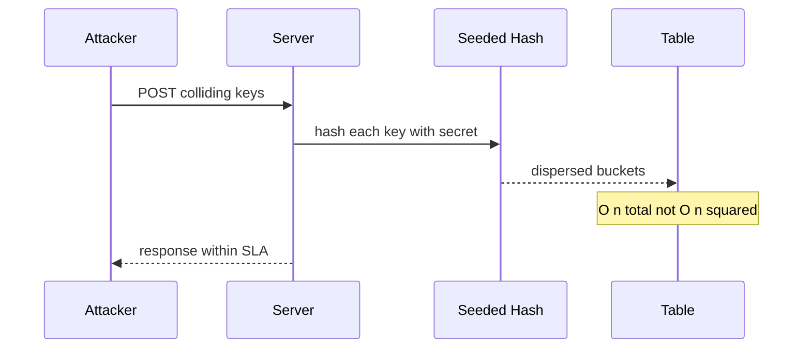

# Hash-Flooding DoS and Randomized Hashing

## Overview

**Hash-flooding** is an **algorithmic complexity attack**: an adversary submits many keys that collide under the hash function, degrading hash table operations from expected O(1) to O(n) per operation. At web scale—JSON parsers, HTTP headers, form fields—a few megabytes of malicious input can tie a CPU core for seconds.

**Randomized hashing** (per-process secret seed, SipHash, HashDoS mitigations) makes collision locations unpredictable to remote attackers who cannot observe the seed. Defense is a **security requirement** for any structure processing attacker-controlled strings on a network boundary.

## Learning Objectives

- Explain hash-flooding as CPU exhaustion, not memory exhaustion
- Compare mitigation strategies: random seed, universal hashing, treeified bins, input limits
- Identify attacker-controlled hash table entry points in a service
- Evaluate language/runtime defaults (CPython, V8, JVM post-mitigations)
- Design observability for collision depth and parse-time CPU anomalies

## Prerequisites

- [[04-Data-Structures/04-Hash-Tables-and-Sets/Hash Functions Avalanche and Equality Contracts|Hash Functions Avalanche and Equality Contracts]]
- [[04-Data-Structures/04-Hash-Tables-and-Sets/Separate Chaining|Separate Chaining]]
- [[01-Computer-Science/08-Languages-and-Computation/Computational Complexity Primer|Computational Complexity Primer]]

## Difficulty

`advanced`

## Estimated Time

- Reading: 2 hours
- Exercises: 2 hours
- Mini project: 3 hours

## History

Crosby and Wallach (2003) demonstrated algorithmic complexity attacks on data structures. Kirsch and Mitzenmacher analyzed limited randomization. **SipHash** (Aumasson & Bernstein, 2012) became the standard keyed hash for hash tables. Python 3.3+ hash randomization, Rust's SipHash default, and Java 8+ treeified bins followed real-world exploits against Ruby, Python, and Java hash maps.

## Problem It Solves

Deterministic weak hashes on public inputs let attackers craft **multicollisions** offline. Without mitigation:

- Single request parses thousands of colliding JSON keys → event loop blocked
- Firewall/proxy hash maps degrade under crafted URLs
- Microservice death from one POST body

## Internal Implementation

### Attack model

1. Attacker knows hash algorithm `h` (or guesses JVM String hash before randomization).
2. Attacker finds N keys `{k₁…kₙ}` with `h(kᵢ) mod m = same bucket`.
3. Server inserts all N; each lookup/insert walks length-N chain or probe sequence.
4. Total work O(N²) for N inserts with naive structure.

### Mitigations

| Strategy | Mechanism | Limitation |
| --- | --- | --- |
| Random per-process seed | Attacker can't predict bucket | Same-process info leak rare |
| Keyed hash (SipHash) | Secret key mixed into hash | Key rotation on fork |
| Treeified bins | O(log n) per bin | Still CPU; not O(1) |
| Input caps | Max keys, max body size | Policy not crypto |
| Switch structure | Comparison sort batch | Changes API |



## Invariants

- **I1 (Unpredictability)**: Remote attacker cannot compute `bucket(k)` without secret seed/key with non-negligible advantage.
- **I2 (Backward compatibility)**: Hash randomization must not break in-process maps; cross-process hashing uses stable algorithms (see hash contract note).
- **I3 (Bounded work)**: Combined with input limits, worst-case CPU per request ≤ SLA budget.
- **I4 (Observability)**: Max chain/probe length measurable in staging.

## Operation Complexity

| Scenario | Insert | Lookup | Attacker goal |
| --- | --- | --- | --- |
| Uniform keys | O(1) avg | O(1) avg | — |
| N colliding keys (chaining) | O(N) each | O(N) | N inserts → O(N²) total |
| N colliding + treeified bin | O(log N) | O(log N) | Reduces but not eliminated |
| Seeded SipHash | O(1) expected | O(1) expected | Collisions hard to find offline |

## Mermaid Diagrams

### Structure: attack surface map



### Sequence: mitigated vs vulnerable path



## Examples

### Minimal Example

**TypeScript** — SipHash-like keyed mix (use `siphash` library in production):

```typescript
function keyedStringHash(data: string, seed0: number, seed1: number): number {
  // Production: use npm:siphash or crypto.createHmac
  let h = seed0 ^ seed1;
  for (let i = 0; i < data.length; i++) {
    h = Math.imul(h ^ data.charCodeAt(i), 0x5bd1e995);
    h ^= h >>> 15;
  }
  return h >>> 0;
}

// Per-process seed from crypto
import { randomBytes } from "crypto";
const [seed0, seed1] = randomBytes(8).readUInt32LE(0);
```

**Python** — CPython randomizes str hash by default:

```python
import sys

# hash("same") differs across runs since 3.3+ (unless PYTHONHASHSEED=0)
def safe_internal_map(keys: list[str]) -> dict[str, int]:
    return {k: i for i, k in enumerate(keys)}  # OK in-process

# Cross-process: never rely on hash() for stable sharding
import hashlib

def stable_shard(key: str, buckets: int) -> int:
    digest = hashlib.blake2b(key.encode(), digest_size=8).digest()
    return int.from_bytes(digest, "big") % buckets
```

### Production-Shaped Example

Defense in depth for JSON API:

```typescript
const MAX_KEYS = 10_000;
const MAX_KEY_LENGTH = 256;

function parseObject(obj: Record<string, unknown>): void {
  const keys = Object.keys(obj);
  if (keys.length > MAX_KEYS) throw new Error("too many keys");
  for (const k of keys) {
    if (k.length > MAX_KEY_LENGTH) throw new Error("key too long");
  }
  // Use Map; runtime uses seeded hash internally
}
```

Monitor `process.cpu` + parse duration correlation; alert on p99 parse time with small payload size (signature of flooding).

## Trade-offs

| Dimension | Upside | Downside | When it matters |
| --- | --- | --- | --- |
| Hash randomization | Strong default | Nondeterministic hash across runs | Debugging, cross-process |
| SipHash | Attack-resistant | ~2× hash CPU vs FNV | Public APIs |
| Input limits | Simple, effective | May reject legit large docs | Edge gateways |
| Treeified bins | Bounds bin length | Complex; still log factor | JVM ecosystem |

### When to Use

- Any hash table fed **attacker-controlled keys** at trust boundary
- Load balancers, WAFs, JSON/XML parsers, GraphQL argument maps
- **Stable sharding**: use explicit BLAKE2/SHA, not language `hash()`

### When Not to Use

- Do not disable `PYTHONHASHSEED` randomization in production
- Do not roll custom "random" hash without crypto review
- Internal-only numeric IDs may use fast hashes if truly non-adversarial

## Exercises

1. Generate 100 strings colliding under Java's pre-Java-8 String hash (documented polynomial).
2. Measure insert time for 10k colliding vs random keys in chaining map.
3. Explain why `PYTHONHASHSEED=0` is dangerous in public web apps.
4. List five hash map entry points in a typical REST + JSON stack.
5. Design metrics dashboard for hash table health.

## Mini Project

**Collision Generator Lab**: given a weak hash implementation, brute-force or algebraic-find colliding keys; then repeat with SipHash seed—compare bucket spread.

## Portfolio Project

Security section in [[04-Data-Structures/projects/Hash Map Bake-Off/README|Hash Map Bake-Off]]: adversarial key suite and mitigation checklist.

## Interview Questions

1. What is hash-flooding and what resource does it exhaust?
2. How does Python hash randomization help?
3. Why doesn't rehashing alone fix flooding?
4. Difference between SipHash and SHA-256 for bucket indexing?
5. How did Java 8 mitigate String hash attacks?

### Stretch / Staff-Level

1. Argue whether treeified bins are sufficient as sole mitigation for a public GraphQL gateway.
2. Design a canary deployment test that detects weak hashing before production.

## Common Mistakes

- Using `hash()` for **consistent hashing** across processes (Python)
- Assuming HTTPS prevents hash-flooding (it's application-layer CPU)
- Only limiting **body size** but not **key count** in JSON
- Logging hash seeds or `PYTHONHASHSEED` in bug reports

## Best Practices

- Rely on modern runtime hash for string keys
- Cap keys, nesting depth, and parse time at gateway
- Track max bucket chain/probe in custom map implementations
- Use explicit cryptographic hash for cross-service sharding
- See [[18-Security/README|Security]] track for defense-in-depth

## Summary

Hash-flooding turns hash tables into linked lists via crafted collisions, causing CPU denial of service. Randomized, keyed hashing makes offline collision finding infeasible; input limits bound worst-case work. Treat any network-facing parser's map as an attack surface—not a pure data structure exercise. Production engineers verify runtime defaults and never use process-local hash for stable distributed routing.

## Further Reading

- [[00-References/Data Structures/README|Data Structures References]]
- Crosby & Wallach — Denial of Service via Algorithmic Complexity Attacks
- Aumasson & Bernstein — SipHash: a fast short-input PRF

## Related Notes

- [[04-Data-Structures/04-Hash-Tables-and-Sets/Hash Functions Avalanche and Equality Contracts|Hash Functions Avalanche and Equality Contracts]]
- [[04-Data-Structures/04-Hash-Tables-and-Sets/Separate Chaining|Separate Chaining]]
- [[04-Data-Structures/04-Hash-Tables-and-Sets/Open Addressing|Open Addressing]]
- [[01-Computer-Science/08-Languages-and-Computation/Computational Complexity Primer|Computational Complexity Primer]]
- [[04-Data-Structures/13-Concurrency-Aware-Structures/Concurrent Hash Maps Concepts|Concurrent Hash Maps Concepts]]

## Progress Checklist

- [ ] Explained from first principles
- [ ] Drew at least one Mermaid diagram
- [ ] Implemented a minimal version
- [ ] Documented trade-offs and non-goals
- [ ] Completed exercises
- [ ] Practiced interview questions aloud
- [ ] Linked prerequisites and dependents
