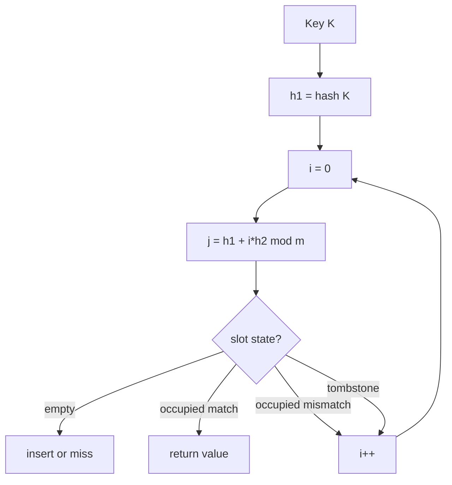
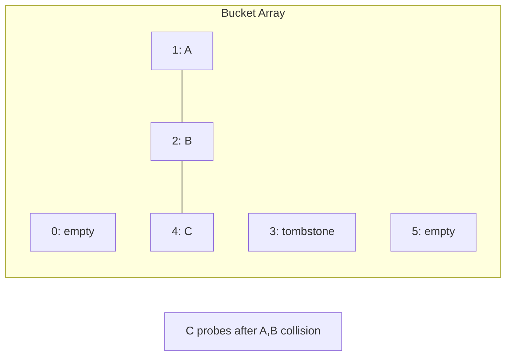
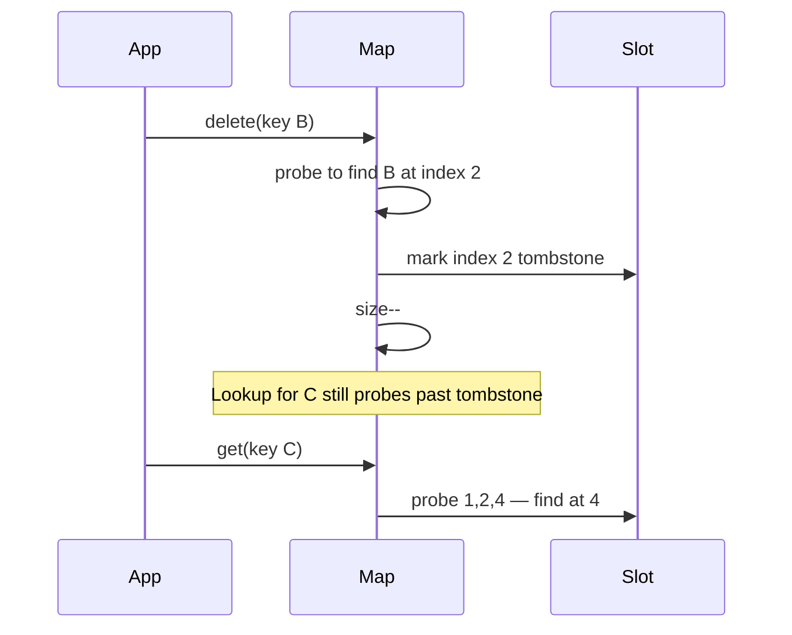

# Open Addressing

## Overview

**Open addressing** stores all entries **inside the bucket array**—no auxiliary linked structures. On collision, the table **probes** alternative slots according to a probe sequence until an empty slot (insert) or matching key (lookup) is found.

Variants differ in probe sequence generation:

- **Linear probing**: `(h + i) mod m`
- **Quadratic probing**: `(h + c₁i + c₂i²) mod m`
- **Double hashing**: `(h₁(k) + i · h₂(k)) mod m`

CPython's `dict`, Ruby's `Hash` (historically), and many high-performance libraries favor open addressing for **cache locality**: one contiguous array, fewer pointer dereferences.

## Learning Objectives

- Implement linear probing with tombstones and rehash
- Compare primary clustering (linear) vs secondary clustering (double hashing)
- Maintain load factor below critical thresholds (typically α < 0.7)
- Analyze probe length distribution under uniform hashing assumption
- Choose open addressing vs [[04-Data-Structures/04-Hash-Tables-and-Sets/Separate Chaining|Separate Chaining]] for a workload

## Prerequisites

- [[04-Data-Structures/04-Hash-Tables-and-Sets/Hash Functions Avalanche and Equality Contracts|Hash Functions Avalanche and Equality Contracts]]
- [[04-Data-Structures/04-Hash-Tables-and-Sets/Separate Chaining|Separate Chaining]]
- [[04-Data-Structures/01-Contiguous-Sequences/Dynamic Arrays and Amortized Growth|Dynamic Arrays and Amortized Growth]]

## Difficulty

`intermediate`

## Estimated Time

- Reading: 2–3 hours
- Exercises: 3 hours
- Mini project: 4 hours

## History

Open addressing was analyzed extensively by Knuth. Linear probing's **primary clustering** motivated quadratic and double hashing. Modern implementations combine open addressing with **compact dict layouts** (Python 3.6+ insertion-ordered compact dict) and **SIMD group probing** (Swiss tables in Abseil, Rust hashbrown).

## Problem It Solves

Chaining allocates a node per entry—bad for cache and allocator pressure. Open addressing packs entries densely in one array, improving **spatial locality** at the cost of complex deletion and stricter load factor limits.

## Internal Implementation

### Slot states

Each slot is **empty**, **occupied**, or **tombstone** (deleted). Tombstones preserve probe chains for keys inserted after a deleted key occupied an intermediate slot.

### Insert / lookup loop

```
i = 0
loop:
  j = probe(h, i)
  if slot[j] empty: insert here (or miss on lookup)
  if slot[j] tombstone: remember first tomb for insert
  if slot[j] key matches: found
  i++
```

### Rehash triggers

When α exceeds ~0.5–0.7 or tombstone ratio grows, allocate larger table and reinsert **only live entries** (no tombstones).

### Clustering

**Primary clustering**: linear probing creates runs of occupied slots—one collision makes future collisions more likely.

**Secondary clustering**: quadratic probing reduces primary runs but keys with same h₀ share probe sequence.

**Double hashing**: second hash `h₂` must be non-zero and coprime to m (power-of-two m uses odd `h₂`).



## Invariants

- **I1**: Every occupied slot at index `j` holds key `k` such that `j` is the **first empty-or-tombstone** slot in `k`'s probe sequence at insert time (tombstones count as occupied for lookup).
- **I2**: Load factor `liveEntries / m ≤ maxLoad` except during growth.
- **I3**: Probe function visits all slots before repeat (requires m power of 2 with odd step, or prime m).
- **I4**: Tombstones do not count toward `size` but count as occupied for probing.

## Operation Complexity

| Operation | Average | Worst | Amortized | Notes |
| --- | --- | --- | --- | --- |
| `get(k)` | O(1/(1-α)) | O(m) | — | Clustering raises average |
| `put(k,v)` | O(1/(1-α)) | O(m) | O(1) | Rehash amortized |
| `delete(k)` | O(1/(1-α)) | O(m) | — | Tombstone or backward shift |
| `rehash()` | O(n) | O(n) | — | Clears tombstones |

At α = 0.9 linear probing degrades badly; keep α ≤ 0.7 in production.

## Mermaid Diagrams

### Structure: contiguous probe sequence



### Sequence: delete with tombstone



## Examples

### Minimal Example

**TypeScript** — double hashing with tombstones:

```typescript
const EMPTY = Symbol("empty");
const DELETED = Symbol("deleted");

export class OpenAddressingMap<K, V> {
  private keys: Array<K | typeof EMPTY | typeof DELETED> = [];
  private vals: Array<V | undefined> = [];
  private _size = 0;
  private tombstones = 0;

  constructor(
    capacity = 16,
    private h1: (k: K) => number,
    private h2: (k: K) => number,
    private eq: (a: K, b: K) => boolean
  ) {
    this.keys = Array(capacity).fill(EMPTY);
    this.vals = Array(capacity);
  }

  private probe(key: K, i: number): number {
    const m = this.keys.length;
    const step = this.h2(key) | 1; // force odd
    return (this.h1(key) + i * step) & (m - 1);
  }

  get(key: K): V | undefined {
    for (let i = 0; i < this.keys.length; i++) {
      const j = this.probe(key, i);
      const slot = this.keys[j];
      if (slot === EMPTY) return undefined;
      if (slot !== DELETED && this.eq(slot, key)) return this.vals[j];
    }
    return undefined;
  }

  put(key: K, value: V): void {
    let firstDeleted = -1;
    for (let i = 0; i < this.keys.length; i++) {
      const j = this.probe(key, i);
      const slot = this.keys[j];
      if (slot === EMPTY) {
        const idx = firstDeleted >= 0 ? firstDeleted : j;
        if (this.keys[idx] === DELETED) this.tombstones--;
        this.keys[idx] = key;
        this.vals[idx] = value;
        this._size++;
        this.maybeGrow();
        return;
      }
      if (slot === DELETED && firstDeleted < 0) firstDeleted = j;
      if (slot !== DELETED && this.eq(slot, key)) {
        this.vals[j] = value;
        return;
      }
    }
  }

  private maybeGrow(): void {
    const m = this.keys.length;
    if ((this._size + this.tombstones + 1) / m > 0.7) this.rehash(m * 2);
  }

  private rehash(newCap: number): void {
    const oldKeys = this.keys;
    const oldVals = this.vals;
    this.keys = Array(newCap).fill(EMPTY);
    this.vals = Array(newCap);
    this._size = 0;
    this.tombstones = 0;
    for (let j = 0; j < oldKeys.length; j++) {
      const k = oldKeys[j];
      if (k !== EMPTY && k !== DELETED) this.put(k as K, oldVals[j]!);
    }
  }
}
```

**Python**:

```python
from typing import Callable, Generic, Optional, TypeVar, Union

K = TypeVar("K")
V = TypeVar("V")

_EMPTY = object()
_DELETED = object()

class OpenAddressingMap(Generic[K, V]):
    def __init__(
        self,
        h1: Callable[[K], int],
        h2: Callable[[K], int],
        eq: Callable[[K, K], bool],
        capacity: int = 16,
    ) -> None:
        self._h1, self._h2, self._eq = h1, h2, eq
        self._keys: list[Union[K, object]] = [_EMPTY] * capacity
        self._vals: list[Optional[V]] = [None] * capacity
        self._size = 0
        self._tombstones = 0

    def _probe(self, key: K, i: int) -> int:
        m = len(self._keys)
        step = self._h2(key) | 1
        return (self._h1(key) + i * step) & (m - 1)

    def get(self, key: K) -> Optional[V]:
        for i in range(len(self._keys)):
            j = self._probe(key, i)
            slot = self._keys[j]
            if slot is _EMPTY:
                return None
            if slot is not _DELETED and self._eq(slot, key):  # type: ignore[arg-type]
                return self._vals[j]
        return None

    def put(self, key: K, value: V) -> None:
        first_deleted = -1
        for i in range(len(self._keys)):
            j = self._probe(key, i)
            slot = self._keys[j]
            if slot is _EMPTY:
                idx = first_deleted if first_deleted >= 0 else j
                if self._keys[idx] is _DELETED:
                    self._tombstones -= 1
                self._keys[idx] = key
                self._vals[idx] = value
                self._size += 1
                self._maybe_grow()
                return
            if slot is _DELETED and first_deleted < 0:
                first_deleted = j
            if slot is not _DELETED and self._eq(slot, key):  # type: ignore[arg-type]
                self._vals[j] = value
                return
```

### Production-Shaped Example

**Robin Hood hashing** reduces variance in probe lengths by evicting entries that are "rich" (short probe distance) in favor of "poor" ones—used in Rust `hashbrown` variants:

```typescript
// Conceptual: on insert, if incumbent has shorter probe distance than incoming, swap and continue inserting evicted
interface Slot<K, V> { key: K; value: V; psl: number } // probe sequence length
```

Instrument **probe length p99** in staging; spikes precede latency regressions on dict-heavy endpoints.

## Trade-offs

| Dimension | Upside | Downside | When it matters |
| --- | --- | --- | --- |
| vs chaining | Cache-friendly, no pointers | Clustering, tombstones | Hot in-memory maps |
| Linear probing | Simple, fast inserts | Primary clustering | α < 0.5, uniform keys |
| Double hashing | Low clustering | Two hashes per key | General purpose |
| Tombstones | O(1) delete | Probe chains lengthen | Delete-heavy workloads |

### When to Use

- In-process maps where **latency and memory** dominate
- Known max load with controlled α
- SIMD-friendly group probing implementations

### When Not to Use

- α cannot be bounded (unknown stream size without rehash budget)
- Frequent deletes without periodic rehash (tombstone buildup)
- Keys/values too large to move on Robin Hood swap

## Exercises

1. Implement `delete` with tombstones; measure probe length vs tombstone count.
2. Plot average probe length vs α for linear vs double hashing (simulation).
3. Implement **backward-shift deletion** (no tombstones) for linear probing only.
4. Why must `h₂(k)` be odd when `m` is power of two?
5. Reimplement using **quadratic probing**; find insertion failure when m is not prime.

## Mini Project

Open-addressing map with configurable probe strategy enum (`LINEAR`, `QUADRATIC`, `DOUBLE`) and benchmark harness in code labs.

## Portfolio Project

Add open-addressing variant to [[04-Data-Structures/projects/Hash Map Bake-Off/README|Hash Map Bake-Off]]; publish probe-length histograms.

## Interview Questions

1. Why are tombstones needed in open addressing?
2. Explain primary vs secondary clustering.
3. Why can't open addressing load factor reach 1.0?
4. How does Python dict achieve O(1) average with open addressing?
5. When is rehash mandatory beyond load factor (tombstones)?

### Stretch / Staff-Level

1. Explain Swiss table (control byte + SIMD) group probing at high level.
2. Compare Robin Hood vs tombstone deletion for a delete-heavy session cache.

## Common Mistakes

- Using linear probing at α > 0.7
- `h₂(k) == 0` breaking full table coverage
- Clearing tombstones on lookup (breaks chain)
- Not rehashing after many deletes

## Best Practices

- Keep α ≤ 0.7; rehash at 0.5 for latency-sensitive paths
- Periodic **compact** rehash if deletes dominate
- Use double hashing or Robin Hood for general keys
- Mix hash before masking; see avalanche note

## Summary

Open addressing collides by probing within a single array. It wins on locality and loses on deletion complexity and clustering sensitivity. Tombstones or Robin Hood policies preserve correctness; rehash restores performance. CPython and modern Rust maps demonstrate that disciplined load control plus good probe sequences make open addressing the production default for in-memory associative arrays.

## Further Reading

- [[00-References/Data Structures/README|Data Structures References]]
- Knuth — open addressing analysis
- Python PEP 468 — compact dict

## Related Notes

- [[04-Data-Structures/04-Hash-Tables-and-Sets/Separate Chaining|Separate Chaining]]
- [[04-Data-Structures/04-Hash-Tables-and-Sets/Hash Functions Avalanche and Equality Contracts|Hash Functions Avalanche and Equality Contracts]]
- [[04-Data-Structures/04-Hash-Tables-and-Sets/Hash-Flooding DoS and Randomized Hashing|Hash-Flooding DoS and Randomized Hashing]]
- [[04-Data-Structures/00-Orientation-and-Contracts/Memory Layout Locality and Allocation Patterns|Memory Layout Locality and Allocation Patterns]]
- [[01-Computer-Science/02-Machine-Model/Cache Hierarchy and Locality|Cache Hierarchy and Locality]]

## Progress Checklist

- [ ] Explained from first principles
- [ ] Drew at least one Mermaid diagram
- [ ] Implemented a minimal version
- [ ] Documented trade-offs and non-goals
- [ ] Completed exercises
- [ ] Practiced interview questions aloud
- [ ] Linked prerequisites and dependents
