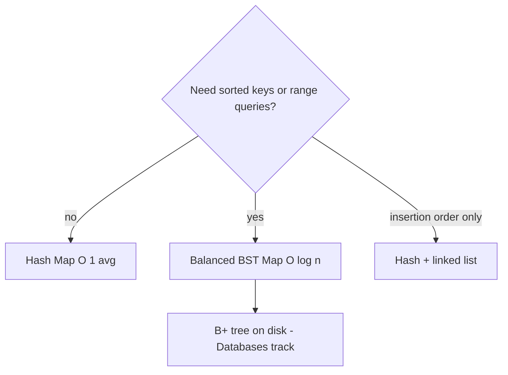
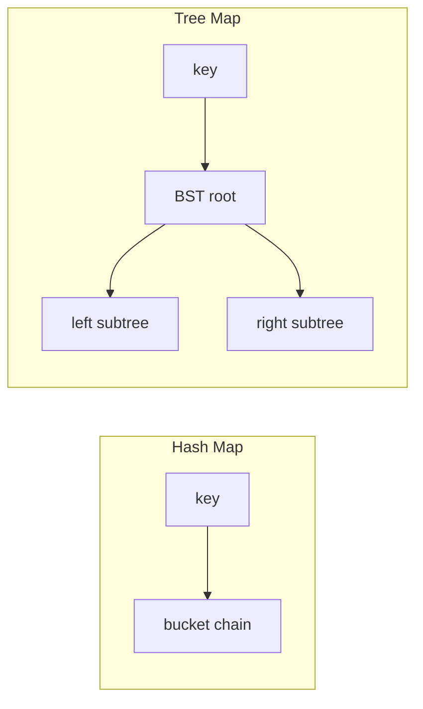
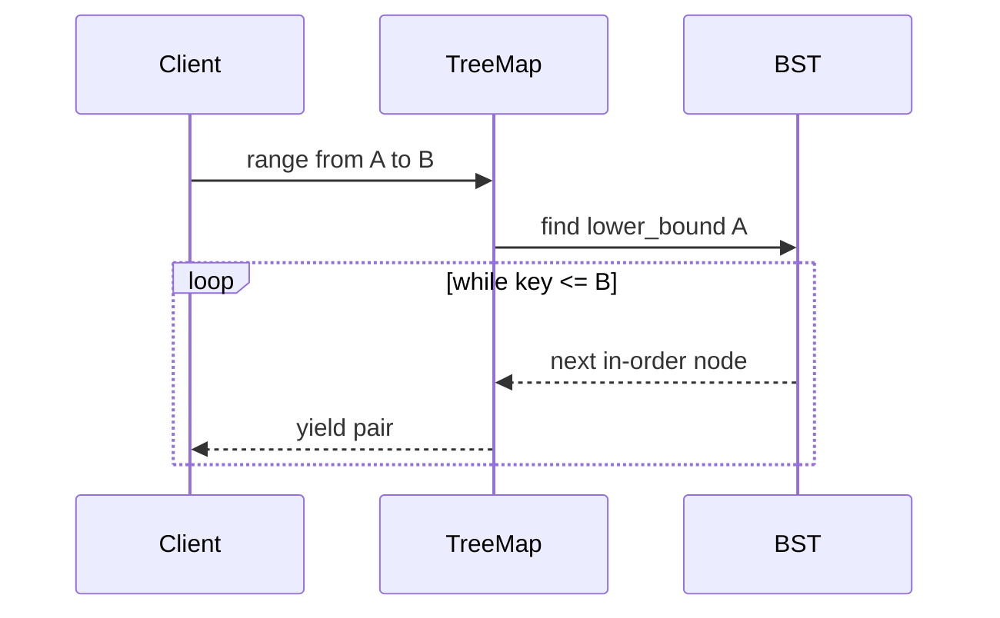

# Ordered Maps via Trees vs Hashing

## Overview

A **hash map** provides expected O(1) insert, lookup, and delete with **no key ordering**. An **ordered map** (tree map, sorted dictionary) maintains keys in **comparison order** (typically red-black or AVL tree internally), enabling `min`, `max`, `successor`, and **range iteration** in O(log n) per structural op and O(k + log n) for k results.

The choice is not "which is faster" but **which operations your contract requires**. Schedulers need order by priority timestamp; caches keyed by opaque UUID need hash speed only.

## Learning Objectives

- Compare hash map and balanced BST map operation sets and complexities
- Identify workloads requiring sorted iteration or range queries
- Understand hybrid designs: hash for lookup + tree for order (LinkedHashMap, index hybrids)
- Map stdlib types: `Map` vs `TreeMap`, Python `dict` (insertion-ordered) vs `sortedcontainers`
- Hand off disk-ordered indexes to [[08-Databases/README|Databases]] B+ trees

## Prerequisites

- [[04-Data-Structures/04-Hash-Tables-and-Sets/Separate Chaining|Separate Chaining]]
- [[04-Data-Structures/05-Trees-and-Ordered-Maps/Binary Search Trees|Binary Search Trees]]
- [[04-Data-Structures/05-Trees-and-Ordered-Maps/Tree Representation and Traversal Contracts|Tree Representation and Traversal Contracts]]

## Difficulty

`intermediate`

## Estimated Time

- Reading: 2 hours
- Exercises: 2 hours
- Mini project: 3 hours

## History

`std::map` (red-black) vs `std::unordered_map` split the C++ standard library. Java `TreeMap` (red-black) vs `HashMap`. Python 3.7+ dict guarantees **insertion order**—not the same as **sorted order**—a frequent interview trap.

## Problem It Solves

Using hash maps for "get keys sorted" forces O(n log n) sort on every export. Using tree maps for pure membership at high QPS wastes log factor and comparison cost. Wrong choice shows up in slow reports, missing range APIs, and accidental reliance on hash iteration order.

## Internal Implementation

### Hash map core

- Index: `hash(key) → bucket`
- Order: undefined (implementation-dependent iteration)
- Key requirement: `hash` + `equals`

### Tree map core

- Index: BST on `compare(a,b)`
- Order: in-order traversal = sorted keys
- Key requirement: **total order** (strict weak ordering in C++)

### Insertion-ordered dict (Python)

Doubly linked list threading insertion sequence through hash table—O(1) move-to-end (`move_to_end`). Sorted order still requires separate tree or sort.



## Invariants

- **I1 (Hash map)**: No ordering invariant; iteration order must not be relied upon unless documented (insertion order).
- **I2 (Tree map)**: In-order traversal yields keys in strict ascending compare order.
- **I3 (BST balance)**: Height O(log n) via AVL/red-black invariants—see tree module notes.
- **I4 (Compare consistency)**: If `compare(a,b)==0`, keys treated as equal; no duplicates.

## Operation Complexity

| Operation | Hash map | Tree map (balanced) |
| --- | --- | --- |
| `get` / `put` / `delete` | O(1) avg | O(log n) |
| `min` / `max` | O(n) scan | O(log n) |
| `successor(k)` | O(n) | O(log n) |
| Range `[a,b]` | O(n) filter + sort | O(k + log n) |
| Iterate sorted | O(n log n) sort first | O(n) in-order |
| Memory | Lower overhead | Tree pointers |

## Mermaid Diagrams

### Structure: hash vs tree indexing



### Sequence: range query on tree map



## Examples

### Minimal Example

**TypeScript** — `Map` (hash) vs simple BST map sketch:

```typescript
// Hash — no sort order
const byId = new Map<string, number>();
byId.set("z", 1);
byId.set("a", 2);
console.log([...byId.keys()]); // insertion order in modern JS, not alpha

// Tree — use comparison
class TreeMap<K, V> {
  private root: Node<K, V> | null = null;
  constructor(private cmp: (a: K, b: K) => number) {}

  put(key: K, value: V): void {
    this.root = this.insert(this.root, key, value);
  }

  private insert(node: Node<K, V> | null, key: K, value: V): Node<K, V> {
    if (!node) return { key, value, left: null, right: null };
    const c = this.cmp(key, node.key);
    if (c < 0) node.left = this.insert(node.left, key, value);
    else if (c > 0) node.right = this.insert(node.right, key, value);
    else node.value = value;
    return node;
  }
  // balance omitted — see AVL / Red-Black notes
}

type Node<K, V> = {
  key: K;
  value: V;
  left: Node<K, V> | null;
  right: Node<K, V> | null;
};
```

**Python**:

```python
from sortedcontainers import SortedDict  # pip install sortedcontainers

by_hash: dict[str, int] = {"z": 1, "a": 2}
print(list(by_hash.keys()))  # insertion order 3.7+, not sorted

by_order: SortedDict[str, int] = SortedDict({"z": 1, "a": 2})
print(list(by_order.irange("a", "m")))  # range query in log n
```

### Production-Shaped Example

Time-series rollup: keys are timestamps—need **range scan**:

```python
from sortedcontainers import SortedDict
from datetime import datetime

rollups: SortedDict[datetime, float] = SortedDict()

def sum_range(start: datetime, end: datetime) -> float:
    total = 0.0
    for ts, value in rollups.irange(start, end):
        total += value
    return total
```

For UUID-only point lookups, use `dict`—no order needed.

Hybrid: **hash index + sorted index** for columns with different query patterns (database territory—see [[08-Databases/README|Databases]]).

## Trade-offs

| Dimension | Upside | Downside | When it matters |
| --- | --- | --- | --- |
| Hash map | Fast point ops | No range | Session stores, caches |
| Tree map | Range, order | log n, compare cost | Schedulers, time series |
| Insertion-ordered hash | LRU-like iteration | Not sorted | Config snapshots |
| On-disk B+ tree | Page locality | IO latency | Database indexes |

### When to Use

- **Hash**: opaque IDs, cache keys, dedupe sets
- **Tree**: timestamps, lexographic names, interval scheduling
- **SortedDict / TreeMap**: in-memory leaderboards with rank queries

### When Not to Use

- Tree map when keys lack stable total order (floating NaN pitfalls)
- Hash map when API promises sorted pagination without sort step
- In-memory tree for data that belongs on disk B+ — see [[04-Data-Structures/05-Trees-and-Ordered-Maps/B-Trees and B-Plus Trees Concepts|B-Trees and B-Plus Trees Concepts]]

## Exercises

1. Implement `floor(key)` and `ceiling(key)` on BST map.
2. Benchmark 1M inserts: `Map` vs balanced tree vs sort-on-read.
3. Explain why Python dict order ≠ sorted order with example.
4. Design API choosing hash vs tree for user preference store keyed by `(userId, prefKey)`.
5. When is `std::map` preferred over `unordered_map` for small n?

## Mini Project

**Ordered Map Clinic**: build CLI supporting point get and range dump; swap hash vs AVL backend via flag—part of [[04-Data-Structures/projects/Ordered Map Clinic/README|Ordered Map Clinic]].

## Portfolio Project

Document decision matrix row in [[04-Data-Structures/14-Production-Selection/Structure Selection Decision Matrix|Structure Selection Decision Matrix]].

## Interview Questions

1. Hash map vs tree map—when do you pick each?
2. Does Python dict sort keys by default?
3. Complexity of "top 10 keys in range [a,b]" on each structure?
4. What key types are unsafe for tree maps?
5. How is LinkedHashMap different from TreeMap?

### Stretch / Staff-Level

1. Design an in-memory index supporting both equality and range on different fields.
2. Compare skip list ordered map vs red-black for concurrent readers.

## Common Mistakes

- Assuming hash map iteration is sorted
- Using `float` keys without total order (`NaN`)
- Paying O(log n) for tree when hash suffices
- Confusing insertion order with comparator order

## Best Practices

- Document ordering contract in API (sorted by, or undefined)
- Use tree maps for **open-ended range streams** (time windows)
- Use hash maps for **point lookups** at high QPS
- For disk persistence, defer to database B+ indexes

## Summary

Hash maps optimize single-key access; tree maps optimize order and ranges. Insertion-ordered hashes are a third variant for recency, not comparison sort. Production selection starts from required operations, not asymptotic constants alone. Disk-resident ordered indexes extend these ideas with page-oriented B-trees—owned by the Databases track.

## Further Reading

- [[00-References/Data Structures/README|Data Structures References]]
- [[04-Data-Structures/projects/Ordered Map Clinic/README|Ordered Map Clinic]]

## Related Notes

- [[04-Data-Structures/05-Trees-and-Ordered-Maps/Binary Search Trees|Binary Search Trees]]
- [[04-Data-Structures/05-Trees-and-Ordered-Maps/AVL Trees|AVL Trees]]
- [[04-Data-Structures/05-Trees-and-Ordered-Maps/Red-Black Trees Concepts|Red-Black Trees Concepts]]
- [[04-Data-Structures/05-Trees-and-Ordered-Maps/B-Trees and B-Plus Trees Concepts|B-Trees and B-Plus Trees Concepts]]
- [[04-Data-Structures/04-Hash-Tables-and-Sets/Sets Multisets and Map vs Set|Sets Multisets and Map vs Set]]
- [[08-Databases/README|Databases Track]]

## Progress Checklist

- [ ] Explained from first principles
- [ ] Drew at least one Mermaid diagram
- [ ] Implemented a minimal version
- [ ] Documented trade-offs and non-goals
- [ ] Completed exercises
- [ ] Practiced interview questions aloud
- [ ] Linked prerequisites and dependents
