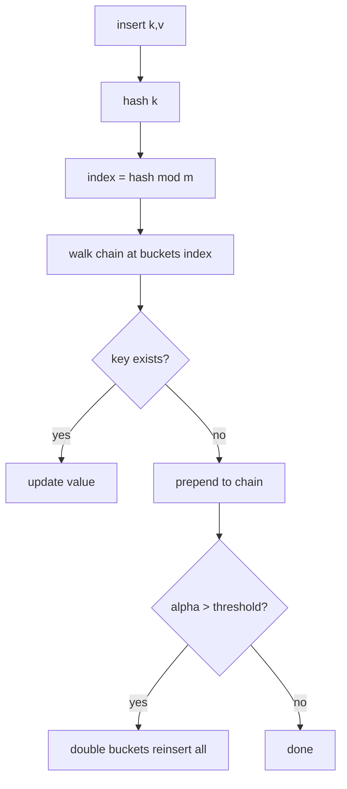
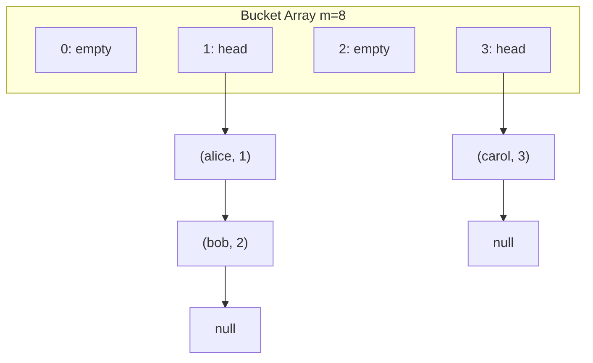
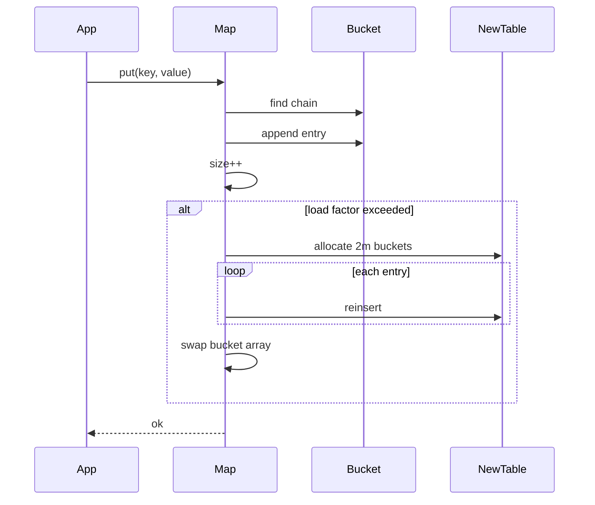

# Separate Chaining

## Overview

**Separate chaining** resolves hash collisions by storing all keys that map to the same bucket in an auxiliary collection—traditionally a **singly linked list**, often a **dynamic array** (Java `HashMap` since Java 8 treeifies long bins), or a small fixed array for embedded systems.

The bucket array holds **heads**; each bucket is independent. Load factor α = n/m (entries / buckets) can exceed 1.0 in theory, but production tables rehash before α grows large enough to make chains dominate latency.

This is the default mental model for `std::unordered_map`, Python `dict` (open addressing internally in CPython—but chaining taught first), and many teaching implementations.

## Learning Objectives

- Implement a chaining hash map with insert, get, delete, and resize
- Analyze expected chain length as a function of load factor
- Choose list vs vector per bucket for cache locality
- Implement rehashing without losing entries or breaking iterators
- Relate pointer-chasing cost to [[01-Computer-Science/02-Machine-Model/Cache Hierarchy and Locality|Cache Hierarchy and Locality]]

## Prerequisites

- [[04-Data-Structures/04-Hash-Tables-and-Sets/Hash Functions Avalanche and Equality Contracts|Hash Functions Avalanche and Equality Contracts]]
- [[04-Data-Structures/02-Linked-Structures/Singly Linked Lists|Singly Linked Lists]]
- [[04-Data-Structures/01-Contiguous-Sequences/Dynamic Arrays and Amortized Growth|Dynamic Arrays and Amortized Growth]]

## Difficulty

`intermediate`

## Estimated Time

- Reading: 2 hours
- Exercises: 3 hours
- Mini project: 4 hours

## History

Separate chaining appears in early Lisp interpreters and Knuth's catalog of hashing schemes. Java's transition from linked lists to balanced trees in oversized bins (Java 8+) addressed **hash-flooding** within chaining. Modern high-performance libraries often prefer **open addressing** for cache reasons but chaining remains easier to teach and to make **concurrent** (lock per bucket).

## Problem It Solves

Direct addressing needs m = |universe| slots—impossible for string keys. Chaining bounds table size m ≪ |universe| while keeping expected O(1) operations when α is controlled and hashes are uniform.

## Internal Implementation

### Layout

```
buckets:  [ head0, head1, head2, ... head(m-1) ]
            |      |
            v      v
           null   (k1,v1) -> (k4,v4) -> null
```

Each entry stores `(key, value, hashCache?)`. Caching `hashCode` avoids rehashing on resize for Java-style objects.

### Rehashing

When α > threshold (often 0.75), allocate `2m` buckets, reinsert every entry at `newIndex = hash(k) mod newM`. Amortized O(1) insert—see [[04-Data-Structures/00-Orientation-and-Contracts/Complexity Tables Amortization and Practical Constants|Complexity Tables Amortization and Practical Constants]].

### Delete

Unlink node from chain. **No tombstones** needed (contrast [[04-Data-Structures/04-Hash-Tables-and-Sets/Open Addressing|Open Addressing]]). Iterator invalidation: only iterators to deleted bucket affected if using linked lists.



## Invariants

- **I1**: Every stored entry `(k,v)` appears in exactly one bucket chain: `bucket[hash(k) mod m]`.
- **I2**: No duplicate keys within a chain; `equals` identifies key identity.
- **I3**: `size` equals total entries across all chains.
- **I4**: After rehash, all entries satisfy I1 with new modulus.
- **I5**: Load factor `size / buckets.length ≤ maxLoad` except transiently during insert before rehash.

## Operation Complexity

| Operation | Average | Worst | Amortized | Notes |
| --- | --- | --- | --- | --- |
| `get(k)` | O(1) | O(n) | — | Worst: all keys in one bucket |
| `put(k,v)` | O(1) | O(n) | O(1) | Rehash amortized |
| `delete(k)` | O(1) | O(n) | — | Unlink from chain |
| `resize()` | O(n) | O(n) | — | Full reinsert |
| Iterate all | O(n + m) | O(n + m) | — | Must scan empty buckets |

Assumptions: simple uniform hashing; α bounded by constant; hash contract holds.

## Mermaid Diagrams

### Structure: bucket array with chains



### Sequence: insert with rehash



## Examples

### Minimal Example

**TypeScript**:

```typescript
type Entry<K, V> = { key: K; value: V; next?: Entry<K, V> };

export class ChainingHashMap<K, V> {
  private buckets: Array<Entry<K, V> | undefined> = [];
  private _size = 0;
  private readonly maxLoad = 0.75;

  constructor(
    initialCapacity = 8,
    private hash: (k: K) => number,
    private equal: (a: K, b: K) => boolean
  ) {
    this.buckets = new Array(initialCapacity);
  }

  private index(key: K): number {
    return this.hash(key) & (this.buckets.length - 1);
  }

  get(key: K): V | undefined {
    for (let e = this.buckets[this.index(key)]; e; e = e.next) {
      if (this.equal(e.key, key)) return e.value;
    }
    return undefined;
  }

  put(key: K, value: V): void {
    const i = this.index(key);
    for (let e = this.buckets[i]; e; e = e.next) {
      if (this.equal(e.key, key)) {
        e.value = value;
        return;
      }
    }
    this.buckets[i] = { key, value, next: this.buckets[i] };
    this._size++;
    if (this._size / this.buckets.length > this.maxLoad) this.rehash();
  }

  private rehash(): void {
    const old = this.buckets;
    this.buckets = new Array(old.length * 2);
    this._size = 0;
    for (const head of old) {
      for (let e = head; e; e = e.next) this.put(e.key, e.value);
    }
  }

  get size(): number {
    return this._size;
  }
}
```

**Python**:

```python
from dataclasses import dataclass
from typing import Callable, Generic, Iterator, Optional, TypeVar

K = TypeVar("K")
V = TypeVar("V")

@dataclass
class _Entry(Generic[K, V]):
    key: K
    value: V
    next: Optional["_Entry[K, V]"] = None

class ChainingHashMap(Generic[K, V]):
    def __init__(
        self,
        hash_fn: Callable[[K], int],
        eq: Callable[[K, K], bool],
        capacity: int = 8,
        max_load: float = 0.75,
    ) -> None:
        self._hash = hash_fn
        self._eq = eq
        self._max_load = max_load
        self._buckets: list[Optional[_Entry[K, V]]] = [None] * capacity
        self._size = 0

    def _index(self, key: K) -> int:
        return self._hash(key) & (len(self._buckets) - 1)

    def get(self, key: K) -> Optional[V]:
        e = self._buckets[self._index(key)]
        while e:
            if self._eq(e.key, key):
                return e.value
            e = e.next
        return None

    def put(self, key: K, value: V) -> None:
        i = self._index(key)
        e = self._buckets[i]
        while e:
            if self._eq(e.key, key):
                e.value = value
                return
            e = e.next
        self._buckets[i] = _Entry(key, value, self._buckets[i])
        self._size += 1
        if self._size / len(self._buckets) > self._max_load:
            self._rehash()

    def _rehash(self) -> None:
        old = self._buckets
        self._buckets = [None] * (len(old) * 2)
        self._size = 0
        for head in old:
            e = head
            while e:
                self.put(e.key, e.value)
                e = e.next
```

### Production-Shaped Example

Per-bucket **vector** with small-array optimization reduces pointer chasing:

```typescript
class VecBucketMap<K, V> {
  private buckets: Array<Array<[K, V]>> = Array.from({ length: 16 }, () => []);

  put(key: K, value: V): void {
    const i = this.hash(key) & 15;
    const bin = this.buckets[i];
    for (let j = 0; j < bin.length; j++) {
      if (this.equal(bin[j][0], key)) {
        bin[j][1] = value;
        return;
      }
    }
    bin.push([key, value]);
    if (bin.length > 8) this.convertToTreeOrRehash(i); // Java-style mitigation
  }
  // hash, equal, convertToTreeOrRehash omitted
}
```

Instrument chain length histogram in metrics; alert on p99 chain > 8 under normal load—possible hash attack or bad key distribution.

## Trade-offs

| Dimension | Upside | Downside | When it matters |
| --- | --- | --- | --- |
| Chaining vs open addressing | Simple delete; α can > 1 briefly | Pointer chasing; cache misses | Large entries, easy concurrency |
| Linked list buckets | O(1) prepend | Poor locality | Small maps, teaching |
| Vector buckets | Better cache for small bins | O(k) delete in bin | Embedded / real-time |
| Treeified bins (Java) | O(log k) worst bin | Code complexity | Adversarial strings |

### When to Use

- Teaching and prototyping hash tables
- When **deletes are frequent** and tombstone management is undesirable
- **Concurrent maps** with per-bucket locking (segmented hash maps)

### When Not to Use

- Ultra-low-latency in-memory indexes where open addressing wins on locality
- Memory-tight embedded systems (overhead of node pointers)

## Exercises

1. Implement `delete(k)` and verify invariants with property tests.
2. Derive expected chain length α under simple uniform hashing.
3. Measure throughput: linked-list buckets vs dynamic array buckets for 1M inserts.
4. Implement iterator that visits entries in bucket order without allocation.
5. Simulate hash-flooding: all keys collide; compare with treeified bin mitigation.

## Mini Project

Complete a dual-language **ChainingHashMap** in [[04-Data-Structures/code/README|code labs]] with shared JSON test vectors: insert, overwrite, delete, rehash, iterate.

## Portfolio Project

Benchmark chaining vs open addressing in [[04-Data-Structures/projects/Hash Map Bake-Off/README|Hash Map Bake-Off]] on uniform and adversarial key sets.

## Interview Questions

1. What is load factor and typical rehash threshold?
2. Why is delete simpler in chaining than open addressing?
3. Expected time of lookup if m = n (α = 1)?
4. How does Java 8+ reduce chain length worst case?
5. Why might linked-list buckets hurt CPU cache performance?

### Stretch / Staff-Level

1. Design a concurrent chaining map with lock per bucket vs striped locks—compare contention under skewed access.
2. When would you treeify a bin vs rehash the entire table?

## Common Mistakes

- Forgetting to rehash **all** entries on resize (using old modulus)
- Infinite rehash loop if `maxLoad` misconfigured with fixed capacity
- Not handling **duplicate hash** with distinct keys via full `equals` check
- Using `===` on keys when value equality was intended

## Best Practices

- Power-of-two bucket count with **masked index** only after hash mixing
- Track **max chain length** in production metrics
- Pre-size table when entry count known (`new Map(expectedSize)`)
- Prefer immutable keys; see hash contract note

## Summary

Separate chaining maps each bucket to a independent collision collection. It trades memory overhead and pointer chasing for simplicity and clean deletion. Performance is governed by load factor and hash quality; rehashing keeps expected chain length bounded. Production systems often hybridize—vectors for small bins, trees for attacked bins—while the core invariant remains: every key lives in exactly one bucket chain determined by its hash.

## Further Reading

- [[00-References/Data Structures/README|Data Structures References]]
- Knuth — separate chaining analysis
- Java `HashMap` source — treeify threshold documentation

## Related Notes

- [[04-Data-Structures/04-Hash-Tables-and-Sets/Open Addressing|Open Addressing]]
- [[04-Data-Structures/04-Hash-Tables-and-Sets/Hash Functions Avalanche and Equality Contracts|Hash Functions Avalanche and Equality Contracts]]
- [[04-Data-Structures/04-Hash-Tables-and-Sets/Hash-Flooding DoS and Randomized Hashing|Hash-Flooding DoS and Randomized Hashing]]
- [[04-Data-Structures/00-Orientation-and-Contracts/Memory Layout Locality and Allocation Patterns|Memory Layout Locality and Allocation Patterns]]
- [[04-Data-Structures/13-Concurrency-Aware-Structures/Concurrent Hash Maps Concepts|Concurrent Hash Maps Concepts]]

## Progress Checklist

- [ ] Explained from first principles
- [ ] Drew at least one Mermaid diagram
- [ ] Implemented a minimal version
- [ ] Documented trade-offs and non-goals
- [ ] Completed exercises
- [ ] Practiced interview questions aloud
- [ ] Linked prerequisites and dependents
