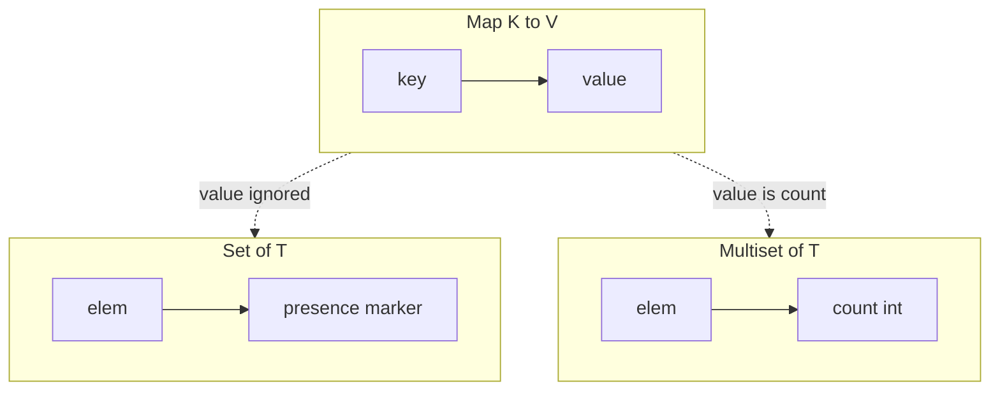
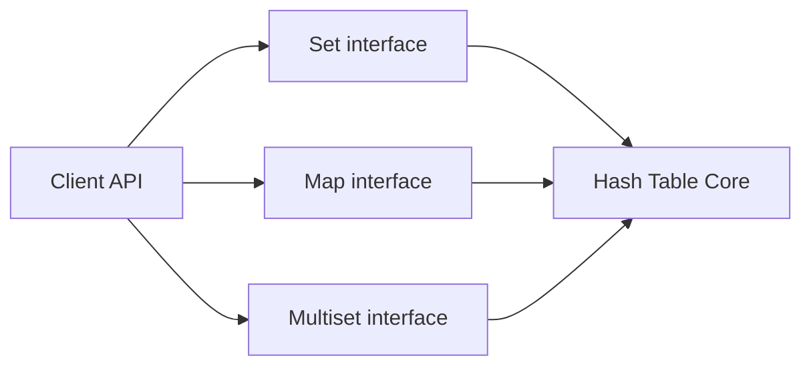
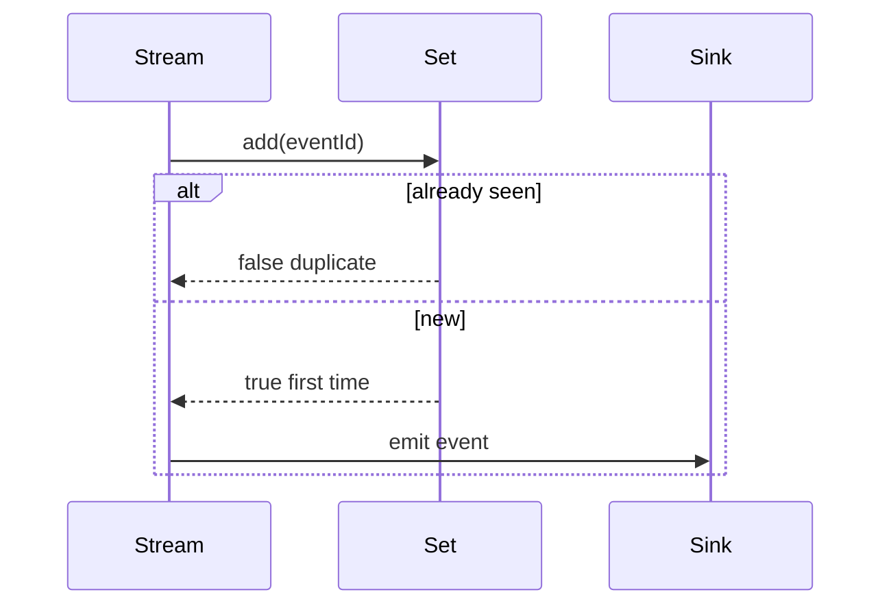

# Sets Multisets and Map vs Set

## Overview

A **set** is an unordered collection of **unique** elements supporting membership test, insert, and delete. A **map** (dictionary, associative array) stores **key–value pairs** with unique keys. A **multiset** (bag) counts **multiplicity**—how many times each element appears.

All three are typically implemented atop the same hash table machinery from [[04-Data-Structures/04-Hash-Tables-and-Sets/Separate Chaining|Separate Chaining]] or [[04-Data-Structures/04-Hash-Tables-and-Sets/Open Addressing|Open Addressing]]: a set is a map whose values are ignored or fixed to a sentinel; a multiset maps keys to integer counts.

Choosing map vs set vs multiset is an **API design** decision with performance and correctness implications in deduplication, indexing, and frequency analysis.

## Learning Objectives

- Define set, multiset, and map ADTs with precise operations
- Implement hash set and counter (multiset) from hash map
- Choose the right abstraction for dedupe, indexing, and cardinality
- Understand set algebra operations and their complexity
- Map TypeScript `Set`/`Map` and Python `set`/`dict`/`Counter` semantics

## Prerequisites

- [[04-Data-Structures/04-Hash-Tables-and-Sets/Separate Chaining|Separate Chaining]]
- [[04-Data-Structures/00-Orientation-and-Contracts/Abstract Data Types vs Concrete Structures|Abstract Data Types vs Concrete Structures]]

## Difficulty

`beginner`

## Estimated Time

- Reading: 1.5 hours
- Exercises: 2 hours
- Mini project: 2 hours

## History

Mathematical sets predate computing; SETL and Pascal introduced set types. Multisets appear in combinatorics and database **GROUP BY** counts. Python's `collections.Counter` (2009) popularized multiset APIs for data pipelines.

## Problem It Solves

Wrong abstraction causes:

- Using `Map<T, boolean>` for membership when `Set<T>` expresses intent and saves memory
- Using `Set` when counts matter—losing frequency information
- Using `Map` with dummy values when only keys matter—confusing serializers and metrics

## Internal Implementation

### Map as substrate

| ADT | Storage | Value slot |
| --- | --- | --- |
| Map | `hash(key) → value` | arbitrary `V` |
| Set | `hash(elem) → present` | unit / `true` / empty object |
| Multiset | `hash(elem) → count` | integer ≥ 1 |

Set insert ignores value overwrite; multiset increment/decrement updates count, removes key when count hits zero.

### Set operations

For hash sets A, B with n and m elements:

- **Union**: insert all from both — O(n + m) expected
- **Intersection**: iterate smaller, test membership in larger — O(min(n,m)) expected
- **Difference**: iterate A, remove if in B

No ordering unless using [[04-Data-Structures/05-Trees-and-Ordered-Maps/Binary Search Trees|tree-backed ordered sets]].



## Invariants

- **I1 (Set uniqueness)**: Each element appears at most once; `contains(x)` iff x stored.
- **I2 (Map key uniqueness)**: Each key maps to exactly one value; `put(k,v)` replaces prior.
- **I3 (Multiset count)**: Stored count for `x` equals number of `add(x)` minus `remove(x)` not below zero.
- **I4 (Contract)**: All ADTs use same hash/equality contract for element/key type.

## Operation Complexity

| Operation | Set (hash) | Map (hash) | Multiset (hash) |
| --- | --- | --- | --- |
| `add` / `put` | O(1) avg | O(1) avg | O(1) avg |
| `contains` / `get` | O(1) avg | O(1) avg | O(1) avg |
| `remove` | O(1) avg | O(1) avg | O(1) avg |
| `size` | O(1) | O(1) | O(1) distinct keys |
| `union` | O(n + m) | — | merge counts O(n + m) |
| Iterate | O(n) | O(n) | O(distinct) |

Worst cases O(n) under hash collisions; see hash flooding note.

## Mermaid Diagrams

### Structure: three ADTs one engine



### Sequence: dedupe pipeline with set vs map



## Examples

### Minimal Example

**TypeScript**:

```typescript
export class HashSet<T> {
  private map = new Map<T, true>();

  add(x: T): boolean {
    if (this.map.has(x)) return false;
    this.map.set(x, true);
    return true;
  }

  has(x: T): boolean {
    return this.map.has(x);
  }

  delete(x: T): boolean {
    return this.map.delete(x);
  }

  get size(): number {
    return this.map.size;
  }
}

export class HashMultiset<T> {
  private counts = new Map<T, number>();

  add(x: T, n = 1): void {
    this.counts.set(x, (this.counts.get(x) ?? 0) + n);
  }

  count(x: T): number {
    return this.counts.get(x) ?? 0;
  }

  remove(x: T, n = 1): void {
    const c = this.count(x);
    if (c <= n) this.counts.delete(x);
    else this.counts.set(x, c - n);
  }
}
```

**Python**:

```python
from collections import Counter, defaultdict
from typing import Generic, Hashable, TypeVar

T = Hashable = TypeVar("T", bound=Hashable)

class HashMultiset(Generic[T]):
    def __init__(self) -> None:
        self._counts: dict[T, int] = {}

    def add(self, x: T, n: int = 1) -> None:
        self._counts[x] = self._counts.get(x, 0) + n

    def count(self, x: T) -> int:
        return self._counts.get(x, 0)

    def remove(self, x: T, n: int = 1) -> None:
        c = self.count(x)
        if c <= n:
            del self._counts[x]
        else:
            self._counts[x] = c - n

# Idiom: set for membership
seen: set[str] = set()
# Idiom: Counter for frequencies
freq: Counter[str] = Counter()
```

### Production-Shaped Example

Request deduplication: **set** for idempotency keys; **multiset** for rate-limit token buckets per client:

```typescript
class IdempotencyGuard {
  private seen = new Set<string>();

  accept(key: string): boolean {
    if (this.seen.has(key)) return false;
    this.seen.add(key);
    return true;
  }
}

class SlidingWindowCounter {
  private buckets = new Map<string, number[]>();

  record(clientId: string, ts: number): void {
    const window = this.buckets.get(clientId) ?? [];
    window.push(ts);
    this.buckets.set(clientId, window);
  }
}
```

Use **Bloom filter** ([[04-Data-Structures/10-Probabilistic-Structures/Bloom Filters|Bloom Filters]]) when set memory at scale is prohibitive and false positives are tolerable.

## Trade-offs

| Dimension | Upside | Downside | When it matters |
| --- | --- | --- | --- |
| Set vs Map with dummy value | Clear intent | — | Code review, API docs |
| Hash set vs sorted set | O(1) avg ops | No order | Range queries need tree |
| Multiset vs list | O(1) count update | Only per distinct key | Word frequency |
| In-memory set vs DB unique index | Fast | Not durable | Idempotency with persistence |

### When to Use

- **Set**: dedupe, visited tracking, permission membership
- **Map**: attribute lookup, cache key → value, index by ID
- **Multiset/Counter**: histograms, inventory with quantity, anagram counts

### When Not to Use

- **Set** when you need value payload—use map
- **Map** when only keys matter—use set (avoid `null` values)
- **Multiset** when order of duplicates matters—use list

## Exercises

1. Implement set union/intersection using only `add`, `has`, `iterate`.
2. Prove intersection is O(min(n,m)) when iterating the smaller set.
3. Build an anagram grouper using multiset signatures `Counter(char)`.
4. Convert broken `Map<string, boolean>` deduper to `Set`; measure memory.
5. When does Python `dict` preserve insertion order and how does that differ from `set`?

## Mini Project

**Log Deduplication CLI**: stream JSON lines; flags `--unique-field`; reports duplicate rate; optional `--count` for multiset mode.

## Portfolio Project

Extend [[04-Data-Structures/projects/Hash Map Bake-Off/README|Hash Map Bake-Off]] with set and multiset facades sharing one hash core.

## Interview Questions

1. Implement contains duplicate using a set in O(n) time.
2. Difference between set and map in your language of choice?
3. How is Counter different from defaultdict(int)?
4. Can two sets be equal with different iteration order?
5. Memory cost: Set vs array for 1M integers in [0, 1M)?

### Stretch / Staff-Level

1. Design a distributed multiset merge for MapReduce combiners.
2. When would you use HyperLogLog instead of exact set cardinality?

## Common Mistakes

- Using objects as Set keys in JS without stable identity semantics
- Mutating a key while in a set
- Confusing `len(counter)` (distinct keys) with `sum(counter.values())` (total items)
- Using set for **multiplicity-1** inventory with merge updates—need map

## Best Practices

- Name types explicitly: `UserIdSet`, not `Map<UserId, unknown>`
- Use `Counter` / multiset for frequency; don't append duplicates to arrays
- For ordered unique keys, see [[04-Data-Structures/04-Hash-Tables-and-Sets/Ordered Maps via Trees vs Hashing|Ordered Maps via Trees vs Hashing]]
- Document empty-set and empty-map serialization in APIs

## Summary

Sets, maps, and multisets differ in what they store—presence, mapping, or count—but share hash-table implementations and complexity profiles. Picking the right ADT clarifies invariants and prevents dummy-value hacks. Production pipelines dedupe with sets, index with maps, and aggregate with multisets; each choice should be explicit in API design and observability.

## Further Reading

- [[00-References/Data Structures/README|Data Structures References]]
- Python `collections` module documentation

## Related Notes

- [[04-Data-Structures/04-Hash-Tables-and-Sets/Separate Chaining|Separate Chaining]]
- [[04-Data-Structures/04-Hash-Tables-and-Sets/Open Addressing|Open Addressing]]
- [[04-Data-Structures/04-Hash-Tables-and-Sets/Ordered Maps via Trees vs Hashing|Ordered Maps via Trees vs Hashing]]
- [[04-Data-Structures/10-Probabilistic-Structures/Bloom Filters|Bloom Filters]]
- [[04-Data-Structures/00-Orientation-and-Contracts/Abstract Data Types vs Concrete Structures|Abstract Data Types vs Concrete Structures]]

## Progress Checklist

- [ ] Explained from first principles
- [ ] Drew at least one Mermaid diagram
- [ ] Implemented a minimal version
- [ ] Documented trade-offs and non-goals
- [ ] Completed exercises
- [ ] Practiced interview questions aloud
- [ ] Linked prerequisites and dependents
