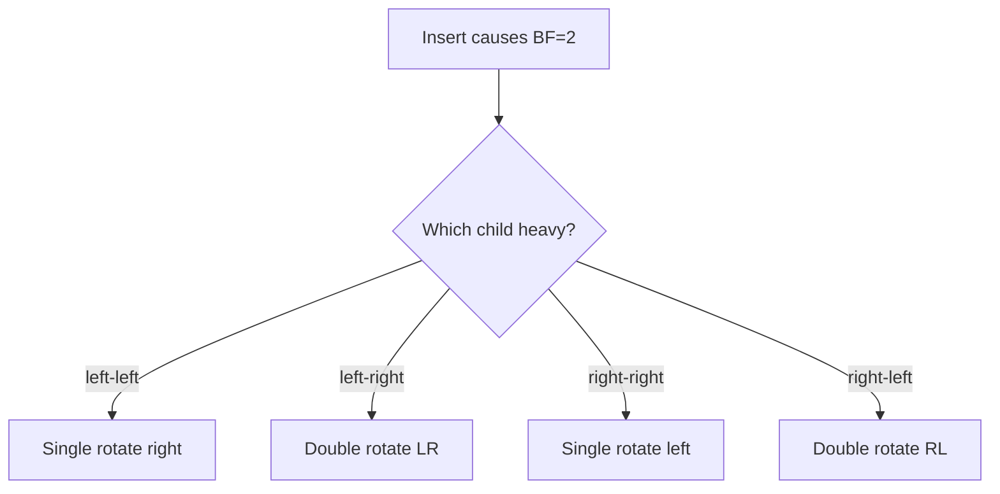
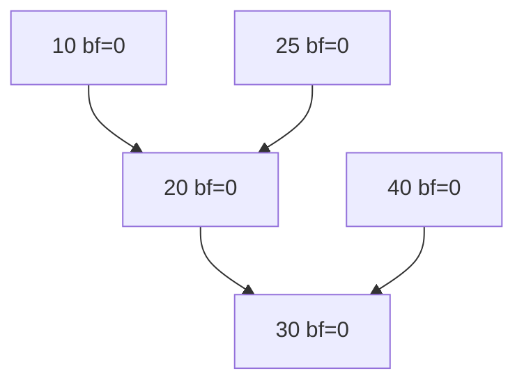
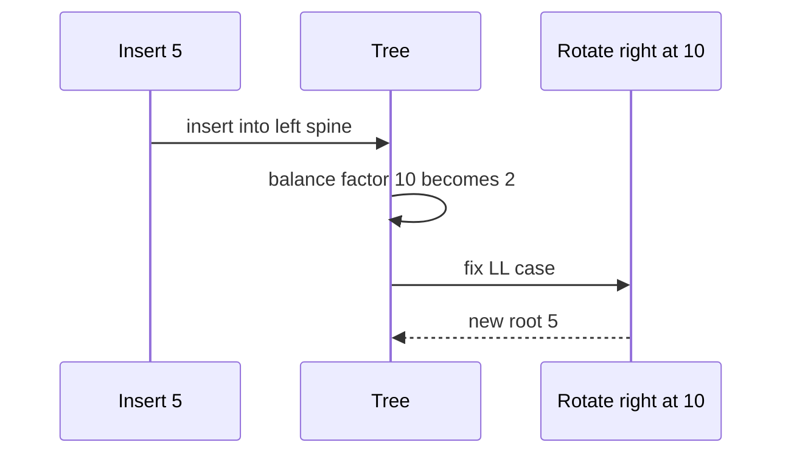

# AVL Trees

## Overview

An **AVL tree** is a self-balancing BST where for every node the **balance factor**—height(left) − height(right)—is in {−1, 0, +1}. Insert and delete may violate balance; **rotations** (single and double) restore the invariant in O(1) local work per imbalance, keeping height h = O(log n).

AVL trees are **more strictly balanced** than typical red-black trees (shorter height, more rotations on insert). They suit **lookup-heavy** ordered maps; write-heavy workloads may prefer red-black's fewer rotations.

## Learning Objectives

- Compute balance factor and detect violations bottom-up
- Perform left/right single rotations and LL/LR/RL/RR double rotation cases
- Implement AVL insert with rebalancing on unwind
- Prove height bound ~1.44 log₂(n+2) − constant
- Compare AVL vs [[04-Data-Structures/05-Trees-and-Ordered-Maps/Red-Black Trees Concepts|Red-Black Trees]] for production map selection

## Prerequisites

- [[04-Data-Structures/05-Trees-and-Ordered-Maps/Binary Search Trees|Binary Search Trees]]
- [[04-Data-Structures/05-Trees-and-Ordered-Maps/Tree Representation and Traversal Contracts|Tree Representation and Traversal Contracts]]

## Difficulty

`advanced`

## Estimated Time

- Reading: 3 hours
- Exercises: 5 hours
- Mini project: 6 hours

## History

Adelson-Velsky and Landis (1962) published the first balanced BST. AVL remained standard in Russian/Soviet curricula and database teaching; industrial C++ `std::map` uses red-black instead for historical STL choices and slightly cheaper inserts.

## Problem It Solves

Unbalanced BST height O(n) breaks ordered map guarantees. AVL restores **worst-case O(log n)** search, insert, delete with predictable comparison count—important for latency-sensitive in-memory indexes and real-time systems.

## Internal Implementation

### Node fields

Store `height` or `balance` at each node; update on every structural change.

### Rotations

**Right rotation** on left-heavy node:

```
      y                x
     / \              / \
    x   C    ==>     A   y
   / \                  / \
  A   B                B   C
```

**Left-right case**: rotate left on child, then right on node.

### Insert rebalance

Recursive insert returns new subtree root; after child insert, update height, compute balance, rotate if outside {−1,0,1}. At most **two rotations** per insert.

### Delete

BST delete then rebalance on unwind; may require O(log n) rotations along path—still O(log n) total height.



## Invariants

- **I1 (BST order)**: Same as [[04-Data-Structures/05-Trees-and-Ordered-Maps/Binary Search Trees|Binary Search Trees]].
- **I2 (AVL balance)**: For every node, |height(left) − height(right)| ≤ 1.
- **I3 (Height field)**: Stored height equals actual subtree height.
- **I4 (Post-rotation)**: I1 and I2 hold; BST order preserved by rotation geometry.

## Operation Complexity

| Operation | Worst | Amortized notes |
| --- | --- | --- |
| `search` | O(log n) | ~30% fewer compares than RB on average |
| `insert` | O(log n) | Up to 2 rotations |
| `delete` | O(log n) | O(log n) rotations possible |
| `rotate` | O(1) | Local pointer rewiring |
| Space | O(n) | +1 int per node for height |

## Mermaid Diagrams

### Structure: balance factors



### Sequence: LL insert triggers rotate



## Examples

### Minimal Example

**TypeScript** — rotation helpers:

```typescript
type AVLNode<K, V> = {
  key: K;
  value: V;
  height: number;
  left: AVLNode<K, V> | null;
  right: AVLNode<K, V> | null;
};

function height<K, V>(n: AVLNode<K, V> | null): number {
  return n ? n.height : 0;
}

function updateHeight<K, V>(n: AVLNode<K, V>): void {
  n.height = 1 + Math.max(height(n.left), height(n.right));
}

function balanceFactor<K, V>(n: AVLNode<K, V>): number {
  return height(n.left) - height(n.right);
}

function rotateRight<K, V>(y: AVLNode<K, V>): AVLNode<K, V> {
  const x = y.left!;
  const T2 = x.right;
  x.right = y;
  y.left = T2;
  updateHeight(y);
  updateHeight(x);
  return x;
}

function rebalance<K, V>(n: AVLNode<K, V>): AVLNode<K, V> {
  updateHeight(n);
  const bf = balanceFactor(n);
  if (bf > 1) {
    if (balanceFactor(n.left!) < 0) n.left = rotateLeft(n.left!);
    return rotateRight(n);
  }
  if (bf < -1) {
    if (balanceFactor(n.right!) > 0) n.right = rotateRight(n.right!);
    return rotateLeft(n);
  }
  return n;
}

function rotateLeft<K, V>(x: AVLNode<K, V>): AVLNode<K, V> {
  const y = x.right!;
  const T2 = y.left;
  y.left = x;
  x.right = T2;
  updateHeight(x);
  updateHeight(y);
  return y;
}
```

**Python**:

```python
from dataclasses import dataclass
from typing import Callable, Generic, Optional, TypeVar

K = TypeVar("K")
V = TypeVar("V")

@dataclass
class AVLNode(Generic[K, V]):
    key: K
    value: V
    height: int = 1
    left: Optional["AVLNode[K, V]"] = None
    right: Optional["AVLNode[K, V]"] = None

def _height(n: Optional[AVLNode[K, V]]) -> int:
    return n.height if n else 0

def _update(n: AVLNode[K, V]) -> None:
    n.height = 1 + max(_height(n.left), _height(n.right))

def _rotate_right(y: AVLNode[K, V]) -> AVLNode[K, V]:
    x = y.left
    assert x
    y.left = x.right
    x.right = y
    _update(y)
    _update(x)
    return x

def _rebalance(n: AVLNode[K, V]) -> AVLNode[K, V]:
    _update(n)
    bf = _height(n.left) - _height(n.right)
    if bf > 1:
        assert n.left
        if _height(n.left.right) > _height(n.left.left):
            n.left = _rotate_left(n.left)
        return _rotate_right(n)
    if bf < -1:
        assert n.right
        if _height(n.right.left) > _height(n.right.right):
            n.right = _rotate_right(n.right)
        return _rotate_left(n)
    return n
```

### Production-Shaped Example

Use AVL when **p99 lookup latency** dominates (read-heavy config index):

```typescript
class ConfigIndex {
  private root: AVLNode<string, ConfigEntry> | null = null;
  get(key: string): ConfigEntry | undefined {
    /* O(log n) bounded comparisons */
  }
}
```

Instrument comparison count histogram; AVL should show tighter tail vs unbalanced BST on adversarial sorted inserts.

## Trade-offs

| Dimension | Upside | Downside | When it matters |
| --- | --- | --- | --- |
| vs unbalanced BST | O(log n) worst | Rotation code | Any production ordered map |
| vs red-black | Shorter tree, faster lookup | More rotations on insert | Read-heavy |
| vs hash map | Order + range | log n | Sorted pagination |
| Implementation | Deterministic height | Tricky delete | Interview + libs |

### When to Use

- Lookup-heavy in-memory ordered maps
- When worst-case comparison count must stay low
- Teaching rotations before red-black

### When Not to Use

- Write-heavy maps where RB's fewer rotations win
- Disk-resident indexes—use [[04-Data-Structures/05-Trees-and-Ordered-Maps/B-Trees and B-Plus Trees Concepts|B-Trees]]

## Exercises

1. Insert sequence 10,20,30,40,50; draw each rotation.
2. Implement full AVL delete with rebalance.
3. Verify I2 with O(n) post-order check on random ops.
4. Count rotations over 100k random inserts AVL vs RB simulation.
5. Prove AVL height ≤ 1.44 log₂(n+2).

## Mini Project

Complete AVL map in code labs; shared vectors with BST regression on sorted input.

## Portfolio Project

[[04-Data-Structures/projects/Ordered Map Clinic/README|Ordered Map Clinic]] AVL backend with rotation trace export.

## Interview Questions

1. Define AVL balance factor.
2. Difference LL vs LR case?
3. How many rotations maximum per insert?
4. AVL vs red-black—when prefer AVL?
5. Does AVL guarantee O(log n) delete?

### Stretch / Staff-Level

1. Implement node pooling to reduce allocator churn in AVL.
2. Prove insertion preserves BST order through rotation.

## Common Mistakes

- Forgetting to update heights after rotation
- Applying wrong rotation case (LR vs LL)
- Off-by-one in balance factor after delete
- Storing balance without recomputing from children

## Best Practices

- Centralize `rebalance()` called after insert/delete unwind
- Debug assert full tree AVL property periodically
- Prefer iterative search; recursive insert with stack depth O(log n) OK
- Document tie-breaking for duplicate keys

## Summary

AVL trees enforce strict height balance via rotations, guaranteeing O(log n) operations. They trade extra rotation work on write for shallower trees and faster lookup. Master single and double rotations on paper before coding delete. Production ordered maps often use red-black for historical reasons, but AVL remains the clearest introduction to balance invariants.

## Further Reading

- [[00-References/Data Structures/README|Data Structures References]]
- Adelson-Velsky & Landis (1962)

## Related Notes

- [[04-Data-Structures/05-Trees-and-Ordered-Maps/Binary Search Trees|Binary Search Trees]]
- [[04-Data-Structures/05-Trees-and-Ordered-Maps/Red-Black Trees Concepts|Red-Black Trees Concepts]]
- [[04-Data-Structures/04-Hash-Tables-and-Sets/Ordered Maps via Trees vs Hashing|Ordered Maps via Trees vs Hashing]]
- [[04-Data-Structures/05-Trees-and-Ordered-Maps/Treaps and Scapegoat Trees Concepts|Treaps and Scapegoat Trees Concepts]]

## Progress Checklist

- [ ] Explained from first principles
- [ ] Drew at least one Mermaid diagram
- [ ] Implemented a minimal version
- [ ] Documented trade-offs and non-goals
- [ ] Completed exercises
- [ ] Practiced interview questions aloud
- [ ] Linked prerequisites and dependents
