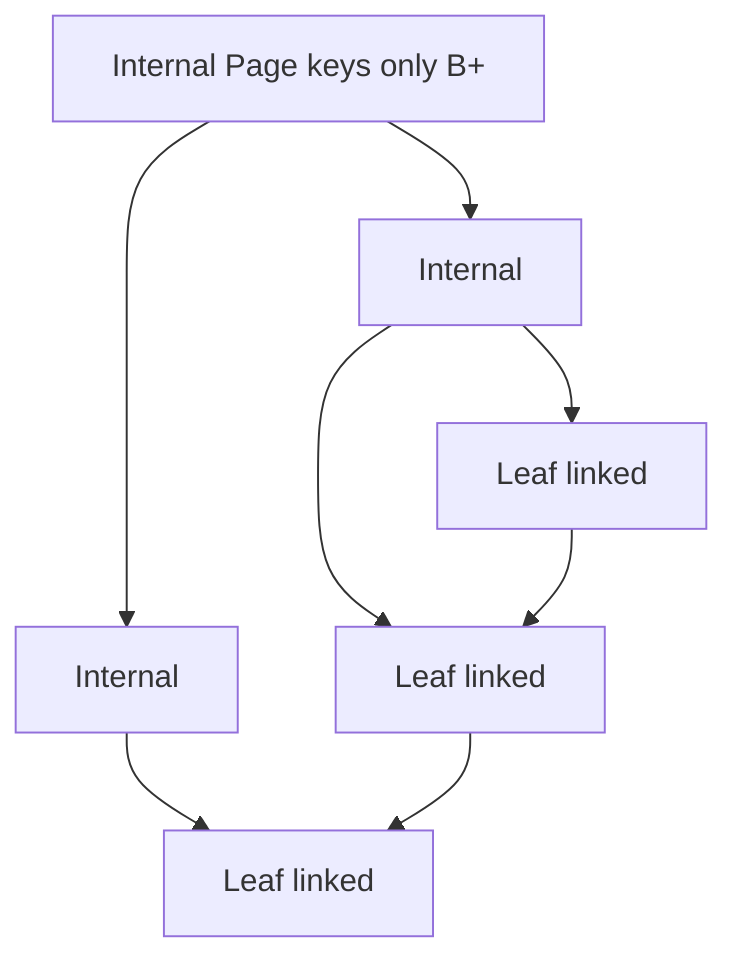
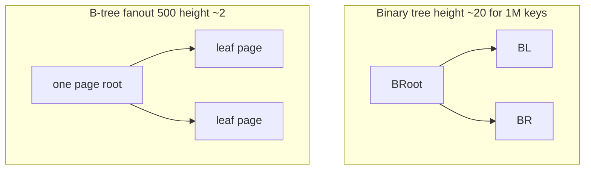
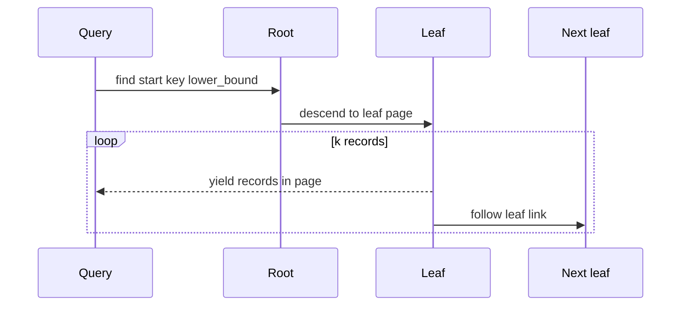

# B-Trees and B-Plus Trees Concepts

## Overview

A **B-tree** is a self-balancing search tree optimized for **block-oriented storage**: each node holds up to **M−1 keys** and **M children**, keeping height low via high **fanout**. Disk reads happen in **page-sized** units (often 4–16 KiB); a B-tree node maps to one page, so one I/O touches thousands of keys.

A **B+ tree** variant stores all records in **leaf nodes** linked for sequential scan; internal nodes hold only **routing keys**. Database indexes (InnoDB, PostgreSQL) use B+ trees; this note teaches **invariants and fanout reasoning**. Page formats, WAL, and buffer pools belong to [[08-Databases/README|Databases]].

## Learning Objectives

- State B-tree node occupancy invariants (minimum half-full except root)
- Explain why high fanout minimizes disk seeks
- Contrast B-tree (keys in internal nodes) vs B+ tree (keys only in leaves)
- Estimate tree height given page size and key size
- Hand off implementation details to database index notes

## Prerequisites

- [[04-Data-Structures/05-Trees-and-Ordered-Maps/Binary Search Trees|Binary Search Trees]]
- [[01-Computer-Science/02-Machine-Model/Cache Hierarchy and Locality|Cache Hierarchy and Locality]]
- [[01-Computer-Science/03-Memory-and-Addressing/Memory Hierarchy Trade-offs|Memory Hierarchy Trade-offs]]

## Difficulty

`advanced`

## Estimated Time

- Reading: 2–3 hours
- Exercises: 2 hours
- Mini project: 3 hours (height calculator)

## History

Bayer and McCreight (1972) at Boeing introduced B-trees for disk access. B+ trees became standard for database indexing due to leaf linking and uniform record storage. SSDs reduced seek latency but **page-oriented I/O** remains relevant.

## Problem It Solves

Binary BSTs have fanout 2—height log₂(n) means many disk hops for large n. B-tree with fanout 500 has height ~3 for billions of keys **if each node fits one page**. Minimizing height minimizes **I/O operations**, the dominant cost on disk.

## Internal Implementation

### B-tree node (order m)

For order **m** (max m children):

- Internal node: **⌈m/2⌉ − 1** to **m − 1** keys (except root)
- All leaves at **same depth**
- Search: binary search within node, then child pointer

### Split on overflow

Insert into leaf; if keys == m−1, **split** into two nodes, promote median key to parent (B-tree) or copy separator to parent (B+ variant details differ by text).

### B+ tree specifics

- Internal nodes: keys for routing only
- Leaves: all `(key → record pointer)` + **next leaf pointer**
- Range scan: walk leaf linked list—O(k) I/O for k records



## Invariants

- **I1 (Balance)**: All leaves at equal depth.
- **I2 (Occupancy)**: Non-root nodes have between ⌈m/2⌉−1 and m−1 keys (B-tree textbook variant; exact bounds vary by order definition).
- **I3 (Search ordering)**: Keys within node sorted; child pointers partition key space.
- **I4 (B+ leaf link)**: Leaves form singly linked list in key order.
- **I5 (Page fit)**: Node serializes within one storage page (production constraint).

## Operation Complexity

| Operation | Disk-oriented | In-memory analogy |
| --- | --- | --- |
| Point search | O(h) I/O, h = O(log_m n) | O(h × log B) per-node search |
| Insert | O(h) I/O + splits | Same structure |
| Range k records | O(h + k/m) leaf pages B+ | O(log n + k) |
| Delete | O(h) merges/borrows | Complex local fixup |

**m** ≈ pageSize / keyPointerSize — fanout dominates height.

## Mermaid Diagrams

### Structure: fanout vs binary tree height



### Sequence: B+ range scan



## Examples

### Minimal Example

**TypeScript** — height estimator (conceptual):

```typescript
function bTreeHeight(n: number, fanout: number): number {
  if (n <= 1) return 0;
  return Math.ceil(Math.log(n) / Math.log(fanout));
}

// page 16KB, key+ptr 32 bytes => fanout ~500
console.log(bTreeHeight(1_000_000_000, 500)); // ~4
```

**Python**:

```python
import math

def b_tree_height(n: int, fanout: int) -> int:
    if n <= 1:
        return 0
    return math.ceil(math.log(n, fanout))

def fanout_from_page(page_bytes: int, key_ptr_bytes: int) -> int:
    return page_bytes // key_ptr_bytes

print(b_tree_height(1_000_000_000, fanout_from_page(16_384, 32)))
```

### Production-Shaped Example

Index selection reasoning—not implementing pages here:

```python
# Rule of thumb: primary key int index on 500M rows
# fanout 400 => height ~3 => 3 buffer pool hits for point lookup
# See 08-Databases for EXPLAIN, page splits, fillfactor
```

SSD **write amplification** from splits is a database tuning topic; B-tree shape still matters for buffer pool efficiency.

## Trade-offs

| Dimension | Upside | Downside | When it matters |
| --- | --- | --- | --- |
| vs binary BST on disk | Few I/Os | Complex split/merge | Large indexes |
| B vs B+ | — | B+ better range scan | SQL indexes |
| vs hash index | Range + order | O(log n) not O(1) | Secondary indexes |
| vs LSM-tree | Read optimal single key | Write-heavy differs | Databases handoff |

### When to Use

- Conceptual model for **database clustered/nonclustered indexes**
- Estimating index depth for capacity planning
- Understanding why UUID random inserts cause page splits

### When Not to Use

- In-memory maps—use red-black/AVL/hash
- Implementing buffer pool/WAL here—use Databases track

## Exercises

1. Compute fanout and height for 1B keys, 8KiB pages, 64-byte entries.
2. Draw B+ tree after sequential insert causing two splits.
3. Why are range queries cheaper on B+ than B-tree?
4. Compare point lookup I/O: hash index vs B+ tree qualitatively.
5. What happens to height if keys are UUID v4 random inserts?

## Mini Project

**B-Tree Height Calculator CLI**: inputs row count, page size, key size; outputs height, fanout, bytes per level.

## Portfolio Project

Link calculator to [[08-Databases/README|Databases]] index design exercise when available.

## Interview Questions

1. Why B-trees for disk but red-black for RAM?
2. Define fanout; what limits it?
3. B-tree vs B+ tree difference in one sentence?
4. Why is height 3–4 acceptable for billion-row tables?
5. What is leaf linking used for?

### Stretch / Staff-Level

1. Explain why LSM-trees compete with B+ on write-heavy SSD workloads.
2. Model page split rate for monotonic vs random key insert.

## Common Mistakes

- Confusing **order m** definitions across textbooks
- Ignoring **page fillfactor** and partial pages
- Applying BST rotation intuition to multi-key nodes
- Assuming hash index supports range scans

## Best Practices

- Reason in **I/Os**, not comparisons, for disk indexes
- Use B+ mental model for SQL `EXPLAIN` index range scans
- Defer page latch and WAL to Databases notes
- For in-memory ordered maps, stay with binary balanced trees

## Summary

B-trees and B+ trees minimize height through high fanout aligned to storage pages. B+ leaves linked lists enable efficient range scans—why relational indexes look the way they do. This track owns the **shape and invariants**; the Databases track owns **pages, durability, and concurrency**. Binary balanced trees are the in-memory analogue; B-trees are the disk analogue.

## Further Reading

- [[00-References/Data Structures/README|Data Structures References]]
- [[08-Databases/README|Databases Track]]
- Comer — "The Ubiquitous B-Tree"

## Related Notes

- [[04-Data-Structures/05-Trees-and-Ordered-Maps/Red-Black Trees Concepts|Red-Black Trees Concepts]]
- [[04-Data-Structures/05-Trees-and-Ordered-Maps/Binary Search Trees|Binary Search Trees]]
- [[04-Data-Structures/04-Hash-Tables-and-Sets/Ordered Maps via Trees vs Hashing|Ordered Maps via Trees vs Hashing]]
- [[01-Computer-Science/02-Machine-Model/Cache Hierarchy and Locality|Cache Hierarchy and Locality]]
- [[08-Databases/README|Databases Track]]

## Progress Checklist

- [ ] Explained from first principles
- [ ] Drew at least one Mermaid diagram
- [ ] Implemented a minimal version
- [ ] Documented trade-offs and non-goals
- [ ] Completed exercises
- [ ] Practiced interview questions aloud
- [ ] Linked prerequisites and dependents
