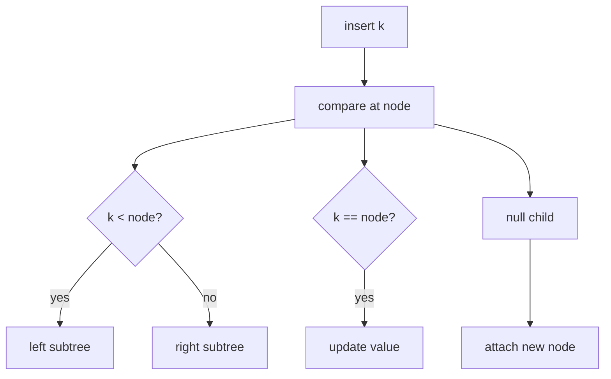
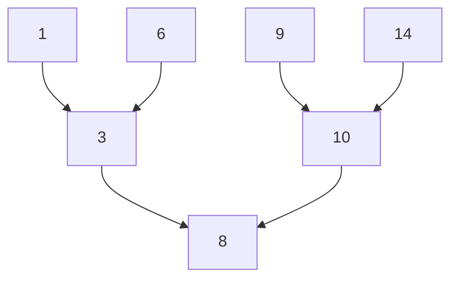
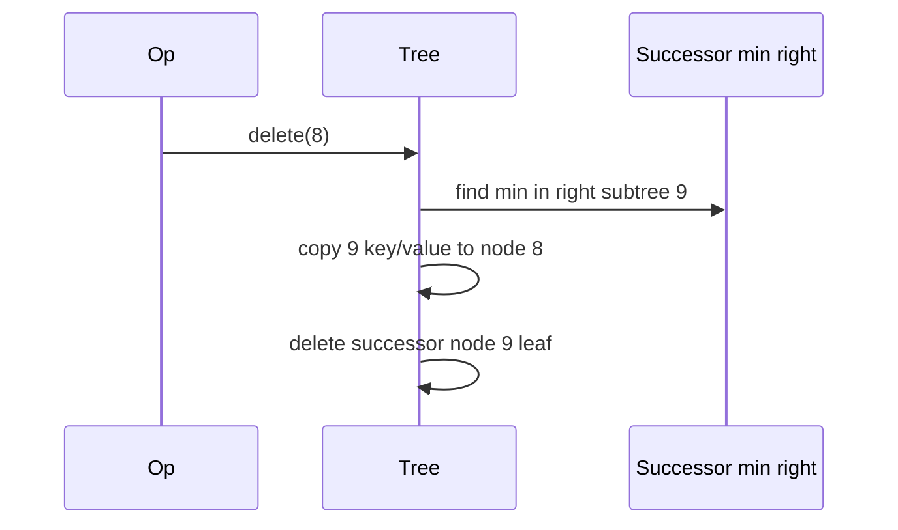

# Binary Search Trees

## Overview

A **binary search tree (BST)** is a binary tree where each node's key is **greater than all keys in its left subtree** and **less than all keys in its right subtree** (assuming strict ordering; duplicates handled by convention—left or linked list).

Search, insert, and delete follow one path from root comparing at each step. **Height h** determines performance: O(h) per operation. Random insert order yields O(log n) expected height; sorted input degenerates to a linked list—O(n) per op—motivating [[04-Data-Structures/05-Trees-and-Ordered-Maps/AVL Trees|AVL]] and [[04-Data-Structures/05-Trees-and-Ordered-Maps/Red-Black Trees Concepts|red-black]] balancing.

## Learning Objectives

- Implement BST search, insert, delete (including two-child case)
- Prove and verify BST ordering invariant after mutations
- Analyze best, average, and worst-case heights
- Implement order statistics: min, max, successor, predecessor
- Compare unbalanced BST to hash map for ordered workloads

## Prerequisites

- [[04-Data-Structures/05-Trees-and-Ordered-Maps/Tree Representation and Traversal Contracts|Tree Representation and Traversal Contracts]]
- [[04-Data-Structures/00-Orientation-and-Contracts/Invariants Representation and Debug Assertions|Invariants Representation and Debug Assertions]]

## Difficulty

`intermediate`

## Estimated Time

- Reading: 2–3 hours
- Exercises: 4 hours
- Mini project: 5 hours

## History

BSTs underpin early symbol tables. AVL (1962) and red-black (1972) trees restored balance. BST remains the pedagogical base for ordered maps and database B-tree variants.

## Problem It Solves

Sorted arrays give O(log n) search but O(n) insert. Hash maps give O(1) insert but no order. BST offers **dynamic order** with O(h) ops—optimal when h stays logarithmic.

## Internal Implementation

### Search

```
search(node, k):
  if node null: miss
  if k == node.key: hit
  if k < node.key: search(left)
  else: search(right)
```

### Insert

Descend as search; attach new leaf at null child position.

### Delete

- **Leaf / one child**: splice out
- **Two children**: replace with **in-order successor** (min of right subtree) or predecessor; delete successor node

### Duplicate keys

Policy choices: disallow, store in right subtree only, or attach list at node—document invariant.



## Invariants

- **I1 (BST order)**: ∀ node `n`, all keys in `n.left` < `n.key` < all keys in `n.right` (strict variant).
- **I2 (Tree structure)**: Acyclic, connected, single root—see tree representation note.
- **I3 (Size)**: `size` equals node count maintained incrementally.
- **I4 (Post-mutation)**: After insert/delete, I1 holds—assert in debug via in-order monotonicity check.

## Operation Complexity

| Operation | Best | Average | Worst | Notes |
| --- | --- | --- | --- | --- |
| `search` | O(1) | O(log n) | O(n) | Sorted insert → worst |
| `insert` | O(1) | O(log n) | O(n) | Same path as search |
| `delete` | O(1) | O(log n) | O(n) | Two-child needs successor |
| `min` / `max` | O(1) | O(log n) | O(n) | Walk left/right spine |
| `in-order iterate` | O(n) | O(n) | O(n) | Sorted output |

Average assumes random order; worst is skewed tree.

## Mermaid Diagrams

### Structure: BST ordering



### Sequence: delete two-child node



## Examples

### Minimal Example

**TypeScript**:

```typescript
export type BSTNode<K, V> = {
  key: K;
  value: V;
  left: BSTNode<K, V> | null;
  right: BSTNode<K, V> | null;
};

export class BSTMap<K, V> {
  root: BSTNode<K, V> | null = null;
  constructor(private cmp: (a: K, b: K) => number) {}

  get(key: K): V | undefined {
    let cur = this.root;
    while (cur) {
      const c = this.cmp(key, cur.key);
      if (c === 0) return cur.value;
      cur = c < 0 ? cur.left : cur.right;
    }
    return undefined;
  }

  put(key: K, value: V): void {
    if (!this.root) {
      this.root = { key, value, left: null, right: null };
      return;
    }
    let cur = this.root;
    for (;;) {
      const c = this.cmp(key, cur.key);
      if (c === 0) {
        cur.value = value;
        return;
      }
      if (c < 0) {
        if (!cur.left) {
          cur.left = { key, value, left: null, right: null };
          return;
        }
        cur = cur.left;
      } else {
        if (!cur.right) {
          cur.right = { key, value, left: null, right: null };
          return;
        }
        cur = cur.right;
      }
    }
  }
}
```

**Python**:

```python
from dataclasses import dataclass
from typing import Callable, Generic, Optional, TypeVar

K = TypeVar("K")
V = TypeVar("V")

@dataclass
class BSTNode(Generic[K, V]):
    key: K
    value: V
    left: Optional["BSTNode[K, V]"] = None
    right: Optional["BSTNode[K, V]"] = None

class BSTMap(Generic[K, V]):
    def __init__(self, cmp: Callable[[K, K], int]) -> None:
        self._cmp = cmp
        self.root: Optional[BSTNode[K, V]] = None

    def get(self, key: K) -> Optional[V]:
        cur = self.root
        while cur:
            c = self._cmp(key, cur.key)
            if c == 0:
                return cur.value
            cur = cur.left if c < 0 else cur.right
        return None

    def put(self, key: K, value: V) -> None:
        if not self.root:
            self.root = BSTNode(key, value)
            return
        cur = self.root
        while True:
            c = self._cmp(key, cur.key)
            if c == 0:
                cur.value = value
                return
            if c < 0:
                if not cur.left:
                    cur.left = BSTNode(key, value)
                    return
                cur = cur.left
            else:
                if not cur.right:
                    cur.right = BSTNode(key, value)
                    return
                cur = cur.right
```

### Production-Shaped Example

In-memory index for sorted pagination—must use **balanced** BST in prod; raw BST for bounded random keys only:

```typescript
function rangePage<K, V>(
  root: BSTNode<K, V> | null,
  cmp: (a: K, b: K) => number,
  cursor: K | null,
  limit: number
): [K, V][] {
  // Use in-order from cursor; production: TreeMap / AVL
  const out: [K, V][] = [];
  // ... iterative in-order with early exit
  return out;
}
```

## Trade-offs

| Dimension | Upside | Downside | When it matters |
| --- | --- | --- | --- |
| vs hash map | Sorted iterate, range | O(h) not O(1) | Reports |
| vs sorted array | O(h) insert | Pointer overhead | Dynamic keys |
| Unbalanced | Simple code | O(n) worst | Trusted shuffle |
| Balanced variant | Guarantees | Rotation code | Production maps |

### When to Use

- Teaching ordered maps
- Small n where simplicity beats balance overhead
- Random insert order with bounded n

### When Not to Use

- Sorted or monotonic insert streams without balancing
- Pure point lookup without order—use hash map

## Exercises

1. Implement full delete including two-child case.
2. Verify BST invariant with O(n) in-order monotonicity check.
3. Insert 1..n in order; measure height and search time vs random order.
4. Implement `successor(key)` for BST.
5. Build BST from sorted array in O(n) worst case—why bad?

## Mini Project

Dual-language BST with delete + invariant assertions in code labs; compare to AVL on sorted input.

## Portfolio Project

[[04-Data-Structures/projects/Ordered Map Clinic/README|Ordered Map Clinic]] — BST backend baseline before AVL swap.

## Interview Questions

1. BST search/insert complexity vs height?
2. How delete node with two children?
3. When does BST degrade to O(n)?
4. In-order traversal output on BST?
5. Difference BST vs binary heap?

### Stretch / Staff-Level

1. Prove expected height O(log n) for random insert order.
2. Design duplicate-key policy for multi-map on BST.

## Common Mistakes

- Allowing `<=` on both sides breaking strict invariant
- Deleting two-child node by replacing with wrong successor
- Using BST for priority queue (need heap)
- Forgetting null checks on skewed spines

## Best Practices

- Assert BST order after every mutation in debug builds
- Use AVL/red-black for production ordered maps
- Document duplicate key policy
- Prefer iterative search on deep untrusted trees

## Summary

BSTs maintain sorted order through local comparison invariants. Performance tracks height—not node count—so unbalanced trees fail on structured input. They are the conceptual foundation for balanced maps and B-trees; implement delete and successor carefully before adding rotations in AVL and red-black notes.

## Further Reading

- [[00-References/Data Structures/README|Data Structures References]]
- Knuth — binary search tree algorithms

## Related Notes

- [[04-Data-Structures/05-Trees-and-Ordered-Maps/AVL Trees|AVL Trees]]
- [[04-Data-Structures/05-Trees-and-Ordered-Maps/Red-Black Trees Concepts|Red-Black Trees Concepts]]
- [[04-Data-Structures/04-Hash-Tables-and-Sets/Ordered Maps via Trees vs Hashing|Ordered Maps via Trees vs Hashing]]
- [[04-Data-Structures/05-Trees-and-Ordered-Maps/Tree Representation and Traversal Contracts|Tree Representation and Traversal Contracts]]

## Progress Checklist

- [ ] Explained from first principles
- [ ] Drew at least one Mermaid diagram
- [ ] Implemented a minimal version
- [ ] Documented trade-offs and non-goals
- [ ] Completed exercises
- [ ] Practiced interview questions aloud
- [ ] Linked prerequisites and dependents
