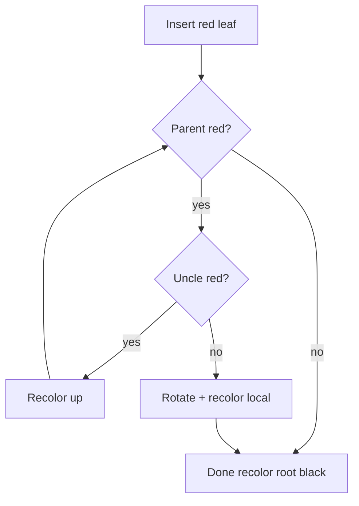
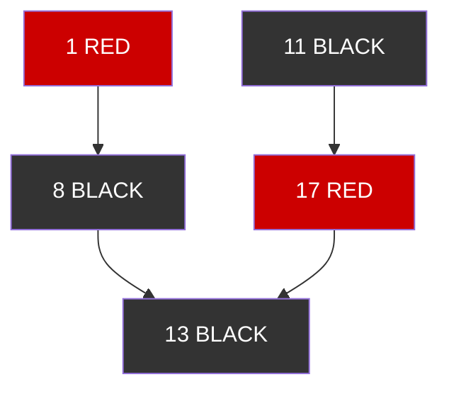
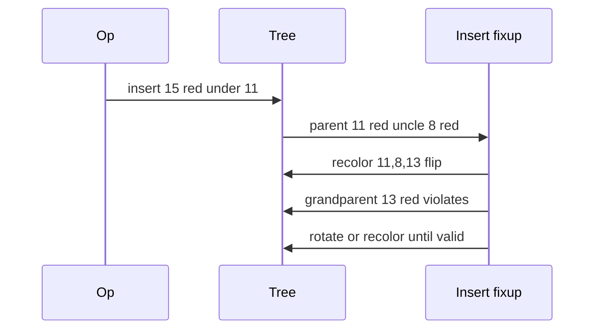

# Red-Black Trees Concepts

## Overview

A **red-black tree** is a BST augmented with **color bits** (red or black) satisfying five invariants that guarantee height ≤ 2 log₂(n+1)—thus O(log n) search, insert, and delete. Insert/delete use **recoloring** and **rotations** like AVL, but allow slightly looser balance in exchange for **fewer rotations** on update—why Java `TreeMap`, C++ `std::map`, and Linux kernel `rbtree` adopt it.

This is a **concepts** note: state invariants, trace fixups on diagrams, map to stdlib usage. Full dual-language production implementation lives in code labs; rotation geometry transfers directly from [[04-Data-Structures/05-Trees-and-Ordered-Maps/AVL Trees|AVL Trees]].

## Learning Objectives

- State all five red-black invariants precisely
- Trace insert fixup cases (uncle red vs black triangle/line)
- Explain why root is black and black-height is well-defined
- Compare rotation count and height vs AVL qualitatively
- Identify red-black usage in production libraries and kernels

## Prerequisites

- [[04-Data-Structures/05-Trees-and-Ordered-Maps/Binary Search Trees|Binary Search Trees]]
- [[04-Data-Structures/05-Trees-and-Ordered-Maps/AVL Trees|AVL Trees]]

## Difficulty

`advanced`

## Estimated Time

- Reading: 2–3 hours
- Exercises: 3 hours
- Mini project: 4 hours (trace tool)

## History

Guibas and Sedgewick (1972) introduced red-black trees as a variant of 2-3 trees. They became the default balanced BST in STL (1994) and pervasive in kernel schedulers and memory maps.

## Problem It Solves

Need **sorted associative container** with bounded worst-case ops and **moderate update cost**. Red-black achieves balance without AVL's strict height difference, reducing rotation churn on mixed workloads while keeping proofs simple enough for systems code.

## Internal Implementation

### Five invariants

1. Every node is **red** or **black**
2. **Root** is black
3. **Leaves (NIL)** are black (often omit null leaves, treat as black)
4. Red node has **black children** only (no two reds adjacent)
5. Every path from node to descendant leaves has the **same black height**

**Black height** bh(x) = number of black nodes on path to leaf (excluding x). Invariant 5 ⇒ longest path ≤ 2× shortest.

### Insert fixup (conceptual)

New node starts **red**. If parent black, done. If parent red, **uncle** matters:

- **Uncle red**: recolor parent, uncle, grandparent; continue from grandparent
- **Uncle black (triangle/line)**: rotate + recolor (mirror cases for left/right)

At most **two rotations** per insert.

### Delete fixup

More cases than insert—**double-black** conceptual trick; delete fixup restores black-height. Implementations defer to trusted library code unless building infrastructure.



## Invariants

- **I1 (BST)**: Key ordering as standard BST.
- **I2 (Color)**: Each node red or black; root black.
- **I3 (No red-red)**: No red parent with red child.
- **I4 (Black height)**: All root-to-NIL paths equal black count.
- **I5 (Height bound)**: h ≤ 2 log₂(n+1) derived from I2–I4.

## Operation Complexity

| Operation | Worst | Notes |
| --- | --- | --- |
| `search` | O(log n) | Same as BST walk |
| `insert` | O(log n) | ≤ 2 rotations |
| `delete` | O(log n) | O(log n) fixup steps |
| `iterate sorted` | O(n) | In-order |
| Rotations | O(1) each | Local |

## Mermaid Diagrams

### Structure: colors and black-height



Each path to NIL has 2 black nodes (including NIL abstraction).

### Sequence: insert causes recolor cascade



## Examples

### Minimal Example

**TypeScript** — node with color enum (conceptual, insert fixup abbreviated):

```typescript
enum Color {
  Red,
  Black,
}

type RBNode<K, V> = {
  key: K;
  value: V;
  color: Color;
  left: RBNode<K, V> | null;
  right: RBNode<K, V> | null;
};

function insertFixup<K, V>(root: RBNode<K, V>, z: RBNode<K, V>): RBNode<K, V> {
  while (z.parent?.color === Color.Red) {
    // Case analysis on uncle color and triangle vs line
    // Full implementation: CLRS or Linux rbtree reference
  }
  root.color = Color.Black;
  return root;
}
```

**Python** — validate invariants in debug:

```python
from enum import Enum, auto
from dataclasses import dataclass
from typing import Optional

class Color(Enum):
    RED = auto()
    BLACK = auto()

@dataclass
class RBNode:
    key: int
    color: Color
    left: Optional["RBNode"] = None
    right: Optional["RBNode"] = None

def black_height(node: Optional[RBNode]) -> Optional[int]:
    if not node:
        return 0
    lh = black_height(node.left)
    rh = black_height(node.right)
    if lh is None or rh is None or lh != rh:
        return None
    return lh + (1 if node.color == Color.BLACK else 0)

def is_valid_rb(root: Optional[RBNode]) -> bool:
    if not root:
        return True
    if root.color != Color.BLACK:
        return False
    return black_height(root) is not None and _no_red_red(root)

def _no_red_red(node: Optional[RBNode]) -> bool:
    if not node:
        return True
    if node.color == Color.RED:
        if (node.left and node.left.color == Color.RED) or (
            node.right and node.right.color == Color.RED
        ):
            return False
    return _no_red_red(node.left) and _no_red_red(node.right)
```

### Production-Shaped Example

Use stdlib instead of hand-rolling:

```typescript
// JavaScript: no built-in RB tree; use ordered map libraries or WASM
// Java: TreeMap — red-black backed
// C++: std::map

import { SortedMap } from "some-ordered-map-lib"; // or native binding
```

Linux kernel `struct rb_root` for interval trees and VMAs—study when building kernel modules, not greenfield app maps.

## Trade-offs

| Dimension | Upside | Downside | When it matters |
| --- | --- | --- | --- |
| vs AVL | Fewer inserts rotations | Taller than AVL | Mixed read/write |
| vs hash map | Sorted ops | log n | TreeMap APIs |
| vs B-tree | Simple in-memory | Poor disk locality | RAM only |
| Implementation | Industry standard | Delete fixup subtle | Prefer stdlib |

### When to Use

- Need in-memory **sorted map** with library support (`TreeMap`, `std::map`)
- Kernel/systems structures requiring proven balance
- Teaching 2-3 tree isomorphism to red-black

### When Not to Use

- Hand-roll in application code when stdlib suffices
- Disk pages—use [[04-Data-Structures/05-Trees-and-Ordered-Maps/B-Trees and B-Plus Trees Concepts|B-Trees]]
- Pure lookup—hash map

## Exercises

1. Insert keys 11,2,14,1,7,15 into empty RB tree; color each step.
2. Prove height ≤ 2 log(n+1) from black-height invariant.
3. Map 2-3 tree insert split to RB recolor/rotate picture.
4. Implement `is_valid_rb()` checker on random trees.
5. Compare rotation counts AVL vs RB on same random sequence (simulation).

## Mini Project

**RB Trace Visualizer**: read operation log, emit Graphviz with colors after each insert (no full delete required for v1).

## Portfolio Project

Concepts section in [[04-Data-Structures/projects/Ordered Map Clinic/README|Ordered Map Clinic]] comparing AVL trace vs RB trace on identical inserts.

## Interview Questions

1. List red-black invariants (five rules).
2. Why is root forced black?
3. What is black height?
4. RB vs AVL trade-off in one sentence?
5. Which Java/C++ map is red-black backed?

### Stretch / Staff-Level

1. Explain red-black ↔ 2-3 tree isomorphism.
2. Why Linux uses rbtree for VMAs instead of hash map?

## Common Mistakes

- Confusing red-black with heap color properties
- Forgetting NIL/leaves are black in counting
- Implementing delete fixup incorrectly (most bugs)
- Assuming red-black = automatically faster than AVL always

## Best Practices

- Use language **ordered map** library in production
- Validate with checker after test mutations when learning
- Draw uncle cases before coding insert fixup
- Link to AVL note for shared rotation primitives

## Summary

Red-black trees maintain BST order with color invariants that bound height logarithmically. Insert fixup recolors or rotates locally; delete fixup is harder—reason to use stdlib. They are the industrial default for in-memory ordered maps when hash tables lack required order. Disk-resident B+ trees extend balancing ideas for pages in the Databases track.

## Further Reading

- [[00-References/Data Structures/README|Data Structures References]]
- Cormen et al. — Red-Black Trees chapter (CLRS)
- Linux kernel `Documentation/rbtree.rst`

## Related Notes

- [[04-Data-Structures/05-Trees-and-Ordered-Maps/AVL Trees|AVL Trees]]
- [[04-Data-Structures/05-Trees-and-Ordered-Maps/Binary Search Trees|Binary Search Trees]]
- [[04-Data-Structures/05-Trees-and-Ordered-Maps/B-Trees and B-Plus Trees Concepts|B-Trees and B-Plus Trees Concepts]]
- [[04-Data-Structures/04-Hash-Tables-and-Sets/Ordered Maps via Trees vs Hashing|Ordered Maps via Trees vs Hashing]]

## Progress Checklist

- [ ] Explained from first principles
- [ ] Drew at least one Mermaid diagram
- [ ] Implemented a minimal version
- [ ] Documented trade-offs and non-goals
- [ ] Completed exercises
- [ ] Practiced interview questions aloud
- [ ] Linked prerequisites and dependents
