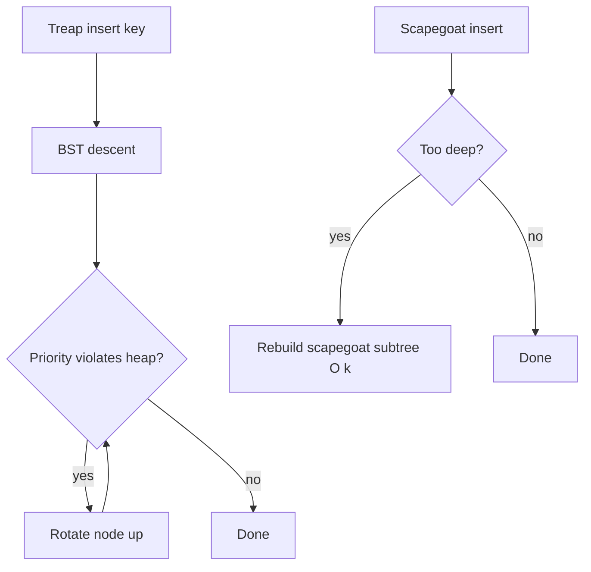
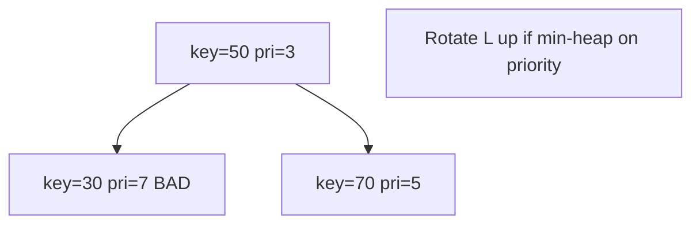
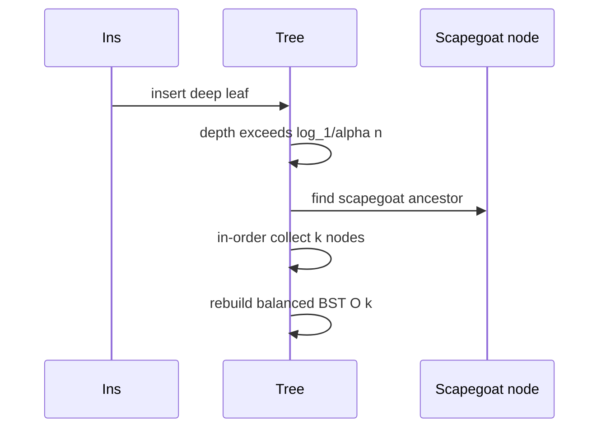

# Treaps and Scapegoat Trees Concepts

## Overview

**Treaps** and **scapegoat trees** are alternative self-balancing BST strategies that avoid storing explicit balance bits like AVL or red-black:

- **Treap**: each node has a **BST key** and a **random heap priority**; tree satisfies BST order on keys and **min-heap order** on priorities (or max-heap variant). Random priorities yield expected height O(log n).
- **Scapegoat tree**: no per-node balance field; on insert that makes subtree **too heavy**, rebuild that subtree from sorted array in O(n) **amortized** O(log n).

Both teach that balance can come from **randomization** or **occasional rebuilding** rather than rotation invariants alone. Concepts note—full production dual-impl optional; compare to [[04-Data-Structures/10-Probabilistic-Structures/Skip Lists|Skip Lists]] as another randomized ordered structure.

## Learning Objectives

- State treap dual invariant (BST key + heap priority)
- Trace treap insert with rotations when heap property violated
- Explain scapegoat α-size criterion and rebuild trigger
- Analyze expected vs amortized bounds
- Choose randomized structures when implementation simplicity matters

## Prerequisites

- [[04-Data-Structures/05-Trees-and-Ordered-Maps/Binary Search Trees|Binary Search Trees]]
- [[04-Data-Structures/06-Heaps-and-Priority-Queues/Binary Heaps and Array Layout|Binary Heaps and Array Layout]]
- [[04-Data-Structures/05-Trees-and-Ordered-Maps/AVL Trees|AVL Trees]]

## Difficulty

`advanced`

## Estimated Time

- Reading: 2 hours
- Exercises: 2 hours
- Mini project: 3 hours

## History

Seidel and Aragon (1989) introduced treaps (tree + heap). Scapegoat trees by Andersson (1989) and Galperin & Wigderson. Treaps appear in competitive programming and some concurrent data structure research; skip lists often win industrial mindshare for randomized order.

## Problem It Solves

Deterministic balance (AVL/RB) requires careful case analysis. Treaps **delegate balance to randomness**—simple insert logic. Scapegoat trees **defer balance** to occasional rebuild—simple fields, good amortized bounds, useful when rotations are hard to verify.

## Internal Implementation

### Treap insert

1. BST insert new node with random priority
2. While child priority < parent priority (min-heap), **rotate** child up
3. Expected O(log n) rotations

### Treap delete

Rotate low-priority node down until leaf, then remove.

### Scapegoat insert

Maintain `size` and check if `depth > ⌊log_{1/α}(n)⌋`; find **scapegoat** ancestor whose child subtree too large; **rebuild** scapegoat subtree to perfect balance from in-order array.

Parameter α (e.g., 0.75) controls rebuild frequency vs memory of depth.



## Invariants

### Treap

- **T1 (BST)**: Keys in left < node < right.
- **T2 (Heap)**: Parent priority ≤ child priorities (min-heap on priority).
- **T3 (Random priority)**: Priorities i.i.d. uniform (or high-quality PRNG).

### Scapegoat

- **S1 (BST)**: Standard ordering.
- **S2 (α-height)**: Except during rebuild, depth ≤ ⌊log_{1/α}(n)⌋.
- **S3 (Size)**: Subtree `size` fields accurate for rebuild checks.

## Operation Complexity

| Structure | Search | Insert | Delete | Notes |
| --- | --- | --- | --- | --- |
| Treap | O(log n) exp | O(log n) exp | O(log n) exp | Rotations like AVL |
| Scapegoat | O(log n) worst* | O(log n) amortized | O(log n) amortized | *depth bound when α fixed |
| Rebuild | — | O(k) on scapegoat size k | — | Rare amortized |

## Mermaid Diagrams

### Structure: treap dual invariant



### Sequence: scapegoat rebuild



## Examples

### Minimal Example

**TypeScript** — treap insert sketch:

```typescript
type TreapNode = {
  key: number;
  priority: number;
  left: TreapNode | null;
  right: TreapNode | null;
};

function rotateRight(y: TreapNode): TreapNode {
  const x = y.left!;
  y.left = x.right;
  x.right = y;
  return x;
}

function insert(root: TreapNode | null, key: number, pri: number): TreapNode {
  if (!root) return { key, priority: pri, left: null, right: null };
  if (key < root.key) {
    root.left = insert(root.left, key, pri);
    if (root.left!.priority < root.priority) return rotateRight(root);
  } else if (key > root.key) {
    root.right = insert(root.right, key, pri);
    if (root.right!.priority < root.priority) return rotateLeft(root);
  }
  return root;
}

function rotateLeft(x: TreapNode): TreapNode {
  const y = x.right!;
  x.right = y.left;
  y.left = x;
  return y;
}
```

**Python** — scapegoat rebuild helper:

```python
from dataclasses import dataclass
from typing import List, Optional

@dataclass
class SGNode:
    key: int
    left: Optional["SGNode"] = None
    right: Optional["SGNode"] = None
    size: int = 1

def in_order_collect(node: Optional[SGNode], out: List[int]) -> None:
    if not node:
        return
    in_order_collect(node.left, out)
    out.append(node.key)
    in_order_collect(node.right, out)

def build_balanced(keys: List[int], lo: int, hi: int) -> Optional[SGNode]:
    if lo > hi:
        return None
    mid = (lo + hi) // 2
    left = build_balanced(keys, lo, mid - 1)
    right = build_balanced(keys, mid + 1, hi)
    n = SGNode(keys[mid], left, right)
    n.size = 1 + (left.size if left else 0) + (right.size if right else 0)
    return n
```

### Production-Shaped Example

Treaps useful in **mergeable** structures or implicit keys (competitive programming). Application servers rarely expose treap maps—prefer stdlib RB tree. Scapegoat idea appears in **periodic compaction** of unbalanced structures (rebuild index overnight).

## Trade-offs

| Dimension | Upside | Downside | When it matters |
| --- | --- | --- | --- |
| Treap vs RB | Simple insert logic | Randomness needed | Teaching, CP |
| Scapegoat vs RB | No balance bits | Spike latency on rebuild | Amortized OK |
| vs Skip list | Tree semantics | Rotation/rebuild code | Concurrent order |
| vs AVL | Less case analysis | Expected not strict worst | Probabilistic OK |

### When to Use

- Learning randomized balancing
- Competitive programming ordered set with split/merge treap extensions
- Prototyping when RB delete fixup is too heavy

### When Not to Use

- Hard latency SLAs forbidding rebuild spikes (scapegoat)
- Weak PRNG environments for security-sensitive ordering
- Production default—use library RB tree

## Exercises

1. Insert keys with fixed priorities; force rotation sequence by hand.
2. Simulate treap height over 10k inserts; compare to AVL.
3. When does scapegoat rebuild trigger for α=0.75, n=100?
4. Implement treap delete by rotating down.
5. Relate treap expected height to random BST analysis.

## Mini Project

Treap vs scapegoat vs AVL rotation/rebuild counter on identical key sequences.

## Portfolio Project

Randomized structures module in [[04-Data-Structures/projects/Structures Workbench/README|Structures Workbench]].

## Interview Questions

1. What two invariants does a treap maintain?
2. How does scapegoat tree restore balance?
3. Treap insert expected complexity?
4. Worst-case scapegoat insert without amortization?
5. Compare treap to skip list.

### Stretch / Staff-Level

1. Implicit treap for array reverse/split—when useful?
2. Prove scapegoat amortized O(log n) insert for fixed α.

## Common Mistakes

- Using non-random priorities (sorted priorities → linked list)
- Forgetting to update `size` in scapegoat subtrees
- Confusing heap priority with BST key ordering
- Assuming treap worst-case O(log n) without randomness

## Best Practices

- Seed PRNG from crypto source if adversarial input possible
- Profile rebuild spikes for scapegoat before production use
- Prefer skip list or RB for team-maintained production code
- Cross-link heap note for priority semantics

## Summary

Treaps combine BST keys with heap priorities and randomize balance through rotations. Scapegoat trees tolerate imbalance until depth exceeds a logarithmic bound, then rebuild wholesale. Both demonstrate alternative balance economics to AVL/red-black—valuable conceptually even when stdlib ordered maps use deterministic trees. Randomized structures pair naturally with probabilistic data structure module themes.

## Further Reading

- [[00-References/Data Structures/README|Data Structures References]]
- Seidel & Aragon — Treap paper

## Related Notes

- [[04-Data-Structures/05-Trees-and-Ordered-Maps/AVL Trees|AVL Trees]]
- [[04-Data-Structures/05-Trees-and-Ordered-Maps/Red-Black Trees Concepts|Red-Black Trees Concepts]]
- [[04-Data-Structures/06-Heaps-and-Priority-Queues/Binary Heaps and Array Layout|Binary Heaps and Array Layout]]
- [[04-Data-Structures/10-Probabilistic-Structures/Skip Lists|Skip Lists]]
- [[04-Data-Structures/05-Trees-and-Ordered-Maps/Binary Search Trees|Binary Search Trees]]

## Progress Checklist

- [ ] Explained from first principles
- [ ] Drew at least one Mermaid diagram
- [ ] Implemented a minimal version
- [ ] Documented trade-offs and non-goals
- [ ] Completed exercises
- [ ] Practiced interview questions aloud
- [ ] Linked prerequisites and dependents
