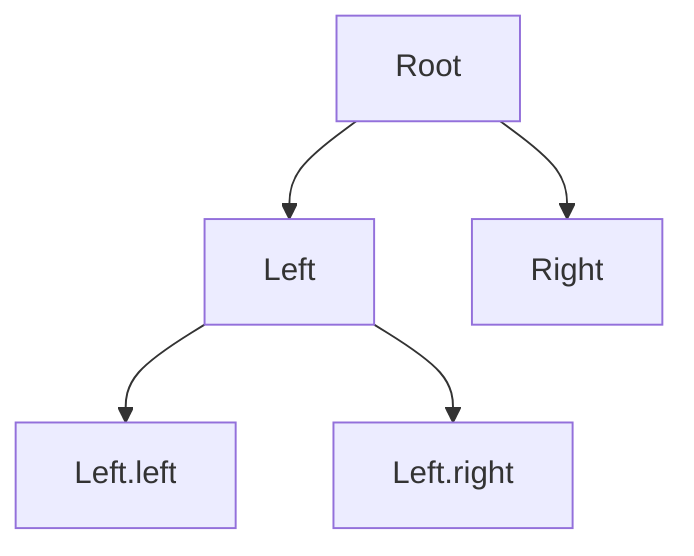
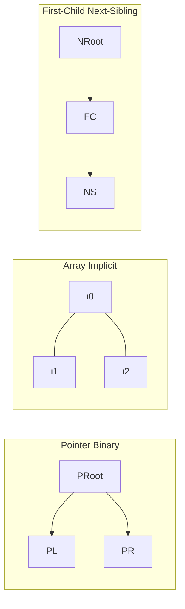
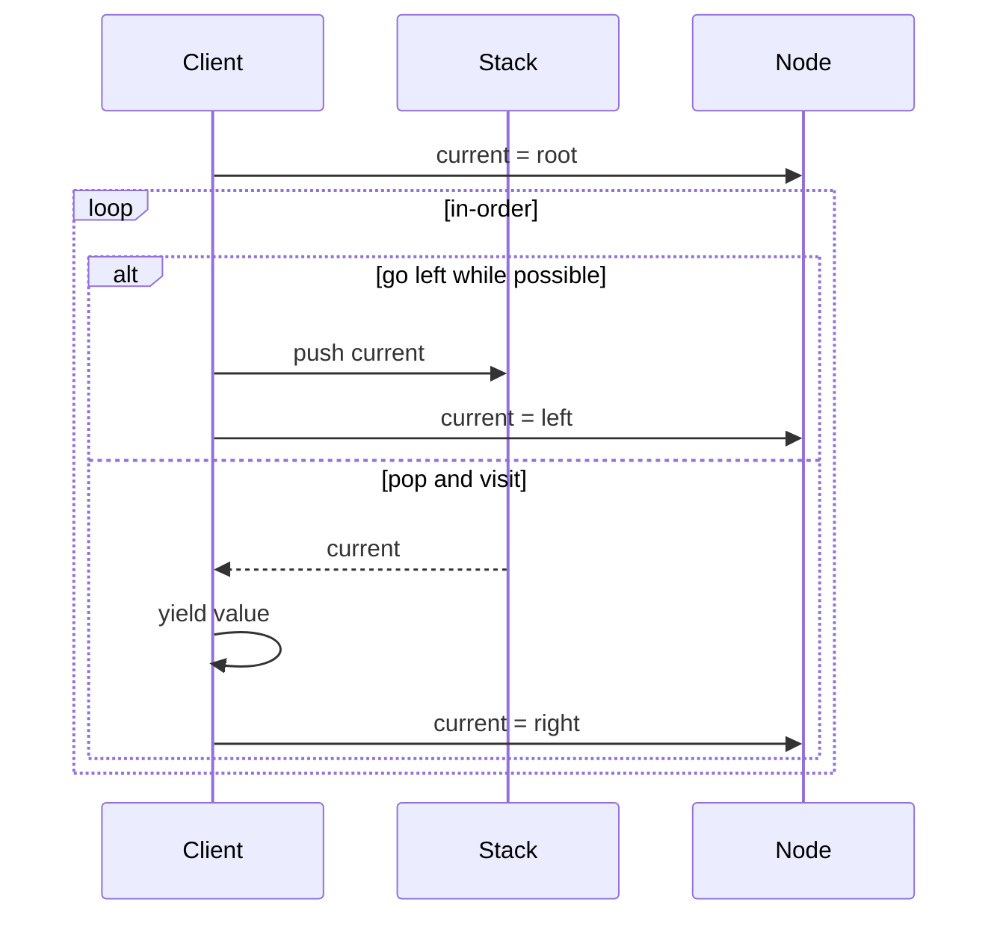

# Tree Representation and Traversal Contracts

## Overview

A **tree** is a connected acyclic graph with a designated **root**. Each node has zero or more **children**; nodes with no children are **leaves**. Unlike general graphs ([[04-Data-Structures/08-Graphs-as-Representation/Graph ADT Vertices Edges and Labels|Graph ADT]]), trees have exactly one simple path from root to any node—enabling recursive algorithms and predictable memory layouts.

**Representation** choices (pointer-based nodes, array heap layout, first-child/next-sibling) and **traversal contracts** (pre/in/post-order, level-order) determine cache behavior, API stability, and what client code may assume during iteration.

## Learning Objectives

- Represent trees via linked nodes and via implicit array indices
- Implement recursive and iterative DFS traversals; BFS with queue
- State traversal invariants and iterator invalidation rules
- Distinguish tree traversals from graph traversals (no cycles)
- Choose representation for BST, heap, file system, and AST use cases

## Prerequisites

- [[04-Data-Structures/02-Linked-Structures/Singly Linked Lists|Singly Linked Lists]]
- [[04-Data-Structures/03-Stacks-Queues-and-Deques/Stacks|Stacks]]
- [[04-Data-Structures/03-Stacks-Queues-and-Deques/Queues|Queues]]

## Difficulty

`beginner`

## Estimated Time

- Reading: 2 hours
- Exercises: 3 hours
- Mini project: 3 hours

## History

Tree structures model hierarchical data since early Lisp (1950s). Knuth codified traversals for expression trees and sorting. **First-child/next-sibling** representation converts arbitrary arity to binary-like traversal without multi-pointer arrays.

## Problem It Solves

Ambiguous tree APIs cause:

- Off-by-one depth calculations in authorization trees
- Mutating children while iterating → skipped nodes or infinite loops
- Assuming pre-order equals sorted order (false except BST in-order)
- Stack overflow on deep recursion without iterative fallback

## Internal Implementation

### Pointer node (binary)

```typescript
type BinNode<T> = { val: T; left: BinNode<T> | null; right: BinNode<T> | null };
```

### First-child / next-sibling (n-ary)

```typescript
type NaryNode<T> = { val: T; firstChild: NaryNode<T> | null; nextSibling: NaryNode<T> | null };
```

### Implicit array (complete binary tree)

Index `i`: parent `(i-1)//2`, left `2i+1`, right `2i+2` — see [[04-Data-Structures/06-Heaps-and-Priority-Queues/Binary Heaps and Array Layout|Binary Heaps and Array Layout]].

### Traversals

| Order | Visit relative to children | Typical use |
| --- | --- | --- |
| Pre-order | node, left, right | Copy tree, prefix walk |
| In-order | left, node, right | BST sorted keys |
| Post-order | left, right, node | Delete tree, suffix eval |
| Level-order (BFS) | by depth | Print layers, shortest path in tree |



## Invariants

- **I1 (Acyclicity)**: No node reachable from itself following child pointers.
- **I2 (Single parent)**: Each non-root has exactly one parent pointer (unless using shared DAG—then not a tree).
- **I3 (Traversal coverage)**: Each traversal visits every node exactly once iff tree finite and no concurrent structural mutation.
- **I4 (BST order — when applicable)**: Left subtree keys < node < right subtree keys.

## Operation Complexity

| Operation | Pointer tree | Notes |
| --- | --- | --- |
| Visit all n nodes | O(n) | Any traversal |
| Height | O(n) worst | Skewed tree |
| Depth of node | O(h) | h = height |
| Child count (n-ary) | O(degree) | With sibling list |
| BFS queue space | O(width) | Max frontier |

Graph algorithms on trees inherit O(n) for BFS/DFS—full treatment in [[05-Algorithms/07-Graph-Traversal-and-DAGs/BFS|BFS]] and [[05-Algorithms/07-Graph-Traversal-and-DAGs/DFS|DFS]].

## Mermaid Diagrams

### Structure: representations



### Sequence: iterative in-order with stack



## Examples

### Minimal Example

**TypeScript**:

```typescript
export type TreeNode<T> = { val: T; left: TreeNode<T> | null; right: TreeNode<T> | null };

export function* inOrder<T>(root: TreeNode<T> | null): Generator<T> {
  const stack: TreeNode<T>[] = [];
  let cur = root;
  while (cur || stack.length) {
    while (cur) {
      stack.push(cur);
      cur = cur.left;
    }
    cur = stack.pop()!;
    yield cur.val;
    cur = cur.right;
  }
}

export function* levelOrder<T>(root: TreeNode<T> | null): Generator<T> {
  if (!root) return;
  const q: TreeNode<T>[] = [root];
  while (q.length) {
    const n = q.shift()!;
    yield n.val;
    if (n.left) q.push(n.left);
    if (n.right) q.push(n.right);
  }
}
```

**Python**:

```python
from collections import deque
from dataclasses import dataclass
from typing import Deque, Generator, Generic, Optional, TypeVar

T = TypeVar("T")

@dataclass
class TreeNode(Generic[T]):
    val: T
    left: Optional["TreeNode[T]"] = None
    right: Optional["TreeNode[T]"] = None

def in_order(root: Optional[TreeNode[T]]) -> Generator[T, None, None]:
    stack: list[TreeNode[T]] = []
    cur = root
    while cur or stack:
        while cur:
            stack.append(cur)
            cur = cur.left
        cur = stack.pop()
        yield cur.val
        cur = cur.right

def level_order(root: Optional[TreeNode[T]]) -> Generator[T, None, None]:
    if not root:
        return
    q: Deque[TreeNode[T]] = deque([root])
    while q:
        n = q.popleft()
        yield n.val
        if n.left:
            q.append(n.left)
        if n.right:
            q.append(n.right)
```

### Production-Shaped Example

File system walker with **pre-order** (enter directory before children); guard depth and mutability:

```typescript
async function walkDir(
  node: DirNode,
  depth: number,
  maxDepth: number,
  onDir: (n: DirNode, d: number) => void
): Promise<void> {
  if (depth > maxDepth) return;
  onDir(node, depth);
  for (const child of node.children) {
    if (child.isDirectory) await walkDir(child, depth + 1, maxDepth, onDir);
  }
}
```

Use iterative stack if tree depth may exceed call stack limits (10k+ nested JSON).

## Trade-offs

| Dimension | Upside | Downside | When it matters |
| --- | --- | --- | --- |
| Recursive DFS | Clear code | Stack overflow deep trees | AST depth |
| Iterative + stack | Bounded stack | More code | Untrusted input trees |
| Pointer vs array | Flexible shape | Cache misses | Heaps prefer array |
| N-ary sibling list | O(1) add child | Sibling scan | DOM-like structures |

### When to Use

- **Pre-order**: serialize, clone, prefix expressions
- **In-order**: BST sorted output
- **Post-order**: bottom-up aggregation, free memory
- **BFS**: level-wise processing, closest node first

### When Not to Use

- BFS on deep skinny trees with memory constraints (frontier still small)
- In-order on non-BST expecting sort order

## Exercises

1. Implement pre-order and post-order iteratively with one stack.
2. Compute tree height and node count in one post-order pass.
3. Convert n-ary tree (children array) to first-child/next-sibling form.
4. Detect if two traversals could describe the same binary tree (unique reconstruction conditions).
5. Morris in-order traversal O(1) extra space (research).

## Mini Project

**Traversal Visualizer**: read tree from JSON; emit DOT/Graphviz with visit order labels.

## Portfolio Project

Tree module in [[04-Data-Structures/projects/Structures Workbench/README|Structures Workbench]] with step-through traversal animation.

## Interview Questions

1. Difference between pre, in, post-order?
2. BFS vs DFS on trees—when prefer each?
3. Reconstruct binary tree from in-order + pre-order unique?
4. Iterative in-order without recursion?
5. Complexity of level-order traversal?

### Stretch / Staff-Level

1. Design an iterator that supports concurrent tree mutations with versioning.
2. Compare cache performance: pointer tree vs implicit array for same shape.

## Common Mistakes

- Confusing graph BFS (visited set) with tree BFS (no visited needed)
- Mutating `left`/`right` during in-order without careful iterator design
- Using in-order on heap expecting sorted output
- Integer overflow in depth on adversarial input

## Best Practices

- Document **which traversal** API guarantees
- Cap recursion depth; use iterative for untrusted trees
- Store **parent pointer** only when upward walks required (adds invariant maintenance)
- Cross-link to [[04-Data-Structures/00-Orientation-and-Contracts/Invariants Representation and Debug Assertions|Invariants Representation and Debug Assertions]]

## Summary

Trees are hierarchical data with one root path per node. Representation (pointers, arrays, sibling lists) and traversal order form a **contract** clients depend on—especially in-order for BST sorted iteration. Master recursive and iterative formulations before balanced trees and heaps; graph traversals extend these ideas with cycle handling in the Algorithms track.

## Further Reading

- [[00-References/Data Structures/README|Data Structures References]]
- Knuth — binary tree traversals

## Related Notes

- [[04-Data-Structures/05-Trees-and-Ordered-Maps/Binary Search Trees|Binary Search Trees]]
- [[04-Data-Structures/06-Heaps-and-Priority-Queues/Binary Heaps and Array Layout|Binary Heaps and Array Layout]]
- [[04-Data-Structures/08-Graphs-as-Representation/Graph ADT Vertices Edges and Labels|Graph ADT Vertices Edges and Labels]]
- [[05-Algorithms/07-Graph-Traversal-and-DAGs/BFS|BFS]], [[05-Algorithms/07-Graph-Traversal-and-DAGs/DFS|DFS]]
- [[01-Computer-Science/02-Machine-Model/Cache Hierarchy and Locality|Cache Hierarchy and Locality]]

## Progress Checklist

- [ ] Explained from first principles
- [ ] Drew at least one Mermaid diagram
- [ ] Implemented a minimal version
- [ ] Documented trade-offs and non-goals
- [ ] Completed exercises
- [ ] Practiced interview questions aloud
- [ ] Linked prerequisites and dependents
