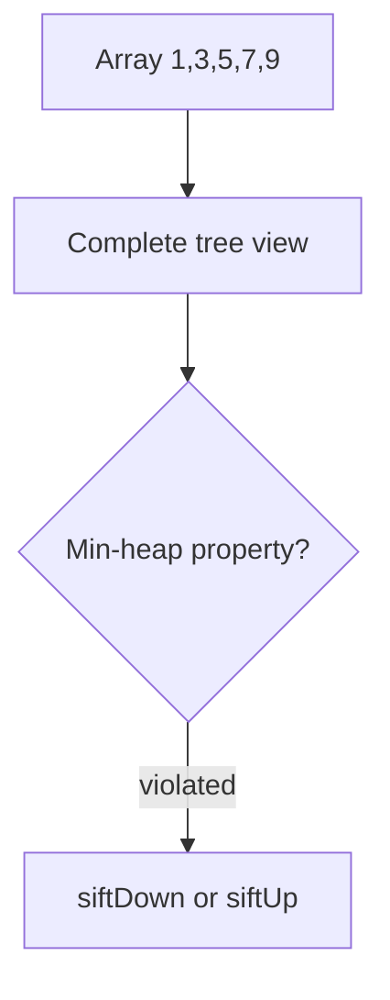
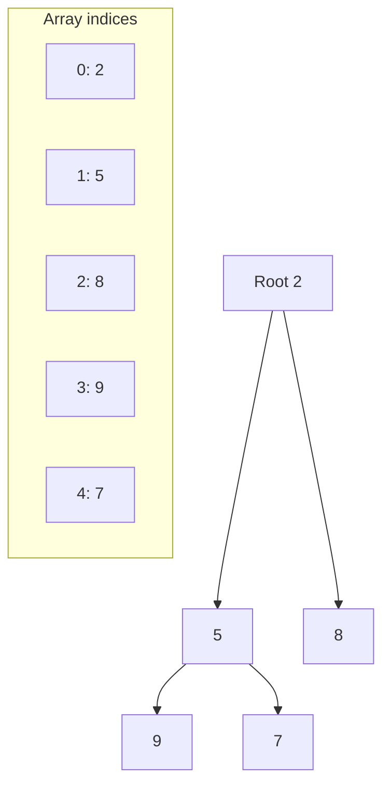
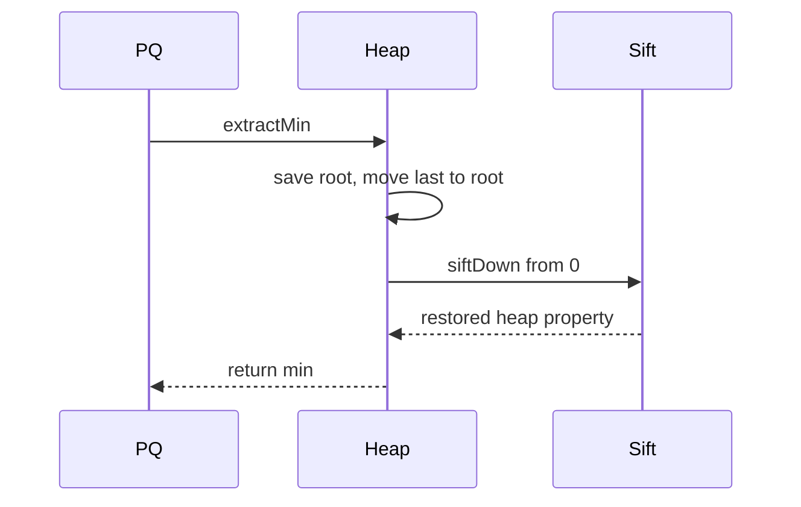

# Binary Heaps and Array Layout

## Overview

A **binary heap** is a **complete binary tree** satisfying the **heap property**: in a **min-heap**, every parent ≤ its children; in a **max-heap**, every parent ≥ children. The structure is stored in a **dynamic array** with index arithmetic—no child pointers—giving excellent cache locality for [[04-Data-Structures/06-Heaps-and-Priority-Queues/Priority Queue ADT|priority queue]] operations.

Heaps are **not** search structures: `find arbitrary key` is O(n). They optimize **extremum** access: min or max in O(1), extract in O(log n), insert in O(log n).

## Learning Objectives

- Map tree indices: parent, left, right for zero-based array
- Implement `siftUp` (insert) and `siftDown` (extract/delete)
- Prove heap property maintained after operations
- Build heap from array in O(n) with bottom-up sift
- Distinguish heap ordering from BST ordering

## Prerequisites

- [[04-Data-Structures/05-Trees-and-Ordered-Maps/Tree Representation and Traversal Contracts|Tree Representation and Traversal Contracts]]
- [[04-Data-Structures/01-Contiguous-Sequences/Dynamic Arrays and Amortized Growth|Dynamic Arrays and Amortized Growth]]

## Difficulty

`intermediate`

## Estimated Time

- Reading: 2 hours
- Exercises: 3 hours
- Mini project: 4 hours

## History

Williams (1964) introduced heapsort. Floyd's O(n) build-heap (1964) made heaps practical for priority queues and [[05-Algorithms/03-Sorting/Heapsort|heapsort]] (handoff). Binary heaps power schedulers, Dijkstra, event loops, and `std::priority_queue`.

## Problem It Solves

Sorted array: O(1) min, O(n) insert. Balanced BST: O(log n) both but pointer overhead. Heap: O(1) min, O(log n) insert/extract with **contiguous memory**—ideal when only the extremum matters, not full order.

## Internal Implementation

### Index formulas (0-based)

For node at index `i`:

- Parent: `(i - 1) // 2`
- Left child: `2i + 1`
- Right child: `2i + 2`

Complete tree property: array `[0..n-1]` is valid heap shape; no gaps.

### siftUp (insert)

Append at end; while node < parent (min-heap), swap with parent.

### siftDown (extract-min)

Swap root with last element, shrink size; while node > child, swap with **smaller child** (min-heap).

### buildHeap (Floyd)

For i from last parent down to 0, siftDown(i)—O(n) total.



## Invariants

- **I1 (Shape)**: Tree is complete; array length n represents exactly n nodes.
- **I2 (Heap order)**: Min-heap: `A[parent(i)] ≤ A[i]` for all i > 0.
- **I3 (Size)**: `size` field equals array logical length for heap operations.
- **I4 (Post-op)**: After siftUp/siftDown, I1 and I2 hold.

## Operation Complexity

| Operation | Time | Notes |
| --- | --- | --- |
| `peek` min/max | O(1) | Root index 0 |
| `insert` | O(log n) | siftUp height |
| `extract-min` | O(log n) | siftDown height |
| `delete arbitrary`* | O(log n) | With index map — see indexed heap note |
| `buildHeap` | O(n) | Floyd bottom-up |
| `heapify sort` | O(n log n) | Extract n times |

*Standard heap lacks arbitrary delete without auxiliary index.

## Mermaid Diagrams

### Structure: array to tree mapping



### Sequence: extract-min



## Examples

### Minimal Example

**TypeScript**:

```typescript
export class MinHeap {
  private a: number[] = [];

  peek(): number | undefined {
    return this.a[0];
  }

  push(x: number): void {
    this.a.push(x);
    this.siftUp(this.a.length - 1);
  }

  pop(): number | undefined {
    if (!this.a.length) return undefined;
    const min = this.a[0];
    const last = this.a.pop()!;
    if (this.a.length) {
      this.a[0] = last;
      this.siftDown(0);
    }
    return min;
  }

  private siftUp(i: number): void {
    while (i > 0) {
      const p = (i - 1) >> 1;
      if (this.a[p] <= this.a[i]) break;
      [this.a[p], this.a[i]] = [this.a[i], this.a[p]];
      i = p;
    }
  }

  private siftDown(i: number): void {
    const n = this.a.length;
    for (;;) {
      let smallest = i;
      const l = 2 * i + 1;
      const r = l + 1;
      if (l < n && this.a[l] < this.a[smallest]) smallest = l;
      if (r < n && this.a[r] < this.a[smallest]) smallest = r;
      if (smallest === i) break;
      [this.a[i], this.a[smallest]] = [this.a[smallest], this.a[i]];
      i = smallest;
    }
  }
}
```

**Python**:

```python
class MinHeap:
    def __init__(self) -> None:
        self._a: list[float] = []

    def peek(self) -> float | None:
        return self._a[0] if self._a else None

    def push(self, x: float) -> None:
        self._a.append(x)
        self._sift_up(len(self._a) - 1)

    def pop(self) -> float | None:
        if not self._a:
            return None
        mn = self._a[0]
        last = self._a.pop()
        if self._a:
            self._a[0] = last
            self._sift_down(0)
        return mn

    def _sift_up(self, i: int) -> None:
        a = self._a
        while i > 0:
            p = (i - 1) // 2
            if a[p] <= a[i]:
                break
            a[p], a[i] = a[i], a[p]
            i = p

    def _sift_down(self, i: int) -> None:
        a = self._a
        n = len(a)
        while True:
            smallest = i
            l, r = 2 * i + 1, 2 * i + 2
            if l < n and a[l] < a[smallest]:
                smallest = l
            if r < n and a[r] < a[smallest]:
                smallest = r
            if smallest == i:
                break
            a[i], a[smallest] = a[smallest], a[i]
            i = smallest
```

### Production-Shaped Example

Event scheduler with tie-break on sequence number:

```typescript
type Event = { at: number; seq: number; payload: string };

class EventQueue {
  private heap: Event[] = [];

  push(ev: Event): void {
    this.heap.push(ev);
    this.siftUp(this.heap.length - 1);
  }

  popDue(now: number): Event[] {
    const out: Event[] = [];
    while (this.heap.length && this.heap[0].at <= now) {
      out.push(this.pop()!);
    }
    return out;
  }

  private compare(a: Event, b: Event): number {
    return a.at !== b.at ? a.at - b.at : a.seq - b.seq;
  }
  // sift using compare — omitted for brevity
}
```

Use `heapq` in Python for production; implement from scratch for learning.

## Trade-offs

| Dimension | Upside | Downside | When it matters |
| --- | --- | --- | --- |
| vs sorted array | O(log n) insert | No O(1) arbitrary delete | Streaming min |
| vs BST | Cache-friendly, simple | No order iteration | Top-k only |
| vs pairing heap | Simple | decrease-key slower* | Basic PQ |
| 0-based array | Fast index math | Off-by-one bugs | All heap code |

*See [[04-Data-Structures/06-Heaps-and-Priority-Queues/Decrease-Key and Indexed Heaps|Indexed Heaps]].

### When to Use

- Priority queues, schedulers, merge k sorted lists
- Heap sort when in-place matters (Algorithms track)
- Top-k streaming with fixed k (also use heap of size k)

### When Not to Use

- Need sorted full traversal—use BST or sort
- Need decrease-key without indexed heap
- Need search by key—use hash map

## Exercises

1. Prove siftUp/siftDown restore heap property.
2. Build heap from `[9,8,7,6,5,4,3,2,1]` with Floyd—count sift ops.
3. Implement `heapSort` in-place using max-heap.
4. Why is `buildHeap` O(n) not O(n log n)?
5. Compare child index formulas 0-based vs 1-based.

## Mini Project

Binary heap in code labs with shared vectors; pair with [[04-Data-Structures/06-Heaps-and-Priority-Queues/Priority Queue ADT|Priority Queue ADT]] facade.

## Portfolio Project

[[04-Data-Structures/projects/Structures Workbench/README|Structures Workbench]] heap visualizer with sift animation.

## Interview Questions

1. Array indices for parent/children in binary heap?
2. Complexity insert and extract-min?
3. Difference heap vs BST?
4. How buildHeap in O(n)?
5. Min-heap vs max-heap for finding k largest?

### Stretch / Staff-Level

1. Prove height of complete tree with n nodes is ⌊log₂ n⌋.
2. Design d-ary heap index formulas—see d-ary note.

## Common Mistakes

- Comparing only one child in siftDown
- Forgetting to handle last element on pop
- Using heap for sorted iteration expectation
- 1-based vs 0-based index mixups

## Best Practices

- Encapsulate compare function for generic heaps
- Use library heap (`heapq`, `PriorityQueue`) in production
- Unit test sift on small arrays with invariant checker
- Cross-link to priority queue ADT for semantics

## Summary

Binary heaps encode complete trees in arrays, trading pointer chasing for index arithmetic. Min/max access is O(1); insert and extract cost O(log n) via sift operations. They are the default engine for priority queues when full sorting is unnecessary. Indexed and d-ary variants extend the model for graph algorithms and specialized schedulers.

## Further Reading

- [[00-References/Data Structures/README|Data Structures References]]
- CLRS — Heaps chapter

## Related Notes

- [[04-Data-Structures/06-Heaps-and-Priority-Queues/Priority Queue ADT|Priority Queue ADT]]
- [[04-Data-Structures/06-Heaps-and-Priority-Queues/Decrease-Key and Indexed Heaps|Decrease-Key and Indexed Heaps]]
- [[04-Data-Structures/06-Heaps-and-Priority-Queues/D-ary and Pairing Heaps Concepts|D-ary and Pairing Heaps Concepts]]
- [[04-Data-Structures/05-Trees-and-Ordered-Maps/Tree Representation and Traversal Contracts|Tree Representation and Traversal Contracts]]
- [[05-Algorithms/03-Sorting/Heapsort|Heapsort]]

## Progress Checklist

- [ ] Explained from first principles
- [ ] Drew at least one Mermaid diagram
- [ ] Implemented a minimal version
- [ ] Documented trade-offs and non-goals
- [ ] Completed exercises
- [ ] Practiced interview questions aloud
- [ ] Linked prerequisites and dependents
