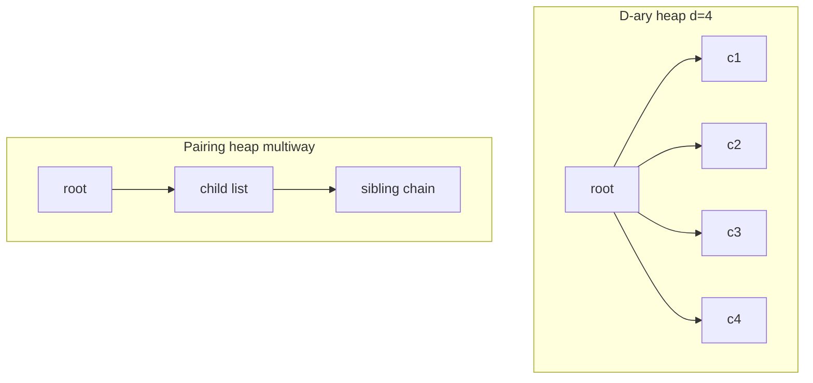
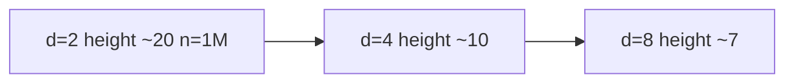
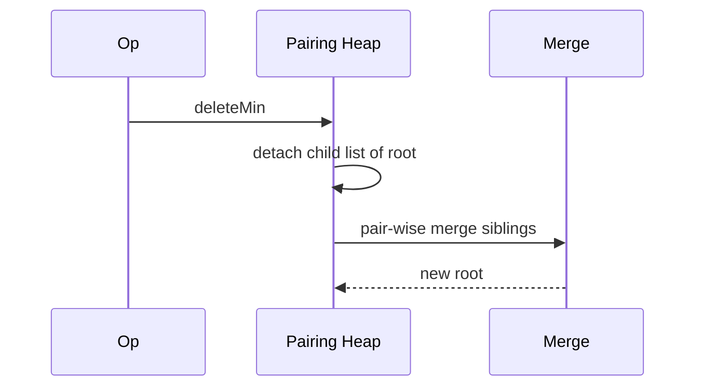

# D-ary and Pairing Heaps Concepts

## Overview

**D-ary heaps** generalize binary heaps: each node has up to **d children** stored in arrays with index formulas adapted for arity. Higher **d** reduces tree **height** (fewer sift levels) but increases work per level (comparing among d children)—useful when **extract/decrease** cost is dominated by cache-friendly shallow trees.

**Pairing heaps** are **pointer-based** multiway trees with simple **merge** operations; they achieve excellent practical performance for **decrease-key**-heavy workloads with amortized bounds still debated theoretically. This **concepts** note teaches invariants and trade-offs; production defaults remain binary heaps unless profiling demands alternatives.

## Learning Objectives

- Derive d-ary heap index formulas and height vs arity
- Explain when d ≈ 4–8 wins over d = 2 on modern CPUs
- Describe pairing heap merge and decrease-key at conceptual level
- Compare pairing heap vs indexed binary heap vs Fibonacci heap claims
- Recognize when to stay with binary heap per [[04-Data-Structures/06-Heaps-and-Priority-Queues/Priority Queue ADT|Priority Queue ADT]]

## Prerequisites

- [[04-Data-Structures/06-Heaps-and-Priority-Queues/Binary Heaps and Array Layout|Binary Heaps and Array Layout]]
- [[04-Data-Structures/06-Heaps-and-Priority-Queues/Decrease-Key and Indexed Heaps|Decrease-Key and Indexed Heaps]]
- [[04-Data-Structures/05-Trees-and-Ordered-Maps/Tree Representation and Traversal Contracts|Tree Representation and Traversal Contracts]]

## Difficulty

`advanced`

## Estimated Time

- Reading: 2 hours
- Exercises: 2 hours
- Mini project: 3 hours (arity benchmark)

## History

D-ary heaps analyzed alongside binary in CLRS. Pairing heaps (Fredman et al., 1986) were introduced as simpler alternatives to Fibonacci heaps; experimental results often favor pairing heaps despite incomplete tight bounds.

## Problem It Solves

Binary heap siftDown compares 2 children per level; for large n, **log₂ n** levels may exceed benefit of cheap compares. **D-ary** reduces levels to **log_d n** at cost of O(d) child scan—optimal d depends on hardware. Pairing heaps target **mergeable** and **decrease-key** intensive priority queues without Fibonacci heap complexity.

## Internal Implementation

### D-ary array indices (0-based)

For arity d:

- Parent: `(i - 1) // d`
- Children: `d*i + 1` through `d*i + d` (some may be out of bounds)

Height ≈ **log_d n**.

### SiftDown in d-ary

Find minimum among node and up to d children—O(d) per level, O(d log_d n) total extract.

**Optimal d**: theoretically near **O(1)** for very large d impractical; empirically **d = 4 or 8** often beats binary on cache-heavy workloads.

### Pairing heap structure

Each node has **child list** (sibling linked). **Merge** two heaps by linking roots with smaller key as parent. **Delete-min**: merge children in pairs (pairing pass). **Decrease-key**: cut node, merge with root.

Pointer-based—not contiguous array—different locality trade-off.



## Invariants

### D-ary heap

- **D1**: Complete d-ary tree embedded in array without gaps.
- **D2**: Min-heap: parent priority ≤ each child priority.

### Pairing heap (min)

- **P1**: Min-heap order on parent-child edges (not sibling order).
- **P2**: Root holds global minimum.
- **P3**: After delete-min pairing merges, structure remains valid heap.

## Operation Complexity

| Structure | insert | delete-min | decrease-key | Notes |
| --- | --- | --- | --- | --- |
| Binary heap | O(log n) | O(log n) | O(log n) indexed | Baseline |
| D-ary heap | O(d log_d n) | O(d log_d n) | O(d log_d n) indexed | Tune d |
| Pairing heap | O(1) amortized* | O(log n) amortized* | O(log log n)? amortized* | *Bounds vary by analysis |
| Fibonacci heap | O(1) amortized | O(log n) amortized | O(1) amortized | Complex |

Empirical pairing heap often matches or beats Fibonacci in practice for decrease-key.

## Mermaid Diagrams

### Structure: arity vs height



### Sequence: pairing heap delete-min



## Examples

### Minimal Example

**TypeScript** — d-ary siftDown core (d=4):

```typescript
function darySiftDown(a: number[], i: number, d: number): void {
  const n = a.length;
  for (;;) {
    let smallest = i;
    const first = d * i + 1;
    for (let c = 0; c < d; c++) {
      const j = first + c;
      if (j < n && a[j] < a[smallest]) smallest = j;
    }
    if (smallest === i) break;
    [a[i], a[smallest]] = [a[smallest], a[i]];
    i = smallest;
  }
}
```

**Python** — arity height comparison:

```python
import math

def heap_height(n: int, d: int) -> int:
    if n <= 1:
        return 0
    return math.ceil(math.log(n, d))

for d in (2, 4, 8, 16):
    print(d, heap_height(1_000_000, d))
```

### Production-Shaped Example

**Java `PriorityQueue`** is binary only; **d-ary** appears in custom schedulers (e.g., network simulators). Before switching:

1. Profile siftDown in hot path
2. Benchmark d ∈ {2,4,8} on real priority distribution
3. Stay binary if difference within noise

Pairing heaps appear in specialized libraries (some graph frameworks)—prefer **indexed binary heap** unless team maintains pairing heap invariants.

## Trade-offs

| Dimension | Upside | Downside | When it matters |
| --- | --- | --- | --- |
| D-ary vs binary | Shorter tree | More compares per level | Large n extract-heavy |
| Pairing vs binary | Fast merge/decrease-key practical | Pointers, theory gaps | Graph algorithms research |
| vs indexed binary | Simpler than Fibonacci | Pairing not in stdlib | Custom graph engine |
| Array vs pointer | d-ary cache-friendly | Pairing less locality | Embedded d-ary wins |

### When to Use

- **D-ary**: large priority queues, extract-min dominated, tuning allowed
- **Pairing heap**: experimental graph libs, decrease-key heavy, team expert
- **Concepts**: interviews and algorithm selection discussions

### When Not to Use

- Default application code—binary heap + lazy or indexed
- Small n where d tuning irrelevant
- Need stdlib support and minimal bugs

## Exercises

1. Derive parent/child formulas for 1-based d-ary indexing.
2. For n=10⁶, plot estimated sift compares binary vs d=4 extract-min.
3. Sketch pairing heap after two merge operations.
4. Why doesn't pairing heap use array layout like d-ary?
5. Implement d-ary heap push/pop for d=3; verify against binary on random ops.

## Mini Project

Benchmark harness: binary vs d=4 vs d=8 heap on uniform and skewed priorities (1M ops).

## Portfolio Project

Advanced heaps section in Structures Workbench optional arity slider.

## Interview Questions

1. What changes in d-ary heap vs binary array indexing?
2. Intuition for optimal d on modern CPU?
3. Pairing heap advantage over binary for decrease-key?
4. Why are Fibonacci heaps rare in production?
5. Height of d-ary heap with n nodes?

### Stretch / Staff-Level

1. Relate d-ary heap to **k-way merge** optimization.
2. Summarize open theoretical bounds for pairing heap decrease-key.

## Common Mistakes

- Using wrong child count loop bounds in d-ary siftDown
- Assuming d=∞ is always better—compare cost grows
- Implementing pairing heap without rigorous test on decrease-key sequences
- Confusing pairing heap with union-find

## Best Practices

- Profile before exotic heaps
- Encapsulate arity as constructor param in experiments
- Document chosen d with benchmark evidence
- Default to [[04-Data-Structures/06-Heaps-and-Priority-Queues/Binary Heaps and Array Layout|Binary Heaps]] in team codebases

## Summary

D-ary heaps trade wider nodes for shorter height—sometimes faster on large extracts. Pairing heaps offer pointer-based simplicity and strong practical decrease-key performance without Fibonacci heap complexity. Both extend the priority queue story beyond binary arrays; most production systems still use binary or indexed binary heaps until measurement proves otherwise.

## Further Reading

- [[00-References/Data Structures/README|Data Structures References]]
- Fredman et al. — Pairing heaps
- CLRS — d-ary heaps exercises

## Related Notes

- [[04-Data-Structures/06-Heaps-and-Priority-Queues/Binary Heaps and Array Layout|Binary Heaps and Array Layout]]
- [[04-Data-Structures/06-Heaps-and-Priority-Queues/Decrease-Key and Indexed Heaps|Decrease-Key and Indexed Heaps]]
- [[04-Data-Structures/06-Heaps-and-Priority-Queues/Priority Queue ADT|Priority Queue ADT]]
- [[04-Data-Structures/05-Trees-and-Ordered-Maps/Tree Representation and Traversal Contracts|Tree Representation and Traversal Contracts]]
- [[05-Algorithms/README|Algorithms Track]]

## Progress Checklist

- [ ] Explained from first principles
- [ ] Drew at least one Mermaid diagram
- [ ] Implemented a minimal version
- [ ] Documented trade-offs and non-goals
- [ ] Completed exercises
- [ ] Practiced interview questions aloud
- [ ] Linked prerequisites and dependents
