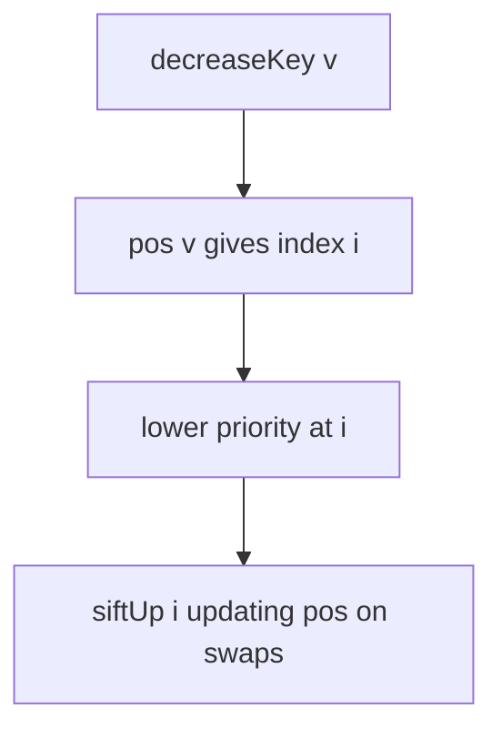
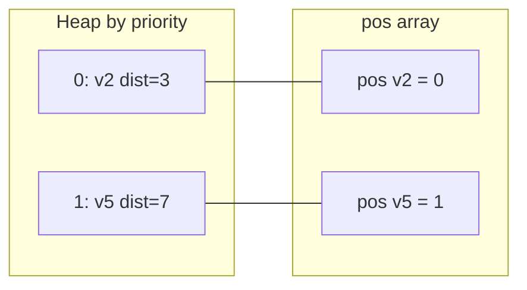
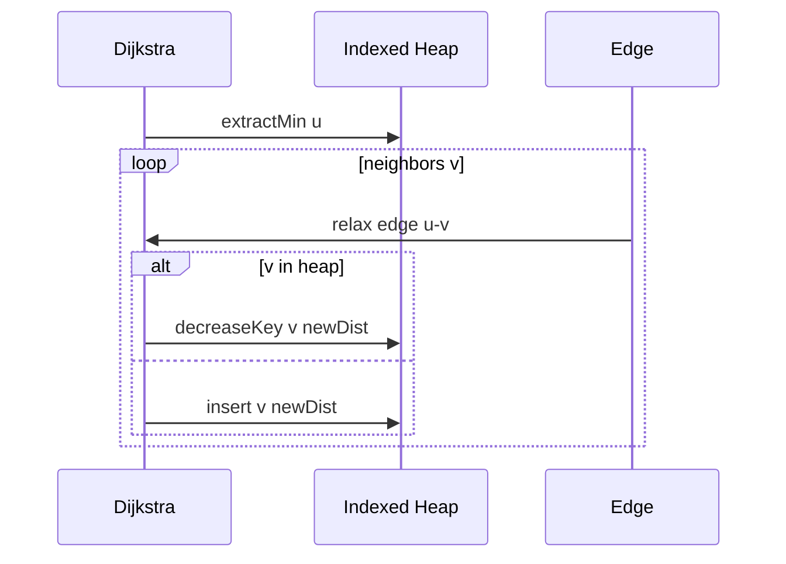

# Decrease-Key and Indexed Heaps

## Overview

Standard binary heaps lack **O(log n) decrease-key** and **delete-by-identity** because they do not track where an element lives after sift operations. An **indexed heap** (or **indexable priority queue**) maintains:

- **Heap array** of items (or priorities)
- **Position map**: `id → heap index` (often parallel array or hash map)
- **Reverse map**: `heap[i].id` for validation

When priority improves (`decreaseKey`), siftUp from known index in O(log n). This is the structure Dijkstra's algorithm wants when edge relaxations repeatedly improve distance estimates—see [[05-Algorithms/08-Shortest-Paths/Dijkstra with Indexed Heaps|Dijkstra with Indexed Heaps]] for graph algorithm handoff.

## Learning Objectives

- Implement decrease-key with position array synchronized on every swap
- Analyze Dijkstra complexity with binary heap + decrease-key vs lazy decrease
- Handle delete and change-priority without losing index invariants
- Compare indexed binary heap vs Fibonacci heap theory (decrease-key O(1) amortized)
- Build production-safe API with explicit handles/tokens

## Prerequisites

- [[04-Data-Structures/06-Heaps-and-Priority-Queues/Binary Heaps and Array Layout|Binary Heaps and Array Layout]]
- [[04-Data-Structures/06-Heaps-and-Priority-Queues/Priority Queue ADT|Priority Queue ADT]]
- [[04-Data-Structures/04-Hash-Tables-and-Sets/Separate Chaining|Separate Chaining]]

## Difficulty

`advanced`

## Estimated Time

- Reading: 2–3 hours
- Exercises: 4 hours
- Mini project: 5 hours

## History

Fredman & Tarjan's Fibonacci heaps (1984) achieved O(1) amortized decrease-key—theoretical milestone for Dijkstra. Practical implementations favor **indexed binary heaps** for simpler constants and cache behavior. Java lacks `decreaseKey` in `PriorityQueue`; practitioners use **lazy insertion** (duplicate entries with stale priorities ignored on pop).

## Problem It Solves

Graph relaxations call `decreaseKey(v, newDist)` many times. Without indexed heap:

- **Scan heap** for vertex — O(n)
- **Re-push** duplicate — O(log n) insert but larger heap, lazy cleanup

Indexed heap gives deterministic O(log n) decrease without heap bloat.

## Internal Implementation

### Parallel arrays (vertex ids 0..V-1)

```
heap:     [ (v3, 5), (v1, 7), ... ]  // min-heap by priority
pos[v]:   index of v in heap, or -1 if absent
```

### Swap must update both directions

When swapping heap[i] and heap[j], update `pos[heap[i].v] = i` and `pos[heap[j].v] = j`.

### decreaseKey(v, p)

Assert `p < heap[pos[v]].priority`; assign; `siftUp(pos[v])`.

### delete(v)

Swap v with last; shrink; siftUp or siftDown as needed; mark `pos[v] = -1`.



## Invariants

- **I1 (Heap order)**: Min-heap on priorities in array segment `[0..size)`.
- **I2 (Bijection)**: Active vertices v satisfy `pos[v] = i ⇔ heap[i].vertex = v`.
- **I3 (Consistency)**: After any swap, I2 holds for both moved vertices.
- **I4 (Absent)**: Removed vertices have `pos[v] = -1` (or sentinel).

## Operation Complexity

| Operation | Indexed binary heap | Lazy duplicate heap |
| --- | --- | --- |
| `insert` | O(log n) | O(log n) |
| `extractMin` | O(log n) | O(log n) amortized* |
| `decreaseKey` | O(log n) | O(log n) insert + stale |
| `delete` | O(log n) | harder |
| Space | O(n) pos array | up to O(E) duplicates |

*Stale entries skipped on pop with extra compare.

Fibonacci heap: decrease-key O(1) amortized, extract O(log n)—complex; rarely in app code.

## Mermaid Diagrams

### Structure: dual indexing



### Sequence: decrease-key in Dijkstra



## Examples

### Minimal Example

**TypeScript**:

```typescript
export class IndexedMinHeap {
  private dist: number[] = [];
  private pos: number[] = []; // pos[v] = heap index of v, -1 absent
  private heap: number[] = []; // heap[i] = vertex id
  private size = 0;

  constructor(vertCount: number, private INF = Number.POSITIVE_INFINITY) {
    this.dist = Array(vertCount).fill(this.INF);
    this.pos = Array(vertCount).fill(-1);
  }

  contains(v: number): boolean {
    return this.pos[v] !== -1;
  }

  insert(v: number, d: number): void {
    this.dist[v] = d;
    this.heap[this.size] = v;
    this.pos[v] = this.size;
    this.size++;
    this.siftUp(this.pos[v]);
  }

  decreaseKey(v: number, d: number): void {
    if (d >= this.dist[v]) return;
    this.dist[v] = d;
    if (this.pos[v] === -1) this.insert(v, d);
    else this.siftUp(this.pos[v]);
  }

  extractMin(): number {
    const v = this.heap[0];
    this.swap(0, this.size - 1);
    this.size--;
    this.pos[v] = -1;
    if (this.size) this.siftDown(0);
    return v;
  }

  private swap(i: number, j: number): void {
    const vi = this.heap[i];
    const vj = this.heap[j];
    this.heap[i] = vj;
    this.heap[j] = vi;
    this.pos[vi] = j;
    this.pos[vj] = i;
  }

  private siftUp(i: number): void {
    while (i > 0) {
      const p = (i - 1) >> 1;
      if (this.dist[this.heap[p]] <= this.dist[this.heap[i]]) break;
      this.swap(i, p);
      i = p;
    }
  }

  private siftDown(i: number): void {
    for (;;) {
      let s = i;
      const l = 2 * i + 1;
      const r = l + 1;
      if (l < this.size && this.dist[this.heap[l]] < this.dist[this.heap[s]]) s = l;
      if (r < this.size && this.dist[this.heap[r]] < this.dist[this.heap[s]]) s = r;
      if (s === i) break;
      this.swap(i, s);
      i = s;
    }
  }
}
```

**Python**:

```python
class IndexedMinHeap:
    def __init__(self, n: int) -> None:
        self.inf = float("inf")
        self.dist = [self.inf] * n
        self.pos = [-1] * n
        self.heap: list[int] = []
        self._size = 0

    def _swap(self, i: int, j: int) -> None:
        vi, vj = self.heap[i], self.heap[j]
        self.heap[i], self.heap[j] = vj, vi
        self.pos[vi], self.pos[vj] = j, i

    def decrease_key(self, v: int, d: float) -> None:
        if d >= self.dist[v]:
            return
        self.dist[v] = d
        if self.pos[v] == -1:
            self._insert(v)
        else:
            self._sift_up(self.pos[v])

    def _insert(self, v: int) -> None:
        self.heap.append(v)
        self.pos[v] = self._size
        self._size += 1
        self._sift_up(self.pos[v])

    def _sift_up(self, i: int) -> None:
        while i > 0:
            p = (i - 1) // 2
            if self.dist[self.heap[p]] <= self.dist[self.heap[i]]:
                break
            self._swap(i, p)
            i = p
```

### Production-Shaped Example

Lazy decrease-key pattern when indexed heap unavailable:

```python
import heapq

def dijkstra_lazy(adj, src):
    dist = {src: 0}
    pq = [(0, src)]
    while pq:
        d, u = heapq.heappop(pq)
        if d != dist.get(u, float("inf")):
            continue  # stale entry
        for v, w in adj[u]:
            nd = d + w
            if nd < dist.get(v, float("inf")):
                dist[v] = nd
                heapq.heappush(pq, (nd, v))
```

Choose indexed heap when graph dense and E log V with duplicates hurts memory.

## Trade-offs

| Dimension | Upside | Downside | When it matters |
| --- | --- | --- | --- |
| Indexed heap | True decrease-key | pos array memory | Dijkstra dense graphs |
| Lazy heap | Simple API | Duplicate entries | Java PriorityQueue |
| Fibonacci heap | Theoretical best | Impractical | Academic |
| Hash map pos | Sparse ids | Hash overhead | Non-dense vertex labels |

### When to Use

- Dijkstra / Prim on graphs needing many decrease-key ops
- Scheduler with dynamic priority updates for known task ids
- Simulation with explicit entity indices

### When Not to Use

- One-shot extract-only workloads
- Vertex ids unbounded sparse without compression
- Language PQ without index support and graph small—lazy OK

## Exercises

1. Prove swap updates preserve I2 bijection invariant.
2. Implement `delete(v)` on indexed heap.
3. Benchmark Dijkstra indexed vs lazy on grid graph.
4. What breaks if you forget to update `pos` on sift?
5. Design handle-based API returning opaque token on insert.

## Mini Project

Indexed heap + Dijkstra in code labs; compare paths to lazy heap on shared graph vectors.

## Portfolio Project

Graph module in [[04-Data-Structures/projects/Graph Store CLI/README|Graph Store CLI]] optional Dijkstra backend.

## Interview Questions

1. Why doesn't standard binary heap support decrease-key efficiently?
2. How indexed heap locates vertex for sift?
3. Lazy decrease-key stale entry trick?
4. Dijkstra complexity with indexed binary heap?
5. When is Fibonacci heap mentioned but not used?

### Stretch / Staff-Level

1. Implement decrease-key with hash map for arbitrary string task ids.
2. Compare indexed d-ary heap for decrease-key heavy workloads.

## Common Mistakes

- Stale `pos` after swap
- Off-by-one vertex count sizing
- decreaseKey when new priority is worse (must reject or increase-key separate)
- Using Java PQ without lazy stale check

## Best Practices

- Encapsulate swap to centralize pos updates
- Assert invariants in debug after every public op
- Document whether handles invalid after delete
- Prefer lazy pattern when graph library lacks indexed heap

## Summary

Indexed heaps augment binary heaps with position maps so decrease-key and delete-by-id run in O(log n). They bridge priority queue theory and graph algorithms like Dijkstra. When indexed structures are unavailable, lazy duplicate insertion with stale checks is the production fallback—trading space for implementation simplicity.

## Further Reading

- [[00-References/Data Structures/README|Data Structures References]]
- CLRS — Fibonacci heaps (advanced); Dijkstra with heaps

## Related Notes

- [[04-Data-Structures/06-Heaps-and-Priority-Queues/Binary Heaps and Array Layout|Binary Heaps and Array Layout]]
- [[04-Data-Structures/06-Heaps-and-Priority-Queues/Priority Queue ADT|Priority Queue ADT]]
- [[04-Data-Structures/06-Heaps-and-Priority-Queues/D-ary and Pairing Heaps Concepts|D-ary and Pairing Heaps Concepts]]
- [[04-Data-Structures/08-Graphs-as-Representation/Adjacency Lists|Adjacency Lists]]
- [[05-Algorithms/08-Shortest-Paths/Dijkstra with Indexed Heaps|Dijkstra with Indexed Heaps]]

## Progress Checklist

- [ ] Explained from first principles
- [ ] Drew at least one Mermaid diagram
- [ ] Implemented a minimal version
- [ ] Documented trade-offs and non-goals
- [ ] Completed exercises
- [ ] Practiced interview questions aloud
- [ ] Linked prerequisites and dependents
