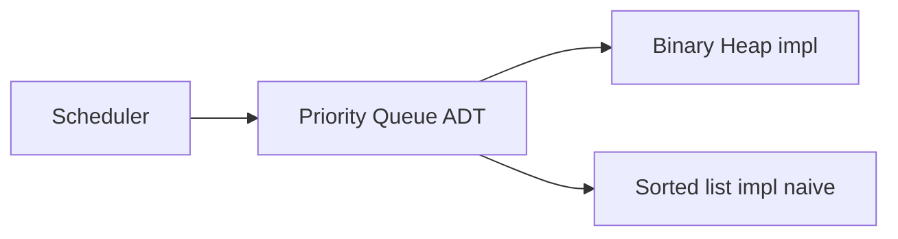
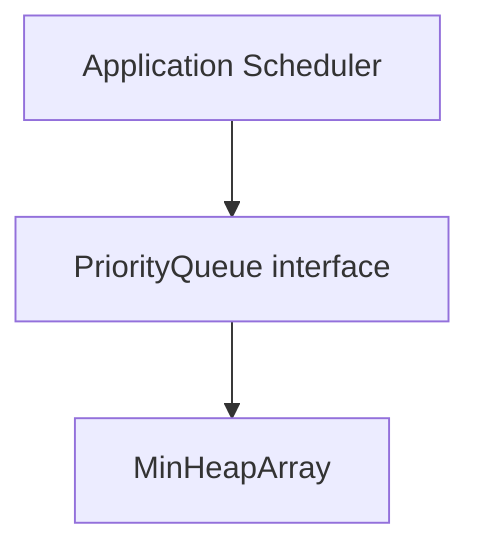
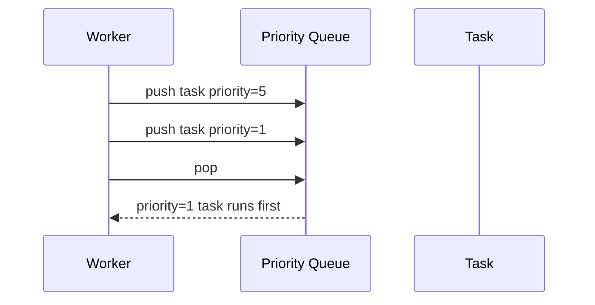

# Priority Queue ADT

## Overview

A **priority queue (PQ)** is an ADT supporting:

- **`insert(item, priority)`** — add with priority
- **`peekMin` / `peekMax`** — view extremum without removal
- **`extractMin` / `extractMax`** — remove and return extremum

Optional: **`merge`**, **`decreaseKey`**, **`delete` arbitrary**. The ADT does not mandate a **heap**—but binary heaps are the standard implementation per [[04-Data-Structures/06-Heaps-and-Priority-Queues/Binary Heaps and Array Layout|Binary Heaps and Array Layout]].

Priority queues model **schedulers**, **Dijkstra**, **Huffman coding**, **task runners**, and **timeout wheels** at a higher abstraction than array sift details.

## Learning Objectives

- Specify PQ operations and their complexity contracts
- Implement PQ facade over min-heap with stable tie-breaking
- Compare PQ to FIFO [[04-Data-Structures/03-Stacks-Queues-and-Deques/Queues|Queue]] semantics
- Choose PQ vs sorted structure vs heap-of-limited-size for top-k
- Map stdlib APIs: `heapq`, `PriorityQueue`, `asyncio` timers

## Prerequisites

- [[04-Data-Structures/06-Heaps-and-Priority-Queues/Binary Heaps and Array Layout|Binary Heaps and Array Layout]]
- [[04-Data-Structures/00-Orientation-and-Contracts/Abstract Data Types vs Concrete Structures|Abstract Data Types vs Concrete Structures]]

## Difficulty

`intermediate`

## Estimated Time

- Reading: 1.5 hours
- Exercises: 2 hours
- Mini project: 3 hours

## History

Priority queues formalized with heaps (1960s). Operating system schedulers (multilevel feedback queues) combine PQ ideas with policy. Distributed systems use **time-ordered** structures (Kafka timestamps, delayed queues) with similar ADT semantics at scale.

## Problem It Solves

FIFO queue serves earliest arrival; many systems need **highest priority first** or **earliest deadline first**. Without PQ abstraction, teams embed heap logic in business code—duplicating tie-break bugs and untested sift paths.

## Internal Implementation

### ADT interface

```
interface PriorityQueue<T> {
  push(item: T): void;
  peek(): T | undefined;
  pop(): T | undefined;
  size(): number;
}
```

Priority encoded in `T` via comparator or separate key field.

### Stable ordering

When priorities tie, use **monotonic sequence** tie-breaker to avoid starvation ambiguity:

```
(priority, seq, payload)
```

### Implementation choices

| Backend | insert | extract | decrease-key |
| --- | --- | --- | --- |
| Binary heap | O(log n) | O(log n) | needs index map |
| Sorted array | O(n) | O(1) at end | O(n) |
| Unsorted array + scan | O(1) | O(n) | O(n) |
| Pairing heap | O(1)* | O(log n)* | O(log n)* amortized |

*Concepts in d-ary/pairing note.



## Invariants

- **I1 (Extremum)**: If non-empty, `peek()` returns item with best priority per comparator.
- **I2 (Size)**: `size()` equals number of stored items.
- **I3 (Queue discipline)**: `pop()` returns same item consecutive `peek()` would until mutation.
- **I4 (Stability policy)**: Tie-break rule documented and consistent.

## Operation Complexity

| Operation | Binary heap PQ | Notes |
| --- | --- | --- |
| `push` | O(log n) | |
| `peek` | O(1) | |
| `pop` | O(log n) | |
| `push-pop` fused | O(log n) | Optimization in `heapq.heappushpop` |
| `melding` two heaps | O(n) naive | Advanced heaps better |

## Mermaid Diagrams

### Structure: ADT layering



### Sequence: task scheduling



## Examples

### Minimal Example

**TypeScript**:

```typescript
export class PriorityQueue<T> {
  private heap: T[] = [];
  constructor(private less: (a: T, b: T) => boolean) {}

  push(x: T): void {
    this.heap.push(x);
    this.siftUp(this.heap.length - 1);
  }

  peek(): T | undefined {
    return this.heap[0];
  }

  pop(): T | undefined {
    if (!this.heap.length) return undefined;
    const top = this.heap[0];
    const last = this.heap.pop()!;
    if (this.heap.length) {
      this.heap[0] = last;
      this.siftDown(0);
    }
    return top;
  }

  get size(): number {
    return this.heap.length;
  }
  // siftUp/siftDown same as Binary Heaps note
}
```

**Python**:

```python
import heapq
from dataclasses import dataclass, field
from typing import Any

@dataclass(order=True)
class Prioritized:
    priority: int
    item: Any = field(compare=False)

class PriorityQueue:
    def __init__(self) -> None:
        self._h: list[Prioritized] = []

    def push(self, priority: int, item: Any) -> None:
        heapq.heappush(self._h, Prioritized(priority, item))

    def pop(self) -> Any:
        return heapq.heappop(self._h).item

    def peek(self) -> Any:
        return self._h[0].item
```

### Production-Shaped Example

Worker pool with deadline scheduling:

```typescript
type Job = { id: string; deadline: number; seq: number };

const pq = new PriorityQueue<Job>(
  (a, b) => a.deadline !== b.deadline ? a.deadline - b.deadline : a.seq - b.seq
);

function drainDue(now: number): Job[] {
  const ready: Job[] = [];
  while (pq.size && pq.peek()!.deadline <= now) ready.push(pq.pop()!);
  return ready;
}
```

Instrument queue depth and priority age histograms for SLA tuning.

## Trade-offs

| Dimension | Upside | Downside | When it matters |
| --- | --- | --- | --- |
| Heap-backed PQ | Balanced ops | No efficient arbitrary delete | General scheduler |
| FIFO queue | Fair arrival order | Ignores priority | BFS, logging |
| Delayed queue (Redis) | Distributed | Network latency | Microservices |
| Top-k heap size k | O(n log k) | Not full sort | Streaming |

### When to Use

- Shortest path (Dijkstra), Prim's MST — Algorithms track
- Event simulation with timestamp order
- Rate limiting with earliest expiry first

### When Not to Use

- Strict FIFO fairness without priority semantics
- Need searchable queue by id without auxiliary map
- Very small n where array scan beats heap constants

## Exercises

1. Implement stable PQ with `(priority, seq, item)` tuple ordering.
2. Simulate Dijkstra on tiny graph using PQ only—handoff to Algorithms.
3. Compare runtime: PQ vs sort-on-each-step for n=1000 scheduling rounds.
4. Implement `push-pop` optimization in one sift pass.
5. When is unsorted array + linear scan faster than heap?

## Mini Project

**Job Scheduler Simulator**: PQ-driven discrete event simulation with metrics export.

## Portfolio Project

PQ module in Structures Workbench integrated with graph algorithm demos.

## Interview Questions

1. PQ operations and typical complexities?
2. Difference PQ vs queue?
3. How implement max-PQ using min-heap?
4. Why tie-breaker sequence in stable scheduling?
5. Role of PQ in Dijkstra?

### Stretch / Staff-Level

1. Design distributed priority queue with clock skew handling.
2. Compare `heapq` vs `asyncio` timeout management patterns.

## Common Mistakes

- Inverting comparator (max vs min heap confusion)
- Not handling empty pop/peek
- Using PQ when sorted list suffices for tiny n
- Starvation when priority ties mishandled

## Best Practices

- Wrap heap in PQ class—don't expose internal array
- Document comparator stability and tie policy
- Use fused push-pop when applicable
- For decrease-key heavy workloads, use [[04-Data-Structures/06-Heaps-and-Priority-Queues/Decrease-Key and Indexed Heaps|Indexed Heaps]]

## Summary

The priority queue ADT abstracts extremum-first scheduling independent of heap mechanics. Binary heaps provide the standard implementation profile: logarithmic insert and extract, constant peek. Production code expresses policy through comparators and stable tie-breakers while delegating sift details to a tested heap layer.

## Further Reading

- [[00-References/Data Structures/README|Data Structures References]]
- [[05-Algorithms/08-Shortest-Paths/Dijkstra with Indexed Heaps|Dijkstra with Indexed Heaps]], [[05-Algorithms/05-Greedy-Algorithms/Huffman Coding|Huffman Coding]]

## Related Notes

- [[04-Data-Structures/06-Heaps-and-Priority-Queues/Binary Heaps and Array Layout|Binary Heaps and Array Layout]]
- [[04-Data-Structures/06-Heaps-and-Priority-Queues/Decrease-Key and Indexed Heaps|Decrease-Key and Indexed Heaps]]
- [[04-Data-Structures/03-Stacks-Queues-and-Deques/Queues|Queues]]
- [[04-Data-Structures/00-Orientation-and-Contracts/Abstract Data Types vs Concrete Structures|Abstract Data Types vs Concrete Structures]]

## Progress Checklist

- [ ] Explained from first principles
- [ ] Drew at least one Mermaid diagram
- [ ] Implemented a minimal version
- [ ] Documented trade-offs and non-goals
- [ ] Completed exercises
- [ ] Practiced interview questions aloud
- [ ] Linked prerequisites and dependents
