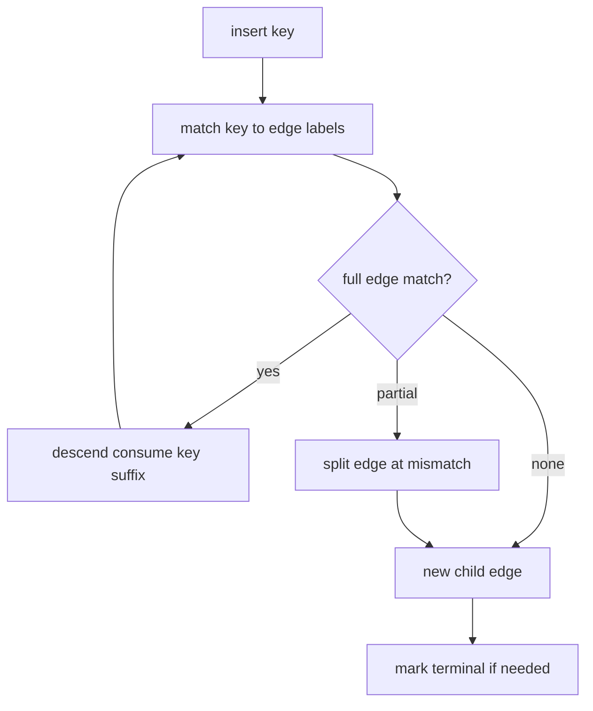
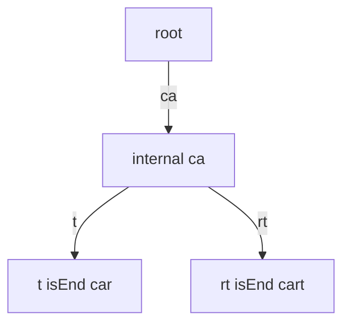
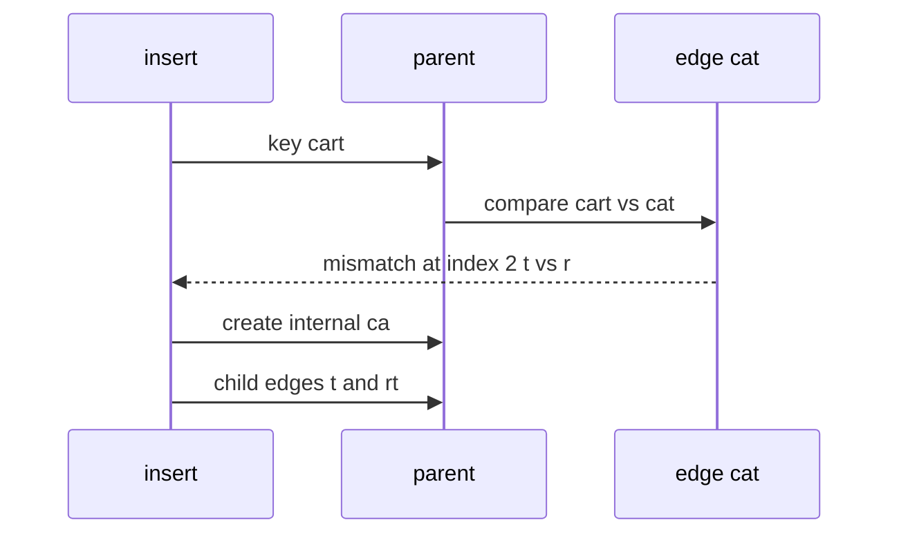

# Compressed Tries and Radix Trees

## Overview

A **compressed trie** ( **radix tree** / **Patricia trie** ) collapses chains of nodes with **single outgoing edges** into one edge labeled with a **substring** (edge label is a string fragment, not a single character). Internal nodes have **at least two children** (or are terminal). The set of keys remains identical to an uncompressed [[04-Data-Structures/07-Tries-and-Prefix-Structures/Tries|trie]], but node count drops toward O(n) for n keys rather than O(total characters).

Lookup compares key slices against edge labels—still O(L) character comparisons, often with **fewer pointer hops** and better cache behavior. Linux kernel routing (`radix_tree`/`xarray` lineage), `git` path structures, and many IP tables use radix-style compression.

## Learning Objectives

- Explain edge-labeled vs node-labeled trie representations
- Implement split-on-mismatch during insert
- State invariants linking compressed edges to prefix sets
- Compare memory and pointer overhead to standard tries
- Recognize production uses: URL routers, CIDR tables, file path indexes

## Prerequisites

- [[04-Data-Structures/07-Tries-and-Prefix-Structures/Tries|Tries]]
- [[04-Data-Structures/05-Trees-and-Ordered-Maps/Tree Representation and Traversal Contracts|Tree Representation and Traversal Contracts]]

## Difficulty

`intermediate`

## Estimated Time

- Reading: 2–3 hours
- Exercises: 4 hours
- Mini project: 5 hours

## History

Morrison (1968) and Knuth popularized **Patricia** (Practical Algorithm To Retrieve Information Coded in Alphanumeric). Radix trees generalize the idea to arbitrary alphabets and variable-length edge labels. Modern systems (Redis cluster slot maps, HTTP route trees) use compressed paths to reduce depth.

## Problem It Solves

Standard tries allocate one node per character—URLs and file paths waste memory on `"/users/"` shared segments. Compression merges unary chains: `"users"` becomes one edge from parent. Fewer nodes means less allocator traffic and shallower pointer chasing while preserving prefix semantics.

## Internal Implementation

### Node shape

```typescript
type RadixNode = {
  label: string;           // edge label from parent (empty at root)
  children: Map<string, RadixNode>; // keyed by first char of child label
  isEnd: boolean;
};
```

Alternative: store `label` on outgoing edges only; root has empty label.

### Insert algorithm sketch

1. Walk from root matching `key` against child edge labels character-by-character.
2. On **partial match** within an edge label, **split** the edge at mismatch index: new internal node holds common prefix; two child edges hold suffixes.
3. If full edge consumed, descend to child and continue with remaining key suffix.
4. At stop point, attach new leaf edge or mark terminal.

### Search

Same walk; success only if key fully consumed and terminal (or exact edge boundary with `isEnd`).



## Invariants

- **I1 (Edge labels non-empty)**: Every edge label has length ≥ 1 (except root's implicit label).
- **I2 (Branching)**: Every internal non-terminal node has ≥ 2 children (compression invariant—no unary internal chains).
- **I3 (Child key discipline)**: Children indexed by first character of their edge label; sibling first characters distinct.
- **I4 (Key set equivalence)**: The expanded character-wise trie of all root-to-terminal paths equals the key set of the uncompressed trie.
- **I5 (Maximal compression)**: No internal node with exactly one non-terminal child—such chains would be merged.

## Operation Complexity

Let L = key length, n = keys, h = compressed tree height (≤ L, often ≪ L with sharing).

| Operation | Time | Notes |
| --- | --- | --- |
| `search` | O(L) | Char comparisons; fewer nodes than trie |
| `insert` | O(L) | Split may add O(1) nodes |
| `delete` | O(L) | Merge unary parents after prune |
| `startsWith` | O(P) | P = prefix length |
| Space | O(n) nodes typical | O(n · L) worst without sharing |

Splits and merges make constant factors higher than naive trie; win when paths are long and sparse.

## Mermaid Diagrams

### Structure: split after inserting "cart"



Before `"cart"`, edge `"cat"` may exist; partial match on `"ca"` forces split.

### Sequence: partial edge match triggers split



## Examples

### Minimal Example

**TypeScript**:

```typescript
type RadixNode = {
  label: string;
  children: Map<string, RadixNode>;
  isEnd: boolean;
};

export class RadixTree {
  private root: RadixNode = { label: "", children: new Map(), isEnd: false };

  insert(key: string): void {
    this._insert(this.root, key);
  }

  search(key: string): boolean {
    let i = 0;
    let node = this.root;
    while (i < key.length) {
      const ch = key[i];
      const child = node.children.get(ch);
      if (!child) return false;
      const { label } = child;
      let j = 0;
      while (j < label.length && i + j < key.length && label[j] === key[i + j]) j++;
      if (j < label.length) return false;
      i += label.length;
      node = child;
    }
    return node.isEnd;
  }

  private _insert(node: RadixNode, key: string, depth = 0): void {
    if (depth === key.length) {
      node.isEnd = true;
      return;
    }
    const ch = key[depth];
    let child = node.children.get(ch);
    if (!child) {
      node.children.set(ch, {
        label: key.slice(depth),
        children: new Map(),
        isEnd: true,
      });
      return;
    }
    let j = 0;
    const max = Math.min(child.label.length, key.length - depth);
    while (j < max && child.label[j] === key[depth + j]) j++;
    if (j === child.label.length) {
      this._insert(child, key, depth + j);
      return;
    }
    // split
    const mid: RadixNode = {
      label: child.label.slice(0, j),
      children: new Map(),
      isEnd: false,
    };
    const tailChild: RadixNode = {
      label: child.label.slice(j),
      children: child.children,
      isEnd: child.isEnd,
    };
    mid.children.set(tailChild.label[0], tailChild);
    node.children.set(ch, mid);
    if (depth + j < key.length) {
      const newLeaf: RadixNode = {
        label: key.slice(depth + j),
        children: new Map(),
        isEnd: true,
      };
      mid.children.set(newLeaf.label[0], newLeaf);
    } else {
      mid.isEnd = true;
    }
  }
}
```

**Python**:

```python
from dataclasses import dataclass, field
from typing import Dict, Optional

@dataclass
class RadixNode:
    label: str = ""
    children: Dict[str, "RadixNode"] = field(default_factory=dict)
    is_end: bool = False

class RadixTree:
    def __init__(self) -> None:
        self._root = RadixNode()

    def search(self, key: str) -> bool:
        i, node = 0, self._root
        while i < len(key):
            child = node.children.get(key[i])
            if not child:
                return False
            lbl = child.label
            j = 0
            while j < len(lbl) and i + j < len(key) and lbl[j] == key[i + j]:
                j += 1
            if j < len(lbl):
                return False
            i += len(lbl)
            node = child
        return node.is_end

    def insert(self, key: str) -> None:
        self._insert(self._root, key, 0)

    def _insert(self, node: RadixNode, key: str, depth: int) -> None:
        if depth == len(key):
            node.is_end = True
            return
        ch = key[depth]
        child = node.children.get(ch)
        if not child:
            node.children[ch] = RadixNode(label=key[depth:], is_end=True)
            return
        j = 0
        while j < len(child.label) and depth + j < len(key) and child.label[j] == key[depth + j]:
            j += 1
        if j == len(child.label):
            self._insert(child, key, depth + j)
            return
        mid = RadixNode(label=child.label[:j])
        tail = RadixNode(label=child.label[j:], children=child.children, is_end=child.is_end)
        mid.children[tail.label[0]] = tail
        node.children[ch] = mid
        if depth + j < len(key):
            leaf = RadixNode(label=key[depth + j:], is_end=True)
            mid.children[leaf.label[0]] = leaf
        else:
            mid.is_end = True
```

### Production-Shaped Example

HTTP router: compressed paths, method-specific payloads at terminals, parameterized segments as wildcard edges (implementation detail in Backend). Instrument **split count** and max depth on route registration:

```typescript
class RouteRadix {
  register(path: string, handler: Handler): void {
    const normalized = this.normalize(path);
    this.tree.insert(normalized);
    // attach handler at terminal; reject ambiguous param collisions
  }
}
```

## Trade-offs

| Dimension | Upside | Downside | When it matters |
| --- | --- | --- | --- |
| vs plain trie | Fewer nodes, less depth | Split/merge code complexity | Long path-like keys |
| vs hash map | Prefix/longest match | Slower exact on short keys | Routers, IP lookup |
| Edge as string | Batch compare, SIMD potential | Substring alloc if careless | Hot paths—use slices/views |
| Binary Patricia | Minimal nodes for bits | Specialized | MAC/IP bit tries |

### When to Use

- Route tables, file paths, hostnames with shared prefixes
- Memory-bound dictionaries with long keys
- Longest-prefix match in networking

### When Not to Use

- Short random keys with no prefix overlap—hash map wins
- When insert/delete rate is extreme and split cost matters—benchmark first

## Exercises

1. Implement delete with parent merge when child becomes unary.
2. Draw before/after splits inserting `"foo"`, `"fool"`, `"fo"` into empty tree.
3. Verify I4 by expanding compressed tree to character trie programmatically.
4. Benchmark node count: trie vs radix on `/api/v1/...` path list.
5. Implement longest-prefix match returning the deepest terminal ancestor.

## Mini Project

Radix tree module in code labs with visual split logging; compare memory to [[04-Data-Structures/07-Tries-and-Prefix-Structures/Tries|Tries]] on Linux `/usr` path corpus.

## Portfolio Project

[[04-Data-Structures/projects/Graph Store CLI/README|Graph Store CLI]] — optional path index using radix tree for asset paths.

## Interview Questions

1. What triggers an edge split in a radix tree?
2. Why can compressed tries use O(n) nodes for n keys?
3. Patricia trie vs radix tree—same idea?
4. How is longest-prefix match implemented on a compressed trie?
5. Complexity of insert when no splits occur vs many splits?

### Stretch / Staff-Level

1. Design a persistent radix tree for copy-on-write routing tables.
2. Compare crit-bit trees (Bernstein) to map-keyed radix children.

## Common Mistakes

- Allowing unary internal chains (violates I2/I5)
- Off-by-one in partial match index during split
- Indexing children by wrong character after split
- Allocating new strings per comparison instead of slice indices

## Best Practices

- Store `(offset, length)` into a shared key buffer for zero-copy edges
- Assert compression invariant in debug after every mutation
- Normalize paths (`//`, `.`, `..`) before insert in routers
- Fuzz insert/delete/search against brute-force `Set` reference

## Summary

Compressed tries merge unary path segments into substring-labeled edges, preserving the prefix key set while cutting node count and depth. Insert and delete revolve around edge splits and merges; correctness is invariant-driven equivalence to an expanded trie. They are the production shape of prefix indexes for paths, routes, and long shared strings.

## Further Reading

- [[00-References/Data Structures/README|Data Structures References]]
- Knuth — Patricia trie
- Linux kernel radix tree / xarray documentation

## Related Notes

- [[04-Data-Structures/07-Tries-and-Prefix-Structures/Tries|Tries]]
- [[04-Data-Structures/07-Tries-and-Prefix-Structures/Ternary Search Trees Concepts|Ternary Search Trees Concepts]]
- [[04-Data-Structures/05-Trees-and-Ordered-Maps/B-Trees and B-Plus Trees Concepts|B-Trees and B-Plus Trees Concepts]]
- [[07-Backend/README|Backend]] — HTTP routing and middleware ordering

## Progress Checklist

- [ ] Explained from first principles
- [ ] Drew at least one Mermaid diagram
- [ ] Implemented a minimal version
- [ ] Documented trade-offs and non-goals
- [ ] Completed exercises
- [ ] Practiced interview questions aloud
- [ ] Linked prerequisites and dependents
