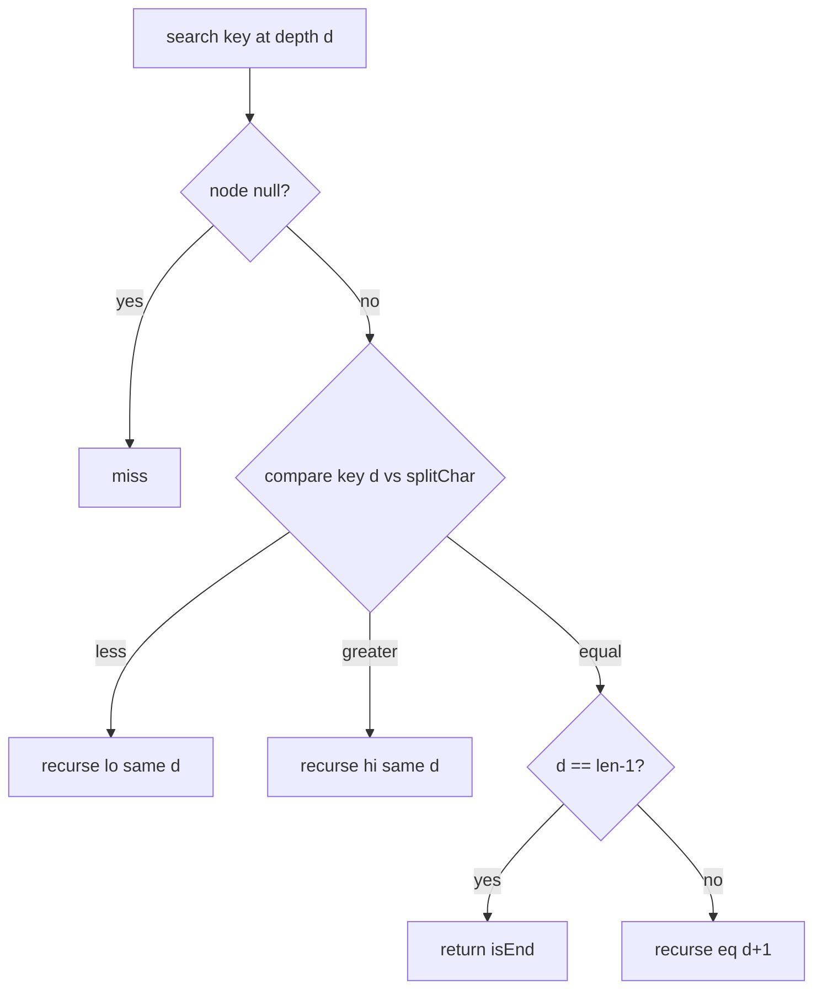
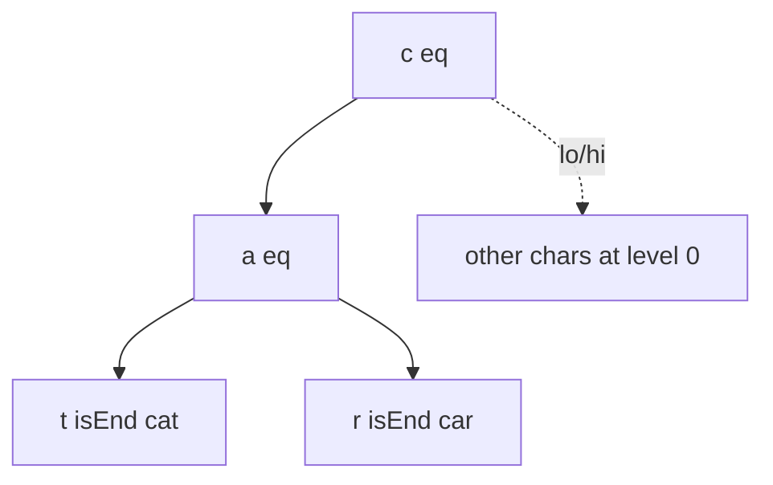
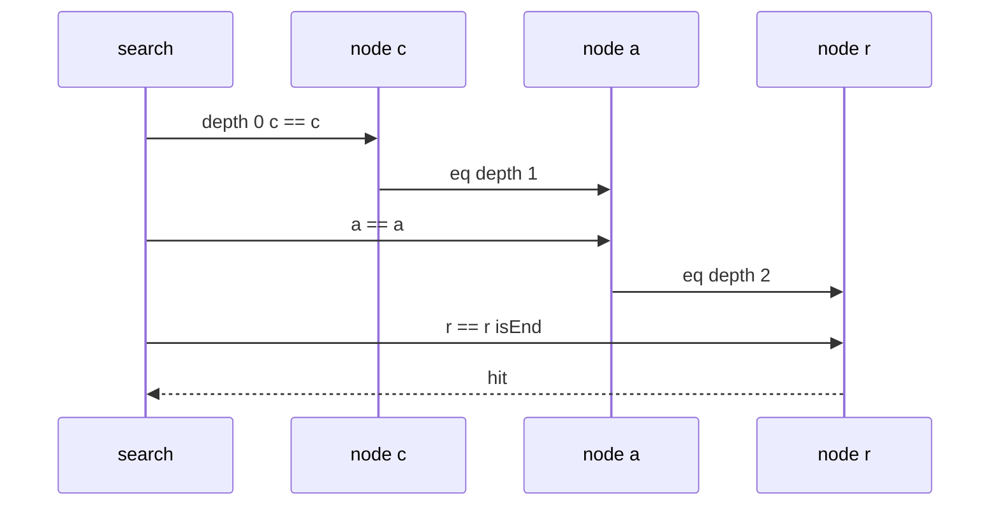

# Ternary Search Trees Concepts

## Overview

A **ternary search tree (TST)** is a hybrid of a [[04-Data-Structures/07-Tries-and-Prefix-Structures/Tries|trie]] and a [[04-Data-Structures/05-Trees-and-Ordered-Maps/Binary Search Trees|BST]]. Each node stores one **character** `splitChar` and three pointers:

- **lo** — subtree for characters **less than** `splitChar`
- **eq** — subtree for **next character** in the key (trie-style advance)
- **hi** — subtree for characters **greater than** `splitChar`

Keys are stored along **eq-chains**; terminal nodes mark word ends. TSTs avoid large per-node child arrays (256-way trie nodes) while keeping O(L) search for key length L. Jon Bentley and Robert Sedgewick popularized TSTs for practical string indexing.

This note is **concept-level**: implement after mastering trie invariants and BST ordering.

## Learning Objectives

- Map TST node fields to trie + BST roles
- Trace search/insert on eq vs lo/hi branches
- Compare memory to array-trie and hash-map trie
- State TST invariants linking eq-chains to stored strings
- Decide when TST beats radix tree or hash map in production

## Prerequisites

- [[04-Data-Structures/07-Tries-and-Prefix-Structures/Tries|Tries]]
- [[04-Data-Structures/05-Trees-and-Ordered-Maps/Binary Search Trees|Binary Search Trees]]

## Difficulty

`intermediate`

## Estimated Time

- Reading: 1.5 hours
- Exercises: 3 hours
- Mini project: 4 hours

## History

TSTs emerged from combining digital search trees with BST pruning at each level (Bentley & Sedgewick, 1990s). They predated widespread hash-map trie nodes but remain relevant when alphabet is large and memory is tight.

## Problem It Solves

Array tries use O(|Σ|) per node—prohibitive for byte or Unicode alphabets. Hash-map tries add pointer overhead per level. TST stores **at most three pointers per character depth**, clustering character comparisons in BST fashion at each trie level, yielding compact in-memory string sets with predictable O(L) time (with larger constants than array tries).

## Internal Implementation

### Node layout

```
struct TSTNode {
  char splitChar;
  bool isEnd;
  TSTNode* lo, eq, hi;
  Value* payload;  // optional
};
```

### Search(key, node, depth)

```
if node is null: miss
c = key[depth]
if c < node.splitChar: search(key, node.lo, depth)
else if c > node.splitChar: search(key, node.hi, depth)
else:
  if depth == len(key)-1: return node.isEnd
  else: search(key, node.eq, depth+1)
```

Insert creates lo/hi/eq nodes on miss paths mirroring BST+trie rules.



## Invariants

- **I1 (Eq-chain spelling)**: Following `eq` pointers from a match path spells consecutive key characters; `lo`/`hi` never advance depth.
- **I2 (BST order on lo/hi)**: For any node `n`, all characters in `n.lo` subtree are < `n.splitChar`; all in `n.hi` are > `n.splitChar`.
- **I3 (Terminal)**: `isEnd` true iff some stored key ends at this node's character position.
- **I4 (No duplicate keys)**: At most one eq-path stores a given key string.
- **I5 (Acyclic eq-depth)**: Eq-edges increase depth; total eq steps along a search ≤ L.

## Operation Complexity

| Operation | Average | Worst | Space |
| --- | --- | --- | --- |
| `search` | O(L) | O(L) | O(1) extra |
| `insert` | O(L) | O(L) | O(L) new nodes worst case |
| `delete` | O(L) | O(L) | — |
| `prefix search` | O(L + k) | O(L + k) | Output size k |

Worst-case lo/hi skew can add log factor **per character** if each level degenerates to a linked list—rare with balanced insertion order; unlike AVL, standard TST is unbalanced.

Node count O(n · L) worst case; often better than trie with |Σ|-sized arrays.

## Mermaid Diagrams

### Structure: keys "cat", "car"



At root `splitChar='c'`, eq-chain spells `ca`, then branch `t` vs `r`.

### Sequence: search "car"



## Examples

### Minimal Example

**TypeScript**:

```typescript
type TSTNode = {
  splitChar: string;
  isEnd: boolean;
  lo: TSTNode | null;
  eq: TSTNode | null;
  hi: TSTNode | null;
};

export class TernarySearchTree {
  private root: TSTNode | null = null;

  search(key: string): boolean {
    return this._search(this.root, key, 0);
  }

  private _search(node: TSTNode | null, key: string, d: number): boolean {
    if (!node) return false;
    const c = key[d];
    if (c < node.splitChar) return this._search(node.lo, key, d);
    if (c > node.splitChar) return this._search(node.hi, key, d);
    if (d === key.length - 1) return node.isEnd;
    return this._search(node.eq, key, d + 1);
  }

  insert(key: string): void {
    this.root = this._insert(this.root, key, 0);
  }

  private _insert(node: TSTNode | null, key: string, d: number): TSTNode {
    const c = key[d];
    if (!node) {
      node = { splitChar: c, isEnd: false, lo: null, eq: null, hi: null };
    }
    if (c < node.splitChar) node.lo = this._insert(node.lo, key, d);
    else if (c > node.splitChar) node.hi = this._insert(node.hi, key, d);
    else {
      if (d === key.length - 1) node.isEnd = true;
      else node.eq = this._insert(node.eq, key, d + 1);
    }
    return node;
  }
}
```

**Python**:

```python
from dataclasses import dataclass
from typing import Optional

@dataclass
class TSTNode:
    split_char: str
    is_end: bool = False
    lo: Optional["TSTNode"] = None
    eq: Optional["TSTNode"] = None
    hi: Optional["TSTNode"] = None

class TernarySearchTree:
    def __init__(self) -> None:
        self._root: Optional[TSTNode] = None

    def search(self, key: str) -> bool:
        return self._search(self._root, key, 0)

    def _search(self, node: Optional[TSTNode], key: str, d: int) -> bool:
        if node is None:
            return False
        c = key[d]
        if c < node.split_char:
            return self._search(node.lo, key, d)
        if c > node.split_char:
            return self._search(node.hi, key, d)
        if d == len(key) - 1:
            return node.is_end
        return self._search(node.eq, key, d + 1)

    def insert(self, key: str) -> None:
        self._root = self._insert(self._root, key, 0)

    def _insert(self, node: Optional[TSTNode], key: str, d: int) -> TSTNode:
        c = key[d]
        if node is None:
            node = TSTNode(split_char=c)
        if c < node.split_char:
            node.lo = self._insert(node.lo, key, d)
        elif c > node.split_char:
            node.hi = self._insert(node.hi, key, d)
        else:
            if d == len(key) - 1:
                node.is_end = True
            else:
                node.eq = self._insert(node.eq, key, d + 1)
        return node
```

### Production-Shaped Example

In-memory spell checker: TST over lowercase a–z alphabet; shuffle insert order to avoid lo/hi skew; optional LRU for recent corrections. Prefer [[04-Data-Structures/07-Tries-and-Prefix-Structures/Compressed Tries and Radix Trees|radix tree]] if paths share long prefixes and node count still high.

## Trade-offs

| Dimension | Upside | Downside | When it matters |
| --- | --- | --- | --- |
| vs array trie | O(1) pointers per node | More comparisons per level | Large \|Σ\| |
| vs hash trie children | Ordered char branching at level | lo/hi skew risk | Sorted near-neighbor queries |
| vs hash map | Prefix traversal | Slower exact lookup | Mixed prefix + order |
| vs radix | Simple node shape | More nodes on shared prefixes | Medium key length |

### When to Use

- Large alphabet, memory-sensitive in-memory dictionaries
- Teaching trie/BST unification
- When hash-per-level trie nodes are too heavy

### When Not to Use

- Maximum throughput autocomplete—array trie or radix often faster
- Pure exact lookup—use hash map
- Need guaranteed balance—TST lacks rotations unless augmented

## Exercises

1. Insert 10 words; draw lo/eq/hi diagram; verify I1–I2.
2. Implement delete and prune dead eq-branches.
3. Compare node count: TST vs map-trie on same word list.
4. Measure search time vs skewed insert order (sorted words).
5. Implement `startsWith` by walking eq-chain then DFS on eq-subtree only.

## Mini Project

TST backend for autocomplete alongside trie in Structures Workbench; shared benchmark harness.

## Portfolio Project

[[04-Data-Structures/projects/Structures Workbench/README|Structures Workbench]] — structure comparison panel including TST.

## Interview Questions

1. What do lo, eq, hi mean in a TST node?
2. TST vs hash map for 1M random strings?
3. Why does eq advance depth but lo/hi do not?
4. How does TST relate to trie + BST?
5. Worst-case time if every level is a skewed lo-chain?

### Stretch / Staff-Level

1. Design a balanced TST variant or argue why radix + hash wins instead.
2. Memory layout: pool-allocated nodes vs pointer-heavy TST for cache lines.

## Common Mistakes

- Advancing depth on lo/hi branches (breaks I1)
- Confusing TST with binary tree on whole string
- Forgetting terminal flag on last character node
- Using TST for Unicode without code-unit policy

## Best Practices

- Restrict alphabet or use code units consistently
- Randomize or shuffle bulk inserts to reduce skew
- Property-test equivalence against `Set<string>` reference
- Prefer radix compression when eq-chains grow long

## Summary

TSTs implement trie logic on eq-edges and BST logic on lo/hi at each character level. They trade per-level array or hash children for three pointers, giving compact string indexes when alphabet is large. Correctness rests on eq-depth and lo/hi ordering invariants; production systems often choose radix trees or hash tries unless memory profiles favor TST.

## Further Reading

- [[00-References/Data Structures/README|Data Structures References]]
- Bentley & Sedgewick — TST essays
- [[04-Data-Structures/07-Tries-and-Prefix-Structures/Compressed Tries and Radix Trees|Compressed Tries and Radix Trees]]

## Related Notes

- [[04-Data-Structures/07-Tries-and-Prefix-Structures/Tries|Tries]]
- [[04-Data-Structures/07-Tries-and-Prefix-Structures/Compressed Tries and Radix Trees|Compressed Tries and Radix Trees]]
- [[04-Data-Structures/05-Trees-and-Ordered-Maps/Binary Search Trees|Binary Search Trees]]
- [[04-Data-Structures/04-Hash-Tables-and-Sets/Separate Chaining|Separate Chaining]]

## Progress Checklist

- [ ] Explained from first principles
- [ ] Drew at least one Mermaid diagram
- [ ] Implemented a minimal version
- [ ] Documented trade-offs and non-goals
- [ ] Completed exercises
- [ ] Practiced interview questions aloud
- [ ] Linked prerequisites and dependents
