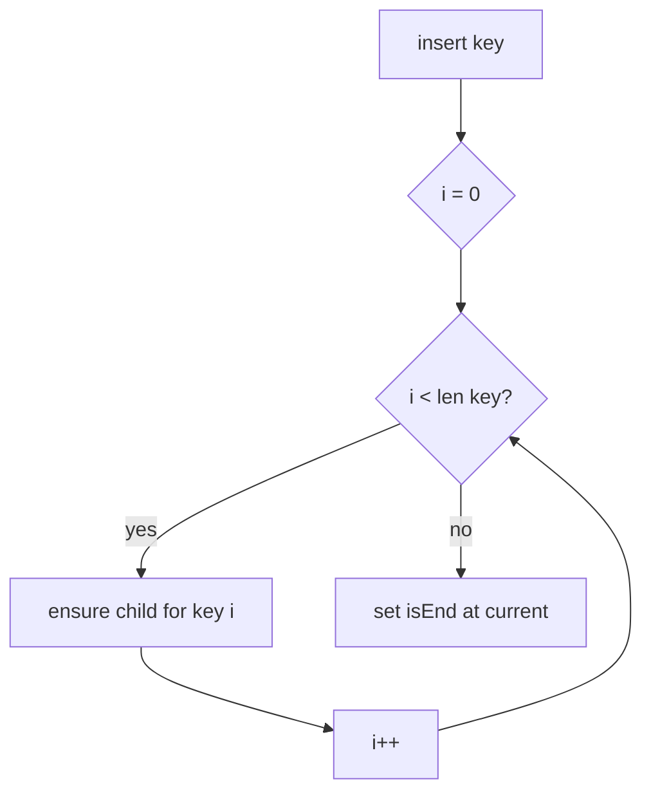
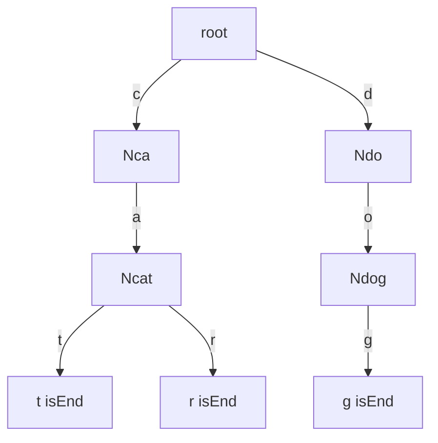
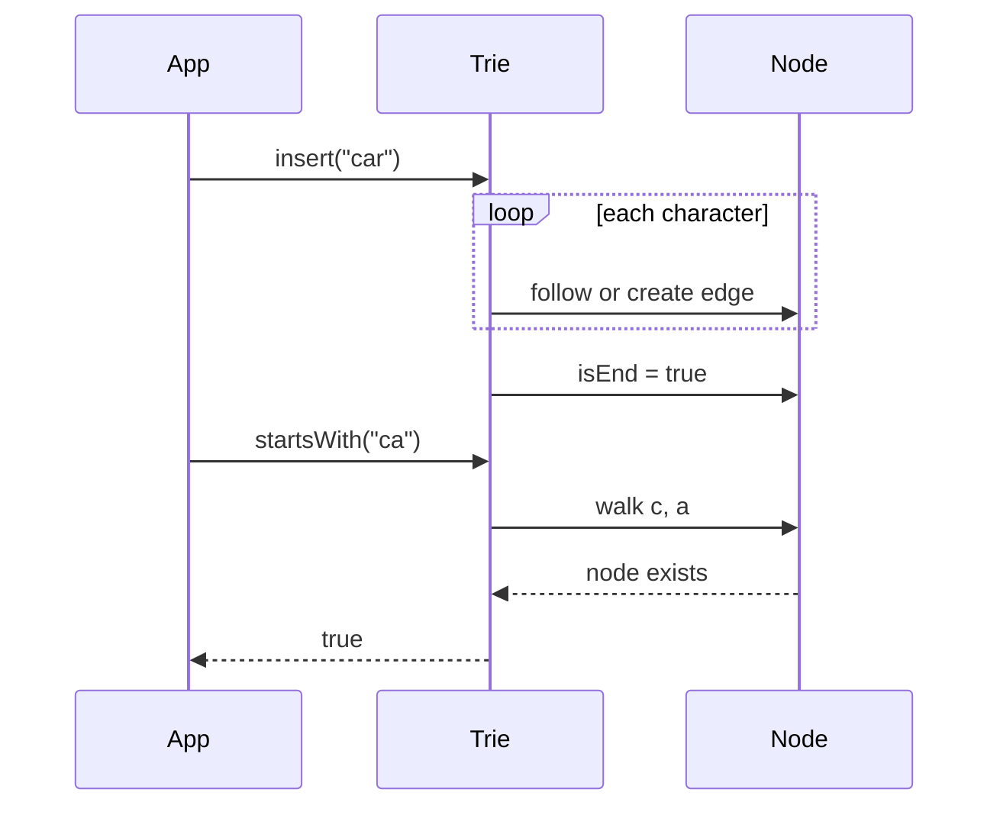

# Tries

## Overview

A **trie** (prefix tree) stores a set of **strings** (or sequences over a fixed alphabet Σ) as a rooted tree where each edge is labeled with a character and each node represents a **prefix**. A node marked **terminal** (`isEnd`) indicates that the path from root to that node spells a complete key stored in the structure.

Unlike [[04-Data-Structures/05-Trees-and-Ordered-Maps/Binary Search Trees|BSTs]] keyed by total order, tries exploit **shared prefixes**: `"cat"` and `"car"` share the path `c → a`. Lookup walks one character at a time—O(L) in key length L, independent of how many keys n are stored (subject to alphabet size and memory).

Tries are the baseline for autocomplete, IP routing tables, spell-check dictionaries, and prefix-sensitive security rules (path normalization, URL blocklists).

## Learning Objectives

- Define trie ADT operations: insert, exact search, prefix search, delete
- State and verify trie invariants after mutations
- Choose child-indexing strategy: array vs hash map vs sorted map
- Analyze time and space as functions of n, L, and |Σ|
- Compare trie to hash map for string keys and to [[04-Data-Structures/07-Tries-and-Prefix-Structures/Compressed Tries and Radix Trees|compressed variants]] for sparse alphabets

## Prerequisites

- [[04-Data-Structures/05-Trees-and-Ordered-Maps/Tree Representation and Traversal Contracts|Tree Representation and Traversal Contracts]]
- [[04-Data-Structures/04-Hash-Tables-and-Sets/Hash Functions Avalanche and Equality Contracts|Hash Functions Avalanche and Equality Contracts]]

## Difficulty

`intermediate`

## Estimated Time

- Reading: 2 hours
- Exercises: 3 hours
- Mini project: 4 hours

## History

Tries were described by René de la Briandais (1959) and popularized by Fredkin (1960, name from **re**trieval). Early spell-checkers and telephony routing used trie-shaped decision trees. Modern systems compress tries ([[04-Data-Structures/07-Tries-and-Prefix-Structures/Compressed Tries and Radix Trees|radix trees]]) for memory but retain the prefix invariant.

## Problem It Solves

Hash maps give O(1) exact lookup on strings but **no efficient prefix queries** (`startsWith`, enumerate all keys with prefix `pre`). Sorted arrays or BSTs support order but prefix search still costs O(n) or O(log n + k) with extra structure. Tries make **prefix membership and enumeration** natural: descend while characters match, then DFS/BFS from the subtree (traversal algorithms live in [[05-Algorithms/README|Algorithms]]).

## Internal Implementation

### ADT

| Operation | Contract |
| --- | --- |
| `insert(key)` | Store key; idempotent if already present |
| `search(key)` | True iff key was inserted |
| `startsWith(prefix)` | True iff some stored key has prefix |
| `delete(key)` | Remove key; prune unused nodes |
| `keysWithPrefix(prefix)` | All stored keys extending prefix |

### Layout

Each node holds:

- `children`: map or array from next character → child node
- `isEnd`: boolean (or count for multiset)
- Optional `value` payload at terminal nodes

```
root
 └─ c ─ a ─ t (isEnd)
         └─ r (isEnd)
```

### Child indexing trade-off

| Strategy | Pros | Cons |
| --- | --- | --- |
| Fixed array size \|Σ\| | O(1) child access | Wastes memory if \|Σ\| large (Unicode) |
| Hash map per node | Sparse alphabets | Pointer overhead per node |
| Compressed edges | Fewer nodes | See radix note |

### Delete

Walk to terminal node, clear `isEnd`. If node has no children and is not root, unlink and recurse upward pruning dead branches—preserves prefix sharing for remaining keys.



## Invariants

- **I1 (Prefix path)**: For every stored key `s`, there exists a unique path from root following edges labeled `s[0], s[1], …, s[|s|-1]` ending at a node with `isEnd = true`.
- **I2 (Terminal iff member)**: `isEnd` at node `v` is true iff the string spelled by the path to `v` is in the set (or count > 0 for multiset).
- **I3 (No orphan labels)**: Every non-root node has a parent edge labeled with exactly one character; labels on sibling edges differ.
- **I4 (Acyclic)**: Trie is a tree (single parent per node)—no back-edges.
- **I5 (Post-delete)**: After delete, no node except root exists unless it is on a path to some terminal or is terminal.

## Operation Complexity

Let L = key length, P = prefix length, k = number of keys returned, |Σ| = alphabet size, n = number of keys.

| Operation | Time | Space extra | Notes |
| --- | --- | --- | --- |
| `insert` | O(L · f(\|Σ\|)) | O(L) nodes worst case | f = child lookup cost |
| `search` | O(L · f(\|Σ\|)) | O(1) | Array child: f = O(1) |
| `startsWith` | O(P · f(\|Σ\|)) | O(1) | Stop early on mismatch |
| `delete` | O(L · f(\|Σ\|)) | O(1) | Plus prune walk |
| `keysWithPrefix` | O(P + total chars in subtree) | O(k) output | DFS from prefix node |

**Space**: O(total characters stored) with sharing; worst case O(n · L) if no shared prefixes. Array children: O(nodes · |Σ|) memory.

## Mermaid Diagrams

### Structure: shared prefixes



### Sequence: insert then prefix query



## Examples

### Minimal Example

**TypeScript**:

```typescript
type TrieNode = {
  children: Map<string, TrieNode>;
  isEnd: boolean;
};

export class Trie {
  private root: TrieNode = { children: new Map(), isEnd: false };

  insert(word: string): void {
    let cur = this.root;
    for (const ch of word) {
      let next = cur.children.get(ch);
      if (!next) {
        next = { children: new Map(), isEnd: false };
        cur.children.set(ch, next);
      }
      cur = next;
    }
    cur.isEnd = true;
  }

  search(word: string): boolean {
    const node = this._walk(word);
    return node?.isEnd ?? false;
  }

  startsWith(prefix: string): boolean {
    return this._walk(prefix) !== null;
  }

  private _walk(s: string): TrieNode | null {
    let cur: TrieNode | null = this.root;
    for (const ch of s) {
      if (!cur) return null;
      cur = cur.children.get(ch) ?? null;
    }
    return cur;
  }
}
```

**Python**:

```python
from dataclasses import dataclass, field
from typing import Dict, Optional

@dataclass
class TrieNode:
    children: Dict[str, "TrieNode"] = field(default_factory=dict)
    is_end: bool = False

class Trie:
    def __init__(self) -> None:
        self._root = TrieNode()

    def insert(self, word: str) -> None:
        cur = self._root
        for ch in word:
            if ch not in cur.children:
                cur.children[ch] = TrieNode()
            cur = cur.children[ch]
        cur.is_end = True

    def search(self, word: str) -> bool:
        node = self._walk(word)
        return node is not None and node.is_end

    def starts_with(self, prefix: str) -> bool:
        return self._walk(prefix) is not None

    def _walk(self, s: str) -> Optional[TrieNode]:
        cur: Optional[TrieNode] = self._root
        for ch in s:
            if cur is None:
                return None
            cur = cur.children.get(ch)
        return cur
```

### Production-Shaped Example

Autocomplete service: trie in memory with **map children**, terminal nodes store popularity score; cap prefix enumeration and instrument depth:

```typescript
class AutocompleteTrie {
  insert(term: string, score: number): void {
    // ... standard insert; store max score at terminal
  }

  topK(prefix: string, k: number): string[] {
    const node = this._walk(prefix);
    if (!node) return [];
    // Collect terminals via heap — algorithm in 05-Algorithms
    return this.collectTop(node, k);
  }
}
```

Use **byte-level** or **normalized Unicode** keys consistently; NFC vs NFD changes trie shape. For large |Σ|, prefer [[04-Data-Structures/07-Tries-and-Prefix-Structures/Ternary Search Trees Concepts|TST]] or radix compression.

## Trade-offs

| Dimension | Upside | Downside | When it matters |
| --- | --- | --- | --- |
| vs hash map | Prefix queries, shared storage | Higher constant factors, node overhead | Autocomplete, routing |
| vs BST on strings | O(L) not O(L log n) compare | Many nodes for long keys | Long shared prefixes |
| Array children | Fast index | \|Σ\| memory per node | Fixed small alphabet (a-z) |
| Map children | Sparse labels | Hash per level | Unicode, URLs |

### When to Use

- Prefix search, autocomplete, longest-prefix match
- Dictionaries with heavy prefix overlap
- IP/CIDR tables (often compressed)

### When Not to Use

- Exact-only string lookup with no prefix needs—hash map simpler
- Very large alphabet and few keys—memory explodes without compression

## Exercises

1. Implement full `delete` with upward pruning; verify I1–I5.
2. Count total nodes vs total characters for a corpus of English words.
3. Implement `keysWithPrefix` without string concatenation allocation churn.
4. Compare trie vs `Map` for 100k random 32-char hex strings (no sharing).
5. Build trie over bytes vs UTF-16 code units—measure size difference on emoji-heavy input.

## Mini Project

Dual-language trie with insert/search/delete/prefix list in [[04-Data-Structures/code/README|code labs]]; shared JSON word lists.

## Portfolio Project

[[04-Data-Structures/projects/Structures Workbench/README|Structures Workbench]] — autocomplete panel backed by trie with metrics on node count and prefix latency.

## Interview Questions

1. Why is trie lookup O(L) not O(n)?
2. How does a trie support `startsWith` efficiently?
3. Memory cost of array-based children for lowercase a–z?
4. How do you delete a key without breaking shared prefixes?
5. Trie vs hash table for a static dictionary?

### Stretch / Staff-Level

1. Design a thread-safe trie for read-heavy autocomplete with copy-on-write snapshots.
2. When would you replace a trie with a [[04-Data-Structures/07-Tries-and-Prefix-Structures/Compressed Tries and Radix Trees|radix tree]] in production?

## Common Mistakes

- Storing full string at every node (defeats prefix sharing)
- Treating `startsWith` hit on non-terminal as full key membership
- Using raw Unicode code points without normalization policy
- Forgetting to prune after delete leaving dead chains

## Best Practices

- Document alphabet and normalization (NFC, lowercase, punycode)
- Use compressed tries when node count dominates memory
- Assert invariants in debug: terminal count equals set size
- Cap prefix enumeration in APIs to prevent DoS via deep DFS

## Summary

A trie is a tree of prefixes: edges are characters, terminals mark complete keys. It trades node overhead for O(L) exact and prefix operations and natural prefix enumeration. Child-indexing strategy and compression determine whether tries are production-viable for your alphabet and workload; hash maps win on exact-only lookups, compressed variants win on sparse long keys.

## Further Reading

- [[00-References/Data Structures/README|Data Structures References]]
- Fredkin — trie origin
- Unicode normalization — key design for internationalized tries

## Related Notes

- [[04-Data-Structures/07-Tries-and-Prefix-Structures/Compressed Tries and Radix Trees|Compressed Tries and Radix Trees]]
- [[04-Data-Structures/07-Tries-and-Prefix-Structures/Ternary Search Trees Concepts|Ternary Search Trees Concepts]]
- [[04-Data-Structures/05-Trees-and-Ordered-Maps/Tree Representation and Traversal Contracts|Tree Representation and Traversal Contracts]]
- [[04-Data-Structures/04-Hash-Tables-and-Sets/Separate Chaining|Separate Chaining]]
- [[05-Algorithms/07-Graph-Traversal-and-DAGs/DFS|DFS]] / [[05-Algorithms/07-Graph-Traversal-and-DAGs/BFS|BFS]] for enumerating prefix subtrees

## Progress Checklist

- [ ] Explained from first principles
- [ ] Drew at least one Mermaid diagram
- [ ] Implemented a minimal version
- [ ] Documented trade-offs and non-goals
- [ ] Completed exercises
- [ ] Practiced interview questions aloud
- [ ] Linked prerequisites and dependents
