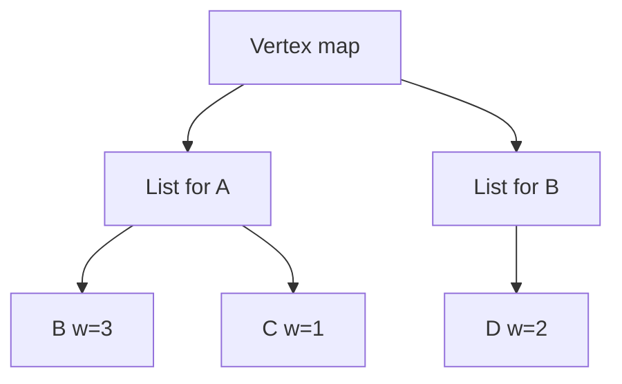
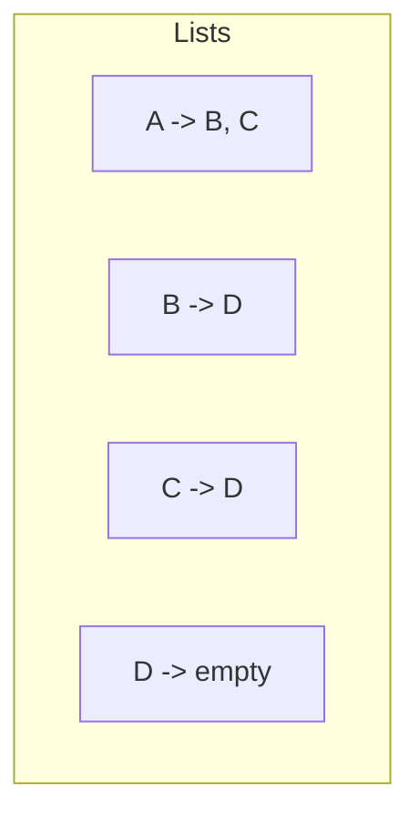
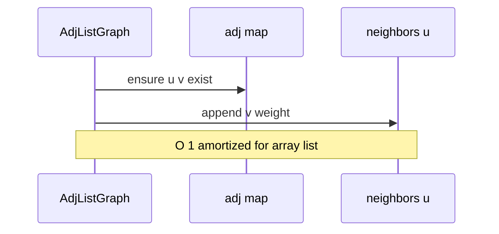

# Adjacency Lists

## Overview

An **adjacency list** stores, for each vertex u, a collection of **out-neighbors** (and optionally edge weights/metadata). The graph is a map from vertex → neighbor list. Space is **O(|V| + |E|)**—ideal for **sparse** graphs where |E| ≪ |V|².

Adjacency lists are the default in-memory representation for social graphs, web crawls, package dependencies, and most algorithm textbooks' BFS/DFS implementations ([[05-Algorithms/07-Graph-Traversal-and-DAGs/BFS|BFS]], [[05-Algorithms/07-Graph-Traversal-and-DAGs/DFS|DFS]]). Neighbor iteration is **O(degree(u))** with excellent cache behavior when lists are contiguous arrays.

## Learning Objectives

- Implement adjacency list with array-of-vectors and hash-map-of-vectors layouts
- Analyze neighbor iteration vs edge lookup costs
- Support directed, undirected, and weighted edges
- Maintain graph invariants under vertex/edge deletion
- Choose list backing ([[04-Data-Structures/02-Linked-Structures/Singly Linked Lists|linked list]] vs [[04-Data-Structures/01-Contiguous-Sequences/Dynamic Arrays and Amortized Growth|dynamic array]])

## Prerequisites

- [[04-Data-Structures/08-Graphs-as-Representation/Graph ADT Vertices Edges and Labels|Graph ADT Vertices Edges and Labels]]
- [[04-Data-Structures/02-Linked-Structures/Singly Linked Lists|Singly Linked Lists]]
- [[04-Data-Structures/01-Contiguous-Sequences/Dynamic Arrays and Amortized Growth|Dynamic Arrays and Amortized Growth]]

## Difficulty

`intermediate`

## Estimated Time

- Reading: 2 hours
- Exercises: 3 hours
- Mini project: 4 hours

## History

Adjacency lists mirror how humans draw graphs—each node with lines to friends. Fortran and early graph libraries used linked lists per vertex; modern systems prefer `vector<Edge>` for locality (NetworkX, Boost.Graph, Neo4j internal formats hybridize).

## Problem It Solves

[[04-Data-Structures/08-Graphs-as-Representation/Adjacency Matrices and Edge Lists|Adjacency matrices]] waste O(|V|²) space when graphs are sparse. Edge lists alone make neighbor queries O(|E|). Adjacency lists optimize the **hot path**—enumerate neighbors—for the sparse case dominating real networks.

## Internal Implementation

### Layout A: indexable vertices 0..|V|-1

```
adj: Array<List<(v, weight)>>
vertex i -> list of outgoing edges
```

Fast when vertex set is dense integers; remapping needed if IDs are strings.

### Layout B: hash map keyed by vertex id

```
Map<VertexId, List<Neighbor>>
```

Flexible external IDs; pointer overhead per vertex.

### Undirected graph

On `addEdge(u,v)`, insert `(v,w)` into u's list and `(u,w)` into v's list—or store once with canonical order and document query semantics (violates naive neighbor unless both added).

### Weighted edge record

```typescript
type Edge = { to: string; weight: number };
```



## Invariants

- **I1**: For each stored directed edge u→v with weight w, v appears in `adj[u]` with weight w.
- **I2 (Undirected)**: If undirected, u appears in `adj[v]` iff v appears in `adj[u]` (symmetric storage).
- **I3**: Sum of list lengths equals |E| (directed) or 2|E| (undirected duplicate storage).
- **I4**: No neighbor entry references a vertex not in the vertex set (after `addEdge` auto-create policy).
- **I5**: After `removeVertex(v)`, v absent from map and all neighbor lists.

## Operation Complexity

| Operation | Time | Notes |
| --- | --- | --- |
| `addEdge(u,v)` | O(1) amortized | Append to u's list |
| `removeEdge(u,v)` | O(deg(u)) | Scan list unless hash index |
| `hasEdge(u,v)` | O(deg(u)) | Linear scan |
| `neighbors(u)` | O(deg(u)) | Iterate list |
| `addVertex` | O(1) | Create empty list |
| `removeVertex` | O(|V| + |E|) naive | Scan all lists |
| Space | O(\|V\| + \|E\|) | Plus vertex id storage |

Use **adjacent edge hash** or sorted vectors + binary search if `hasEdge` must be O(log deg) or O(1).

## Mermaid Diagrams

### Structure: adjacency lists for small directed graph



### Sequence: addEdge append



## Examples

### Minimal Example

**TypeScript**:

```typescript
type WEdge = { to: string; w: number };

export class AdjacencyList {
  private adj = new Map<string, WEdge[]>();

  addVertex(v: string): void {
    if (!this.adj.has(v)) this.adj.set(v, []);
  }

  addEdge(u: string, v: string, w = 1): void {
    this.addVertex(u);
    this.addVertex(v);
    this.adj.get(u)!.push({ to: v, w });
  }

  neighbors(u: string): Iterable<WEdge> {
    return this.adj.get(u) ?? [];
  }

  removeEdge(u: string, v: string): boolean {
    const list = this.adj.get(u);
    if (!list) return false;
    const i = list.findIndex((e) => e.to === v);
    if (i === -1) return false;
    list.splice(i, 1);
    return true;
  }
}
```

**Python**:

```python
from dataclasses import dataclass
from typing import DefaultDict, Dict, Iterable, List, Tuple

@dataclass
class WEdge:
    to: str
    w: float

class AdjacencyList:
    def __init__(self) -> None:
        self._adj: Dict[str, List[WEdge]] = {}

    def add_vertex(self, v: str) -> None:
        self._adj.setdefault(v, [])

    def add_edge(self, u: str, v: str, w: float = 1.0) -> None:
        self.add_vertex(u)
        self.add_vertex(v)
        self._adj[u].append(WEdge(v, w))

    def neighbors(self, u: str) -> Iterable[WEdge]:
        return tuple(self._adj.get(u, ()))

    def remove_edge(self, u: str, v: str) -> bool:
        lst = self._adj.get(u)
        if not lst:
            return False
        for i, e in enumerate(lst):
            if e.to == v:
                lst.pop(i)
                return True
        return False
```

### Production-Shaped Example

Build adjacency from streaming edge log; dedupe with `Set` per vertex during ingest; switch to sorted `Array` for merge in graph analytics. Track **max degree** metric—power-law graphs need memory caps per vertex.

```typescript
function buildFromEdges(edges: Array<[string, string, number]>): AdjacencyList {
  const g = new AdjacencyList();
  for (const [u, v, w] of edges) g.addEdge(u, v, w);
  return g;
}
```

## Trade-offs

| Dimension | Upside | Downside | When it matters |
| --- | --- | --- | --- |
| vs matrix | O(\|V\|+\|E\|) space | Slow hasEdge | Sparse web graphs |
| Array vs linked list neighbors | Cache-friendly iteration | O(n) delete in array | BFS-heavy workloads |
| Integer vs string keys | Compact index | ID mapping layer | External stable IDs |
| Duplicate neighbor entries | Rare in simple graphs | Must forbid or count | Multigraph |

### When to Use

- Sparse graphs; neighbor iteration dominates
- In-memory graph algorithms (hand off traversal to Algorithms)
- Dynamic edge insertion with unknown |V|

### When Not to Use

- Dense graphs (|E| ≈ |V|²)—matrix may win on `hasEdge`
- Need O(1) edge lookup at huge degree—auxiliary hash per vertex

## Exercises

1. Implement undirected `addEdge` with symmetric lists.
2. Implement `removeVertex` in O(|V| + |E|) and discuss indexing shortcuts.
3. Benchmark neighbor iteration: linked list vs dynamic array backing.
4. Build adjacency list from CSV edge file; validate I1–I3.
5. Add sorted neighbor array + binary search for `hasEdge`.

## Mini Project

[[04-Data-Structures/projects/Graph Store CLI/README|Graph Store CLI]] — adjacency list backend with import/export.

## Portfolio Project

Graph Store CLI comparing list vs matrix build time on SNAP dataset sample.

## Interview Questions

1. Space complexity adjacency list vs matrix?
2. Time to check edge (u,v) in adjacency list?
3. Why default for sparse graphs?
4. How store undirected graph in adjacency list?
5. What does BFS need from the representation?

### Stretch / Staff-Level

1. Design adjacency list supporting concurrent edge inserts with per-vertex locks.
2. Compress neighbor lists for skewed degree (delta encoding)—when worth it?

## Common Mistakes

- Only storing one direction for undirected graph without documenting it
- O(|E|) `removeVertex` forgotten—stale edges remain
- Using `Array.splice` in hot removeEdge without considering swap-with-last
- Integer vertex IDs not compact after deletes—hole management

## Best Practices

- Expose `neighbors(u)` as iterator, not internal array reference
- Document multigraph and self-loop policy
- Pre-size neighbor vectors when degree distribution known
- Pair with [[04-Data-Structures/08-Graphs-as-Representation/Graph Storage Trade-offs and Dynamic Updates|trade-offs note]] for production choice

## Summary

Adjacency lists map each vertex to its outgoing edges, giving O(|V| + |E|) space and O(degree) neighbor iteration—the right shape for sparse graphs and algorithm hot paths. Edge lookup and deletion cost scale with degree unless augmented. They implement the [[04-Data-Structures/08-Graphs-as-Representation/Graph ADT Vertices Edges and Labels|Graph ADT]] for most in-memory workloads before handing traversals to [[05-Algorithms/README|Algorithms]].

## Further Reading

- [[00-References/Data Structures/README|Data Structures References]]
- SNAP graph datasets — sparse edge list inputs
- [[04-Data-Structures/02-Linked-Structures/Linked vs Contiguous Trade-offs|Linked vs Contiguous Trade-offs]]

## Related Notes

- [[04-Data-Structures/08-Graphs-as-Representation/Graph ADT Vertices Edges and Labels|Graph ADT Vertices Edges and Labels]]
- [[04-Data-Structures/08-Graphs-as-Representation/Adjacency Matrices and Edge Lists|Adjacency Matrices and Edge Lists]]
- [[04-Data-Structures/08-Graphs-as-Representation/Graph Storage Trade-offs and Dynamic Updates|Graph Storage Trade-offs and Dynamic Updates]]
- [[04-Data-Structures/06-Heaps-and-Priority-Queues/Decrease-Key and Indexed Heaps|Decrease-Key and Indexed Heaps]]
- [[05-Algorithms/README|Algorithms]]

## Progress Checklist

- [ ] Explained from first principles
- [ ] Drew at least one Mermaid diagram
- [ ] Implemented a minimal version
- [ ] Documented trade-offs and non-goals
- [ ] Completed exercises
- [ ] Practiced interview questions aloud
- [ ] Linked prerequisites and dependents
