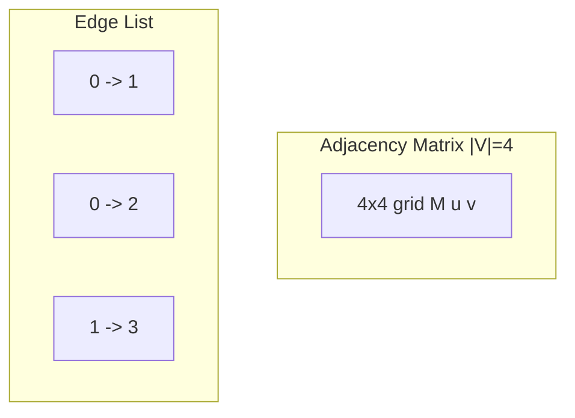
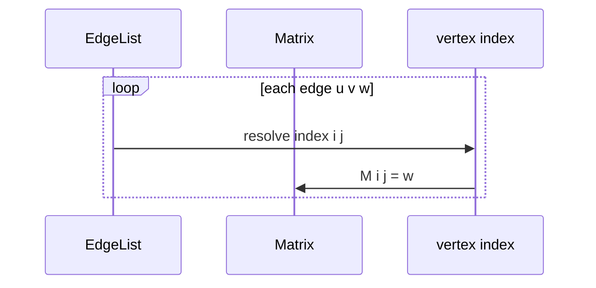

# Adjacency Matrices and Edge Lists

## Overview

Two complementary graph layouts:

1. **Adjacency matrix** — a |V| × |V| table `M` where `M[u][v]` stores edge weight or a boolean presence bit. **O(1)** edge lookup; **O(|V|²)** space.
2. **Edge list** — an array of records `(u, v, w?)` length |E|. Minimal space **O(|E|)** but **O(|E|)** neighbor queries unless combined with an index.

Matrices suit **dense** or small |V| graphs and Floyd–Warshall-style all-pairs algorithms ([[05-Algorithms/README|Algorithms]]). Edge lists suit **bulk ingest**, GPU/CSR conversion pipelines, and serial I/O. Production systems often convert edge lists → [[04-Data-Structures/08-Graphs-as-Representation/Adjacency Lists|adjacency lists]] or **CSR** (compressed sparse row) for computation.

## Learning Objectives

- Implement adjacency matrix with boolean and weighted variants
- Implement edge list with append-only and indexed builds
- Compare `hasEdge`, neighbor iteration, and space across matrix vs list vs edge list
- Use bitsets to compress boolean matrices
- Understand CSR as hybrid of edge list + prefix array (concept bridge)

## Prerequisites

- [[04-Data-Structures/08-Graphs-as-Representation/Graph ADT Vertices Edges and Labels|Graph ADT Vertices Edges and Labels]]
- [[04-Data-Structures/01-Contiguous-Sequences/Multidimensional Arrays and Strides|Multidimensional Arrays and Strides]]
- [[04-Data-Structures/01-Contiguous-Sequences/Bitsets and Compact Boolean Arrays|Bitsets and Compact Boolean Arrays]]

## Difficulty

`intermediate`

## Estimated Time

- Reading: 2 hours
- Exercises: 3 hours
- Mini project: 4 hours

## History

Adjacency matrices are the textbook default for dense graph theory. Edge lists mirror relational **fact tables** (from, to, weight). Scientific computing popularized CSR/CSC formats for sparse linear algebra on graphs (PageRank, etc.).

## Problem It Solves

When |E| approaches |V|², storing lists per vertex duplicates indexing overhead— a flat matrix simplifies **edge existence** checks. When edges arrive as log streams or CSV rows, **edge lists** are the natural ingest format before building faster indices.

## Internal Implementation

### Adjacency matrix (weighted)

```
M: number[][]
M[u][v] = weight or Infinity if absent
```

Vertices must map to **0..|V|-1**. Use `Infinity` or sentinel for absent edges in weighted algorithms.

### Boolean matrix + bitset

For unweighted dense graphs, pack row u as a [[04-Data-Structures/01-Contiguous-Sequences/Bitsets and Compact Boolean Arrays|bitset]] of length |V|—cuts memory 8× vs boolean[][].

### Edge list (COO)

```
edges: Array<{u: number, v: number, w: number}>
```

Build phase: sort edges by u, compute row offsets → CSR for O(degree) neighbors.


## Invariants

- **I1 (Matrix indexing)**: Vertex id maps to index i ∈ [0, |V|); M[i][j] reflects edge i→j only if both endpoints active.
- **I2 (Matrix edge count)**: For unweighted simple graph, count of true entries equals |E| (directed) or 2|E| if symmetric duplicate.
- **I3 (Edge list completeness)**: Every record (u,v) corresponds to an edge in the abstract graph; no invalid indices.
- **I4 (Weight sentinel)**: Absent edges use consistent sentinel (0, Infinity, null) documented for algorithms.
- **I5 (Undirected matrix)**: If undirected, M[u][v] = M[v][u] after mutations.

## Operation Complexity

| Operation | Adj matrix | Edge list | Notes |
| --- | --- | --- | --- |
| `hasEdge(u,v)` | O(1) | O(\|E\|) | Matrix wins |
| `addEdge` | O(1) | O(1) append | Matrix fixed size |
| `removeEdge` | O(1) | O(\|E\|) | List scan |
| `neighbors(u)` | O(\|V\|) | O(\|E\|) | Both slow alone |
| Space | O(\|V\|²) | O(\|E\|) | CSR: O(\|V\|+\|E\|) |
| Build from edges | O(\|E\|) fill | O(1) ingest | Matrix needs dimension |

## Mermaid Diagrams

### Structure: matrix vs edge list



### Sequence: build matrix from edge list



## Examples

### Minimal Example

**TypeScript**:

```typescript
export class AdjacencyMatrix {
  private M: number[][];
  constructor(private n: number, private absent = Infinity) {
    this.M = Array.from({ length: n }, () => Array(n).fill(absent));
  }

  addEdge(u: number, v: number, w = 1): void {
    this.M[u][v] = w;
  }

  hasEdge(u: number, v: number): boolean {
    return this.M[u][v] !== this.absent;
  }

  weight(u: number, v: number): number {
    return this.M[u][v];
  }

  neighbors(u: number): number[] {
    const out: number[] = [];
    for (let v = 0; v < this.n; v++) if (this.hasEdge(u, v)) out.push(v);
    return out;
  }
}

export type CooEdge = { u: number; v: number; w: number };

export class EdgeList {
  edges: CooEdge[] = [];

  addEdge(u: number, v: number, w = 1): void {
    this.edges.push({ u, v, w });
  }
}
```

**Python**:

```python
from dataclasses import dataclass
from typing import List, Optional

class AdjacencyMatrix:
    def __init__(self, n: int, absent: float = float("inf")) -> None:
        self.n = n
        self.absent = absent
        self._m = [[absent] * n for _ in range(n)]

    def add_edge(self, u: int, v: int, w: float = 1.0) -> None:
        self._m[u][v] = w

    def has_edge(self, u: int, v: int) -> bool:
        return self._m[u][v] != self.absent

    def neighbors(self, u: int) -> List[int]:
        return [v for v in range(self.n) if self.has_edge(u, v)]

@dataclass
class CooEdge:
    u: int
    v: int
    w: float = 1.0

class EdgeList:
    def __init__(self) -> None:
        self.edges: List[CooEdge] = []

    def add_edge(self, u: int, v: int, w: float = 1.0) -> None:
        self.edges.append(CooEdge(u, v, w))
```

### Production-Shaped Example

ETL pipeline: append edges to **Parquet edge list**; nightly job builds CSR in memory for analytics. Keep matrix for |V| < 512 service mesh full-mesh latency tables.

```typescript
function buildMatrixFromCoo(edges: CooEdge[], n: number): AdjacencyMatrix {
  const m = new AdjacencyMatrix(n);
  for (const { u, v, w } of edges) m.addEdge(u, v, w);
  return m;
}
```

## Trade-offs

| Dimension | Upside | Downside | When it matters |
| --- | --- | --- | --- |
| Matrix | O(1) edge test | O(\|V\|²) space | Dense small n |
| Edge list | Stream-friendly | Slow queries alone | Ingest, logs |
| Bitset matrix | Compact unweighted | Still O(\|V\|²) bits | Small dense |
| CSR build | Fast neighbor scan | Build cost | One-shot analytics |

### When to Use

- Matrix: |V| ≤ few thousand and dense, or all-pairs DP
- Edge list: logging, distributed storage, initial load
- Bitset row: unweighted dense local subgraph

### When Not to Use

- Matrix for million-vertex sparse web graph—memory impossible
- Edge list alone for interactive neighbor-heavy API

## Exercises

1. Convert edge list to adjacency matrix and validate I1–I3.
2. Implement CSR build from sorted COO; benchmark `neighbors`.
3. Memory estimate: |V|=10⁴, |E|=10⁵ — matrix vs list vs CSR.
4. Store undirected graph in matrix with symmetric updates.
5. Use bitset for |V|=1024 unweighted graph; measure RAM vs `boolean[][]`.

## Mini Project

Graph Store CLI import: CSV → edge list → optional matrix if n small.

## Portfolio Project

[[04-Data-Structures/projects/Graph Store CLI/README|Graph Store CLI]] — COO export and CSR builder.

## Interview Questions

1. Space adjacency matrix for n vertices?
2. Time to list all neighbors with adjacency matrix?
3. When prefer edge list over adjacency list?
4. What is COO vs CSR?
5. How handle absent edge weights in matrix?

### Stretch / Staff-Level

1. Design blocked bitset matrix for cache-friendly dense subgraph ops.
2. When would GPU graph libraries prefer COO over CSR during mutation?

## Common Mistakes

- Using 0 as absent weight when 0 is valid edge weight
- Forgetting to remap vertex IDs to 0..n-1 contiguous range
- Iterating full matrix row in production on sparse graph—use list instead
- Edge list duplicate edges inflating |E| without policy

## Best Practices

- Document sentinel for absent edges
- Build indexed representation once for read-heavy phase
- Validate vertex index bounds on COO ingest
- Use [[04-Data-Structures/08-Graphs-as-Representation/Graph Storage Trade-offs and Dynamic Updates|trade-offs note]] before picking matrix in prod

## Summary

Adjacency matrices trade O(|V|²) space for O(1) edge tests; edge lists trade query speed for minimal streaming storage. Real pipelines ingest COO, then compile to adjacency lists or CSR for neighbor-heavy algorithms such as [[05-Algorithms/08-Shortest-Paths/Floyd-Warshall and All-Pairs Trade-offs|Floyd-Warshall]]. Pick matrix only when density or small |V| justifies the square table.

## Further Reading

- [[00-References/Data Structures/README|Data Structures References]]
- SciPy sparse matrix formats (CSR/CSC)
- [[04-Data-Structures/01-Contiguous-Sequences/Multidimensional Arrays and Strides|Multidimensional Arrays and Strides]]

## Related Notes

- [[04-Data-Structures/08-Graphs-as-Representation/Adjacency Lists|Adjacency Lists]]
- [[04-Data-Structures/08-Graphs-as-Representation/Graph Storage Trade-offs and Dynamic Updates|Graph Storage Trade-offs and Dynamic Updates]]
- [[04-Data-Structures/01-Contiguous-Sequences/Bitsets and Compact Boolean Arrays|Bitsets and Compact Boolean Arrays]]
- [[05-Algorithms/README|Algorithms]]

## Progress Checklist

- [ ] Explained from first principles
- [ ] Drew at least one Mermaid diagram
- [ ] Implemented a minimal version
- [ ] Documented trade-offs and non-goals
- [ ] Completed exercises
- [ ] Practiced interview questions aloud
- [ ] Linked prerequisites and dependents
