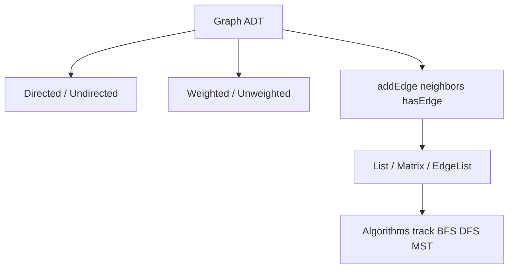
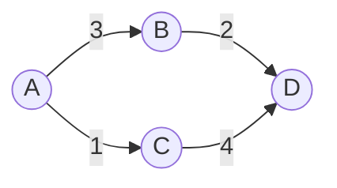
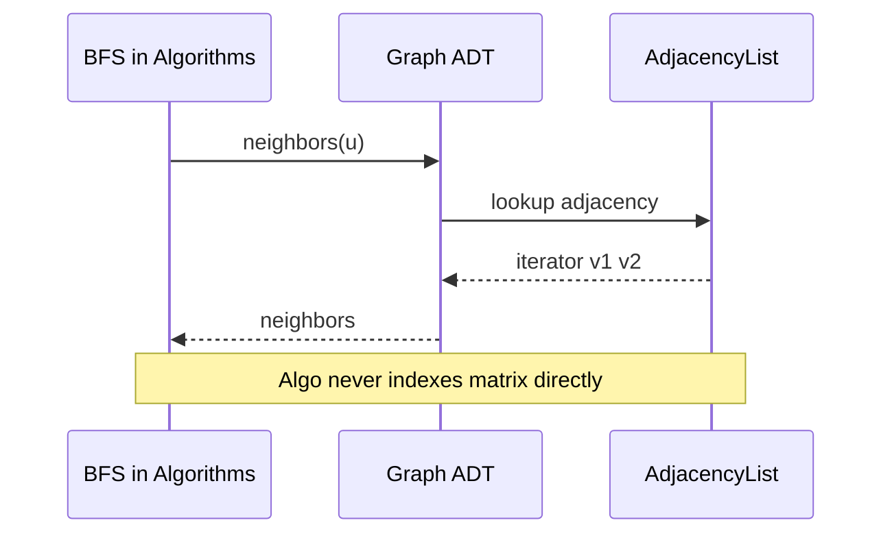

# Graph ADT Vertices Edges and Labels

## Overview

A **graph** G = (V, E) consists of a set of **vertices** (nodes) V and **edges** E connecting pairs of vertices. Unlike a [[04-Data-Structures/05-Trees-and-Ordered-Maps/Tree Representation and Traversal Contracts|tree]], graphs may contain **cycles**, multiple paths between vertices, and optional **edge/vertex labels** (weight, capacity, metadata).

This track treats graphs as **representation problems**: how to store V and E so that neighbor queries, edge insertion, and memory layout match workload constraints. **Traversal, shortest paths, MST, and flow algorithms** belong to [[05-Algorithms/07-Graph-Traversal-and-DAGs/BFS|BFS]]/[[05-Algorithms/07-Graph-Traversal-and-DAGs/DFS|DFS]], [[05-Algorithms/08-Shortest-Paths/Shortest-Path Contracts and Relaxation|shortest paths]], [[05-Algorithms/09-MST-and-Connectivity/Minimum Spanning Tree Contracts and Cut Property|MST]], and [[05-Algorithms/10-Advanced-Graph-Algorithms/Maximum Flow and Residual Networks|flow]]—here we define the ADT contracts those algorithms assume.

## Learning Objectives

- Define directed vs undirected, simple vs multigraph, weighted vs unweighted ADTs
- Specify core operations: add/remove vertex/edge, neighbors, degree, edge lookup
- Map real systems (social graphs, dependencies, networks) to graph ADT choices
- State graph invariants independent of adjacency list/matrix layout
- Hand off algorithm notes with explicit representation assumptions

## Prerequisites

- [[04-Data-Structures/00-Orientation-and-Contracts/Abstract Data Types vs Concrete Structures|Abstract Data Types vs Concrete Structures]]
- [[04-Data-Structures/05-Trees-and-Ordered-Maps/Tree Representation and Traversal Contracts|Tree Representation and Traversal Contracts]]

## Difficulty

`intermediate`

## Estimated Time

- Reading: 2 hours
- Exercises: 2 hours
- Mini project: 3 hours

## History

Graph theory originates in Euler's Königsberg bridges (1736). In computing, graphs model networks, compilers (CFGs), dependencies, and knowledge bases. Adjacency structures emerged as soon as sparse real-world graphs exceeded dense matrix feasibility.

## Problem It Solves

Many problems are naturally **relationship-centric**: "who follows whom," "which tasks block which," "latency between services." The graph ADT abstracts these as uniform vertex/edge operations so representations ([[04-Data-Structures/08-Graphs-as-Representation/Adjacency Lists|Adjacency Lists]], [[04-Data-Structures/08-Graphs-as-Representation/Adjacency Matrices and Edge Lists|Adjacency Matrices and Edge Lists]]) can be swapped without rewriting algorithm logic—provided the ADT contract is explicit.

## Internal Implementation

### ADT variants

| Variant | Edge | Notes |
| --- | --- | --- |
| Undirected | {u, v} unordered | Often store both directions in directed layout |
| Directed | (u → v) ordered | Neighbors asymmetric |
| Weighted | Edge + weight w | Distances, costs, capacities |
| Multigraph | Parallel edges allowed | Must key edges by id or (u,v,index) |
| Labeled vertex | v + payload | User id, service metadata |

### Core operations (representation-agnostic)

| Operation | Purpose |
| --- | --- |
| `addVertex(v)` | Insert isolated vertex |
| `removeVertex(v)` | Remove v and incident edges |
| `addEdge(u, v, w?)` | Connect vertices |
| `removeEdge(u, v)` | Delete edge |
| `hasEdge(u, v)` | Membership |
| `neighbors(u)` | Iterable adjacent vertices |
| `degree(u)` | Count incident edges (in/out in directed) |
| `vertexCount` / `edgeCount` | Size metrics |

Algorithms in [[05-Algorithms/README|Algorithms]] consume `neighbors` and sometimes `edgeWeight(u,v)`—not internal layout.



## Invariants

- **I1 (Endpoint validity)**: Every edge (u, v) satisfies u ∈ V and v ∈ V at time of storage.
- **I2 (Edge count consistency)**: `edgeCount` equals |E| under chosen multigraph policy (parallel edges counted separately or forbidden).
- **I3 (Undirected symmetry)**: If undirected and (u,v) stored, (v,u) is query-equivalent—implementation may duplicate or canonicalize.
- **I4 (Neighbor soundness)**: `neighbors(u)` returns exactly vertices v such that edge (u,v) exists per directed/undirected rules.
- **I5 (Removal closure)**: After `removeVertex(v)`, no stored edge references v.

## Operation Complexity

Complexity depends on representation—**contract-level** bounds:

| Operation | Requirement | Notes |
| --- | --- | --- |
| `neighbors(u)` | Must be iterable | Hot path for all graph algorithms |
| `addEdge` | Defined for all reps | May be O(1) or O(\|V\|) |
| `hasEdge` | Often needed | O(degree) vs O(1) trade-off |
| Space | O(\|V\| + \|E\|) typical | Dense matrix O(\|V\|²) |

See [[04-Data-Structures/08-Graphs-as-Representation/Graph Storage Trade-offs and Dynamic Updates|Graph Storage Trade-offs and Dynamic Updates]] for concrete tables.

## Mermaid Diagrams

### Structure: directed weighted graph



Vertices are entities; edge labels are weights (algorithm input).

### Sequence: algorithm consumes ADT only



## Examples

### Minimal Example

**TypeScript**:

```typescript
export interface Graph {
  addVertex(id: string): void;
  addEdge(u: string, v: string, weight?: number): void;
  removeEdge(u: string, v: string): void;
  neighbors(u: string): Iterable<string>;
  hasEdge(u: string, v: string): boolean;
  vertexCount(): number;
  edgeCount(): number;
}

export class AdjacencyListGraph implements Graph {
  private adj = new Map<string, Map<string, number>>();

  addVertex(id: string): void {
    if (!this.adj.has(id)) this.adj.set(id, new Map());
  }

  addEdge(u: string, v: string, weight = 1): void {
    this.addVertex(u);
    this.addVertex(v);
    this.adj.get(u)!.set(v, weight);
  }

  removeEdge(u: string, v: string): void {
    this.adj.get(u)?.delete(v);
  }

  neighbors(u: string): Iterable<string> {
    return this.adj.get(u)?.keys() ?? [];
  }

  hasEdge(u: string, v: string): boolean {
    return this.adj.get(u)?.has(v) ?? false;
  }

  vertexCount(): number {
    return this.adj.size;
  }

  edgeCount(): number {
    let n = 0;
    for (const m of this.adj.values()) n += m.size;
    return n;
  }
}
```

**Python**:

```python
from abc import ABC, abstractmethod
from typing import Dict, Iterable, Iterator, Optional

class Graph(ABC):
    @abstractmethod
    def add_vertex(self, vid: str) -> None: ...

    @abstractmethod
    def add_edge(self, u: str, v: str, weight: float = 1.0) -> None: ...

    @abstractmethod
    def neighbors(self, u: str) -> Iterable[str]: ...

    @abstractmethod
    def has_edge(self, u: str, v: str) -> bool: ...

class AdjacencyListGraph(Graph):
    def __init__(self) -> None:
        self._adj: Dict[str, Dict[str, float]] = {}

    def add_vertex(self, vid: str) -> None:
        self._adj.setdefault(vid, {})

    def add_edge(self, u: str, v: str, weight: float = 1.0) -> None:
        self.add_vertex(u)
        self.add_vertex(v)
        self._adj[u][v] = weight

    def neighbors(self, u: str) -> Iterable[str]:
        return self._adj.get(u, {}).keys()

    def has_edge(self, u: str, v: str) -> bool:
        return v in self._adj.get(u, {})
```

### Production-Shaped Example

Service dependency graph: vertices are service IDs; edges carry **p99 latency** and **error rate**. Store labels on edges; expose `neighbors` for impact analysis—traversal policy in observability pipelines references [[05-Algorithms/README|Algorithms]] for reachability, not this note.

```typescript
type EdgeMeta = { latencyMs: number; errorRate: number };

interface LabeledGraph extends Graph {
  addEdge(u: string, v: string, meta: EdgeMeta): void;
  edgeMeta(u: string, v: string): EdgeMeta | undefined;
}
```

## Trade-offs

| Dimension | Upside | Downside | When it matters |
| --- | --- | --- | --- |
| ADT abstraction | Swap representations | Interface design upfront | Large codebases |
| Directed model | Asymmetric deps | Must document reverse reach | Pipelines |
| Explicit multigraph | Models parallel links | Harder edge identity | Network fabrics |
| Vertex labels | Rich metadata | Memory per vertex | Service graphs |

### When to Use

- Any problem with pairwise relationships and nontrivial topology
- Before choosing adjacency list vs matrix
- API boundaries between storage and algorithms

### When Not to Use

- Pure hierarchical data—often a tree suffices
- Relational queries with joins—use database model ([[08-Databases/README|Databases]])

## Exercises

1. Formalize I3 for undirected graph stored as symmetric adjacency list.
2. Extend ADT for multigraph: how does `removeEdge(u,v)` disambiguate?
3. Model CI job DAG: vertices jobs, edges dependencies—directed or undirected?
4. Count memory for \|V\|=10k, \|E\|=50k under list vs matrix (estimate).
5. Write interface-only `Graph` in TS/Python; two implementations stubbed.

## Mini Project

[[04-Data-Structures/projects/Graph Store CLI/README|Graph Store CLI]] — define `Graph` ADT first; plug adjacency list backend.

## Portfolio Project

Graph Store CLI with ADT conformance tests shared across representations.

## Interview Questions

1. Difference graph vs tree ADT?
2. How do directed and undirected graphs differ in `neighbors`?
3. What operations must a graph ADT support for BFS?
4. Simple graph vs multigraph?
5. Why separate graph representation from BFS implementation?

### Stretch / Staff-Level

1. Design a versioned graph ADT for temporal edges (valid from/to timestamps).
2. How would you expose adjacency for both in-memory and streaming edge sources?

## Common Mistakes

- Mixing algorithm code with matrix indexing details
- Forgetting reverse edge on undirected add
- Using vertex index 0..n-1 without stable ID mapping when vertices delete
- Assuming `edgeCount` includes both directions when only one stored

## Best Practices

- Document directedness, multigraph policy, and self-loop policy
- Keep algorithms dependent on ADT interface only
- Use stable vertex IDs in production; remap indices internally
- Validate I1 on every `addEdge` in debug builds

## Summary

The graph ADT names vertices and edges and the operations algorithms need—neighbors, membership, mutation—without fixing storage. Directedness, weights, and multigraph policy are part of the contract. This track implements that contract with lists, matrices, and implicit generators; [[05-Algorithms/README|Algorithms]] runs on top once `neighbors` is trustworthy.

## Further Reading

- [[00-References/Data Structures/README|Data Structures References]]
- CLRS — graph representations chapter (algorithms handoff)
- [[04-Data-Structures/08-Graphs-as-Representation/Adjacency Lists|Adjacency Lists]]

## Related Notes

- [[04-Data-Structures/08-Graphs-as-Representation/Adjacency Lists|Adjacency Lists]]
- [[04-Data-Structures/08-Graphs-as-Representation/Adjacency Matrices and Edge Lists|Adjacency Matrices and Edge Lists]]
- [[04-Data-Structures/08-Graphs-as-Representation/Graph Storage Trade-offs and Dynamic Updates|Graph Storage Trade-offs and Dynamic Updates]]
- [[04-Data-Structures/08-Graphs-as-Representation/Implicit Graphs and On-the-Fly Neighbors|Implicit Graphs and On-the-Fly Neighbors]]
- [[04-Data-Structures/05-Trees-and-Ordered-Maps/Tree Representation and Traversal Contracts|Tree Representation and Traversal Contracts]]
- [[05-Algorithms/README|Algorithms]]

## Progress Checklist

- [ ] Explained from first principles
- [ ] Drew at least one Mermaid diagram
- [ ] Implemented a minimal version
- [ ] Documented trade-offs and non-goals
- [ ] Completed exercises
- [ ] Practiced interview questions aloud
- [ ] Linked prerequisites and dependents
