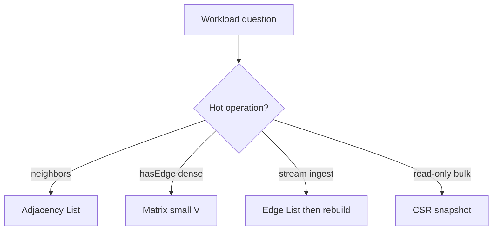
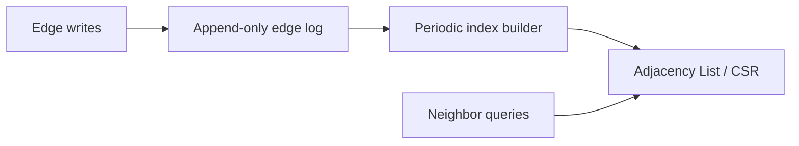
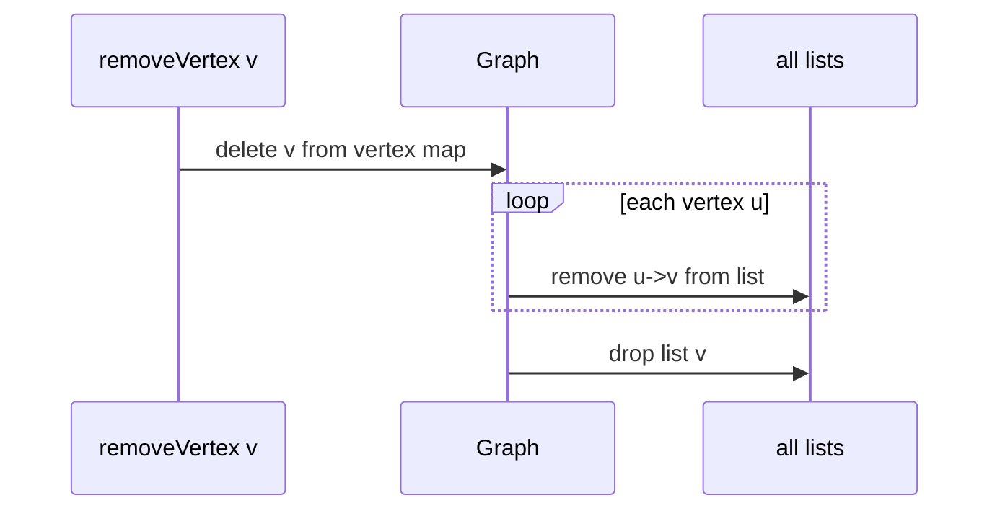

# Graph Storage Trade-offs and Dynamic Updates

## Overview

Choosing a graph representation is a **workload contract**: which operations dominate—neighbor scan, edge lookup, insertion, deletion, iteration over all edges, or serial rebuild? No single layout wins every column.

This note compares [[04-Data-Structures/08-Graphs-as-Representation/Adjacency Lists|adjacency lists]], [[04-Data-Structures/08-Graphs-as-Representation/Adjacency Matrices and Edge Lists|matrices and edge lists]], and hybrid indices under **dynamic updates** (online edge/vertex changes). Algorithm choice (BFS, Dijkstra, MST) lives in [[05-Algorithms/README|Algorithms]]—here we ensure the storage shape does not silently invalidate performance assumptions.

## Learning Objectives

- Fill a decision matrix for representation vs operation hot paths
- Analyze vertex/edge deletion costs and remediation strategies
- Plan rebuild vs incremental maintenance for batch vs streaming graphs
- Relate locality and allocator pressure to list backing choices
- Document representation assumptions consumed by downstream algorithms

## Prerequisites

- [[04-Data-Structures/08-Graphs-as-Representation/Adjacency Lists|Adjacency Lists]]
- [[04-Data-Structures/08-Graphs-as-Representation/Adjacency Matrices and Edge Lists|Adjacency Matrices and Edge Lists]]
- [[04-Data-Structures/00-Orientation-and-Contracts/Memory Layout Locality and Allocation Patterns|Memory Layout Locality and Allocation Patterns]]

## Difficulty

`intermediate`

## Estimated Time

- Reading: 2 hours
- Exercises: 3 hours
- Mini project: 4 hours

## History

Early graph libraries picked one representation permanently. Modern systems (Neo4j, GraphX, network libraries) **dual-store**: append log + derived adjacency index, rebuilding under contention or on snapshot boundaries—mirroring database index maintenance ([[08-Databases/README|Databases]]).

## Problem It Solves

Using an adjacency matrix for a million-node sparse social graph wastes gigabytes; using a bare edge list for interactive neighbor API forces O(|E|) per query. Dynamic **vertex deletion** on adjacency lists without index leaves ghost edges. This note systematizes trade-offs so representation matches access pattern and mutation rate.

## Internal Implementation

### Master comparison

| Layout | Space | hasEdge | neighbors | addEdge | removeEdge | removeVertex |
| --- | --- | --- | --- | --- | --- | --- |
| Adj list | O(V+E) | O(deg) | O(deg) | O(1)* | O(deg) | O(V+E) |
| Adj matrix | O(V²) | O(1) | O(V) | O(1) | O(1) | O(V²) |
| Edge list | O(E) | O(E) | O(E) | O(1) | O(E) | O(E) |
| CSR static | O(V+E) | O(deg) | O(deg) | rebuild | rebuild | rebuild |
| Hash per vertex | O(V+E) | O(1) avg | O(deg) | O(1) | O(1) avg | O(V+E) |

*Amortized append to dynamic array.

### Dynamic update patterns

1. **Fully dynamic** — interleaved inserts/deletes; prefer hash-map adjacency or matrix if V small.
2. **Append-mostly** — edge list + periodic CSR rebuild (batch analytics).
3. **Snapshot immutable** — build CSR once; serve read-only traversals ([[05-Algorithms/README|Algorithms]]).
4. **Lazy deletion** — mark vertices deleted; compact on rebuild; tombstone edges.

### Vertex ID strategies

| Strategy | addVertex | removeVertex |
| --- | --- | --- |
| Dense 0..n-1 | O(1) push | Hole or swap-with-last + remap |
| External string ID | O(1) map | Remove from map + scan edges |
| Generational IDs | Never reuse | Safe for external refs |



## Invariants

- **I1 (Representation fidelity)**: Abstract [[04-Data-Structures/08-Graphs-as-Representation/Graph ADT Vertices Edges and Labels|Graph ADT]] edge set equals derived view from storage.
- **I2 (Post-delete cleanliness)**: No edge references deleted vertices after `removeVertex` completes (or tombstones documented).
- **I3 (Index coherence)**: If auxiliary hash index for edges exists, updated on every mutation.
- **I4 (Rebuild correctness)**: After CSR rebuild from edge list, neighbor lists match adjacency list reference implementation.
- **I5 (Metric consistency)**: `edgeCount` and `vertexCount` match scanned storage.

## Operation Complexity

Focus on **dynamic** scenarios beyond static tables:

| Scenario | Recommended | Dominant cost |
| --- | --- | --- |
| Social feed BFS each request | Adj list, array neighbors | O(V+E) traversal in Algorithms |
| Flight network all-pairs small | Matrix | O(V³) FW in Algorithms |
| Log append edges 24/7 | Edge list + hourly CSR | Rebuild O(E log E) sort |
| Interactive edge delete high rate | Hash adj per vertex | O(1) avg remove |
| Vertex delete rare | Lazy tombstone + weekly compact | Amortized |

## Mermaid Diagrams

### Structure: dual-store architecture



### Sequence: vertex removal on adjacency list



## Examples

### Minimal Example

**TypeScript** — hash-set neighbors for O(1) edge ops:

```typescript
export class HashAdjGraph {
  private adj = new Map<string, Map<string, number>>();

  addEdge(u: string, v: string, w = 1): void {
    if (!this.adj.has(u)) this.adj.set(u, new Map());
    if (!this.adj.has(v)) this.adj.set(v, new Map());
    this.adj.get(u)!.set(v, w);
  }

  removeVertex(v: string): void {
    this.adj.delete(v);
    for (const m of this.adj.values()) m.delete(v);
  }

  hasEdge(u: string, v: string): boolean {
    return this.adj.get(u)?.has(v) ?? false;
  }
}
```

**Python**:

```python
from typing import DefaultDict, Dict

class HashAdjGraph:
    def __init__(self) -> None:
        self._adj: Dict[str, Dict[str, float]] = {}

    def add_edge(self, u: str, v: str, w: float = 1.0) -> None:
        self._adj.setdefault(u, {})[v] = w
        self._adj.setdefault(v, {})

    def remove_vertex(self, v: str) -> None:
        self._adj.pop(v, None)
        for nbrs in self._adj.values():
            nbrs.pop(v, None)

    def has_edge(self, u: str, v: str) -> bool:
        return v in self._adj.get(u, {})
```

### Production-Shaped Example

Graph service with **write-ahead edge log** (Kafka), **read replica** adjacency in memory rebuilt every N seconds or M edges. Document staleness SLA; traversals in [[05-Algorithms/README|Algorithms]] run on snapshot generation id.

```typescript
interface GraphSnapshot {
  readonly generation: number;
  neighbors(u: string): Iterable<string>;
}
```

## Trade-offs

| Dimension | Upside | Downside | When it matters |
| --- | --- | --- | --- |
| List + array | Fast iteration | Slow delete edge | BFS-heavy |
| List + hash set | O(1) edge ops | Memory per edge | Dynamic social |
| Matrix | Simple edge ops | Space | Small dense |
| Rebuild CSR | Optimal read | Stale during build | Analytics |
| Tombstone vertices | Fast delete | Wasted scans | Rare deletes |

### When to Use

- Decision gate before Graph Store or analytics pipeline design
- Migrating representation when workload shifts
- Documenting SLA for dynamic vs snapshot graphs

### When Not to Use

- Do not micro-optimize before measuring hot operations
- Do not pick matrix for large sparse graphs without profiling density

## Exercises

1. Implement `removeVertex` for array-list adjacency; count operations vs hash adjacency.
2. Benchmark rebuild CSR from 1M edges; compare query time before/after.
3. Fill decision matrix for: DNS resolver graph, chip netlist, Twitter follow graph.
4. Design swap-with-last vertex remapping for integer IDs; update all edges.
5. Simulate append-only log + lazy delete; measure tombstone fraction before compact.

## Mini Project

Benchmark harness in Graph Store CLI: same dataset, three representations, report addEdge/neighbors/hasEdge/removeVertex.

## Portfolio Project

[[04-Data-Structures/projects/Graph Store CLI/README|Graph Store CLI]] — representation benchmark mode.

## Interview Questions

1. When adjacency list vs matrix for 5000 nodes, 2M edges?
2. Cost of deleting a vertex from adjacency list?
3. Why rebuild CSR instead of updating in place?
4. How handle dynamic graph in read-heavy service?
5. Space for adjacency list vs matrix at |E|=|V| log |V|?

### Stretch / Staff-Level

1. Design versioned adjacency for temporal graphs with point-in-time queries.
2. Compare GraphX lineage (RDD edge partitions) to single-machine adjacency list.

## Common Mistakes

- Picking matrix because "edge lookup is O(1)" on million-node sparse graph
- Ignoring removeVertex cost in API design
- Reusing vertex IDs after delete without remapping edges
- Running BFS on stale snapshot without generation check

## Best Practices

- Measure operation mix before committing representation
- Expose snapshot generation for read algorithms
- Compact tombstones on schedule or threshold
- Document density ρ = |E|/(|V|(|V|-1)) in graph metadata

## Summary

Graph storage is choosing which operations you pay for: matrices buy O(1) edge tests with square space; lists buy cheap neighbor iteration; edge lists buy ingest simplicity at query cost. Dynamic updates expose removeVertex and index coherence as first-class concerns—often solved with hash neighbors, tombstones, or periodic rebuild. Match layout to measured hot paths, then hand traversals to [[05-Algorithms/07-Graph-Traversal-and-DAGs/BFS|BFS]]/[[05-Algorithms/07-Graph-Traversal-and-DAGs/DFS|DFS]] with explicit snapshot semantics.

## Further Reading

- [[00-References/Data Structures/README|Data Structures References]]
- [[04-Data-Structures/14-Production-Selection/Structure Selection Decision Matrix|Structure Selection Decision Matrix]]
- [[08-Databases/README|Databases]] — index rebuild patterns

## Related Notes

- [[04-Data-Structures/08-Graphs-as-Representation/Adjacency Lists|Adjacency Lists]]
- [[04-Data-Structures/08-Graphs-as-Representation/Adjacency Matrices and Edge Lists|Adjacency Matrices and Edge Lists]]
- [[04-Data-Structures/08-Graphs-as-Representation/Implicit Graphs and On-the-Fly Neighbors|Implicit Graphs and On-the-Fly Neighbors]]
- [[04-Data-Structures/00-Orientation-and-Contracts/Memory Layout Locality and Allocation Patterns|Memory Layout Locality and Allocation Patterns]]
- [[05-Algorithms/README|Algorithms]]

## Progress Checklist

- [ ] Explained from first principles
- [ ] Drew at least one Mermaid diagram
- [ ] Implemented a minimal version
- [ ] Documented trade-offs and non-goals
- [ ] Completed exercises
- [ ] Practiced interview questions aloud
- [ ] Linked prerequisites and dependents
