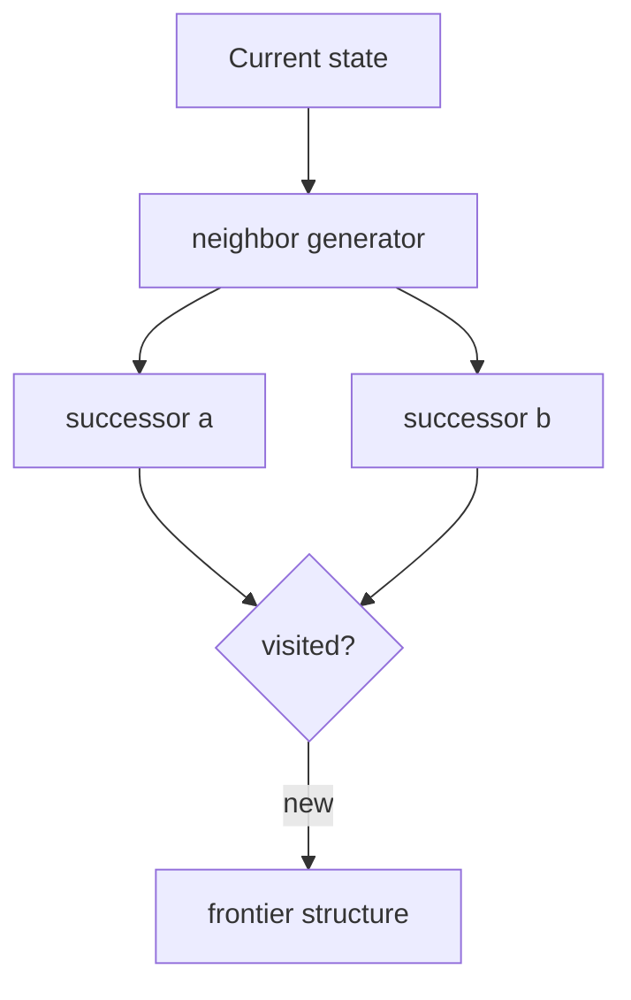
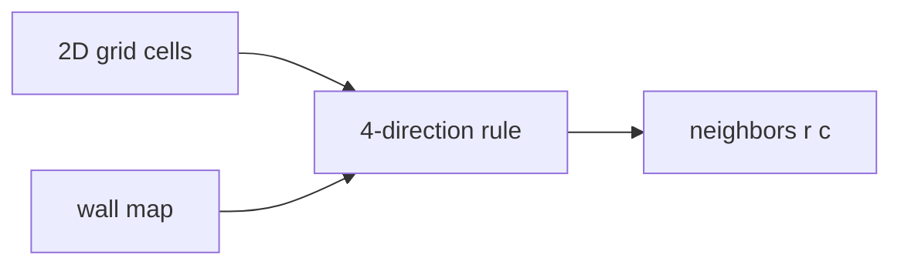
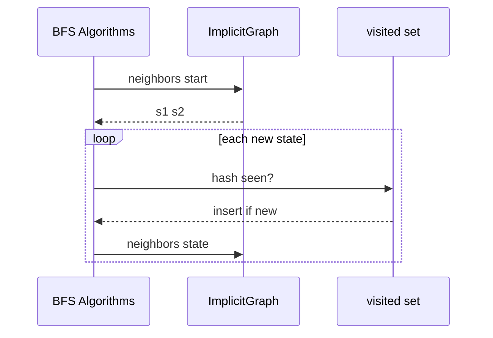

# Implicit Graphs and On-the-Fly Neighbors

## Overview

An **implicit graph** never stores all vertices and edges explicitly. Instead, vertices are **states** (grid cells, puzzle configurations, program counters) and **neighbors(u)** is a **function** that generates adjacent states on demand. The graph may be **infinite** or too large to materialize—only the visited frontier is expanded during search ([[05-Algorithms/README|Algorithms]]).

Examples: chess knight moves on an infinite board, 15-puzzle state space, maze grid, word ladder transitions, dependency resolution where edges derive from rules. The [[04-Data-Structures/08-Graphs-as-Representation/Graph ADT Vertices Edges and Labels|Graph ADT]] contract still applies: algorithms call `neighbors(u)` without caring whether u was pre-stored.

## Learning Objectives

- Implement implicit graphs via neighbor generator functions
- Distinguish state identity (hash/canonical form) from object identity
- Bound memory using visited sets instead of full adjacency
- Model grid graphs without building adjacency lists for every cell
- Hand off search to Algorithms with explicit visited deduplication

## Prerequisites

- [[04-Data-Structures/08-Graphs-as-Representation/Graph ADT Vertices Edges and Labels|Graph ADT Vertices Edges and Labels]]
- [[04-Data-Structures/08-Graphs-as-Representation/Adjacency Lists|Adjacency Lists]]

## Difficulty

`intermediate`

## Estimated Time

- Reading: 1.5 hours
- Exercises: 3 hours
- Mini project: 4 hours

## History

Implicit graphs are standard in AI search (STRIPS planning, pathfinding). Game engines generate navmesh neighbors procedurally. Compiler optimization treats program states implicitly in dataflow analysis.

## Problem It Solves

Materializing |V| and |E| for a 20×20×20 state space or infinite grid is impossible. Storing explicit [[04-Data-Structures/08-Graphs-as-Representation/Adjacency Lists|adjacency lists]] wastes memory on unreachable states. **Generate neighbors when needed** and track **visited** states only—representation shifts from storage to **state encoding + successor function**.

## Internal Implementation

### Pattern

```typescript
type State = ...;
type Neighbor = { state: State; cost: number };

interface ImplicitGraph {
  neighbors(s: State): Neighbor[];
  isGoal(s: State): boolean;
  hash(s: State): string; // for visited set
}
```

No `addEdge`—edges exist by rule.

### Grid graph

Cell `(r,c)` neighbors: four directions if in bounds and not wall. Walls stored as bitset or char grid—not per-cell edge lists.

### State-space graph

Puzzle state encoded as tuple/permutation; neighbors apply legal moves; duplicate states merged via hash in visited map.



## Invariants

- **I1 (Successor validity)**: Every state returned by `neighbors(u)` is reachable by one legal move from u.
- **I2 (Completeness)**: If move u→v is legal, v appears in `neighbors(u)` (directed: apply direction rules).
- **I3 (Identity)**: `hash(u) == hash(v)` iff states u and v are the same abstract vertex.
- **I4 (Cost consistency)**: Edge cost attached in neighbor record matches problem definition (uniform grid = 1).
- **I5 (Visited soundness)**: Algorithm visited set only skips states already expanded—does not skip unexpanded duplicates in frontier unless using consistent hashing in priority queue (see Algorithms).

## Operation Complexity

| Operation | Explicit adj list | Implicit generator |
| --- | --- | --- |
| Space | O(V + E) | O(visited frontier) |
| `neighbors(u)` | O(deg) | O(generate moves) |
| Preprocessing | Build index | O(1) |
| Edge existence | O(deg) or O(1) | Regenerate or cache |

Generator cost dominates: chess branching ~35; grid ≤4; puzzle varies.

## Mermaid Diagrams

### Structure: grid as implicit graph



### Sequence: BFS on implicit graph



## Examples

### Minimal Example

**TypeScript** — 2D grid with walls:

```typescript
export class GridGraph {
  constructor(
    private grid: string[],
    private passable = "."
  ) {}

  key(r: number, c: number): string {
    return `${r},${c}`;
  }

  neighbors(r: number, c: number): Array<[number, number]> {
    const out: Array<[number, number]> = [];
    for (const [dr, dc] of [
      [0, 1],
      [0, -1],
      [1, 0],
      [-1, 0],
    ] as const) {
      const nr = r + dr,
        nc = c + dc;
      if (nr < 0 || nc < 0 || nr >= this.grid.length) continue;
      if (nc >= this.grid[nr].length) continue;
      if (this.grid[nr][nc] === this.passable) out.push([nr, nc]);
    }
    return out;
  }
}
```

**Python**:

```python
from typing import Iterator, List, Tuple

class GridGraph:
    def __init__(self, grid: List[str], passable: str = ".") -> None:
        self._grid = grid
        self._passable = passable

    def key(self, r: int, c: int) -> str:
        return f"{r},{c}"

    def neighbors(self, r: int, c: int) -> List[Tuple[int, int]]:
        out: List[Tuple[int, int]] = []
        for dr, dc in ((0, 1), (0, -1), (1, 0), (-1, 0)):
            nr, nc = r + dr, c + dc
            if nr < 0 or nc < 0 or nr >= len(self._grid):
                continue
            if nc >= len(self._grid[nr]):
                continue
            if self._grid[nr][nc] == self._passable:
                out.append((nr, nc))
        return out
```

### Production-Shaped Example

Workflow dependency resolver: vertex = task snapshot hash; `neighbors` = tasks whose inputs satisfied by outputs of u per schema rules—graph size explodes if materialized. Cache neighbor lists per task version in LRU ([[04-Data-Structures/11-Caches-and-Eviction/LRU via Hash Map and Doubly Linked List|LRU cache]]) for hot paths.

```typescript
interface TaskState {
  completed: Set<string>;
}

function neighbors(state: TaskState): TaskState[] {
  // generate all valid single-task completions — search in Algorithms
  return [];
}
```

## Trade-offs

| Dimension | Upside | Downside | When it matters |
| --- | --- | --- | --- |
| vs explicit | Unbounded/infinite graphs | Regenerate cost | Puzzle AI |
| Visited set | O(frontier) memory | Hash collisions fatal | Large state space |
| Memo neighbors | Faster repeat | Memory creep | Repeated sub-states |
| Canonical hash | Dedup symmetric states | Encode cost | Rubik's cube |

### When to Use

- State-space search, puzzles, pathfinding on grids
- Infinite or exponential |V| where most states unreachable
- Rules-defined edges (legal moves, transitions)

### When Not to Use

- Static social/network graph queried millions of times—materialize [[04-Data-Structures/08-Graphs-as-Representation/Adjacency Lists|adjacency list]]
- Need O(1) edge lookup without regeneration

## Exercises

1. Implement 8-puzzle neighbor generator; count branching factor.
2. BFS shortest path on grid implicit graph; compare visited count vs total cells.
3. Design hash for chess board state; argue I3.
4. Word ladder: neighbors = one-letter edits in dictionary—implicit vs prebuilt graph?
5. Detect when memoization of `neighbors` pays off—benchmark.

## Mini Project

Grid pathfinder in code labs using implicit `GridGraph` + visited set; hand BFS to shared algorithm stub.

## Portfolio Project

[[04-Data-Structures/projects/Graph Store CLI/README|Graph Store CLI]] — optional maze mode with on-the-fly neighbors.

## Interview Questions

1. What is an implicit graph?
2. How BFS works without adjacency list?
3. Why need `hash(state)` for visited?
4. Grid 1000×1000 — store all edges or implicit?
5. Infinite graph shortest path pitfalls?

### Stretch / Staff-Level

1. Bidirectional search on implicit graphs—when neighbor inverse is expensive?
2. Disk-backed visited set for billion-state planning—Bloom prefilter ([[04-Data-Structures/10-Probabilistic-Structures/Bloom Filters|Bloom Filters]]).

## Common Mistakes

- Using object reference equality for states with same content
- Forgetting to mark visited **on enqueue** vs **on dequeue** (changes complexity)
- Materializing full graph "for simplicity" on large grid
- Non-admissible heuristic mixed with implicit graph in A* (Algorithms)

## Best Practices

- Canonicalize state encoding before hashing
- Cap branching in generator for debugging
- Log visited count / expansion rate in production planners
- Separate **rules** (neighbor logic) from **search** (Algorithms)

## Summary

Implicit graphs define vertices as states and edges via a neighbor generator, avoiding O(V+E) storage. Correctness hinges on valid successors and canonical state identity for visited deduplication. They pair naturally with [[05-Algorithms/07-Graph-Traversal-and-DAGs/BFS|BFS]] and [[05-Algorithms/07-Graph-Traversal-and-DAGs/DFS|DFS]]; explicit [[04-Data-Structures/08-Graphs-as-Representation/Adjacency Lists|adjacency lists]] remain better when the graph is static and queried repeatedly.

## Further Reading

- [[00-References/Data Structures/README|Data Structures References]]
- Russell & Norvig — state-space search
- [[05-Algorithms/README|Algorithms]]

## Related Notes

- [[04-Data-Structures/08-Graphs-as-Representation/Graph ADT Vertices Edges and Labels|Graph ADT Vertices Edges and Labels]]
- [[04-Data-Structures/08-Graphs-as-Representation/Graph Storage Trade-offs and Dynamic Updates|Graph Storage Trade-offs and Dynamic Updates]]
- [[04-Data-Structures/04-Hash-Tables-and-Sets/Separate Chaining|Separate Chaining]] — visited sets
- [[04-Data-Structures/10-Probabilistic-Structures/Bloom Filters|Bloom Filters]]

## Progress Checklist

- [ ] Explained from first principles
- [ ] Drew at least one Mermaid diagram
- [ ] Implemented a minimal version
- [ ] Documented trade-offs and non-goals
- [ ] Completed exercises
- [ ] Practiced interview questions aloud
- [ ] Linked prerequisites and dependents
