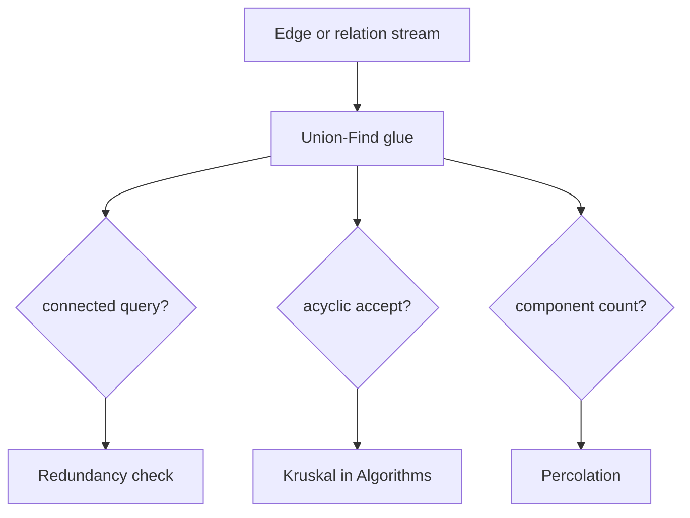
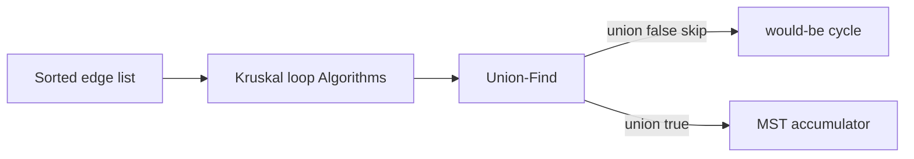
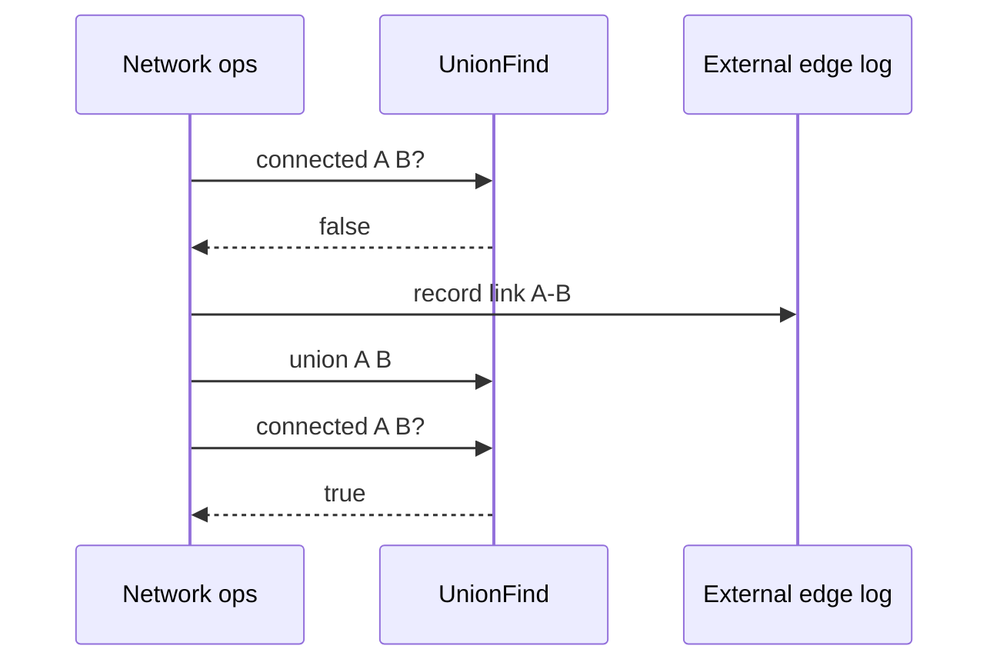

# Disjoint-Set Applications as Glue

## Overview

**Union-find** rarely appears as a user-facing API. It acts as **glue** between a problem and a graph algorithm: maintain **equivalence classes** or **acyclicity** while edges or constraints stream in. The optimized structure ([[04-Data-Structures/09-Disjoint-Set/Union by Rank and Path Compression|Union by Rank and Path Compression]]) answers "same component?" in nearly O(1); the **algorithm** ([[05-Algorithms/09-MST-and-Connectivity/Kruskal with Union-Find|Kruskal]], label propagation, redundancy check) lives in [[05-Algorithms/README|Algorithms]].

This note catalogs production-shaped patterns: MST edge filtering, dynamic connectivity, image connected components, duplicate detection, and network redundancy—each with representation handoff and what DSU does **not** provide (paths, weights, component listing).

## Learning Objectives

- Apply union-find in Kruskal MST as cycle detector (algorithm handoff)
- Model offline connectivity queries with union timeline
- Use DSU for connected components on grid or pixel graphs
- Recognize when BFS/DFS replaces or complements DSU
- Integrate DSU with [[04-Data-Structures/08-Graphs-as-Representation/Adjacency Lists|graph representations]] without duplicating storage

## Prerequisites

- [[04-Data-Structures/09-Disjoint-Set/Union-Find Structure|Union-Find Structure]]
- [[04-Data-Structures/09-Disjoint-Set/Union by Rank and Path Compression|Union by Rank and Path Compression]]
- [[04-Data-Structures/08-Graphs-as-Representation/Graph ADT Vertices Edges and Labels|Graph ADT Vertices Edges and Labels]]

## Difficulty

`intermediate`

## Estimated Time

- Reading: 2 hours
- Exercises: 4 hours
- Mini project: 5 hours

## History

Kruskal (1956) used disjoint sets for MST. Percolation theory and image processing adopted DSU for label equivalence. Modern infra uses DSU in network partition detection and incremental entity resolution.

## Problem It Solves

Many tasks reduce to: **merge sets when relation holds; query if two items already equivalent**. Storing full [[04-Data-Structures/08-Graphs-as-Representation/Adjacency Lists|adjacency lists]] and running BFS per query is O(V+E). Union-find handles **online unions** and **same-set queries** with O(α(n)) each—ideal glue for batch edge processing and streaming links.

## Internal Implementation

### Pattern 1: Kruskal MST (Algorithms owns sort + weight logic)

```
Sort edges by weight ascending
UF = OptimizedUnionFind(V)
for (u,v,w) in edges:
  if UF.union(u,v):  // acyclic — accept edge
    add to MST
```

DSU responsibility: **reject edge if u,v already connected** (would form cycle). Edge storage: [[04-Data-Structures/08-Graphs-as-Representation/Adjacency Matrices and Edge Lists|edge list]] or adjacency input.

### Pattern 2: Connected components (offline)

Single pass: for each edge `(u,v)`, `union(u,v)`. Number of sets = count roots where `parent[i]==i` after all unions. **Listing members** of one component requires extra map root → list (not native DSU).

### Pattern 3: Grid / image labeling

Pixels indexed 0..RC-1; union adjacent pixels with same color. Component count for percolation threshold. Neighbors generated implicitly ([[04-Data-Structures/08-Graphs-as-Representation/Implicit Graphs and On-the-Fly Neighbors|Implicit Graphs]])—only unions stored.

### Pattern 4: Duplicate / account merge

Elements with equality evidence: `union(a,b)`; `connected` before merge prevents duplicate work. Persist union log for audit; DSU rebuilt from log on restart.



## Invariants

- **I1 (Glue correctness)**: DSU partition matches graph connectivity under processed edges (undirected union for undirected connectivity).
- **I2 (Kruskal gate)**: Edge accepted iff union returns true (endpoints in different sets).
- **I3 (Component count)**: After processing all edges, number of roots equals number of connected components (if all vertices initialized).
- **I4 (No path semantics)**: DSU state does not imply shortest path or BFS tree—only equivalence.
- **I5 (Replay)**: Replaying same union sequence on fresh DSU yields same partition.

## Operation Complexity

| Application | DSU ops | Other work | Notes |
| --- | --- | --- | --- |
| Kruskal MST | O(E α(V)) | O(E log E) sort in Algorithms | DSU is not bottleneck |
| Offline connectivity Q queries | O((N+Q) α(N)) | N unions | vs Q × BFS |
| Grid labeling R×C | O(RC α(RC)) | O(RC) neighbor checks | Implicit graph |
| Component count | O(E α(V)) | O(V) scan roots | After unions |
| Entity merge stream | O(U α(N)) | U union events | Audit log separate |

## Mermaid Diagrams

### Structure: Kruskal glue role



### Sequence: redundancy check before link



## Examples

### Minimal Example

**TypeScript** — component count after edges:

```typescript
function countComponents(n: number, edges: Array<[number, number]>): number {
  const uf = new OptimizedUnionFind(n);
  for (const [u, v] of edges) uf.union(u, v);
  let roots = 0;
  for (let i = 0; i < n; i++) if (uf.find(i) === i) roots++;
  return roots;
}
```

**Python** — 2D grid labeling glue:

```python
class OptimizedUnionFind:
    # ... from Union by Rank note ...

def label_components(rows: int, cols: int, grid: list[str]) -> int:
    uf = OptimizedUnionFind(rows * cols)
    def idx(r: int, c: int) -> int:
        return r * cols + c

    for r in range(rows):
        for c in range(cols):
            if grid[r][c] == "#":
                continue
            for dr, dc in ((0, 1), (1, 0)):
                nr, nc = r + dr, c + dc
                if nr < rows and nc < cols and grid[nr][nc] != "#":
                    uf.union(idx(r, c), idx(nr, nc))
    roots = sum(1 for i in range(rows * cols) if uf.find(i) == i and grid[i // cols][i % cols] != "#")
    return roots
```

### Production-Shaped Example

Service mesh **split-brain detector**: each alive instance `union` with peers it can reach; periodic check if all in one set. Edge log in Kafka; DSU rebuilt each minute from snapshot—connectivity query only needs current partition, not paths (path analysis → [[05-Algorithms/07-Graph-Traversal-and-DAGs/BFS|BFS]] on materialized adjacency if needed).

```typescript
class MeshPartitionMonitor {
  private uf = new OptimizedUnionFind(this.capacity);

  onHeartbeat(a: number, peers: number[]): void {
    for (const p of peers) this.uf.union(a, p);
  }

  isFullyConnected(active: number[]): boolean {
    const root = this.uf.find(active[0]);
    return active.every((x) => this.uf.find(x) === root);
  }
}
```

## Trade-offs

| Dimension | Upside | Downside | When it matters |
| --- | --- | --- | --- |
| DSU vs BFS per query | O(α) queries after unions | No path | Link streams |
| DSU vs adjacency | O(n) memory | Cannot traverse component | Count only |
| Offline vs online | Simple replay | Edge deletion hard | Network flaps |
| With edge list input | No adjacency build | Sort cost for Kruskal | Sparse E |

### When to Use

- Kruskal cycle detection
- Streaming equivalence / merge
- Component counting on grids or edge batches
- Percolation / redundancy checks

### When Not to Use

- Shortest path, diameter, articulation points—Algorithms on explicit graph
- Dynamic **edge deletion** connectivity—specialized Link-Cut or rebuild
- Need full component membership listing frequently—maintain adjacency + BFS or root → vector map

## Exercises

1. Implement Kruskal using OptimizedUnionFind; verify MST size |V|-1 on connected graph.
2. Percolation: R×R grid; find threshold row where top connects bottom via DSU.
3. Compare component count via DSU vs BFS on same edge list—timing.
4. Entity resolution: union pairs from CSV; output cluster sizes by root histogram.
5. When does Kruskal spend more time sorting than in DSU? Plot E vs V.

## Mini Project

[[04-Data-Structures/projects/Graph Store CLI/README|Graph Store CLI]] — `components` and `mst-filter` subcommands using DSU glue.

## Portfolio Project

Graph Store CLI + Structures Workbench integration: DSU metrics (union count, root count) exported.

## Interview Questions

1. Role of union-find in Kruskal?
2. DSU vs BFS for 1000 connectivity queries after 10⁶ unions?
3. How count connected components with DSU?
4. Can union-find return MST edges alone without sort?
5. Grid connected regions—store adjacency list or DSU?

### Stretch / Staff-Level

1. Offline dynamic connectivity with partial persistence—outline rebuild strategy.
2. MapReduce connected components (Hook algorithm)—where DSU appears per partition.

## Common Mistakes

- Running Kruskal without sorting edges first
- Expecting DSU to list all nodes in a component without extra structure
- Using union on directed edges for strongly connected problems (wrong model)
- Forgetting to initialize all vertices before component count

## Best Practices

- Keep DSU as stateless glue—persist edges/relations separately
- Use OptimizedUnionFind always in application paths
- Hand path-finding explicitly to [[05-Algorithms/README|Algorithms]] with chosen [[04-Data-Structures/08-Graphs-as-Representation/Adjacency Lists|representation]]
- Log unions for reproducible partition rebuild

## Summary

Union-find glues equivalence and acyclicity checks onto edge streams without materializing full graph traversals. Kruskal, component counts, grid labeling, and merge pipelines share the same pattern: union on relations, query via find. It does not replace graph storage or path algorithms—it complements them with O(α(n)) partition maintenance documented in [[04-Data-Structures/09-Disjoint-Set/Union-Find Structure|Union-Find Structure]] and [[04-Data-Structures/09-Disjoint-Set/Union by Rank and Path Compression|Union by Rank and Path Compression]].

## Further Reading

- [[00-References/Data Structures/README|Data Structures References]]
- CLRS — Kruskal and disjoint-set applications
- [[05-Algorithms/README|Algorithms]] — MST and connectivity algorithms

## Related Notes

- [[04-Data-Structures/09-Disjoint-Set/Union-Find Structure|Union-Find Structure]]
- [[04-Data-Structures/09-Disjoint-Set/Union by Rank and Path Compression|Union by Rank and Path Compression]]
- [[04-Data-Structures/08-Graphs-as-Representation/Graph ADT Vertices Edges and Labels|Graph ADT Vertices Edges and Labels]]
- [[04-Data-Structures/08-Graphs-as-Representation/Implicit Graphs and On-the-Fly Neighbors|Implicit Graphs and On-the-Fly Neighbors]]
- [[04-Data-Structures/08-Graphs-as-Representation/Adjacency Matrices and Edge Lists|Adjacency Matrices and Edge Lists]]
- [[05-Algorithms/README|Algorithms]]

## Progress Checklist

- [ ] Explained from first principles
- [ ] Drew at least one Mermaid diagram
- [ ] Implemented a minimal version
- [ ] Documented trade-offs and non-goals
- [ ] Completed exercises
- [ ] Practiced interview questions aloud
- [ ] Linked prerequisites and dependents
