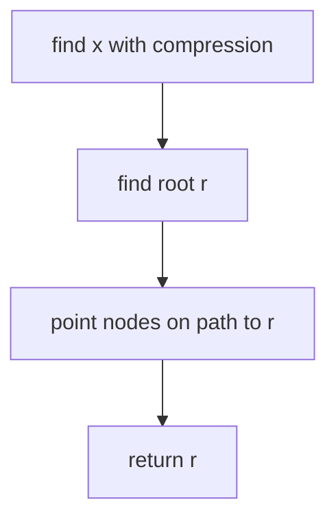
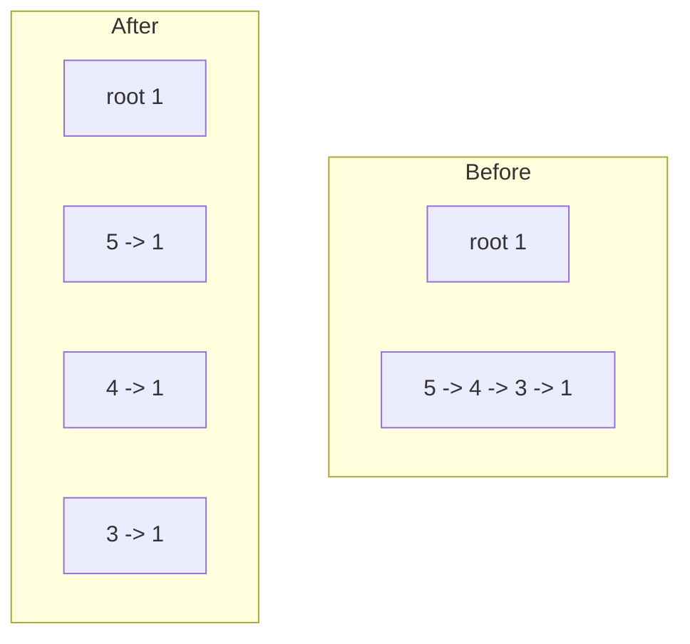
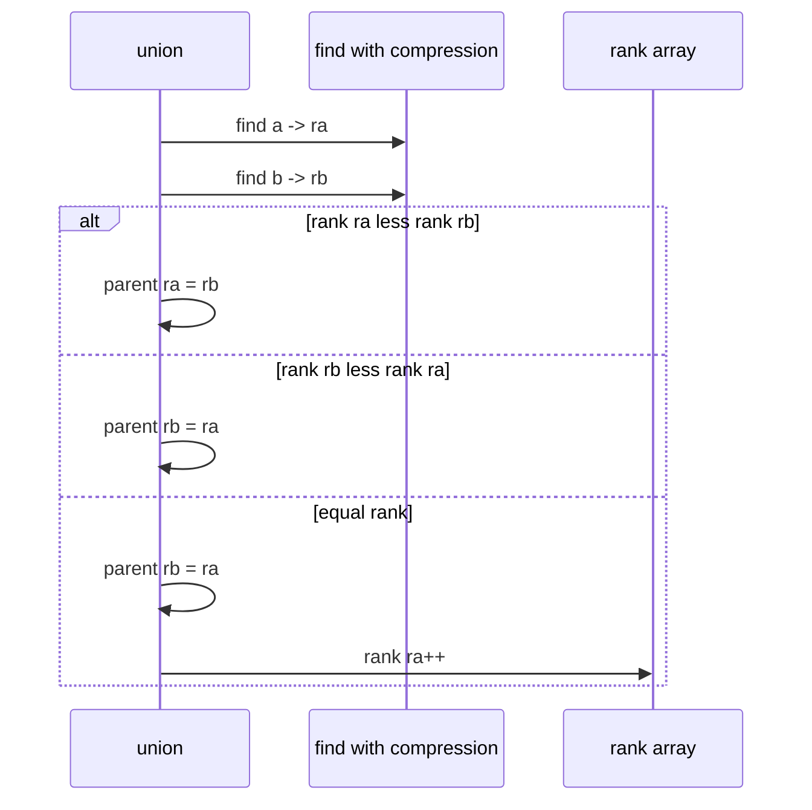

# Union by Rank and Path Compression

## Overview

Two standard optimizations transform naive [[04-Data-Structures/09-Disjoint-Set/Union-Find Structure|union-find]] from O(n) per operation into **O(α(n)) amortized**—where α is the **inverse Ackermann function**, so slow-growing it is effectively a small constant for any realistic n.

1. **Union by rank** (or **size**) — attach shorter tree under taller root; keeps tree height logarithmic without rank.
2. **Path compression** — during `find`, point every node on path directly to root; flattens future finds.

Together they are the production default for disjoint-set structures consumed by Kruskal and connectivity pipelines ([[05-Algorithms/09-MST-and-Connectivity/Kruskal with Union-Find|Kruskal with Union-Find]]).

## Learning Objectives

- Implement union by rank and path compression (iterative find)
- Explain amortized O(α(n)) informally and what rank bounds
- Compare union by rank vs union by size
- Verify invariants after optimized find/union
- Choose halving vs full compression variants

## Prerequisites

- [[04-Data-Structures/09-Disjoint-Set/Union-Find Structure|Union-Find Structure]]
- [[04-Data-Structures/00-Orientation-and-Contracts/Complexity Tables Amortization and Practical Constants|Complexity Tables Amortization and Practical Constants]]

## Difficulty

`intermediate`

## Estimated Time

- Reading: 2 hours
- Exercises: 3 hours
- Mini project: 3 hours

## History

Hopcroft and Ullman analyzed union by rank (1973); Tarjan proved the inverse-Ackermann bound with path compression (1975). The result is among the most cited amortized analyses in computer science.

## Problem It Solves

Adversarial union sequences build linear parent chains—every `find` scans all elements. Rank caps tree height; compression ensures repeated queries on hot elements become O(1). Without both, large-scale Kruskal or network union streams bottleneck on find latency.

## Internal Implementation

### Extra fields

```
parent[i]
rank[i]   // upper bound on tree height; 0 initially
```

### Union by rank

```
ra = find(a), rb = find(b)
if ra == rb: return
if rank[ra] < rank[rb]: parent[ra] = rb
else if rank[ra] > rank[rb]: parent[rb] = ra
else: parent[rb] = ra; rank[ra]++
```

### Path compression (two-pass iterative)

```
find(x):
  root = x
  while parent[root] != root: root = parent[root]
  while parent[x] != root:
    next = parent[x]
    parent[x] = root
    x = next
  return root
```

**Path halving** (single pass): `parent[x] = parent[parent[x]]` during walk—simpler, slightly weaker compression.



## Invariants

- **I1 (Root self-loop)**: `parent[r] == r` for every root r.
- **I2 (Partition)**: Same as base union-find—disjoint sets partition elements.
- **I3 (Rank bound)**: If r is root of tree containing n nodes, `rank[r] ≤ floor(log2 n)` (with union by rank).
- **I4 (Compression safety)**: Path compression preserves I2; only parent pointers change, not partition membership.
- **I5 (Union by rank)**: After union by rank, rank of new root is min(old ranks)+1 at most when equal rank merged.

## Operation Complexity

| Operation | Amortized | Worst single op | Space |
| --- | --- | --- | --- |
| `find` | O(α(n)) | O(log n) without compression pass | O(1) |
| `union` | O(α(n)) | O(log n) | O(1) |
| `connected` | O(α(n)) | — | O(1) |
| Total m ops | O(m α(n)) | — | O(n) |

α(n) ≤ 4 for n ≤ 2^65536—effectively constant in practice.

## Mermaid Diagrams

### Structure: before and after path compression



### Sequence: union by rank



## Examples

### Minimal Example

**TypeScript**:

```typescript
export class OptimizedUnionFind {
  private parent: number[];
  private rank: Uint16Array;

  constructor(n: number) {
    this.parent = Array.from({ length: n }, (_, i) => i);
    this.rank = new Uint16Array(n);
  }

  find(x: number): number {
    let root = x;
    while (this.parent[root] !== root) root = this.parent[root];
    while (this.parent[x] !== root) {
      const next = this.parent[x];
      this.parent[x] = root;
      x = next;
    }
    return root;
  }

  union(a: number, b: number): boolean {
    let ra = this.find(a);
    let rb = this.find(b);
    if (ra === rb) return false;
    if (this.rank[ra] < this.rank[rb]) [ra, rb] = [rb, ra];
    this.parent[rb] = ra;
    if (this.rank[ra] === this.rank[rb]) this.rank[ra]++;
    return true;
  }

  connected(a: number, b: number): boolean {
    return this.find(a) === this.find(b);
  }
}
```

**Python**:

```python
class OptimizedUnionFind:
    def __init__(self, n: int) -> None:
        self.parent = list(range(n))
        self.rank = [0] * n

    def find(self, x: int) -> int:
        root = x
        while self.parent[root] != root:
            root = self.parent[root]
        while self.parent[x] != root:
            nxt = self.parent[x]
            self.parent[x] = root
            x = nxt
        return root

    def union(self, a: int, b: int) -> bool:
        ra, rb = self.find(a), self.find(b)
        if ra == rb:
            return False
        if self.rank[ra] < self.rank[rb]:
            ra, rb = rb, ra
        self.parent[rb] = ra
        if self.rank[ra] == self.rank[rb]:
            self.rank[ra] += 1
        return True

    def connected(self, a: int, b: int) -> bool:
        return self.find(a) == self.find(b)
```

### Production-Shaped Example

Kruskal MST preprocessor: sort edges once ([[05-Algorithms/09-MST-and-Connectivity/Kruskal with Union-Find|Kruskal with Union-Find]]); DSU rejects cycle edges in O(α(n)) each. Instrument **find depth histogram** before/after compression in diagnostics.

```typescript
function filterAcyclicEdges(n: number, edges: Array<[number, number, number]>) {
  const uf = new OptimizedUnionFind(n);
  const mst: typeof edges = [];
  for (const e of edges.sort((a, b) => a[2] - b[2])) {
    if (uf.union(e[0], e[1])) mst.push(e);
  }
  return mst;
}
```

## Trade-offs

| Dimension | Upside | Downside | When it matters |
| --- | --- | --- | --- |
| Rank + compression | Near-constant ops | More code than naive | n > 10⁴ unions |
| Union by size | Same bounds | Size not height bound proof path | Prefer simpler invariant |
| Full vs halving compression | Max flatten | Two-pass vs one-pass | Hot find paths |
| Iterative vs recursive find | No stack overflow | Slightly longer | Deep chains pre-compression |

### When to Use

- Always in production union-find
- Kruskal, connectivity streams, percolation
- Any m > n union/find workloads

### When Not to Use

- Tiny n (< 50)—naive may suffice in micro-benchmarks only
- Need rollback of unions—use persistent DSU variant (advanced)

## Exercises

1. Implement path halving; compare find steps to full compression on random unions.
2. Generate adversarial sequence for naive union; show rank+compression flat profile.
3. Prove rank ≤ log n for union by rank without compression.
4. Count pointer updates during find with/without compression.
5. Implement union by **size** ( subtree node count); compare rank array values.

## Mini Project

Optimized UnionFind in code labs; benchmark vs naive on 10⁶ union/find ops.

## Portfolio Project

[[04-Data-Structures/projects/Graph Store CLI/README|Graph Store CLI]] — MST edge filter using optimized DSU.

## Interview Questions

1. What is path compression?
2. Union by rank vs union by size?
3. Amortized complexity of m operations?
4. What is inverse Ackermann in plain terms?
5. Does path compression break rank invariant as upper bound on height?

### Stretch / Staff-Level

1. Explain why rank is not exact height after compression.
2. Parallel union-find challenges (linking races)—high level only.

## Common Mistakes

- Updating rank after path compression as if it were height
- Recursive find on deep tree before compression—stack overflow
- Union without finding roots first
- Using union by rank but forgetting compression (still O(log n) finds)

## Best Practices

- Use iterative find with two-pass compression in production
- Return whether union merged sets for Kruskal edge acceptance
- Uint16Array for rank if n fits 65535—memory at scale
- Property-test equivalence against naive DSU on small n

## Summary

Union by rank keeps trees shallow at merge time; path compression flattens them on access. Together they deliver O(α(n)) amortized find and union—the standard implementation of [[04-Data-Structures/09-Disjoint-Set/Union-Find Structure|union-find]] for connectivity glue and Kruskal preprocessing in [[05-Algorithms/09-MST-and-Connectivity/Kruskal with Union-Find|Kruskal with Union-Find]].

## Further Reading

- [[00-References/Data Structures/README|Data Structures References]]
- Tarjan — amortized analysis of disjoint set union
- [[04-Data-Structures/00-Orientation-and-Contracts/Complexity Tables Amortization and Practical Constants|Complexity Tables Amortization and Practical Constants]]

## Related Notes

- [[04-Data-Structures/09-Disjoint-Set/Union-Find Structure|Union-Find Structure]]
- [[04-Data-Structures/09-Disjoint-Set/Disjoint-Set Applications as Glue|Disjoint-Set Applications as Glue]]
- [[04-Data-Structures/08-Graphs-as-Representation/Adjacency Lists|Adjacency Lists]]
- [[05-Algorithms/README|Algorithms]]

## Progress Checklist

- [ ] Explained from first principles
- [ ] Drew at least one Mermaid diagram
- [ ] Implemented a minimal version
- [ ] Documented trade-offs and non-goals
- [ ] Completed exercises
- [ ] Practiced interview questions aloud
- [ ] Linked prerequisites and dependents
