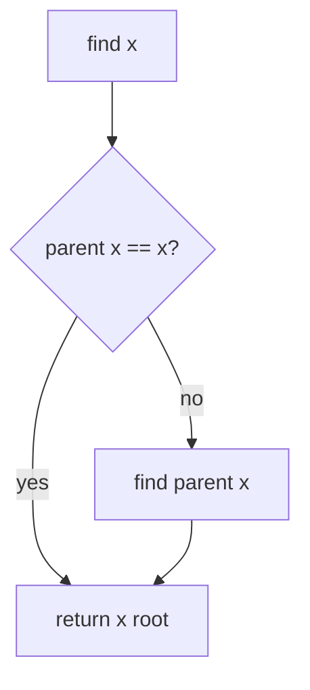
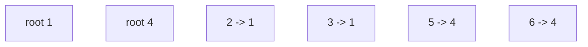
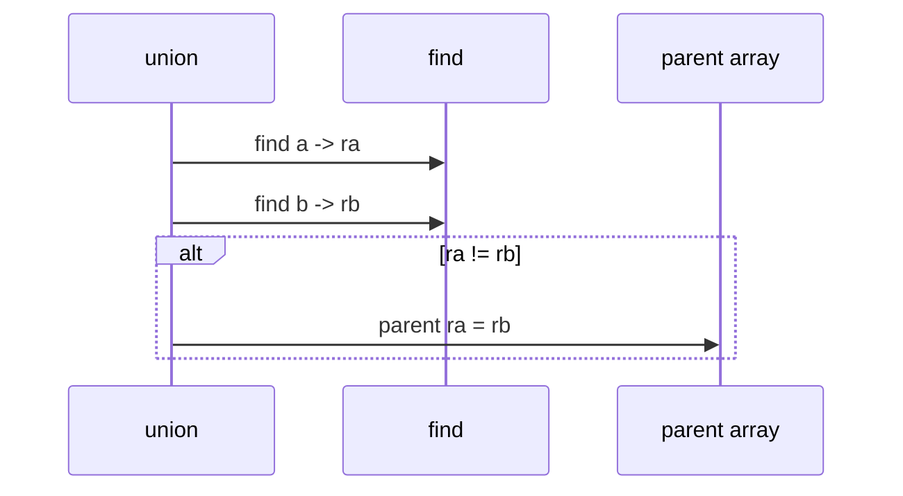

# Union-Find Structure

## Overview

A **union-find** ( **disjoint-set union**, DSU) maintains a partition of elements into **disjoint sets** supporting:

- **`find(x)`** — identifier of x's set (typically a **representative** / root)
- **`union(a, b)`** — merge sets containing a and b
- **`connected(a, b)`** — whether a and b are in the same set

The classic representation is a **parent array** (or pointer forest): each element points to its parent; roots point to themselves. Sets are **trees** in a forest—not necessarily balanced until optimized in [[04-Data-Structures/09-Disjoint-Set/Union by Rank and Path Compression|Union by Rank and Path Compression]].

Union-find is **glue structure** for connectivity, Kruskal's MST edge filtering, image labeling, and network redundancy checks—algorithms in [[05-Algorithms/09-MST-and-Connectivity/Kruskal with Union-Find|Kruskal with Union-Find]] and [[05-Algorithms/07-Graph-Traversal-and-DAGs/Connected Components and Bipartite Testing|connectivity algorithms]] consume `find`/`union`; this note owns the **representation and invariants**.

## Learning Objectives

- Implement parent-array union-find with naive union and find
- State partition invariants after arbitrary union sequence
- Map elements to indices for contiguous storage
- Implement `connected` via representative equality
- Prepare for rank and path compression optimizations

## Prerequisites

- [[04-Data-Structures/00-Orientation-and-Contracts/Abstract Data Types vs Concrete Structures|Abstract Data Types vs Concrete Structures]]
- [[04-Data-Structures/01-Contiguous-Sequences/Fixed-Capacity Arrays|Fixed-Capacity Arrays]]

## Difficulty

`intermediate`

## Estimated Time

- Reading: 1.5 hours
- Exercises: 2 hours
- Mini project: 3 hours

## History

Tarjan analyzed union-find with path compression and union by rank (1975), proving nearly constant amortized time. Earlier disjoint-set merge appeared in Kruskal's MST (1956). Modern systems use DSU in percolation, social cluster detection, and union of permission groups.

## Problem It Solves

Tracking **dynamic connectivity** among n items without storing full [[04-Data-Structures/08-Graphs-as-Representation/Adjacency Lists|adjacency lists]]: after a stream of "a linked to b" events, answer "are a and b connected?" Union-find focuses on **equivalence classes**, not paths or edge weights—O(1)-ish operations after optimizations vs O(V+E) BFS per query ([[05-Algorithms/07-Graph-Traversal-and-DAGs/BFS|BFS]]).

## Internal Implementation

### ADT

| Operation | Contract |
| --- | --- |
| `makeSet(x)` | Create singleton set containing x |
| `find(x)` | Return representative of x's set |
| `union(x, y)` | Merge sets of x and y (if distinct) |
| `connected(x, y)` | `find(x) == find(y)` |

### Parent array layout

```
parent[i] = parent of i, or i if i is root
```

**Naive union**: `find` roots ra, rb; set `parent[ra] = rb` (or vice versa).

**Naive find**: walk parent chain until `parent[x] == x`.



### Index mapping

External IDs (strings) → 0..n-1 via hash map; parent array sized n.

## Invariants

- **I1 (Parent closure)**: For all i, following parent pointers eventually reaches a root r with `parent[r] == r`.
- **I2 (Partition)**: Elements reachable from the same root form exactly one set; sets are disjoint.
- **I3 (Representative)**: `find(x)` returns the root of x's tree.
- **I4 (Union effect)**: After `union(a,b)`, all elements formerly in a's set or b's set share one root.
- **I5 (Acyclic parent graph)**: Following parent links from any node never revisits a node before reaching root (forest of rooted trees).

## Operation Complexity

Naive implementation (no rank, no compression):

| Operation | Worst | Notes |
| --- | --- | --- |
| `find` | O(n) | Skewed tree chain |
| `union` | O(n) | Two finds + pointer assign |
| `connected` | O(n) | Two finds |
| Space | O(n) | Parent array + optional rank |

With [[04-Data-Structures/09-Disjoint-Set/Union by Rank and Path Compression|optimizations]]: O(α(n)) amortized per operation (α = inverse Ackermann).

## Mermaid Diagrams

### Structure: forest after unions



Sets {1,2,3} and {4,5,6}.

### Sequence: union connects components



## Examples

### Minimal Example

**TypeScript**:

```typescript
export class UnionFind {
  private parent: number[];

  constructor(n: number) {
    this.parent = Array.from({ length: n }, (_, i) => i);
  }

  find(x: number): number {
    while (this.parent[x] !== x) x = this.parent[x];
    return x;
  }

  union(a: number, b: number): boolean {
    const ra = this.find(a);
    const rb = this.find(b);
    if (ra === rb) return false;
    this.parent[ra] = rb;
    return true;
  }

  connected(a: number, b: number): boolean {
    return this.find(a) === this.find(b);
  }
}
```

**Python**:

```python
class UnionFind:
    def __init__(self, n: int) -> None:
        self.parent = list(range(n))

    def find(self, x: int) -> int:
        while self.parent[x] != x:
            x = self.parent[x]
        return x

    def union(self, a: int, b: int) -> bool:
        ra, rb = self.find(a), self.find(b)
        if ra == rb:
            return False
        self.parent[ra] = rb
        return True

    def connected(self, a: int, b: int) -> bool:
        return self.find(a) == self.find(b)
```

### Production-Shaped Example

Account merge: each user id mapped to index; `union` on verified duplicate accounts; `connected` gates shared wallet access. Log union events for audit; periodic **path compression** pass in maintenance job—see optimized note.

```typescript
class AccountDSU {
  private uf: UnionFind;
  private idToIndex = new Map<string, number>();

  link(a: string, b: string): void {
    this.uf.union(this.index(a), this.index(b));
  }

  sameCluster(a: string, b: string): boolean {
    return this.uf.connected(this.index(a), this.index(b));
  }
  // index() allocates new slot — makeSet on demand
}
```

## Trade-offs

| Dimension | Upside | Downside | When it matters |
| --- | --- | --- | --- |
| vs BFS per query | Near-constant ops optimized | No path info | Dynamic connectivity |
| vs adjacency list | O(n) space simple | Cannot list component members easily | Connectivity only |
| Parent array | Cache-friendly | Fixed universe size | Integer elements |
| Naive union | Simple | O(n) worst | Teaching baseline |

### When to Use

- Incremental connectivity, Kruskal preprocessing ([[04-Data-Structures/09-Disjoint-Set/Disjoint-Set Applications as Glue|Applications]])
- Equivalence relations merging online
- Percolation / cluster counting

### When Not to Use

- Need shortest path or explicit component listing—use graph storage + Algorithms
- Need edge deletion (dynamic connectivity hard)—specialized structures

## Exercises

1. Construct worst-case union sequence producing O(n) find chain.
2. Implement `makeSet` for dynamically added elements (extend array).
3. Count number of sets after union series; verify I2.
4. Implement iterative find without recursion; compare to recursive version stack depth.
5. Map 10 string IDs through index table; union and query connected.

## Mini Project

Union-Find module in [[04-Data-Structures/code/README|code labs]] with naive implementation + test vectors.

## Portfolio Project

[[04-Data-Structures/projects/Graph Store CLI/README|Graph Store CLI]] — connectivity mode using union-find on edge stream.

## Interview Questions

1. What does union-find store?
2. Naive find/union complexity?
3. How detect if two elements connected?
4. Parent array vs adjacency list for connectivity?
5. What is a representative/root?

### Stretch / Staff-Level

1. Why doesn't naive union-find store edge list for Kruskal?
2. Plan migration from BFS connectivity to DSU in hot path.

## Common Mistakes

- Union without finding roots first (linking non-representatives)
- Off-by-one index when mapping external IDs
- Assuming union-find returns path or distance
- Reusing DSU after expecting edge deletion support

## Best Practices

- Always apply [[04-Data-Structures/09-Disjoint-Set/Union by Rank and Path Compression|rank + compression]] in production
- Assert I1 in debug via cycle detection on parent walk
- Return bool from union indicating whether merge happened
- Size array with headroom if elements added lazily

## Summary

Union-find represents disjoint sets as parent-pointer trees in a forest. Find walks to root; union links roots. Naive versions degrade to linear chains; optimized variants achieve nearly constant amortized time. It is the standard mutable partition structure for connectivity before algorithms like Kruskal consume it in [[05-Algorithms/README|Algorithms]].

## Further Reading

- [[00-References/Data Structures/README|Data Structures References]]
- CLRS — disjoint-set chapter
- [[04-Data-Structures/09-Disjoint-Set/Union by Rank and Path Compression|Union by Rank and Path Compression]]

## Related Notes

- [[04-Data-Structures/09-Disjoint-Set/Union by Rank and Path Compression|Union by Rank and Path Compression]]
- [[04-Data-Structures/09-Disjoint-Set/Disjoint-Set Applications as Glue|Disjoint-Set Applications as Glue]]
- [[04-Data-Structures/08-Graphs-as-Representation/Graph ADT Vertices Edges and Labels|Graph ADT Vertices Edges and Labels]]
- [[05-Algorithms/README|Algorithms]]

## Progress Checklist

- [ ] Explained from first principles
- [ ] Drew at least one Mermaid diagram
- [ ] Implemented a minimal version
- [ ] Documented trade-offs and non-goals
- [ ] Completed exercises
- [ ] Practiced interview questions aloud
- [ ] Linked prerequisites and dependents
