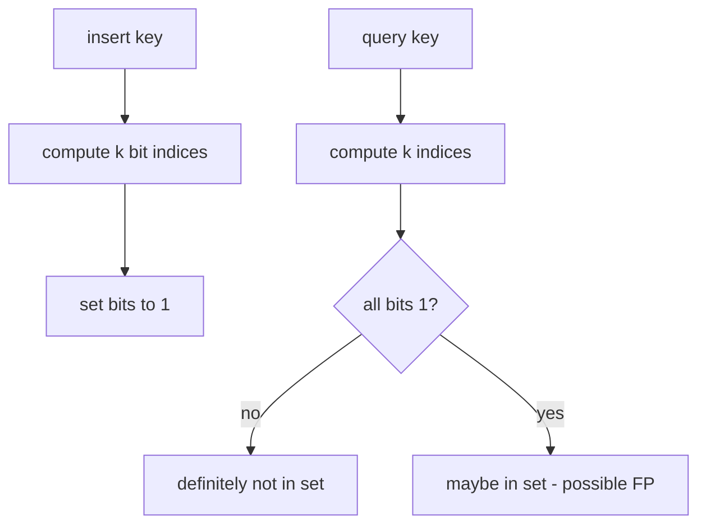
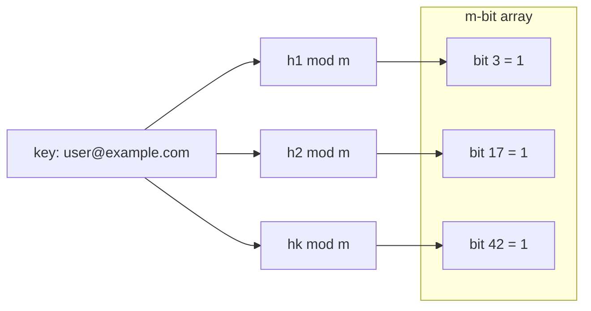
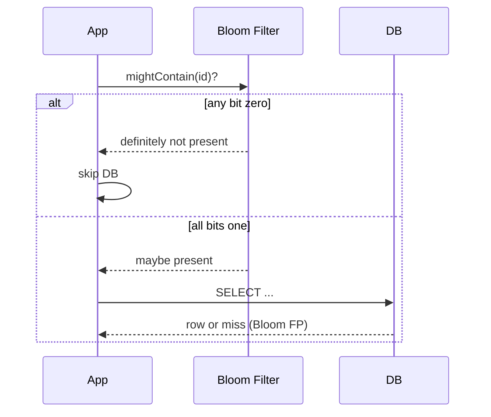

# Bloom Filters

## Overview

A **Bloom filter** is a compact probabilistic set over a universe of keys. It supports **insert** and **membership test** (`mightContain`) using a bit array of length `m` and `k` independent hash functions. A negative answer is **definitive** (no false negatives if no deletions). A positive answer may be a **false positive** with probability bounded by `(m, k, n)`.

Bloom filters trade exactness for **space**: storing millions of URLs in a hash set may require hundreds of megabytes; a well-sized Bloom filter may use single-digit megabytes at ~1% false-positive rate.

This note covers the in-memory data structure. Distributed cache layers (Redis Bloom modules, etc.) belong in [[07-Backend/README|Backend]].

## Learning Objectives

- Derive false-positive rate from `m`, `k`, and expected insert count `n`
- Implement insert and query with `k` hash functions (or double hashing trick)
- Choose `(m, k)` for target false-positive rate and capacity
- Explain why deletes break standard Bloom filters without extensions
- Apply Bloom filters as **negative filters** before expensive lookups

## Prerequisites

- [[04-Data-Structures/01-Contiguous-Sequences/Bitsets and Compact Boolean Arrays|Bitsets and Compact Boolean Arrays]]
- [[04-Data-Structures/04-Hash-Tables-and-Sets/Hash Functions Avalanche and Equality Contracts|Hash Functions Avalanche and Equality Contracts]]
- [[04-Data-Structures/04-Hash-Tables-and-Sets/Sets Multisets and Map vs Set|Sets Multisets and Map vs Set]]

## Difficulty

`intermediate`

## Estimated Time

- Reading: 2 hours
- Exercises: 2 hours
- Mini project: 3 hours

## History

Burton Bloom (1970) introduced the structure for spell-checkers and database access paths when exact sets were too large. Modern uses include Cassandra/HBase **SSTable** bloom filters (disk engine detail in [[08-Databases/README|Databases]]), CDN negative caches, and deduplication guards in ingestion pipelines.

## Problem It Solves

Exact hash sets require O(n) space proportional to stored key size. When you only need to answer "is this key **probably** in the set?" before hitting disk, network, or database, a Bloom filter eliminates most negative lookups at fixed bit cost per element.

## Internal Implementation

### Parameters

- `m`: bit array length
- `k`: number of hash positions per key
- `n`: expected number of inserts
- Optimal `k ≈ (m/n) ln 2`; false-positive rate `p ≈ (1 - e^{-kn/m})^k`

### Insert

For key `x`, compute `k` indices `h_i(x) mod m` and set those bits to 1.

### Query

If **any** of the `k` bits is 0, return **definitely not present**. If all are 1, return **maybe present**.

### Double hashing (production shortcut)

Use one hash `h1(x)` and second `h2(x)`; derive `k` indices as `(h1 + i * h2) mod m` — fewer hash calls, still good distribution if `h2` is coprime with `m` (power-of-two `m` needs odd `h2`).



## Invariants

- **B1 (Monotone bits)**: Bits only transition 0 → 1 on insert; never cleared in standard Bloom.
- **B2 (No false negative)**: If key was inserted and never deleted, all its `k` bits remain 1.
- **B3 (Hash independence)**: The `k` positions behave as independent uniform draws (approximation via good hash family).
- **B4 (Capacity planning)**: Insert count should stay near design `n`; exceeding `n` raises false-positive rate without bound.
- **B5 (No delete semantics)**: Standard Bloom does not support delete without counting variants — see [[04-Data-Structures/10-Probabilistic-Structures/Counting Bloom and Cuckoo Filters Concepts|Counting Bloom and Cuckoo Filters Concepts]].

## Operation Complexity

| Operation | Time | Space | Notes |
| --- | --- | --- | --- |
| `insert(x)` | O(k) | O(m) bits | k hash + bit sets |
| `mightContain(x)` | O(k) | — | k bit reads |
| `delete(x)` | N/A | — | Not supported in standard Bloom |
| Build from n keys | O(nk) | O(m) | One pass |
| False positive rate | — | — | ~`(1 - e^{-kn/m})^k` at saturation |

Assumptions: O(1) bit access; hash functions O(|key|).

## Mermaid Diagrams

### Structure: bit array with k hash probes



### Sequence: negative filter before DB lookup



## Examples

### Minimal Example

**TypeScript**:

```typescript
export class BloomFilter {
  private bits: Uint8Array;
  private readonly m: number;
  private readonly k: number;

  constructor(m: number, k: number) {
    this.m = m;
    this.k = k;
    this.bits = new Uint8Array(Math.ceil(m / 8));
  }

  private indices(key: string): number[] {
    const h1 = fnv1a(key);
    const h2 = murmurMix(key);
    const out: number[] = [];
    for (let i = 0; i < this.k; i++) {
      const idx = (h1 + i * h2) % this.m;
      out.push(idx < 0 ? idx + this.m : idx);
    }
    return out;
  }

  add(key: string): void {
    for (const i of this.indices(key)) {
      this.bits[i >> 3] |= 1 << (i & 7);
    }
  }

  mightContain(key: string): boolean {
    for (const i of this.indices(key)) {
      if ((this.bits[i >> 3] & (1 << (i & 7))) === 0) return false;
    }
    return true;
  }
}

function fnv1a(s: string): number {
  let h = 2166136261;
  for (let i = 0; i < s.length; i++) {
    h ^= s.charCodeAt(i);
    h = Math.imul(h, 16777619);
  }
  return h >>> 0;
}

function murmurMix(s: string): number {
  let h = 0x9747b28c;
  for (let i = 0; i < s.length; i++) h = Math.imul(h ^ s.charCodeAt(i), 0x5bd1e995);
  return (h ^ (h >>> 15)) | 1; // odd for power-of-two m
}
```

**Python**:

```python
from bitarray import bitarray
import mmh3

class BloomFilter:
    def __init__(self, m: int, k: int) -> None:
        self.m = m
        self.k = k
        self.bits = bitarray(m)
        self.bits.setall(0)

    def _indices(self, key: str) -> list[int]:
        h1 = mmh3.hash(key, 0) & 0xFFFFFFFF
        h2 = mmh3.hash(key, 1) | 1
        return [(h1 + i * h2) % self.m for i in range(self.k)]

    def add(self, key: str) -> None:
        for i in self._indices(key):
            self.bits[i] = 1

    def might_contain(self, key: str) -> bool:
        return all(self.bits[i] for i in self._indices(key))
```

### Production-Shaped Example

Size filter for expected 10M keys at 1% FP:

```typescript
function optimalBloom(n: number, p: number): { m: number; k: number } {
  const m = Math.ceil((-n * Math.log(p)) / (Math.LN2 * Math.LN2));
  const k = Math.round((m / n) * Math.LN2);
  return { m, k };
}

// { m: ~95850583, k: 7 } for n=10_000_000, p=0.01
```

Instrument **false-positive rate** in staging by inserting known set, querying absent keys, measuring FP fraction. Alert when insert count exceeds design capacity.

## Trade-offs

| Dimension | Upside | Downside | When it matters |
| --- | --- | --- | --- |
| vs exact hash set | ~10× less memory | False positives | Billions of keys |
| vs no filter | Skips expensive negatives | Cannot list members | Read-heavy paths |
| k hash functions | Tunable FP rate | CPU per query | Hot path latency |
| No delete | Simple bits | Stale positives after logical delete | Long-lived filters |

### When to Use

- **Negative cache** before DB/disk/network lookup
- Deduplication guard in streaming ingestion (with downstream exact check)
- Prefilter when false positive only adds work, not correctness bugs

### When Not to Use

- When false positive causes **wrong user-visible outcome** without verification
- When you need enumeration, size, or delete without counting extension
- Tiny sets where hash set memory is negligible

## Exercises

1. For `n=1_000_000`, `p=0.01`, compute optimal `m` and `k` by formula.
2. Implement Bloom filter and measure empirical FP rate vs theory on random keys.
3. Prove: if any bit is 0 on query, key was never inserted (no delete case).
4. Show why clearing bits on delete causes false negatives.
5. Compare memory: Bloom vs `Set<string>` for 5M SHA-256 hex keys.

## Mini Project

Build a **URL seen-filter** for a crawler: Bloom prefilter + exact `Set` for confirmed URLs; log FP rate and bytes saved.

## Portfolio Project

Probabilistic structures lab in [[04-Data-Structures/projects/Structures Workbench/README|Structures Workbench]] comparing Bloom, counting Bloom sketch, and exact set.

## Interview Questions

1. Can a Bloom filter have false negatives? False positives?
2. How do `m`, `k`, and `n` affect false-positive probability?
3. Why are Bloom filters useful before database lookups?
4. How would you support delete?
5. What is the double-hashing trick for generating k indices?

### Stretch / Staff-Level

1. Design a two-tier system: in-process Bloom + shared exact set; handle filter rebuild on deploy.
2. Analyze saturation when inserts exceed planned `n` — when to rebuild filter?

## Common Mistakes

- Using Bloom as **authoritative** membership without verification
- Forgetting to size for **peak** insert count, not average
- Using correlated hash functions (same seed) collapsing effective `k`
- Attempting delete by clearing bits (creates false negatives)

## Best Practices

- Size for peak cardinality with target FP; rebuild when exceeded
- Use **double hashing** for fewer hash calls
- Place Bloom **before** expensive I/O; confirm positives with exact structure
- Track insert count and estimated FP in metrics
- Cross-link counting Bloom when deletes required

## Summary

A Bloom filter is a bit array probed by k hash functions. Inserts set bits; queries return "no" if any bit is unset, "maybe" otherwise. It eliminates most negative lookups at minimal memory cost but cannot enumerate members and allows false positives. Production use treats it as a cheap guard rail before exact structures or durable storage—not as the source of truth.

## Further Reading

- [[00-References/Data Structures/README|Data Structures References]]
- Bloom (1970) — original paper
- Broder & Mitzenmacher — survey of network applications

## Related Notes

- [[04-Data-Structures/01-Contiguous-Sequences/Bitsets and Compact Boolean Arrays|Bitsets and Compact Boolean Arrays]]
- [[04-Data-Structures/10-Probabilistic-Structures/Counting Bloom and Cuckoo Filters Concepts|Counting Bloom and Cuckoo Filters Concepts]]
- [[04-Data-Structures/04-Hash-Tables-and-Sets/Sets Multisets and Map vs Set|Sets Multisets and Map vs Set]]
- [[04-Data-Structures/04-Hash-Tables-and-Sets/Hash Functions Avalanche and Equality Contracts|Hash Functions Avalanche and Equality Contracts]]
- [[04-Data-Structures/14-Production-Selection/Structure Selection Decision Matrix|Structure Selection Decision Matrix]]

## Progress Checklist

- [ ] Explained from first principles
- [ ] Drew at least one Mermaid diagram
- [ ] Implemented a minimal version
- [ ] Documented trade-offs and non-goals
- [ ] Completed exercises
- [ ] Practiced interview questions aloud
- [ ] Linked prerequisites and dependents
