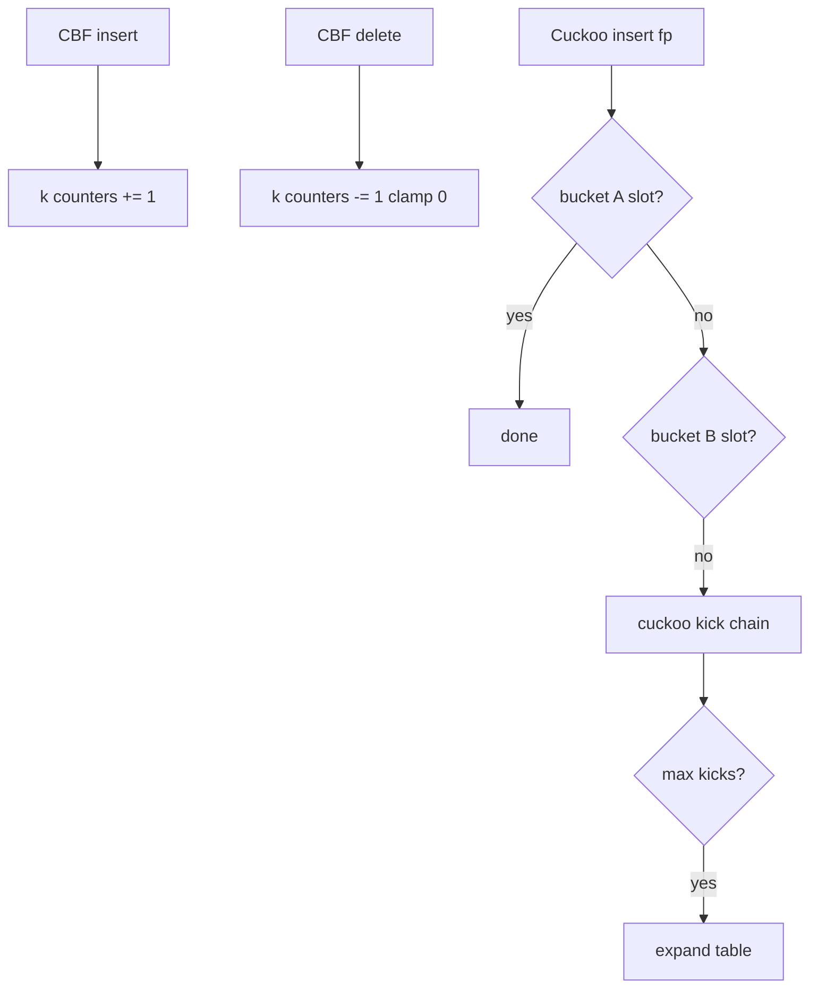
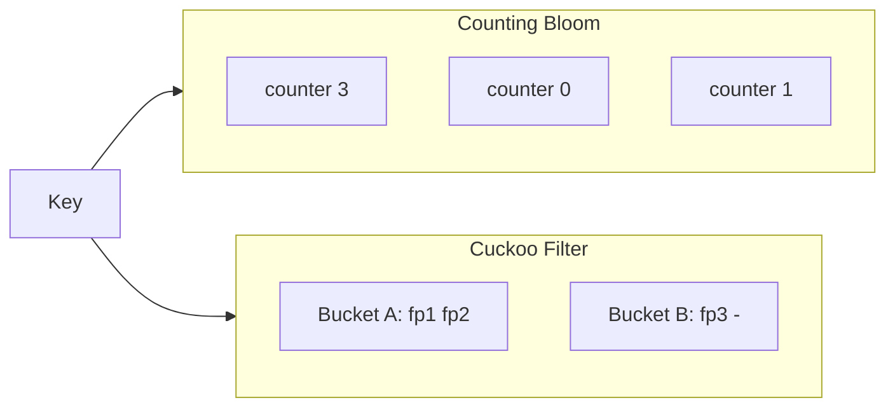
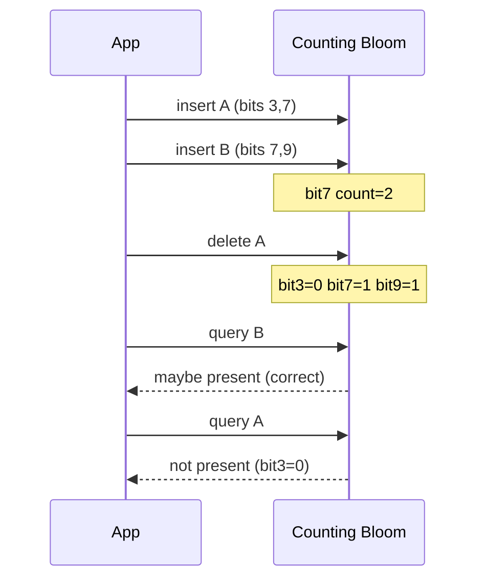

# Counting Bloom and Cuckoo Filters Concepts

## Overview

Standard [[04-Data-Structures/10-Probabilistic-Structures/Bloom Filters|Bloom Filters]] cannot delete safely: clearing a bit shared by multiple keys causes **false negatives**. Two extensions restore delete semantics at different cost profiles:

- **Counting Bloom filter (CBF)**: replace each bit with a small **counter** (typically 4 bits). Increment on insert, decrement on delete; query when all counters > 0.
- **Cuckoo filter**: store **fingerprints** in a cuckoo hash table; supports insert, delete, and membership with controllable false-positive rate; often more space-efficient than CBF at same FP target.

This is a **concepts** note with invariant demos—not a full production cuckoo implementation. Distributed product filters belong in [[07-Backend/README|Backend]].

## Learning Objectives

- Explain why bit-clearing delete breaks standard Bloom invariants
- Demonstrate counting Bloom increment/decrement semantics
- Describe cuckoo filter fingerprint + two-bucket displacement model
- Compare delete support, FP rate, and space vs standard Bloom
- Choose extension when logical deletes or sliding windows are required

## Prerequisites

- [[04-Data-Structures/10-Probabilistic-Structures/Bloom Filters|Bloom Filters]]
- [[04-Data-Structures/04-Hash-Tables-and-Sets/Open Addressing|Open Addressing]]

## Difficulty

`advanced`

## Estimated Time

- Reading: 2 hours
- Exercises: 2 hours
- Mini project: 3 hours

## History

Fan et al. (2000) introduced counting Bloom filters for cache and router applications needing eviction. Cuckoo filters (Fan, Andersen, Kaminsky, Mitzenmacher, 2014) combine cuckoo hashing with compact fingerprints, enabling deletes without counter saturation issues at scale.

## Problem It Solves

Sliding-window deduplication, connection tables with expiry, and cache admission policies need **delete** or **decrement** when keys leave the set. Standard Bloom only grows; counting and cuckoo variants restore approximate set semantics with bounded error.

## Internal Implementation

### Counting Bloom

Array of `m` counters, each `c` bits (4–8 common). Insert: increment `k` counters. Delete: decrement (saturate at 0). Query: all `k` counters > 0.

**Saturation**: if counter overflows (15 → 16 in 4 bits), delete semantics break—false negatives possible.

### Cuckoo filter

Each item maps to **two buckets** via fingerprint `f` and hash. Insert: if bucket full, **kick** existing entry to alternate bucket (cuckoo displacement), bounded retries; failure → rebuild larger table.

Delete: remove fingerprint from bucket if present. False positives when fingerprint collision.



## Invariants

### Counting Bloom

- **CB1**: Counter at index `i` equals number of inserted keys whose hash set includes `i`, minus successful deletes (if no saturation).
- **CB2 (No FN under correct counts)**: Query returns "not present" only if some counter on key's probe set is zero.
- **CB3 (Saturation)**: Counter value `< 2^c - 1` for all operations; overflow breaks CB1.

### Cuckoo filter

- **CF1**: Each stored fingerprint `f` occupies one of two buckets determined by `h1(f)` and `h2(f)`.
- **CF2**: Membership: `f` present in bucket A or B.
- **CF3 (Kick bound)**: Insert completes within `MAX_KICKS` or table expands.
- **CF4**: Delete removes one copy of fingerprint; duplicate fingerprints may cause over-delete false negatives (rare with wide fingerprints).

## Operation Complexity

| Structure | Insert | Delete | Query | Space |
| --- | --- | --- | --- | --- |
| Counting Bloom | O(k) | O(k) | O(k) | O(m · c) bits |
| Cuckoo filter | O(1) amortized* | O(1) | O(1) | O(n · f) bits |
| Rebuild (cuckoo) | — | — | — | O(n) rare |

*Amortized; worst-case kick chain or rebuild O(n).

False positives: CBF same order as Bloom if counters accurate; cuckoo ~`(1/2^b + load_factor_terms)` for fingerprint bits `b`.

## Mermaid Diagrams

### Structure: counting vs cuckoo layout



### Sequence: counting Bloom delete demo



## Examples

### Minimal Example — Counting Bloom demo

**TypeScript**:

```typescript
export class CountingBloom {
  private counters: Uint8Array;

  constructor(
    private readonly m: number,
    private readonly k: number,
    private readonly maxCount = 15
  ) {
    this.counters = new Uint8Array(m);
  }

  private indices(key: string): number[] {
    // reuse double-hash from Bloom note
    const h1 = hash1(key);
    const h2 = hash1(key + "#2") | 1;
    return Array.from({ length: this.k }, (_, i) => (h1 + i * h2) % this.m);
  }

  add(key: string): void {
    for (const i of this.indices(key)) {
      if (this.counters[i] < this.maxCount) this.counters[i]++;
    }
  }

  delete(key: string): void {
    for (const i of this.indices(key)) {
      if (this.counters[i] > 0) this.counters[i]--;
    }
  }

  mightContain(key: string): boolean {
    return this.indices(key).every((i) => this.counters[i] > 0);
  }
}

function hash1(s: string): number {
  let h = 0;
  for (const c of s) h = (h * 31 + c.charCodeAt(0)) >>> 0;
  return h;
}
```

**Python** — cuckoo fingerprint invariant demo:

```python
from dataclasses import dataclass, field

@dataclass
class CuckooBucket:
    slots: list[int | None] = field(default_factory=lambda: [None, None, None, None])

class CuckooFilterDemo:
    """Concept demo: fingerprint-only, two buckets per item."""

    def __init__(self, num_buckets: int, fp_bits: int = 8) -> None:
        self.buckets = [CuckooBucket() for _ in range(num_buckets)]
        self.fp_mask = (1 << fp_bits) - 1

    def _fp(self, key: str) -> int:
        return hash(key) & self.fp_mask

    def _alt(self, i: int, fp: int) -> int:
        return (i ^ (fp * 0x9E3779B1)) % len(self.buckets)

    def insert(self, key: str) -> bool:
        fp = self._fp(key)
        i = hash(key) % len(self.buckets)
        for _ in range(32):
            if self._place(i, fp):
                return True
            i = self._alt(i, fp)
            fp, i = self._kick(i)
        return False  # need rebuild in production

    def _place(self, i: int, fp: int) -> bool:
        b = self.buckets[i]
        for j, s in enumerate(b.slots):
            if s is None:
                b.slots[j] = fp
                return True
        return False

    def _kick(self, i: int) -> tuple[int, int]:
        b = self.buckets[i]
        j = next(idx for idx, s in enumerate(b.slots) if s is not None)
        fp = b.slots[j]
        b.slots[j] = None
        alt = self._alt(i, fp)
        return fp, alt

    def might_contain(self, key: str) -> bool:
        fp = self._fp(key)
        i = hash(key) % len(self.buckets)
        return fp in self.buckets[i].slots or fp in self.buckets[self._alt(i, fp)].slots
```

### Production-Shaped Example

Sliding-window dedup: counting Bloom with **4-bit counters**, window size 1M events, periodic **full reset** when saturation metrics rise. Monitor `counter_saturated_total` and `estimated_fp_rate`.

## Trade-offs

| Dimension | Upside | Downside | When it matters |
| --- | --- | --- | --- |
| CBF vs Bloom | Delete support | 4–8× memory vs bits | Evicting sets |
| CBF saturation | Simple | FP/FN if counters overflow | High churn same indices |
| Cuckoo vs CBF | Better bits/item at FP | Complex insert kicks | Billion-scale filters |
| vs exact set | Compact | Approximate | Memory-bound |

### When to Use

- Sliding-window "seen recently" with deletes
- Network middleboxes with flow expiry
- When cuckoo's space/FP trade-off beats CBF at scale

### When Not to Use

- Exact membership required
- Inserts/deletes unbounded on same filter without rebuild
- Team lacks appetite for cuckoo kick/rebuild edge cases

## Exercises

1. Insert keys A, B sharing a bit; delete A from standard Bloom—show false negative; fix with CBF demo.
2. Simulate 4-bit counter saturation; measure when deletes lie.
3. Trace cuckoo kick chain for 4 buckets, 3 slots each, on paper.
4. Compare memory: Bloom vs CBF (4-bit) vs cuckoo for n=1M, p=1%.
5. When does cuckoo insert fail and require rebuild?

## Mini Project

Implement counting Bloom with saturation metrics; plot delete correctness vs insert/delete ratio.

## Portfolio Project

Extend Bloom lab with CBF + cuckoo concept demos and FP benchmarks.

## Interview Questions

1. Why can't you delete from a standard Bloom filter?
2. What happens when a counting Bloom counter saturates?
3. How does cuckoo filter displacement work?
4. Cuckoo filter vs counting Bloom space at 1% FP?
5. Can cuckoo filters have false negatives?

### Stretch / Staff-Level

1. Design sliding-window dedup with partitioned CBF stripes and merge policy.
2. Analyze fingerprint width vs false-positive and false-negative on delete.

## Common Mistakes

- Decrementing counters below zero without clamp
- Ignoring counter width in capacity planning
- Treating cuckoo "maybe present" as exact without verification
- Same fingerprint collision causing erroneous delete in cuckoo

## Best Practices

- Monitor counter saturation; rebuild or widen counters proactively
- Use cuckoo when delete-heavy and space-critical
- Verify positives with exact structure when correctness matters
- Document FP budget in API contracts

## Summary

Counting Bloom filters replace bits with counters to support delete at higher memory cost and saturation risk. Cuckoo filters store fingerprints in a cuckoo hash table, enabling insert, delete, and query with competitive space efficiency. Both extend probabilistic membership beyond monotone Bloom filters—choose based on delete frequency, memory budget, and tolerance for implementation complexity.

## Further Reading

- [[00-References/Data Structures/README|Data Structures References]]
- Fan et al. (2014) — Cuckoo filter paper

## Related Notes

- [[04-Data-Structures/10-Probabilistic-Structures/Bloom Filters|Bloom Filters]]
- [[04-Data-Structures/04-Hash-Tables-and-Sets/Open Addressing|Open Addressing]]
- [[04-Data-Structures/10-Probabilistic-Structures/HyperLogLog Concepts|HyperLogLog Concepts]]
- [[04-Data-Structures/14-Production-Selection/Structure Selection Decision Matrix|Structure Selection Decision Matrix]]

## Progress Checklist

- [ ] Explained from first principles
- [ ] Drew at least one Mermaid diagram
- [ ] Implemented a minimal version
- [ ] Documented trade-offs and non-goals
- [ ] Completed exercises
- [ ] Practiced interview questions aloud
- [ ] Linked prerequisites and dependents
