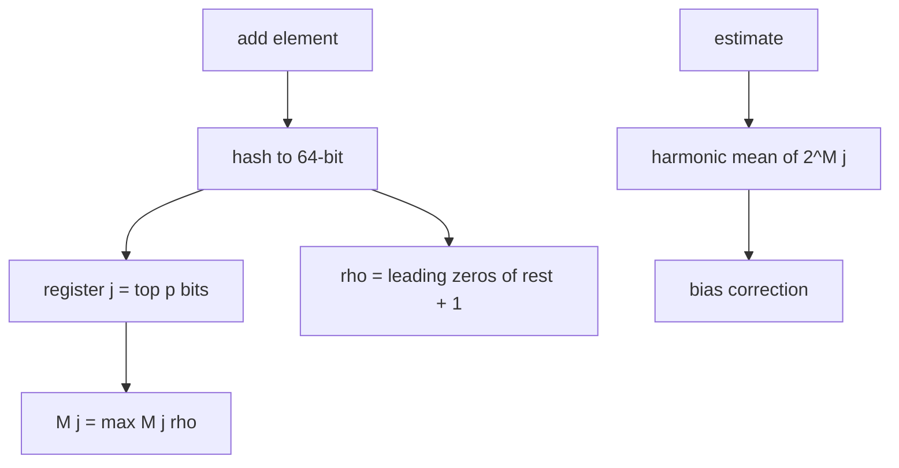
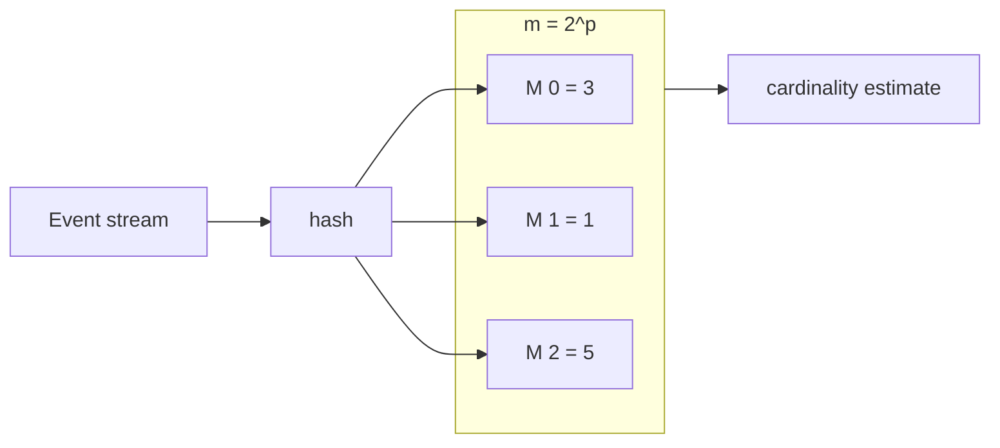
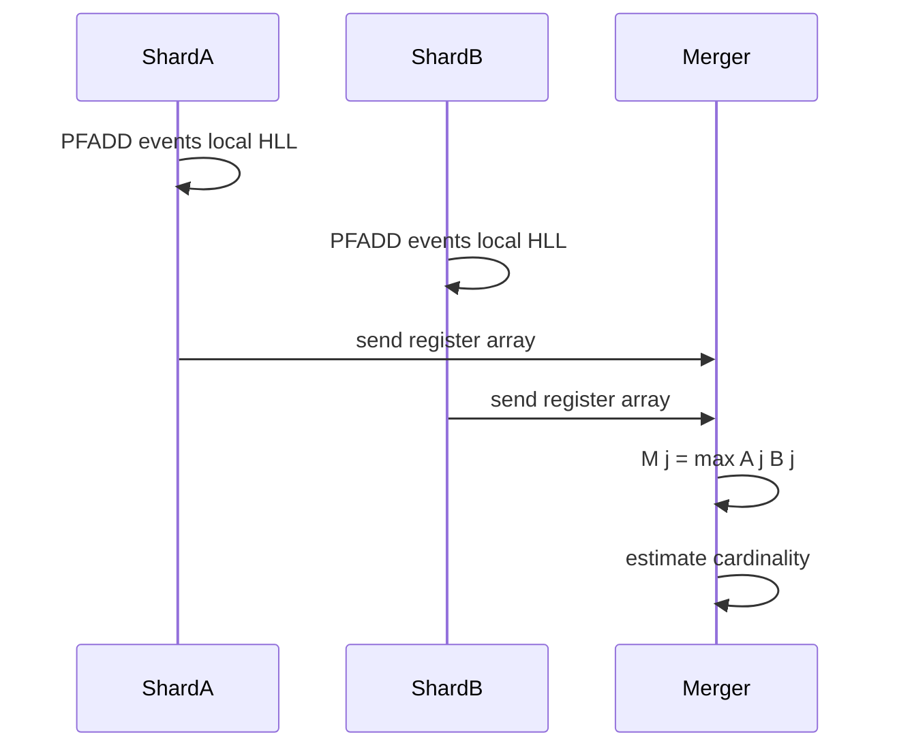

# HyperLogLog Concepts

## Overview

**HyperLogLog (HLL)** estimates the **cardinality** (distinct count) of a multiset streaming past a processor—using **O(log log n)** memory (typically 12 KB for ~2% error) regardless of stream length. It is not a membership structure like [[04-Data-Structures/10-Probabilistic-Structures/Bloom Filters|Bloom Filters]]; it answers "how many **unique** items?" not "is item X present?"

Redis `PFADD`/`PFCOUNT` and many analytics pipelines use HLL variants. This note covers the algorithm and invariants as **concepts** with demo code—not Redis operational detail ([[07-Backend/README|Backend]]).

## Learning Objectives

- Explain leading-zero register update rule and why it estimates cardinality
- Describe HLL merge (union of sketches) for distributed counting
- Compare HLL error (~1–2%) vs exact `Set` memory
- Implement minimal HLL with `m=2^p` registers
- Choose HLL vs exact count vs Bloom for analytics problems

## Prerequisites

- [[04-Data-Structures/10-Probabilistic-Structures/Bloom Filters|Bloom Filters]]
- [[04-Data-Structures/04-Hash-Tables-and-Sets/Hash Functions Avalanche and Equality Contracts|Hash Functions Avalanche and Equality Contracts]]

## Difficulty

`advanced`

## Estimated Time

- Reading: 2 hours
- Exercises: 2 hours
- Mini project: 3 hours

## History

Flajolet & Martin (1985) introduced stochastic counting; HyperLogLog (Flajolet, Fusy, Gandouet, Meunier, 2007) improved variance; HyperLogLog++ (Google, 2013) fixed small-n bias. Standard in CDN unique visitor counts, database optimizers, and stream processors.

## Problem It Solves

Counting distinct user IDs across billions of events with an exact hash set requires O(n) memory—prohibitive. HLL gives a **fixed-size sketch** with bounded relative error, mergeable across shards.

## Internal Implementation

### Register array

Choose precision `p` (4–18 typical); `m = 2^p` registers, each stores max **leading zero count + 1** seen for keys hashing to that register index.

### Add element

1. Hash key to 64-bit value
2. Top `p` bits → register index `j`
3. Remaining bits → count leading zeros `ρ` (plus 1)
4. `M[j] = max(M[j], ρ)`

### Estimate

Harmonic mean of `2^M[j]` with bias correction constants (HLL++; simplified in demo).



## Invariants

- **H1 (Register monotonicity)**: `M[j]` only increases during adds; never decreases until reset.
- **H2 (Index partition)**: Each hash maps to exactly one register `j ∈ [0, m)`.
- **H3 (Max leading zeros)**: `M[j]` equals maximum observed `ρ` among keys assigned to register `j`.
- **H4 (Merge)**: Union sketch satisfies `M[j] = max(M_a[j], M_b[j])` for independent sketches with same `p`.
- **H5 (No membership)**: HLL cannot answer contains(x)—different problem from Bloom.

## Operation Complexity

| Operation | Time | Space | Notes |
| --- | --- | --- | --- |
| `add(x)` | O(1) | O(m) registers | m = 2^p |
| `estimate()` | O(m) | — | Periodic, not per event |
| `merge(a,b)` | O(m) | O(m) | Max per register |
| Relative error | — | — | ~1.04 / √m standard HLL |

For p=14, m=16384, error ~1.6%; memory ~16 KB registers + metadata.

## Mermaid Diagrams

### Structure: registers holding max leading-zero stats



### Sequence: distributed merge



## Examples

### Minimal Example

**TypeScript**:

```typescript
export class HyperLogLog {
  private M: Uint8Array;
  private readonly p: number;
  private readonly m: number;

  constructor(p = 14) {
    this.p = p;
    this.m = 1 << p;
    this.M = new Uint8Array(this.m);
  }

  add(key: string): void {
    const x = hash64(key);
    const j = Number(x >> BigInt(64 - this.p));
    const w = (x << BigInt(this.p)) | (BigInt(1) << BigInt(this.p - 1));
    const rho = leadingZeros64(w) + 1;
    if (rho > this.M[j]) this.M[j] = rho;
  }

  estimate(): number {
    const alpha = 0.7213 / (1 + 1.079 / this.m);
    let sum = 0;
    let zeros = 0;
    for (let j = 0; j < this.m; j++) {
      sum += 2 ** -this.M[j];
      if (this.M[j] === 0) zeros++;
    }
    let est = alpha * this.m * this.m / sum;
    if (est <= 2.5 * this.m && zeros > 0) {
      est = this.m * Math.log(this.m / zeros);
    }
    return Math.round(est);
  }

  merge(other: HyperLogLog): void {
    if (other.p !== this.p) throw new Error("precision mismatch");
    for (let j = 0; j < this.m; j++) {
      if (other.M[j] > this.M[j]) this.M[j] = other.M[j];
    }
  }
}

function hash64(s: string): bigint {
  let h = 0n;
  for (let i = 0; i < s.length; i++) {
    h = (h * 1315423911n + BigInt(s.charCodeAt(i))) & ((1n << 64n) - 1n);
  }
  return h;
}

function leadingZeros64(w: bigint): number {
  if (w === 0n) return 64;
  let n = 0;
  while ((w & (1n << 63n)) === 0n) {
    n++;
    w <<= 1n;
  }
  return n;
}
```

**Python**:

```python
import math
from dataclasses import dataclass, field

@dataclass
class HyperLogLog:
    p: int = 14
    M: list[int] = field(init=False)

    def __post_init__(self) -> None:
        self.m = 1 << self.p
        self.M = [0] * self.m

    def add(self, key: str) -> None:
        x = hash(key) & ((1 << 64) - 1)
        j = x >> (64 - self.p)
        w = ((x << self.p) & ((1 << 64) - 1)) | (1 << (self.p - 1))
        rho = self._leading_zeros(w) + 1
        if rho > self.M[j]:
            self.M[j] = rho

    def estimate(self) -> int:
        alpha = 0.7213 / (1 + 1.079 / self.m)
        inv = sum(2.0 ** -v for v in self.M)
        est = alpha * self.m * self.m / inv
        zeros = sum(1 for v in self.M if v == 0)
        if est <= 2.5 * self.m and zeros:
            est = self.m * math.log(self.m / zeros)
        return round(est)

    @staticmethod
    def _leading_zeros(w: int) -> int:
        if w == 0:
            return 64
        n = 0
        while (w & (1 << 63)) == 0:
            n += 1
            w <<= 1
        return n
```

### Production-Shaped Example

Daily unique visitors: each app server maintains local HLL (`p=14`); batch job merges registers before reporting. Alert if `|estimate - exact_sample| / exact_sample > 0.05` on sampled days for calibration.

## Trade-offs

| Dimension | Upside | Downside | When it matters |
| --- | --- | --- | --- |
| vs exact Set | Fixed ~12 KB | ~1–2% error | Billions distinct |
| vs Bloom | Cardinality | No membership | UV metrics only |
| Mergeable | Shard-local + combine | Same `p` required | Distributed logs |
| p precision | Lower error | More memory | Tight analytics SLAs |

### When to Use

- Distinct count over high-volume streams (UV, unique IPs, unique query patterns)
- Mergeable metrics across parallel workers
- Memory cap regardless of stream length

### When Not to Use

- Exact counts required for billing or compliance
- Need membership or frequency per key (use Bloom, Count-Min sketch, or exact map)
- Very small cardinalities where exact `Set` is cheaper

## Exercises

1. Add 10k random UUIDs; compare HLL estimate to exact `Set` size for p=10,12,14.
2. Prove merge invariant: max registers equals union cardinality estimate.
3. Why does leading-zero pattern relate to distinct count? (Ball into bins intuition.)
4. Implement small-range bias correction when many registers are zero.
5. When does HLL fail badly? (Very low n, hash collisions in ρ.)

## Mini Project

Build **multi-shard UV counter**: simulate 8 workers, merge HLL, plot error vs p.

## Portfolio Project

Analytics sketch module comparing HLL, exact set, and sampled Linear Counting.

## Interview Questions

1. What question does HLL answer vs Bloom filter?
2. What does each register store?
3. How do you merge two HLL sketches?
4. Typical memory and error for p=14?
5. Can HLL tell if a specific key was seen?

### Stretch / Staff-Level

1. Design cardinality pipeline with daily reset vs sliding HLL windows.
2. Compare HLL++ bias correction to raw harmonic mean—when does it matter?

## Common Mistakes

- Using HLL for membership tests
- Merging sketches with different `p`
- Expecting exact counts for small n without small-range correction
- Confusing HLL with Count-Min sketch (frequency, not cardinality)

## Best Practices

- Pick `p` from error budget: error ≈ 1.04/√m
- Calibrate against sampled exact counts in staging
- Document merge semantics in distributed pipelines
- Reset or rotate sketches for time-windowed metrics explicitly

## Summary

HyperLogLog maintains an array of max leading-zero statistics per hash bucket to estimate distinct count in fixed memory. Registers merge by max for distributed aggregation. It complements Bloom filters: HLL counts uniqueness, Bloom tests membership. Production analytics use HLL when approximate cardinality suffices and exact sets are too large.

## Further Reading

- [[00-References/Data Structures/README|Data Structures References]]
- Flajolet et al. (2007) — HyperLogLog paper
- Heule, Nunkesser, Hall (2013) — HyperLogLog++

## Related Notes

- [[04-Data-Structures/10-Probabilistic-Structures/Bloom Filters|Bloom Filters]]
- [[04-Data-Structures/10-Probabilistic-Structures/Counting Bloom and Cuckoo Filters Concepts|Counting Bloom and Cuckoo Filters Concepts]]
- [[04-Data-Structures/14-Production-Selection/Measuring Structures in Production|Measuring Structures in Production]]
- [[04-Data-Structures/04-Hash-Tables-and-Sets/Hash Functions Avalanche and Equality Contracts|Hash Functions Avalanche and Equality Contracts]]

## Progress Checklist

- [ ] Explained from first principles
- [ ] Drew at least one Mermaid diagram
- [ ] Implemented a minimal version
- [ ] Documented trade-offs and non-goals
- [ ] Completed exercises
- [ ] Practiced interview questions aloud
- [ ] Linked prerequisites and dependents
