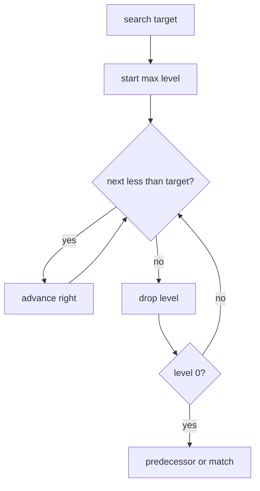
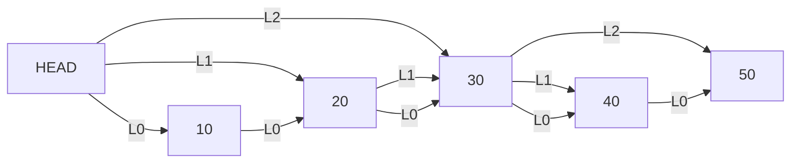
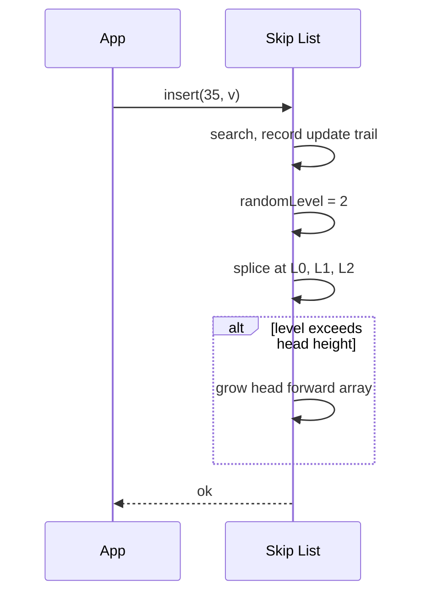

# Skip Lists

## Overview

A **skip list** is a probabilistic ordered structure layering multiple linked lists: level 0 is a sorted singly linked list of all elements; higher levels are **express lanes** skipping subsets of nodes. Search starts at the top-left, moves right while next key < target, then down—expected O(log n) like balanced trees without rotations.

Pugh (1990) designed skip lists for simpler concurrent ordered maps than lock-heavy trees. Redis sorted sets (`ZSET`) use skip list + hash map internally (product detail in [[07-Backend/README|Backend]]). This note focuses on the in-memory ADT.

## Learning Objectives

- Implement search, insert, delete with `p=1/2` level promotion
- Analyze expected level count and pointer overhead
- Compare skip list vs [[04-Data-Structures/05-Trees-and-Ordered-Maps/Red-Black Trees Concepts|Red-Black Trees]] for implementation and concurrency
- Maintain `update[]` predecessor trail on insert/delete
- Relate randomized height to [[04-Data-Structures/05-Trees-and-Ordered-Maps/Treaps and Scapegoat Trees Concepts|Treaps and Scapegoat Trees Concepts]]

## Prerequisites

- [[04-Data-Structures/05-Trees-and-Ordered-Maps/Binary Search Trees|Binary Search Trees]]
- [[04-Data-Structures/02-Linked-Structures/Singly Linked Lists|Singly Linked Lists]]
- [[04-Data-Structures/05-Trees-and-Ordered-Maps/Treaps and Scapegoat Trees Concepts|Treaps and Scapegoat Trees Concepts]]

## Difficulty

`advanced`

## Estimated Time

- Reading: 2 hours
- Exercises: 3 hours
- Mini project: 4 hours

## History

William Pugh (1990) sought a simpler alternative to balanced trees with similar bounds. Skip lists became popular in concurrent libraries (Java `ConcurrentSkipListMap`) because updates touch local pointers—easier to reason about than tree rebalancing under locks.

## Problem It Solves

Sorted linked list search is O(n). Balanced BSTs achieve O(log n) but require complex rebalancing. Skip lists achieve expected O(log n) with **coin-flip level assignment** and simpler insert/delete local rewiring.

## Internal Implementation

### Node

```text
Node: key, value, forward[0..level]
```

### Search

From head at top level, while `forward[i].key < target`: advance; else drop level. At level 0, land on predecessor or exact match.

### Insert

1. Search recording `update[i]` predecessors per level
2. Random level `L` (geometric: promote while coin heads, cap MAX_LEVEL)
3. Splice node at levels 0..L

### Delete

Search with update trail; unlink at all levels node participates.

Expected pointers per node: 2 (for p=1/2).



## Invariants

- **SL1 (Sorted level 0)**: Level-0 list keys strictly increasing (or non-decreasing if multiset).
- **SL2 (Express lane subset)**: Level `i+1` links are subset of level `i` links (subsequence property).
- **SL3 (Reachability)**: From head, every inserted key reachable following forward pointers.
- **SL4 (Head height)**: Head `forward` array length ≥ max node level in list.
- **SL5 (Unique keys)**: Map variant: at most one node per key at level 0.

## Operation Complexity

| Operation | Expected | Worst | Space |
| --- | --- | --- | --- |
| `search(k)` | O(log n) | O(n)* | — |
| `insert(k,v)` | O(log n) | O(n)* | O(log n) new pointers |
| `delete(k)` | O(log n) | O(n)* | — |
| Iterate ordered | O(n) | O(n) | — |

*Worst if bad randomness or adversarial level assignment; p=1/2 random gives high probability O(log n).

## Mermaid Diagrams

### Structure: multi-level express lanes



### Sequence: insert with level promotion



## Examples

### Minimal Example

**TypeScript**:

```typescript
const MAX_LEVEL = 16;
const P = 0.5;

type SLNode = { key: number; value: string; forward: SLNode[] };

export class SkipList {
  private head: SLNode = { key: -Infinity, value: "", forward: [] };
  private level = 0;

  private randomLevel(): number {
    let lvl = 0;
    while (Math.random() < P && lvl < MAX_LEVEL) lvl++;
    return lvl;
  }

  search(key: number): SLNode | null {
    let cur = this.head;
    for (let i = this.level; i >= 0; i--) {
      while (cur.forward[i] && cur.forward[i].key < key) {
        cur = cur.forward[i];
      }
    }
    cur = cur.forward[0];
    return cur && cur.key === key ? cur : null;
  }

  insert(key: number, value: string): void {
    const update: SLNode[] = new Array(MAX_LEVEL + 1);
    let cur = this.head;
    for (let i = this.level; i >= 0; i--) {
      while (cur.forward[i] && cur.forward[i].key < key) cur = cur.forward[i];
      update[i] = cur;
    }
    const lvl = this.randomLevel();
    if (lvl > this.level) {
      for (let i = this.level + 1; i <= lvl; i++) update[i] = this.head;
      this.level = lvl;
    }
    const node: SLNode = { key, value, forward: new Array(lvl + 1) };
    for (let i = 0; i <= lvl; i++) {
      node.forward[i] = update[i].forward[i];
      update[i].forward[i] = node;
    }
  }
}
```

**Python**:

```python
import random
from dataclasses import dataclass, field

MAX_LEVEL = 16
P = 0.5

@dataclass
class SLNode:
    key: float
    value: object
    forward: list["SLNode | None"] = field(default_factory=list)

class SkipList:
    def __init__(self) -> None:
        self.head = SLNode(float("-inf"), None, [])
        self.level = 0

    def _random_level(self) -> int:
        lvl = 0
        while random.random() < P and lvl < MAX_LEVEL:
            lvl += 1
        return lvl

    def search(self, key: float) -> SLNode | None:
        cur = self.head
        for i in range(self.level, -1, -1):
            while i < len(cur.forward) and cur.forward[i] and cur.forward[i].key < key:
                cur = cur.forward[i]
        nxt = cur.forward[0] if cur.forward else None
        return nxt if nxt and nxt.key == key else None

    def insert(self, key: float, value: object) -> None:
        update: list[SLNode] = [self.head] * (MAX_LEVEL + 1)
        cur = self.head
        for i in range(self.level, -1, -1):
            while i < len(cur.forward) and cur.forward[i] and cur.forward[i].key < key:
                cur = cur.forward[i]
            update[i] = cur
        lvl = self._random_level()
        if lvl > self.level:
            for i in range(self.level + 1, lvl + 1):
                update[i] = self.head
            self.level = lvl
        node = SLNode(key, value, [None] * (lvl + 1))
        for i in range(lvl + 1):
            node.forward[i] = update[i].forward[i] if i < len(update[i].forward) else None
            if i >= len(update[i].forward):
                update[i].forward.extend([None] * (i - len(update[i].forward) + 1))
            update[i].forward[i] = node
```

### Production-Shaped Example

Concurrent skip list: protect **individual node updates** or use lock-free variants (concept in [[04-Data-Structures/13-Concurrency-Aware-Structures/Read-Copy-Update and Epoch Concepts|Read-Copy-Update and Epoch Concepts]]). Java `ConcurrentSkipListMap` uses marker nodes and fine-grained locking—study for patterns, implement single-threaded first.

## Trade-offs

| Dimension | Upside | Downside | When it matters |
| --- | --- | --- | --- |
| vs RB tree | Simpler insert/delete | Extra pointers ~2n | Concurrent ordered map |
| vs BST | Expected balance easy | Worst O(n) if RNG bad | Adversarial concerns |
| vs hash map | Ordered iteration | O(log n) not O(1) | Range queries |
| Memory | No rotation metadata | Pointer overhead | Large n cache effects |

### When to Use

- Ordered map needing simpler concurrency than trees
- Range scans (`rank`, `rangeByScore`) with acceptable log n
- Teaching randomized balancing

### When Not to Use

- Pure key-value with no ordering—use hash map
- Hard worst-case latency without randomness guarantee
- Memory-tight embedded (pointer overhead)

## Exercises

1. Insert 1..20 with traced levels; draw resulting skip list.
2. Implement delete and verify SL1–SL5 with assertions.
3. Measure height distribution over 100k inserts; compare to log2(n).
4. Implement `rank(key)` using span lengths or walk level 0.
5. Compare search comparisons: skip list vs BST vs RB for random keys.

## Mini Project

Complete ordered map ADT: insert, delete, search, `forEach` in ascending order; property-test sorted invariant.

## Portfolio Project

Concurrent structures bench: skip list vs tree vs hash for mixed read/write workloads.

## Interview Questions

1. How does skip list search achieve O(log n) expected?
2. What is the role of `update[]` on insert?
3. Skip list vs red-black tree for concurrent access?
4. Expected number of pointers per node for p=1/2?
5. Worst-case skip list height without randomization?

### Stretch / Staff-Level

1. Outline lock-free skip list insert challenges (helping links, markers).
2. Design zset-like structure: skip list + hash map for O(1) key lookup.

## Common Mistakes

- Forgetting to grow head when new node level exceeds current max
- Breaking subsequence invariant when splicing levels
- Using deterministic levels (sorted insert order → linked list)
- Off-by-one in level indexing on delete leaving dangling forward

## Best Practices

- Use crypto-grade RNG if adversarial input possible
- Cap MAX_LEVEL from expected n: `log_{1/p}(n)`
- Pair with hash map for key→node when O(1) lookup needed
- Assert invariants in debug builds during development

## Summary

Skip lists layer sorted linked lists with randomly promoted express lanes. Search drops down and advances right; insert splices using a predecessor trail from search. Expected performance matches balanced trees with simpler local updates—at the cost of extra pointers and probabilistic bounds. They bridge linked structures, trees, and concurrent ordered maps in production systems.

## Further Reading

- [[00-References/Data Structures/README|Data Structures References]]
- Pugh (1990) — Skip lists paper
- Java `ConcurrentSkipListMap` source

## Related Notes

- [[04-Data-Structures/05-Trees-and-Ordered-Maps/Binary Search Trees|Binary Search Trees]]
- [[04-Data-Structures/05-Trees-and-Ordered-Maps/Treaps and Scapegoat Trees Concepts|Treaps and Scapegoat Trees Concepts]]
- [[04-Data-Structures/05-Trees-and-Ordered-Maps/Red-Black Trees Concepts|Red-Black Trees Concepts]]
- [[04-Data-Structures/02-Linked-Structures/Singly Linked Lists|Singly Linked Lists]]
- [[04-Data-Structures/13-Concurrency-Aware-Structures/Concurrent Hash Maps Concepts|Concurrent Hash Maps Concepts]]

## Progress Checklist

- [ ] Explained from first principles
- [ ] Drew at least one Mermaid diagram
- [ ] Implemented a minimal version
- [ ] Documented trade-offs and non-goals
- [ ] Completed exercises
- [ ] Practiced interview questions aloud
- [ ] Linked prerequisites and dependents
