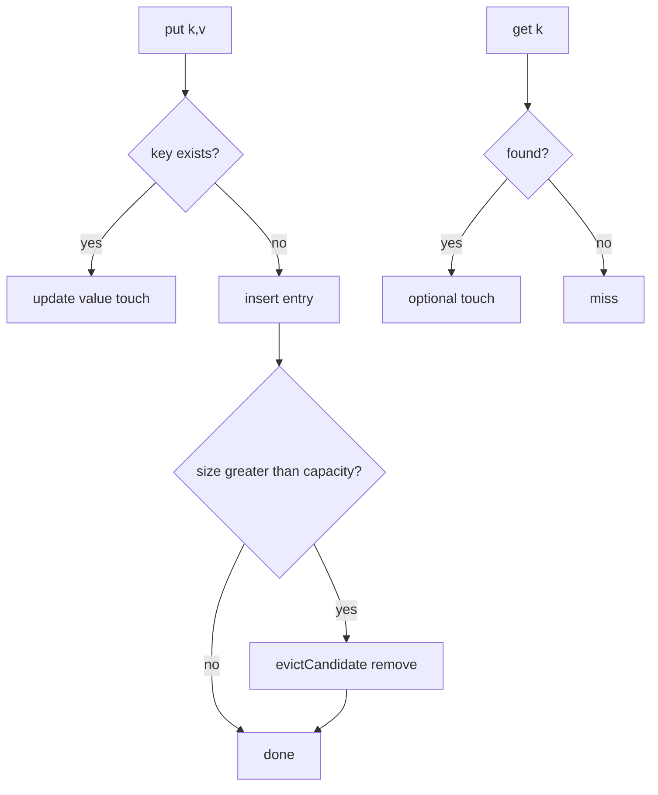
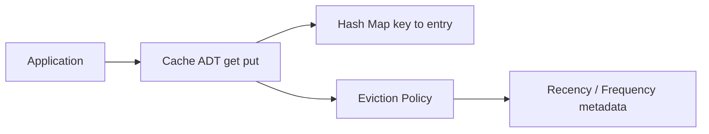
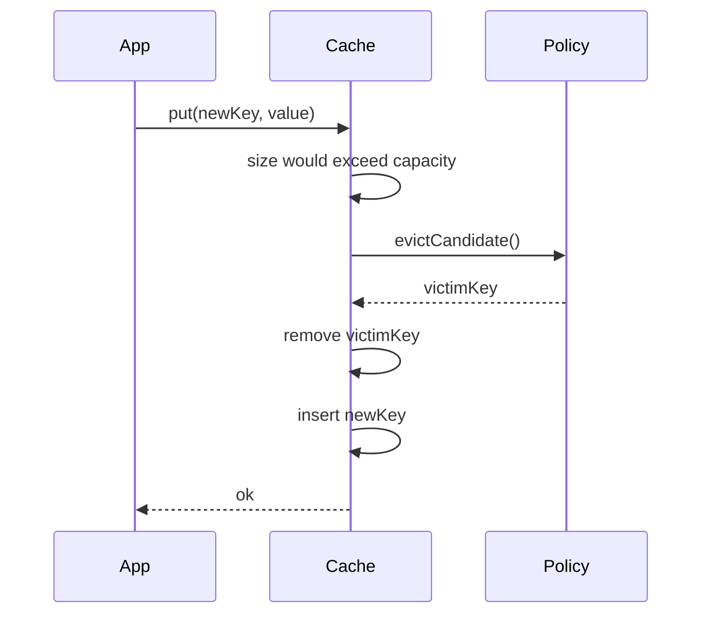

# Cache ADT Get Put and Capacity

## Overview

A **cache** is a bounded key-value store optimizing **repeat access** to expensive data. The **Cache ADT** defines `get(key)`, `put(key, value)`, and a **capacity** limit. On insert when full, an **eviction policy** removes one entry. `get` may or may not count as **use** (refresh recency) depending on policy contract.

This note defines the in-process ADT and contracts. Distributed product caches (Redis, Memcached) are covered in [[07-Backend/README|Backend]]—here we focus on structures you implement in application memory.

## Learning Objectives

- Specify cache operations, capacity semantics, and error behavior
- Distinguish cache-aside vs read-through vs write-through (application pattern)
- Define **hit**, **miss**, **eviction**, and **load factor** metrics
- Implement a capacity-bounded cache skeleton with pluggable eviction
- Choose ADT variants: LRU refresh on get, TTL expiry, negative caching

## Prerequisites

- [[04-Data-Structures/00-Orientation-and-Contracts/Abstract Data Types vs Concrete Structures|Abstract Data Types vs Concrete Structures]]
- [[04-Data-Structures/00-Orientation-and-Contracts/Interface Design Capacity Errors and Iteration|Interface Design Capacity Errors and Iteration]]
- [[04-Data-Structures/04-Hash-Tables-and-Sets/Separate Chaining|Separate Chaining]]

## Difficulty

`intermediate`

## Estimated Time

- Reading: 1.5 hours
- Exercises: 2 hours
- Mini project: 3 hours

## History

CPU caches (1960s) formalized locality; software caches followed in OS buffer caches, memoization, ORM second-level caches, and CDN edge stores. The ADT abstraction separates **fast lookup** from **replacement policy**.

## Problem It Solves

Unbounded in-memory maps grow until OOM. Caches cap memory while maximizing **hit rate** for skewed access patterns (80/20). The ADT lets you swap LRU, LFU, or TTL policies without changing caller logic.

## Internal Implementation

### Core operations

- `get(k) → v | miss`: lookup; optional **touch** updates eviction metadata
- `put(k, v)`: insert or update; if size > capacity after insert, **evict**
- `delete(k)`, `clear()`, `size`, `capacity`

### Capacity models

- **Entry count cap**: max N keys (common in interview LRU)
- **Weighted capacity**: entries have sizes (byte-weighted eviction)
- **Soft vs hard**: soft limit triggers eviction; hard limit rejects puts

### Eviction hook

```text
evictCandidate() → key   // policy-specific
```

Concrete policies: [[04-Data-Structures/11-Caches-and-Eviction/LRU via Hash Map and Doubly Linked List|LRU via Hash Map and Doubly Linked List]], [[04-Data-Structures/11-Caches-and-Eviction/LFU Clock and Segmented LRU Concepts|LFU Clock and Segmented LRU Concepts]].



## Invariants

- **C1 (Capacity)**: `size ≤ capacity` after every operation completes (except transient during put before evict).
- **C2 (Key uniqueness)**: At most one entry per key.
- **C3 (Eviction closure)**: Each put that would exceed capacity removes exactly one entry (unless weighted multi-evict).
- **C4 (Get consistency)**: `get(k)` after successful `put(k,v)` returns `v` until evicted or deleted.
- **C5 (Policy contract)**: If `get` refreshes recency, every hit updates eviction metadata deterministically.

## Operation Complexity

| Operation | Average | Notes |
| --- | --- | --- |
| `get(k)` | O(1)* | *With hash map backing |
| `put(k,v)` | O(1)* | + O(1) evict typical |
| `delete(k)` | O(1)* | |
| `evict()` | O(1)* | Policy-dependent; heap LFU may be O(log n) |

Space: O(capacity) entries plus eviction metadata.

## Mermaid Diagrams

### Structure: ADT layers



### Sequence: put causing eviction



## Examples

### Minimal Example

**TypeScript**:

```typescript
export interface EvictionPolicy<K> {
  onGet(key: K): void;
  onPut(key: K, isNew: boolean): void;
  onRemove(key: K): void;
  evictCandidate(): K | undefined;
}

export class Cache<K, V> {
  private store = new Map<K, V>();

  constructor(
    private readonly capacity: number,
    private readonly policy: EvictionPolicy<K>
  ) {
    if (capacity <= 0) throw new Error("capacity must be positive");
  }

  get(key: K): V | undefined {
    const v = this.store.get(key);
    if (v !== undefined) this.policy.onGet(key);
    return v;
  }

  put(key: K, value: V): void {
    const isNew = !this.store.has(key);
    this.store.set(key, value);
    this.policy.onPut(key, isNew);
    while (this.store.size > this.capacity) {
      const victim = this.policy.evictCandidate();
      if (victim === undefined) break;
      this.store.delete(victim);
      this.policy.onRemove(victim);
    }
  }

  get size(): number {
    return this.store.size;
  }
}
```

**Python**:

```python
from abc import ABC, abstractmethod
from typing import Generic, TypeVar, Optional

K = TypeVar("K")
V = TypeVar("V")

class EvictionPolicy(ABC, Generic[K]):
    @abstractmethod
    def on_get(self, key: K) -> None: ...

    @abstractmethod
    def on_put(self, key: K, is_new: bool) -> None: ...

    @abstractmethod
    def on_remove(self, key: K) -> None: ...

    @abstractmethod
    def evict_candidate(self) -> Optional[K]: ...

class Cache(Generic[K, V]):
    def __init__(self, capacity: int, policy: EvictionPolicy[K]) -> None:
        if capacity <= 0:
            raise ValueError("capacity must be positive")
        self._capacity = capacity
        self._policy = policy
        self._store: dict[K, V] = {}

    def get(self, key: K) -> Optional[V]:
        if key not in self._store:
            return None
        self._policy.on_get(key)
        return self._store[key]

    def put(self, key: K, value: V) -> None:
        is_new = key not in self._store
        self._store[key] = value
        self._policy.on_put(key, is_new)
        while len(self._store) > self._capacity:
            victim = self._policy.evict_candidate()
            if victim is None:
                break
            del self._store[victim]
            self._policy.on_remove(victim)
```

### Production-Shaped Example

Instrument cache with **hit rate**, **eviction count**, **p99 get latency**. Expose metrics:

```typescript
type CacheMetrics = {
  hits: number;
  misses: number;
  evictions: number;
  size: number;
};
```

Document whether `get` refreshes TTL/LRU—callers depend on contract. See [[04-Data-Structures/14-Production-Selection/Measuring Structures in Production|Measuring Structures in Production]].

## Trade-offs

| Dimension | Upside | Downside | When it matters |
| --- | --- | --- | --- |
| Pluggable policy | Swap LRU/LFU without API change | Policy bugs break C1 | Large services |
| get refreshes recency | Better hit rate for hot keys | Extra work per hit | Read-heavy |
| Entry vs byte cap | Simple | Large values skew memory | Mixed object sizes |
| In-process only | Microsecond latency | No cross-host sharing | Single-node hot path |

### When to Use

- Repeated expensive computation or I/O (DB, HTTP, serialization)
- Bounded memory for derived data (parsed configs, rendered fragments)
- Testing eviction policies in isolation before distributed cache

### When Not to Use

- Data must never be stale without TTL discipline
- Consistency across nodes required (use distributed cache in Backend)
- Working set always exceeds any practical capacity without acceptably low hit rate

## Exercises

1. Implement `Cache` with stub policy always evicting oldest inserted key.
2. Define formal pre/postconditions for `put` respecting C1–C5.
3. Simulate Zipf access; plot hit rate vs capacity for random vs LRU policy stub.
4. Add weighted capacity: evict until `sum(sizes) ≤ cap`.
5. When should `get` **not** refresh recency? (Scan workloads.)

## Mini Project

Build cache-aside wrapper around async fetch function with metrics and configurable capacity.

## Portfolio Project

Cache policy shootout framework feeding traces from production access logs (anonymized).

## Interview Questions

1. What happens on `put` when cache is full?
2. Difference between cache-aside and read-through?
3. Should `get` update LRU order? Why or why not?
4. How do you measure cache effectiveness?
5. Entry-cap vs byte-cap eviction?

### Stretch / Staff-Level

1. Design API supporting `peek(key)` without recency update for scan-resistant caches.
2. How do negative caching and TTL interact with capacity eviction?

## Common Mistakes

- Forgetting to evict after update that doesn't increase size but changes value needing space
- `get` not refreshing policy metadata when contract says LRU
- Off-by-one: allowing size == capacity + 1 transiently visible to iterators
- No metrics—flying blind on hit rate

## Best Practices

- Document eviction policy and get-touch semantics in type/interface docs
- Expose hit/miss/eviction metrics from day one
- Pre-size hash map to capacity to avoid rehash during warm-up
- Separate **cache ADT** from **loading logic** (cache-aside)

## Summary

The Cache ADT combines fast key-value access with a fixed capacity and eviction policy. `get` and `put` maintain size bounds by evicting when necessary; policies define which key leaves. This abstraction underlies in-process memoization and front-end blocks of distributed caches—implement the ADT cleanly before optimizing specific eviction algorithms.

## Further Reading

- [[00-References/Data Structures/README|Data Structures References]]
- Hennessy & Patterson — memory hierarchy (CPU cache analogy)

## Related Notes

- [[04-Data-Structures/11-Caches-and-Eviction/LRU via Hash Map and Doubly Linked List|LRU via Hash Map and Doubly Linked List]]
- [[04-Data-Structures/11-Caches-and-Eviction/LFU Clock and Segmented LRU Concepts|LFU Clock and Segmented LRU Concepts]]
- [[04-Data-Structures/11-Caches-and-Eviction/TTL Soft References and Coalesced Expiry|TTL Soft References and Coalesced Expiry]]
- [[04-Data-Structures/00-Orientation-and-Contracts/Interface Design Capacity Errors and Iteration|Interface Design Capacity Errors and Iteration]]
- [[04-Data-Structures/14-Production-Selection/Measuring Structures in Production|Measuring Structures in Production]]

## Progress Checklist

- [ ] Explained from first principles
- [ ] Drew at least one Mermaid diagram
- [ ] Implemented a minimal version
- [ ] Documented trade-offs and non-goals
- [ ] Completed exercises
- [ ] Practiced interview questions aloud
- [ ] Linked prerequisites and dependents
