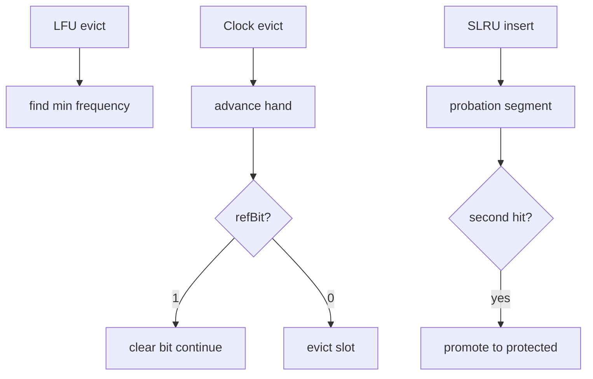
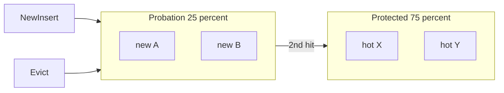
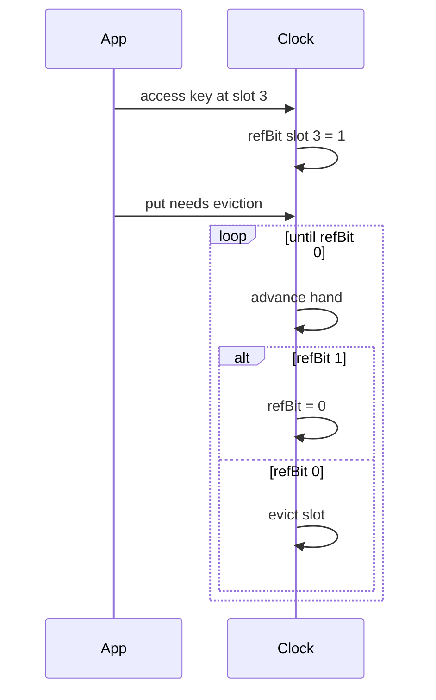

# LFU Clock and Segmented LRU Concepts

## Overview

When **frequency** matters more than last touch, **Least Frequently Used (LFU)** evicts the key with lowest access count. **Clock** (second-chance) approximates LRU with a **circular buffer** and reference bits—O(1) without DLL. **Segmented LRU (SLRU)** splits cache into **probation** and **protected** segments to resist one-shot scans evicting hot entries.

Concepts note: full LFU with dynamic aging is non-trivial; production systems often hybridize (Redis LFU with logarithmic counters—see [[07-Backend/README|Backend]]). Focus on invariants and trade-offs here.

## Learning Objectives

- Describe LFU counter semantics and stale-frequency problem
- Explain clock hand sweep and reference bit second chance
- Trace SLRU promotion from probation to protected on second hit
- Compare policies on scan vs hot-set workloads
- Sketch O(1) LFU via min-heap + lazy decrement (concept)

## Prerequisites

- [[04-Data-Structures/11-Caches-and-Eviction/LRU via Hash Map and Doubly Linked List|LRU via Hash Map and Doubly Linked List]]
- [[04-Data-Structures/06-Heaps-and-Priority-Queues/Binary Heaps and Array Layout|Binary Heaps and Array Layout]]

## Difficulty

`advanced`

## Estimated Time

- Reading: 2 hours
- Exercises: 2 hours
- Mini project: 3 hours

## History

LFU appears in database buffer pools; clock algorithm in Multics and UNIX page replacement. SLRU and variants (2Q, ARC) address LRU scan pathology documented in storage literature. Memcached and Redis offer multiple eviction policies at product layer.

## Problem It Solves

LRU evicts frequently used items after a full-table scan touches every key once. LFU retains **hot** keys but accumulates ** stale frequency** for formerly hot keys. Clock provides cheap approximate LRU; SLRU protects established entries from first-time scans.

## Internal Implementation

### LFU (concept)

- Each entry: `freq` counter, incremented on access
- Evict minimum `freq`; tie-break LRU among min freq
- **Aging**: periodic halving of all counters or time-decayed frequency

O(1) approximate LFU: maintain `freq → doubly linked list of keys` (similar to LRU lists per frequency)—complex but used in production caches.

### Clock

Circular array of slots `{key, refBit}`. **Hand** points to next eviction candidate. On access: set `refBit=1`. On evict need: advance hand; if refBit 1 → clear and continue; if 0 → evict.

### SLRU

Two regions: **probation** (new entries) and **protected** (promoted on second access). Evict from probation first; on protected overflow, demote LRU protected to probation.



## Invariants

### LFU

- **LF1**: `freq(k)` equals access count since insert or last aging event (approximation in decay variants).
- **LF2**: Eviction selects key with minimum freq unless tie-break specified.
- **LF3 (Aging)**: Periodic decay prevents permanent hot ghosts.

### Clock

- **CL1**: Hand cycles through all slots modulo array length.
- **CL2**: refBit set on access before next hand pass clears it.
- **CL3**: Occupied slots contain valid keys or empty marker.

### SLRU

- **SL1**: New keys enter probation only.
- **SL2**: Protected holds keys with ≥2 hits in window (policy-specific).
- **SL3**: Eviction order: probation LRU first, then protected LRU.

## Operation Complexity

| Policy | get/put | evict | Notes |
| --- | --- | --- | --- |
| LFU (heap) | O(log n) | O(log n) | Simple teaching impl |
| LFU (freq lists) | O(1) amortized | O(1) | Production-shaped |
| Clock | O(1) | O(n) worst sweep* | *Rare long sweep |
| SLRU | O(1) with LRU backing | O(1) | Two LRU structures |

## Mermaid Diagrams

### Structure: SLRU segments



### Sequence: clock second chance



## Examples

### Minimal Example — Clock demo

**TypeScript**:

```typescript
type Slot<K, V> = { key: K | null; value: V | null; ref: boolean };

export class ClockCache<K, V> {
  private slots: Slot<K, V>[];
  private hand = 0;
  private count = 0;

  constructor(private capacity: number) {
    this.slots = Array.from({ length: capacity }, () => ({
      key: null,
      value: null,
      ref: false,
    }));
  }

  get(key: K): V | undefined {
    const i = this.slots.findIndex((s) => s.key === key);
    if (i === -1) return undefined;
    this.slots[i].ref = true;
    return this.slots[i].value ?? undefined;
  }

  put(key: K, value: V): void {
    const i = this.slots.findIndex((s) => s.key === key);
    if (i !== -1) {
      this.slots[i].value = value;
      this.slots[i].ref = true;
      return;
    }
    while (true) {
      const s = this.slots[this.hand];
      if (s.key === null) {
        s.key = key;
        s.value = value;
        s.ref = true;
        this.count++;
        this.hand = (this.hand + 1) % this.capacity;
        return;
      }
      if (!s.ref) {
        s.key = key;
        s.value = value;
        s.ref = true;
        this.hand = (this.hand + 1) % this.capacity;
        return;
      }
      s.ref = false;
      this.hand = (this.hand + 1) % this.capacity;
    }
  }
}
```

**Python** — LFU with heap (concept):

```python
import heapq
from dataclasses import dataclass, field
from typing import Generic, Optional, TypeVar

K = TypeVar("K")
V = TypeVar("V")

@dataclass(order=True)
class _LFUEntry(Generic[K, V]):
    freq: int
    order: int
    key: K = field(compare=False)
    value: V = field(compare=False)

class LFUCacheConcept(Generic[K, V]):
    def __init__(self, capacity: int) -> None:
        self.capacity = capacity
        self._heap: list[_LFUEntry[K, V]] = []
        self._map: dict[K, _LFUEntry[K, V]] = {}
        self._order = 0

    def get(self, key: K) -> Optional[V]:
        if key not in self._map:
            return None
        e = self._map[key]
        e.freq += 1
        heapq.heapify(self._heap)  # demo only; production uses freq lists
        return e.value

    def put(self, key: K, value: V) -> None:
        if key in self._map:
            e = self._map[key]
            e.value = value
            e.freq += 1
            return
        if len(self._map) >= self.capacity:
            victim = heapq.heappop(self._heap)
            del self._map[victim.key]
        self._order += 1
        e = _LFUEntry(1, self._order, key, value)
        self._map[key] = e
        heapq.heappush(self._heap, e)
```

### Production-Shaped Example

Choose policy from workload trace:

| Pattern | Prefer |
| --- | --- |
| Hot small set, occasional scan | SLRU or ARC |
| Stable hot keys, long lifetime | LFU with decay |
| Uniform cost, simple code | LRU |
| Memory pressure, approximate OK | Clock |

Instrument **eviction reason** tags in metrics for tuning.

## Trade-offs

| Dimension | Upside | Downside | When it matters |
| --- | --- | --- | --- |
| LFU vs LRU | Keeps hot keys | Stale freq, complex O(1) | CDN popular objects |
| Clock vs LRU DLL | Less pointer memory | Approximate, long sweeps | OS page frames |
| SLRU vs LRU | Scan resistant | Two capacities to tune | DB buffer pool |
| Aging LFU | Fixes ghost hot keys | Periodic CPU spike | Long-running caches |

### When to Use

- LFU: repeated access to stable popular subset
- Clock: embedded/OS-style fixed slot tables
- SLRU: mixed scan + hot-set (ORM, buffer pools)

### When Not to Use

- Tiny caches where LRU suffices
- Team cannot tune SLRU/ARC parameters
- Strict O(1) required without heap—avoid naive LFU heap at scale

## Exercises

1. Construct scan workload where LRU hit rate → 0; show SLRU improvement (simulation).
2. Trace clock hand through 5 slots with mixed ref bits.
3. Show stale LFU: key hot then idle forever—frequency still high.
4. Propose aging scheme halving counters every T seconds.
5. Compare Redis policies conceptually to in-process choices.

## Mini Project

Policy simulator: input access trace file, output hit rate for LRU/LFU/Clock/SLRU.

## Portfolio Project

Eviction policy benchmark in Structures Workbench with downloadable traces.

## Interview Questions

1. When does LFU beat LRU?
2. What is clock algorithm's reference bit?
3. Why SLRU for database buffer pools?
4. Stale frequency problem in LFU?
5. O(1) LFU implementation sketch (freq buckets)?

### Stretch / Staff-Level

1. Explain ARC (Adaptive Replacement Cache) high level vs SLRU.
2. Design decaying LFU for 1M keys without full counter scan.

## Common Mistakes

- LFU without aging—formerly hot keys never leave
- Clock with hand not advancing on empty slots— infinite loop
- SLRU with wrong probation/protected ratio (0% protected)
- Using heap LFU in production hot path without profiling

## Best Practices

- Replay production access traces before choosing policy
- Combine TTL with any policy for staleness bounds
- Document tie-break rules (LRU among equal freq)
- Start LRU; upgrade only when metrics prove scan pathology

## Summary

LFU favors frequently used keys but needs aging to forget the past. Clock approximates LRU with reference bits in a ring. SLRU segregates new from established entries to survive scans. No single policy wins all workloads—understand invariants and measure hit rate on representative traces before committing.

## Further Reading

- [[00-References/Data Structures/README|Data Structures References]]
- Megiddo & Modha — ARC paper
- Redis eviction policy documentation (Backend cross-link)

## Related Notes

- [[04-Data-Structures/11-Caches-and-Eviction/LRU via Hash Map and Doubly Linked List|LRU via Hash Map and Doubly Linked List]]
- [[04-Data-Structures/11-Caches-and-Eviction/Cache ADT Get Put and Capacity|Cache ADT Get Put and Capacity]]
- [[04-Data-Structures/06-Heaps-and-Priority-Queues/Binary Heaps and Array Layout|Binary Heaps and Array Layout]]
- [[04-Data-Structures/11-Caches-and-Eviction/TTL Soft References and Coalesced Expiry|TTL Soft References and Coalesced Expiry]]
- [[04-Data-Structures/14-Production-Selection/Structure Selection Decision Matrix|Structure Selection Decision Matrix]]

## Progress Checklist

- [ ] Explained from first principles
- [ ] Drew at least one Mermaid diagram
- [ ] Implemented a minimal version
- [ ] Documented trade-offs and non-goals
- [ ] Completed exercises
- [ ] Practiced interview questions aloud
- [ ] Linked prerequisites and dependents
