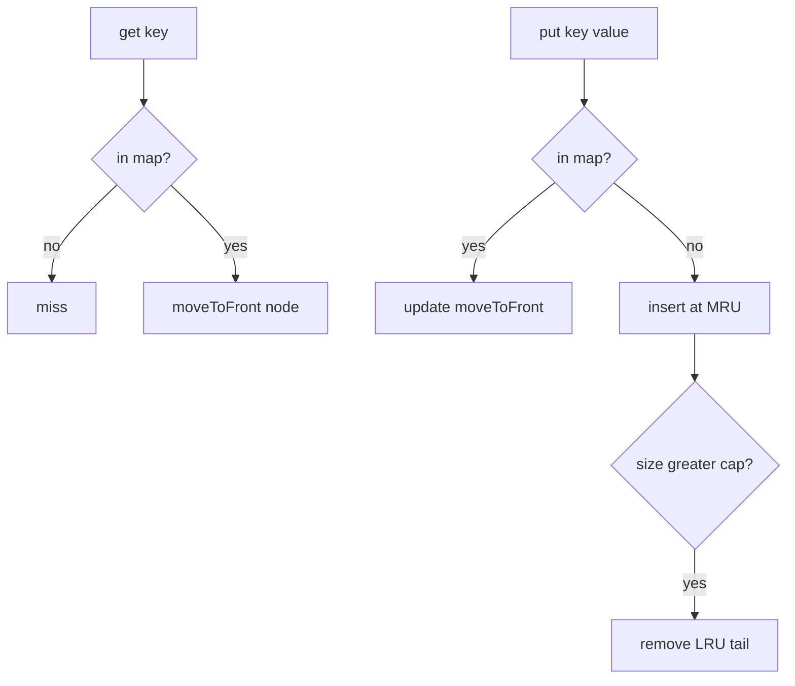
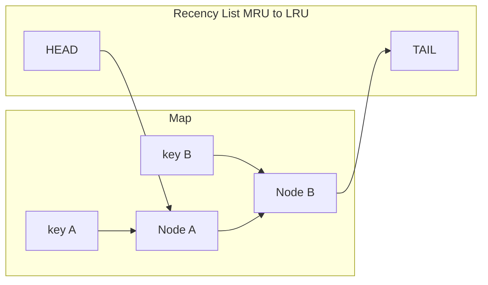
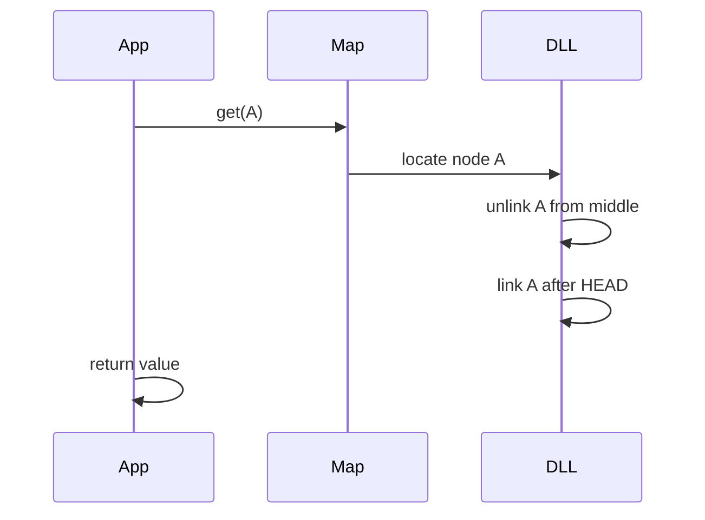

# LRU via Hash Map and Doubly Linked List

## Overview

**Least Recently Used (LRU)** eviction removes the key whose last access (get or put) was oldest. The canonical O(1) implementation pairs:

- **Hash map** `key → node` for lookup
- **Doubly linked list** ordered by recency (MRU near head, LRU near tail)

On hit or update, **move node to MRU**. On overflow, **evict tail** predecessor of sentinel.

This is the standard interview and production in-process pattern. Distributed LRU (Redis `maxmemory-policy`) is [[07-Backend/README|Backend]] territory.

## Learning Objectives

- Implement O(1) get/put LRU with sentinel doubly linked list
- Maintain hash map and list invariants jointly on every operation
- Analyze LRU vs access patterns (good on temporal locality, bad on scans)
- Handle update-in-place vs relink on put existing key
- Debug common pointer bugs with sentinel diagram

## Prerequisites

- [[04-Data-Structures/11-Caches-and-Eviction/Cache ADT Get Put and Capacity|Cache ADT Get Put and Capacity]]
- [[04-Data-Structures/02-Linked-Structures/Doubly Linked Lists and Sentinels|Doubly Linked Lists and Sentinels]]
- [[04-Data-Structures/04-Hash-Tables-and-Sets/Separate Chaining|Separate Chaining]]

## Difficulty

`intermediate`

## Estimated Time

- Reading: 2 hours
- Exercises: 3 hours
- Mini project: 4 hours

## History

LRU approximates Belady's optimal policy when recency predicts future use. Knuth-era list+map combinations appeared in early virtual memory; today it's the default `LinkedHashMap` access-order mode in Java and countless coding interviews.

## Problem It Solves

Eviction policy must be O(1) per operation at scale. Scanning timestamps or sorting keys is O(n). Hash map + DLL gives constant-time lookup and recency update.

## Internal Implementation

### Node

```text
Node { key, value, prev, next }
Sentinel head <-> ... <-> tail
```

Map stores `key → Node` for O(1) locate. **Never store key only in map without list node**—eviction needs list position.

### get(key)

1. If missing → miss
2. Move node to MRU (after head sentinel)
3. Return value

### put(key, value)

1. If exists: update value, move MRU
2. Else: create node at MRU; if size > capacity, remove LRU (before tail sentinel), delete from map



## Invariants

- **L1 (Map-list bijection)**: Every map entry points to exactly one list node; list nodes' keys exist in map.
- **L2 (Recency order)**: List order from head to tail equals access order most-recent-first.
- **L3 (Capacity)**: Node count equals map size ≤ capacity.
- **L4 (Sentinel wiring)**: Head.prev and tail.next null or sentinel loop per design; no orphaned nodes.
- **L5 (Key-node identity)**: Node.key matches map key; update key immutably or reindex map on key change.

## Operation Complexity

| Operation | Time | Space |
| --- | --- | --- |
| `get(k)` | O(1) | — |
| `put(k,v)` | O(1) | O(capacity) |
| `evict()` | O(1) | — |
| `delete(k)` | O(1) | — |

Each op: at most one hash lookup, constant pointer splices.

## Mermaid Diagrams

### Structure: map + DLL with sentinels



### Sequence: get refreshes MRU



## Examples

### Minimal Example

**TypeScript**:

```typescript
type LRUNode<K, V> = { key: K; value: V; prev: LRUNode<K, V> | null; next: LRUNode<K, V> | null };

export class LRUCache<K, V> {
  private map = new Map<K, LRUNode<K, V>>();
  private head: LRUNode<K, V>;
  private tail: LRUNode<K, V>;
  constructor(private capacity: number) {
    this.head = { key: null as unknown as K, value: null as unknown as V, prev: null, next: null };
    this.tail = { key: null as unknown as K, value: null as unknown as V, prev: null, next: null };
    this.head.next = this.tail;
    this.tail.prev = this.head;
  }

  private remove(n: LRUNode<K, V>): void {
    n.prev!.next = n.next;
    n.next!.prev = n.prev;
  }

  private insertAfter(ref: LRUNode<K, V>, n: LRUNode<K, V>): void {
    n.next = ref.next;
    n.prev = ref;
    ref.next!.prev = n;
    ref.next = n;
  }

  private moveToFront(n: LRUNode<K, V>): void {
    this.remove(n);
    this.insertAfter(this.head, n);
  }

  get(key: K): V | undefined {
    const n = this.map.get(key);
    if (!n) return undefined;
    this.moveToFront(n);
    return n.value;
  }

  put(key: K, value: V): void {
    const existing = this.map.get(key);
    if (existing) {
      existing.value = value;
      this.moveToFront(existing);
      return;
    }
    const node: LRUNode<K, V> = { key, value, prev: null, next: null };
    this.map.set(key, node);
    this.insertAfter(this.head, node);
    if (this.map.size > this.capacity) {
      const lru = this.tail.prev!;
      this.remove(lru);
      this.map.delete(lru.key);
    }
  }
}
```

**Python**:

```python
from dataclasses import dataclass
from typing import Generic, Optional, TypeVar

K = TypeVar("K")
V = TypeVar("V")

@dataclass
class _Node(Generic[K, V]):
    key: K
    value: V
    prev: Optional["_Node[K, V]"] = None
    next: Optional["_Node[K, V]"] = None

class LRUCache(Generic[K, V]):
    def __init__(self, capacity: int) -> None:
        self.capacity = capacity
        self.map: dict[K, _Node[K, V]] = {}
        self.head = _Node(None, None)  # type: ignore[arg-type]
        self.tail = _Node(None, None)  # type: ignore[arg-type]
        self.head.next = self.tail
        self.tail.prev = self.head

    def _remove(self, node: _Node[K, V]) -> None:
        assert node.prev and node.next
        node.prev.next = node.next
        node.next.prev = node.prev

    def _insert_after(self, ref: _Node[K, V], node: _Node[K, V]) -> None:
        node.next = ref.next
        node.prev = ref
        assert ref.next
        ref.next.prev = node
        ref.next = node

    def get(self, key: K) -> Optional[V]:
        node = self.map.get(key)
        if not node:
            return None
        self._remove(node)
        self._insert_after(self.head, node)
        return node.value

    def put(self, key: K, value: V) -> None:
        if key in self.map:
            node = self.map[key]
            node.value = value
            self._remove(node)
            self._insert_after(self.head, node)
            return
        node = _Node(key, value)
        self.map[key] = node
        self._insert_after(self.head, node)
        if len(self.map) > self.capacity:
            lru = self.tail.prev
            assert lru and lru is not self.head
            self._remove(lru)
            del self.map[lru.key]
```

### Production-Shaped Example

Use `OrderedDict` in Python (move_to_end) for clarity in services; custom DLL when you need **without GIL** extensions or object pooling. Add **promotion batching** under extreme QPS only after profiling—usually unnecessary.

## Trade-offs

| Dimension | Upside | Downside | When it matters |
| --- | --- | --- | --- |
| vs LFU | Simple; good temporal locality | One-hit wonders evict hot | General web caches |
| vs FIFO | Adapts to access pattern | Pointer overhead vs ring buffer | Interactive workloads |
| DLL vs OrderedDict | Full control; O(1) explicit | More bug surface | Interview / embedded |
| Scan resistance | — | Full scan evicts working set | Analytics queries |

### When to Use

- Recency predicts reuse (session data, ORM entity cache, API responses)
- O(1) get/put required with moderate capacity (< millions entries typical)

### When Not to Use

- Frequency matters more than recency (use LFU—see related note)
- Large sequential scans (use SLRU or don't touch on get)
- Capacity so small that policy barely matters—still document choice

## Exercises

1. Implement full LRU with delete and size; assert L1–L5 after each op.
2. Trace put/get sequence capacity=2; draw list after each step.
3. Construct access pattern where LRU hit rate << LFU.
4. Implement scan-resistant variant: `get` doesn't move on `peek`.
5. Compare `OrderedDict` vs custom DLL performance for 1M ops.

## Mini Project

LeetCode-style LRU plus metrics wrapper; export trace for visualization.

## Portfolio Project

Integrate LRU into [[04-Data-Structures/projects/Structures Workbench/README|Structures Workbench]] cache module.

## Interview Questions

1. Why doubly linked list—not singly linked?
2. O(1) LRU: what does each structure contribute?
3. What happens on put existing key?
4. LRU weakness on one-time large scan?
5. How to evict LRU in O(1)?

### Stretch / Staff-Level

1. Thread-safe LRU: one big lock vs striped locks vs lock-free (concept only).
2. Weighted LRU when values vary in size?

## Common Mistakes

- Updating map without splicing list (L1 break)
- Evicting head sentinel instead of tail.prev
- Singly linked list → O(n) to remove without prev pointer
- Storing value in map separately from node—desync risk

## Best Practices

- Use **sentinel nodes** to avoid null checks on edges
- Unit-test splice helpers in isolation
- Document get-touch semantics for callers
- Prefer library ordered map when maintenance cost > performance gain

## Summary

LRU tracks recency with a doubly linked list and locates nodes in O(1) via hash map. Every get or put moves the entry to the MRU side; eviction removes the LRU neighbor of the tail sentinel. The pattern is the workhorse in-process eviction algorithm—master it before adopting fancier policies.

## Further Reading

- [[00-References/Data Structures/README|Data Structures References]]
- Java `LinkedHashMap` access-order documentation

## Related Notes

- [[04-Data-Structures/11-Caches-and-Eviction/Cache ADT Get Put and Capacity|Cache ADT Get Put and Capacity]]
- [[04-Data-Structures/02-Linked-Structures/Doubly Linked Lists and Sentinels|Doubly Linked Lists and Sentinels]]
- [[04-Data-Structures/11-Caches-and-Eviction/LFU Clock and Segmented LRU Concepts|LFU Clock and Segmented LRU Concepts]]
- [[04-Data-Structures/11-Caches-and-Eviction/TTL Soft References and Coalesced Expiry|TTL Soft References and Coalesced Expiry]]
- [[04-Data-Structures/14-Production-Selection/Structure Selection Decision Matrix|Structure Selection Decision Matrix]]

## Progress Checklist

- [ ] Explained from first principles
- [ ] Drew at least one Mermaid diagram
- [ ] Implemented a minimal version
- [ ] Documented trade-offs and non-goals
- [ ] Completed exercises
- [ ] Practiced interview questions aloud
- [ ] Linked prerequisites and dependents
