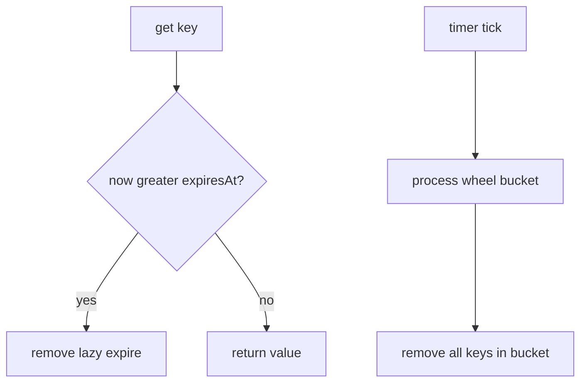
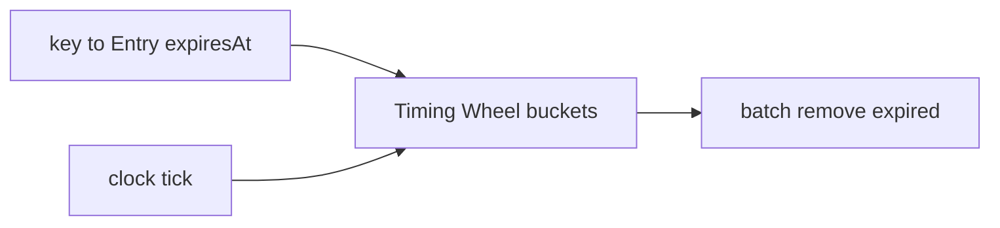
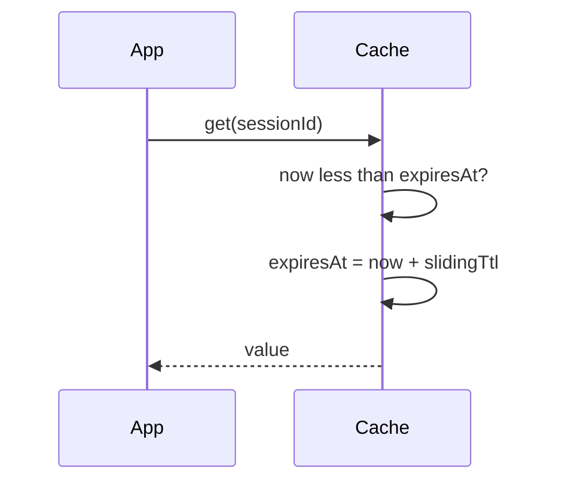

# TTL Soft References and Coalesced Expiry

## Overview

**Time-to-live (TTL)** caches expire entries after a wall-clock or logical duration—orthogonal to capacity eviction. **Soft references** (Java `SoftReference`, Python `weakref` patterns) let the **GC** reclaim memory under pressure before TTL fires. **Coalesced expiry** batches expiration work via **timing wheels** or **priority queues** instead of per-key timers.

Distributed TTL (Redis `EXPIRE`, cache headers) belongs in [[07-Backend/README|Backend]]. This note covers in-process expiry mechanics paired with [[04-Data-Structures/11-Caches-and-Eviction/LRU via Hash Map and Doubly Linked List|LRU]] or LFU.

## Learning Objectives

- Implement TTL on get/put with lazy vs proactive expiry
- Compare absolute expiry (`expiresAt`) vs sliding TTL (refresh on access)
- Explain soft reference semantics vs strong cache entries
- Design coalesced expiry wheel for O(1) bucket processing
- Combine TTL with capacity eviction ordering

## Prerequisites

- [[04-Data-Structures/11-Caches-and-Eviction/Cache ADT Get Put and Capacity|Cache ADT Get Put and Capacity]]
- [[04-Data-Structures/11-Caches-and-Eviction/LRU via Hash Map and Doubly Linked List|LRU via Hash Map and Doubly Linked List]]

## Difficulty

`intermediate`

## Estimated Time

- Reading: 2 hours
- Exercises: 2 hours
- Mini project: 3 hours

## History

DNS TTL (1980s) popularized time-bound caching. JVM soft references (Java 1.2) bridged caching and memory management. Netty and Kafka use **hierarchical timing wheels** for millions of timeouts with low overhead.

## Problem It Solves

Stale data causes bugs; infinite TTL causes unbounded wrongness. Per-key `setTimeout` for 1M keys wastes memory and scheduler overhead. TTL fields + batch expiry process due keys efficiently.

## Internal Implementation

### Entry metadata

```text
Entry { value, expiresAtEpochMs, optional: slidingTtlMs }
```

### Lazy expiry

On `get`: if `now > expiresAt`, treat as miss and remove. Cheap; dead keys linger until touched or sweep.

### Proactive expiry

Background tick or timing wheel bucket fires → remove all keys in bucket. Hashed wheel: O(1) insert; process bucket linked list on tick.

### Soft references

Store `SoftReference<V>`; GC clears referent under memory pressure. `get` returns null → reload. **Non-deterministic** eviction—complement with strong TTL cap.

### TTL + capacity

Typical order: (1) reject if expired on access, (2) if still full, capacity evict (LRU).



## Invariants

- **T1 (Expiry semantics)**: After `expiresAt`, `get` must not return value unless sliding TTL refreshed legally on that get.
- **T2 (Monotonic clock)**: Comparisons use consistent clock source; document NTP jump behavior.
- **T3 (Wheel mapping)**: Each key scheduled in exactly one bucket for its expiry slot (or heap entry).
- **T4 (Capacity independent)**: Expired entries don't count toward size after purge completes.
- **T5 (Soft ref)**: Strong map may hold key while referent null—must treat as miss and optionally remove key.

## Operation Complexity

| Operation | Lazy TTL | Timing wheel |
| --- | --- | --- |
| `get` | O(1) + expire check | O(1) |
| `put` | O(1) | O(1) schedule |
| Expire sweep | O(k) on tick | O(k) keys in bucket |
| Space | O(n) entries | O(n) + wheel slots |

## Mermaid Diagrams

### Structure: map + expiry wheel



### Sequence: sliding TTL on get



## Examples

### Minimal Example

**TypeScript**:

```typescript
type TTLEntry<V> = { value: V; expiresAt: number };

export class TTLCache<K, V> {
  private store = new Map<K, TTLEntry<V>>();

  constructor(
    private readonly ttlMs: number,
    private readonly sliding: boolean = false,
    private readonly now: () => number = () => Date.now()
  ) {}

  get(key: K): V | undefined {
    const e = this.store.get(key);
    if (!e) return undefined;
    if (this.now() >= e.expiresAt) {
      this.store.delete(key);
      return undefined;
    }
    if (this.sliding) e.expiresAt = this.now() + this.ttlMs;
    return e.value;
  }

  put(key: K, value: V, ttlMs = this.ttlMs): void {
    this.store.set(key, { value, expiresAt: this.now() + ttlMs });
  }

  purgeExpired(): number {
    const t = this.now();
    let n = 0;
    for (const [k, e] of this.store) {
      if (t >= e.expiresAt) {
        this.store.delete(k);
        n++;
      }
    }
    return n;
  }
}
```

**Python** — coalesced bucket demo:

```python
import time
from collections import defaultdict, deque
from dataclasses import dataclass
from typing import Deque, Dict, Generic, Optional, TypeVar

K = TypeVar("K")
V = TypeVar("V")

@dataclass
class _Entry(Generic[V]):
    value: V
    expires_at: float

class CoalescedTTLCache(Generic[K, V]):
    """Fixed-slot timing wheel concept (simplified)."""

    def __init__(self, ttl_sec: float, wheel_slots: int = 60) -> None:
        self.ttl_sec = ttl_sec
        self.wheel_slots = wheel_slots
        self._store: Dict[K, _Entry[V]] = {}
        self._wheel: list[Deque[K]] = [deque() for _ in range(wheel_slots)]
        self._slot = 0

    def put(self, key: K, value: V) -> None:
        expires_at = time.monotonic() + self.ttl_sec
        self._store[key] = _Entry(value, expires_at)
        bucket = (self._slot + int(self.ttl_sec)) % self.wheel_slots
        self._wheel[bucket].append(key)

    def tick(self) -> int:
        self._slot = (self._slot + 1) % self.wheel_slots
        removed = 0
        now = time.monotonic()
        while self._wheel[self._slot]:
            key = self._wheel[self._slot].popleft()
            entry = self._store.get(key)
            if entry and now >= entry.expires_at:
                del self._store[key]
                removed += 1
        return removed

    def get(self, key: K) -> Optional[V]:
        entry = self._store.get(key)
        if not entry:
            return None
        if time.monotonic() >= entry.expires_at:
            del self._store[key]
            return None
        return entry.value
```

### Production-Shaped Example

Run `purgeExpired()` on interval jittered ±10% to avoid thundering herd. Metric: `cache_expired_total`, `cache_live_entries`. For JVM, document `-XX:SoftRefLRUPolicyMSPerMB` interaction with soft caches.

## Trade-offs

| Dimension | Upside | Downside | When it matters |
| --- | --- | --- | --- |
| Lazy vs proactive | Simple lazy | Zombie keys | Memory pressure |
| Sliding TTL | Active sessions stay | Hot keys never expire | Session caches |
| Soft refs | GC-aware reclaim | Non-deterministic | Image thumbnail caches |
| Timing wheel | O(1) batch expire | Approximate buckets | Many short TTLs |

### When to Use

- API responses with freshness bound
- Session tokens with idle timeout (sliding)
- Memory-sensitive caches with soft ref + TTL cap

### When Not to Use

- Strong consistency required without version checks
- TTL precision sub-millisecond with huge key count (use heap)
- When expiry logic belongs at CDN/HTTP layer only

## Exercises

1. Implement absolute vs sliding TTL; compare behavior on periodic access.
2. Simulate timing wheel with 60 slots, TTL 120s—discuss bucket collision.
3. Merge TTL cache with LRU capacity=100; define eviction order.
4. What happens on clock jump backward/forward?
5. When does soft reference return null without TTL expiry?

## Mini Project

Session cache: sliding TTL + max capacity LRU; export active session count.

## Portfolio Project

Expiry wheel micro-benchmark vs `setTimeout` per key (Node) or timer heap.

## Interview Questions

1. Lazy vs proactive expiration?
2. Sliding vs absolute TTL?
3. How does timing wheel coalesce expiry?
4. Soft reference vs weak reference in caches?
5. TTL vs capacity eviction—which runs first?

### Stretch / Staff-Level

1. Design hierarchical timing wheel for 1M concurrent timeouts (Netty model).
2. Handle leap seconds and monotonic vs wall clock in TTL caches.

## Common Mistakes

- Wall clock for expiry under DST/NTP jumps without monotonic scheduling
- Never purging—memory leak of expired untouched keys
- Sliding TTL on every peek breaking scan semantics
- Assuming soft refs guarantee LRU order under GC

## Best Practices

- Prefer **monotonic clock** for duration; wall clock for absolute wall-time expiry
- Jitter background sweeps
- Combine TTL with max size always
- Document staleness contract to callers

## Summary

TTL caches bound staleness with per-entry expiry metadata. Lazy checks on read are simple; timing wheels batch proactive removal at scale. Soft references delegate pressure eviction to the GC but need TTL caps for predictability. Combine time-based and capacity-based eviction for production in-process caches.

## Further Reading

- [[00-References/Data Structures/README|Data Structures References]]
- Varghese & Lauck — timing wheels paper
- Java SoftReference javadoc

## Related Notes

- [[04-Data-Structures/11-Caches-and-Eviction/Cache ADT Get Put and Capacity|Cache ADT Get Put and Capacity]]
- [[04-Data-Structures/11-Caches-and-Eviction/LRU via Hash Map and Doubly Linked List|LRU via Hash Map and Doubly Linked List]]
- [[04-Data-Structures/11-Caches-and-Eviction/LFU Clock and Segmented LRU Concepts|LFU Clock and Segmented LRU Concepts]]
- [[04-Data-Structures/14-Production-Selection/Measuring Structures in Production|Measuring Structures in Production]]
- [[04-Data-Structures/14-Production-Selection/From In-Memory Structures to Systems|From In-Memory Structures to Systems]]

## Progress Checklist

- [ ] Explained from first principles
- [ ] Drew at least one Mermaid diagram
- [ ] Implemented a minimal version
- [ ] Documented trade-offs and non-goals
- [ ] Completed exercises
- [ ] Practiced interview questions aloud
- [ ] Linked prerequisites and dependents
