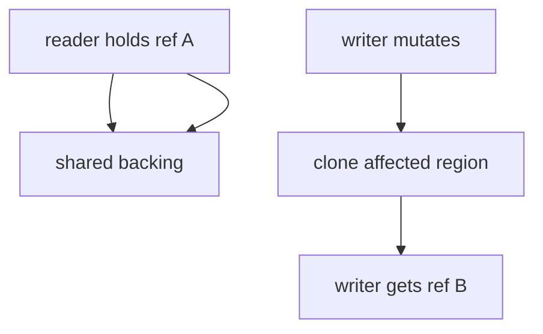
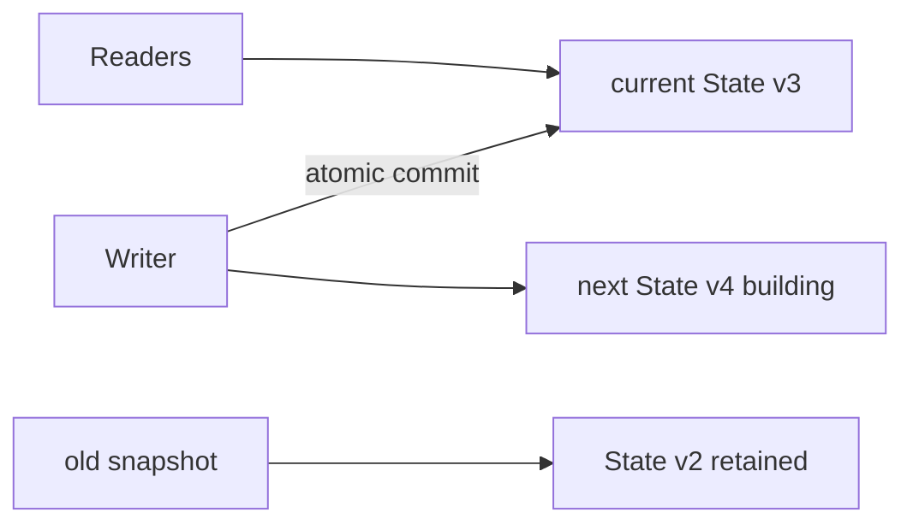
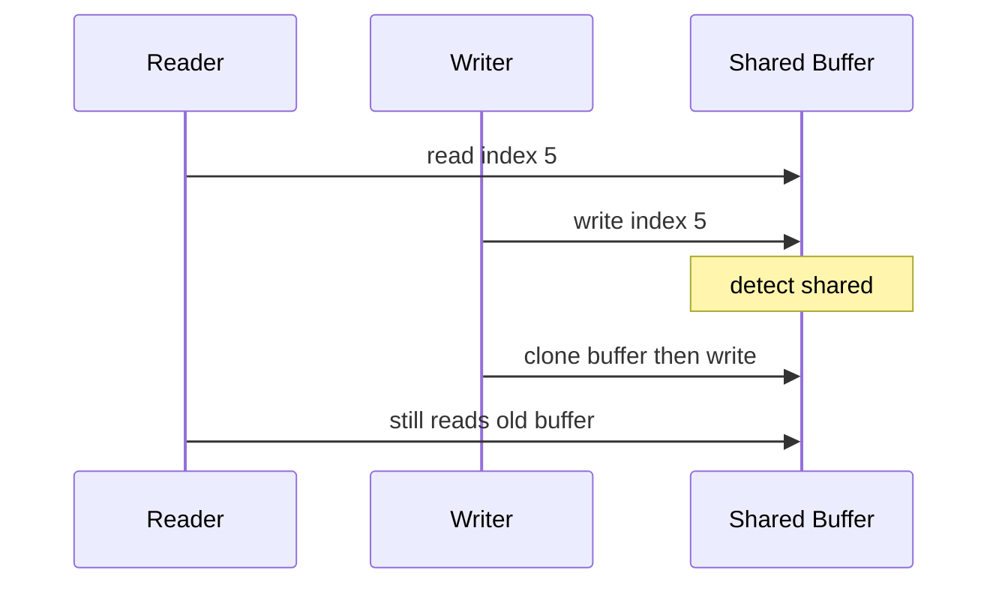

# Copy-on-Write and In-Process Snapshots

## Overview

**Copy-on-write (COW)** delays copying until mutation: readers and writers share pages or objects until a write occurs, then copy the affected region. **In-process snapshots** capture a consistent view of state at a point in time—via COW, persistent roots, or atomic pointer swap.

OS fork COW and database MVCC are related ideas in [[08-Databases/README|Databases]] and systems tracks. Here: application-level COW containers and snapshot patterns for data structures.

## Learning Objectives

- Implement COW wrapper: share until first mutating write
- Compare COW vs persistent path copy vs full clone
- Design snapshot API: `snapshot()`, `readSnapshot(s)`, `commit()`
- Explain double-buffer and RCU-style pointer flip (concept link)
- Identify when COW saves memory vs adds overhead

## Prerequisites

- [[04-Data-Structures/12-Persistent-and-Immutable/Persistence Structural Sharing and Path Copying|Persistence Structural Sharing and Path Copying]]
- [[04-Data-Structures/00-Orientation-and-Contracts/Memory Layout Locality and Allocation Patterns|Memory Layout Locality and Allocation Patterns]]

## Difficulty

`advanced`

## Estimated Time

- Reading: 2 hours
- Exercises: 2 hours
- Mini project: 3 hours

## History

Unix fork (1970s) used memory COW. Persistent functional structures use logical COW via path copying. Application servers use COW snapshots for config, feature flags, and in-memory indexes served to readers while writers build next version.

## Problem It Solves

Readers need stable view while writers update. Full copy on each read snapshot is O(n). COW shares until write touches page/branch—cheap snapshots when reads dominate or updates are sparse.

## Internal Implementation

### COW array (concept)

- `data: T[]` shared reference
- On `set(i, x)`: if shared flag, clone array, then write
- Readers holding old reference see old array unchanged

### Double buffering

- `current: State` readers use
- Writer builds `next: State`; atomic swap `current = next` on commit
- Snapshots retain pointer to old `current` until GC

### Persistent + COW hybrid

Immer: mutable draft mutates proxy; produce new immutable tree on `finalize`—COW at node granularity.



## Invariants

- **W1 (Reader stability)**: Snapshot reference observes no writes after snapshot taken.
- **W2 (COW trigger)**: Mutation never modifies shared backing without copy if other refs exist.
- **W3 (Atomic publish)**: Swap to new version is atomic w.r.t. readers (single pointer read).
- **W4 (No torn reads)**: Readers never see partially updated structure (use immutable publish or locks).
- **W5 (Reference counting optional)**: If RC/refcount, last writer frees old backing safely.

## Operation Complexity

| Pattern | snapshot | read | write (first) | write (unique) |
| --- | --- | --- | --- | --- |
| COW array | O(1) ref | O(1) | O(n) copy | O(1) |
| Path-copy tree | O(1) root | O(log n) | O(log n) | — |
| Double buffer | O(1) ptr | O(1) | O(n) build new | O(1) swap |

## Mermaid Diagrams

### Structure: double buffer snapshot



### Sequence: COW on first write



## Examples

### Minimal Example

**TypeScript**:

```typescript
export class CowArray<T> {
  private buf: T[];
  private shared = false;

  constructor(source?: T[]) {
    this.buf = source ? source.slice() : [];
  }

  private ensureUnique(): void {
    if (this.shared) {
      this.buf = this.buf.slice();
      this.shared = false;
    }
  }

  fork(): CowArray<T> {
    const child = new CowArray(this.buf);
    child.shared = true;
    this.shared = true;
    return child;
  }

  get(i: number): T {
    return this.buf[i];
  }

  set(i: number, v: T): void {
    this.ensureUnique();
    this.buf[i] = v;
  }
}
```

**Python**:

```python
from copy import copy
from typing import Generic, List, TypeVar

T = TypeVar("T")

class CowList(Generic[T]):
    def __init__(self, data: List[T] | None = None) -> None:
        self._buf = data if data is not None else []
        self._shared = False

    def _ensure_unique(self) -> None:
        if self._shared:
            self._buf = copy(self._buf)
            self._shared = False

    def fork(self) -> "CowList[T]":
        other = CowList(self._buf)
        other._shared = True
        self._shared = True
        return other

    def __getitem__(self, i: int) -> T:
        return self._buf[i]

    def __setitem__(self, i: int, v: T) -> None:
        self._ensure_unique()
        self._buf[i] = v

class SnapshotStore(Generic[T]):
    def __init__(self, initial: T) -> None:
        self._current = initial

    def snapshot(self) -> T:
        return self._current

    def publish(self, new_state: T) -> None:
        self._current = new_state
```

### Production-Shaped Example

In-memory **read model** for API: background job builds new `Map` index; `atomicPublish(newIndex)` swaps pointer; in-flight requests finish on old map. Metrics: `snapshot_age_ms`, `publish_duration`. See [[04-Data-Structures/13-Concurrency-Aware-Structures/Read-Copy-Update and Epoch Concepts|Read-Copy-Update and Epoch Concepts]] for reclamation.

## Trade-offs

| Dimension | Upside | Downside | When it matters |
| --- | --- | --- | --- |
| COW vs persistent | Simple for arrays | O(n) first write | Large flat buffers |
| Double buffer | Clean cutover | 2× peak memory during build | Index rebuild |
| vs locks | Readers lock-free | Writer builds full copy | Read-heavy |
| GC retention | Old snapshots linger | Memory until released | Long-lived snapshots |

### When to Use

- Periodic index/config refresh with mostly reads
- Forked state for speculative computation
- Arrays/maps with rare writes after snapshot

### When Not to Use

- Write-heavy with no sharing benefit
- Large structures with frequent small writes (path persistence wins)
- Cross-process durability needs

## Exercises

1. Fork COW array; write in one fork; verify other unchanged.
2. Implement double-buffer with `publish`; concurrent read simulation.
3. When does COW array lose to persistent vector?
4. Memory profile: 10 snapshots of 1MB array with 1% writes each.
5. Sketch RCU reclamation delay for old index after publish.

## Mini Project

Versioned config store: `get()`, `beginEdit()`, `commit()` with immutable publish.

## Portfolio Project

Benchmark COW array vs Immer vs persistent HAMT on realistic edit traces.

## Interview Questions

1. What triggers copy in COW?
2. Double buffering vs COW path copy?
3. How do readers see consistent snapshot without locks?
4. Unix fork COW analogy?
5. When is COW worse than in-place mutation?

### Stretch / Staff-Level

1. Design index rebuild without 2× memory peak (segment merge).
2. Combine COW with epoch-based reclamation for old snapshots.

## Common Mistakes

- Forgetting to mark shared on fork—silent mutation alias
- Publishing partially constructed state
- Holding snapshots indefinitely—memory leak
- COW on deeply nested mutable objects without deep copy

## Best Practices

- Publish only **immutable** snapshots to readers
- Limit snapshot retention; document lifecycle
- Measure copy cost on first write in production traces
- Use double buffer when rebuild is batch offline

## Summary

Copy-on-write shares backing storage until mutation forces a private copy. In-process snapshots expose stable references via COW, persistent structures, or atomic pointer swap to new immutable state. Choose COW for sparse writes on bulk data; prefer path-copy tries or double-buffer rebuilds for structured frequent updates.

## Further Reading

- [[00-References/Data Structures/README|Data Structures References]]
- Immer documentation — proxy COW semantics
- RCU and double-buffering systems papers

## Related Notes

- [[04-Data-Structures/12-Persistent-and-Immutable/Persistence Structural Sharing and Path Copying|Persistence Structural Sharing and Path Copying]]
- [[04-Data-Structures/12-Persistent-and-Immutable/Persistent Vectors and Maps Concepts|Persistent Vectors and Maps Concepts]]
- [[04-Data-Structures/12-Persistent-and-Immutable/Immutability for Concurrent Readers|Immutability for Concurrent Readers]]
- [[04-Data-Structures/13-Concurrency-Aware-Structures/Read-Copy-Update and Epoch Concepts|Read-Copy-Update and Epoch Concepts]]
- [[04-Data-Structures/14-Production-Selection/From In-Memory Structures to Systems|From In-Memory Structures to Systems]]

## Progress Checklist

- [ ] Explained from first principles
- [ ] Drew at least one Mermaid diagram
- [ ] Implemented a minimal version
- [ ] Documented trade-offs and non-goals
- [ ] Completed exercises
- [ ] Practiced interview questions aloud
- [ ] Linked prerequisites and dependents
