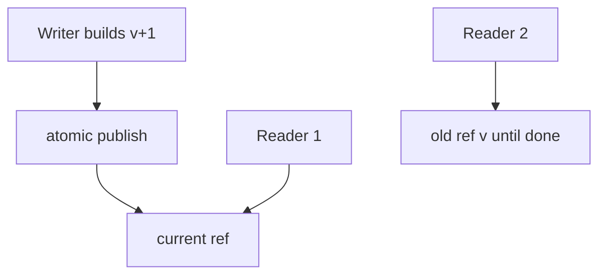
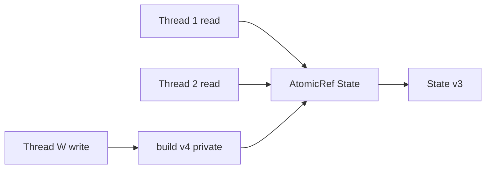
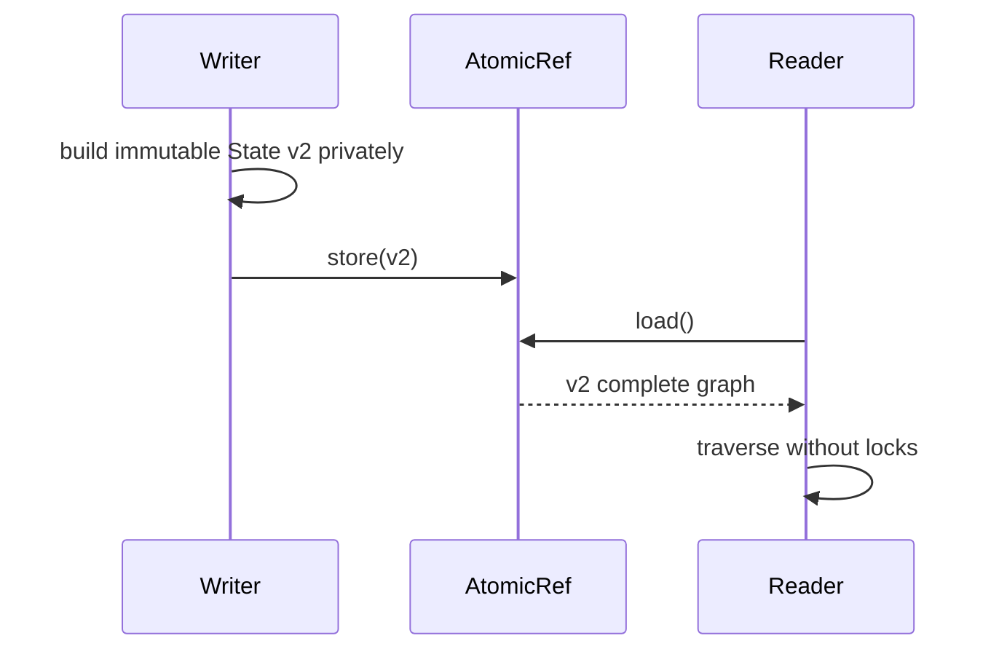

# Immutability for Concurrent Readers

## Overview

**Immutable data structures** enable **unbounded concurrent readers** without locks: if nothing mutates shared state, reads cannot observe torn writes or partial updates. Writers publish **new versions** via atomic pointer swap, RCU, or message passing; readers hold old versions until done.

This note connects persistence/COW to [[04-Data-Structures/13-Concurrency-Aware-Structures/Thread-Safety Classes|Thread-Safety Classes]]. Lock-free write algorithms are concepts in [[04-Data-Structures/13-Concurrency-Aware-Structures/Read-Copy-Update and Epoch Concepts|Read-Copy-Update and Epoch Concepts]]—not full lock-free implementation here.

## Learning Objectives

- Explain why immutable reads need no synchronization (happens-before via publish)
- Design read-mostly service state with atomic snapshot publish
- Identify **safe publication** pitfalls (partially constructed objects)
- Compare immutability vs read-write locks for read-heavy workloads
- Define when defensive copying still required at API boundaries

## Prerequisites

- [[04-Data-Structures/12-Persistent-and-Immutable/Persistence Structural Sharing and Path Copying|Persistence Structural Sharing and Path Copying]]
- [[04-Data-Structures/13-Concurrency-Aware-Structures/Thread-Safety Classes|Thread-Safety Classes]]

## Difficulty

`advanced`

## Estimated Time

- Reading: 2 hours
- Exercises: 2 hours
- Mini project: 3 hours

## History

Functional programming emphasized immutability for reasoning; multicore era applied it to avoid reader locks. Java `final` fields, volatile publication, and RCU in Linux kernel scale read-mostly paths to millions of QPS.

## Problem It Solves

Read-write locks serialize or cache-line bounce under high read concurrency. Immutable snapshots let readers traverse stable graphs with zero lock overhead—writers absorb copy/publish cost off hot path or in background.

## Internal Implementation

### Publish pattern

```text
atomicRef: ImmutableState

reader: load atomicRef → traverse (no lock)
writer: build newState → atomicRef.store(newState)
```

Readers may see stale state—often acceptable; document consistency model.

### Deep vs shallow immutability

- **Shallow frozen**: outer object immutable but nested mutable → unsafe
- **Deep persistent**: all reachable nodes immutable on publish

### Epoch reclamation

Readers announce critical section; old versions freed when no reader references—RCU concept.



## Invariants

- **I1 (Publication safety)**: No reference to new version published until fully constructed and deeply immutable (if promised).
- **I2 (Reader consistency)**: Single read of root reference sees consistent snapshot for immutable DAG.
- **I3 (No reader-side mutation)**: API prevents callers from mutating returned innards.
- **I4 (Writer isolation)**: Writer mutates private copy before publish—never shared mutable draft.
- **I5 (Lifecycle)**: Old versions reclaimed only when no concurrent reader holds them (GC or epoch).

## Operation Complexity

| Operation | Cost | Contention |
| --- | --- | --- |
| Read traverse | O(structure) | None on readers |
| Publish new version | O(build cost) | Single atomic write |
| RW lock read (compare) | O(1) acquire | Cache line bounce |

## Mermaid Diagrams

### Structure: readers + atomic root



### Sequence: safe publication



## Examples

### Minimal Example

**TypeScript**:

```typescript
import { deepFreeze } from "./freeze"; // utility

type Config = Readonly<{ flags: Readonly<Record<string, boolean>> }>;

export class ImmutableConfigService {
  private current: Config = deepFreeze({ flags: {} });

  get(): Config {
    return this.current; // readers: treat as read-only by convention
  }

  publish(flags: Record<string, boolean>): void {
    const next: Config = deepFreeze({ flags: { ...flags } });
    this.current = next; // single reference write — safe in JS single-threaded model
  }
}

function deepFreeze<T extends object>(obj: T): T {
  Object.freeze(obj);
  for (const v of Object.values(obj)) {
    if (v && typeof v === "object") deepFreeze(v as object);
  }
  return obj;
}
```

**Python**:

```python
from dataclasses import dataclass
from threading import Lock
from types import MappingProxyType
from typing import Mapping, Dict

@dataclass(frozen=True)
class Config:
    flags: Mapping[str, bool]

class ImmutableConfigService:
    def __init__(self) -> None:
        self._lock = Lock()
        self._current = Config(flags=MappingProxyType({}))

    def get(self) -> Config:
        return self._current  # frozen dataclass + mapping proxy

    def publish(self, flags: Dict[str, bool]) -> None:
        new_cfg = Config(flags=MappingProxyType(dict(flags)))
        with self._lock:
            self._current = new_cfg
```

Note: Python needs lock on publish for reference atomicity; readers still lock-free for immutable `Config`. JVM uses `volatile`/`final` for similar guarantees.

### Production-Shaped Example

Feature flag service: refresh every 30s builds new `Map`; `AtomicReference` swap; metrics on publish lag. Document **eventual consistency** for readers. For nested structures, use persistent maps from [[04-Data-Structures/12-Persistent-and-Immutable/Persistent Vectors and Maps Concepts|Persistent Vectors and Maps Concepts]].

## Trade-offs

| Dimension | Upside | Downside | When it matters |
| --- | --- | --- | --- |
| vs RW lock | Zero reader contention | Stale reads | Read 1000:1 write |
| vs mutable+lock | Simple reader code | Publish/copy cost | Config, routing tables |
| Deep immutable | True safety | Allocation | Shared nested state |
| Shallow freeze | Fast | Escape mutation | Disciplined codebase |

### When to Use

- Read-heavy global config, routing, taxonomy
- Analytics serving layer rebuilt periodically
- Functional UI state passed to pure components

### When Not to Use

- Strong read-your-writes on every request without versioning
- Massive objects rebuilt every write—too expensive
- Callers can mutate returned collections unless wrapped

## Exercises

1. Demonstrate shallow freeze bug: nested array mutated by reader.
2. Simulate 100 concurrent readers + periodic publish; measure vs RW lock.
3. Define happens-before for volatile publish in Java terms.
4. When is defensive `copy()` on get still required?
5. Sketch epoch table for 3 reader generations.

## Mini Project

Threaded read benchmark: immutable snapshot vs `RWLock` map serving.

## Portfolio Project

Read-mostly config module with publish metrics and deep-freeze tests.

## Interview Questions

1. Why don't readers need locks on immutable data?
2. Safe publication problem?
3. Stale reads vs strong consistency trade-off?
4. Shallow vs deep immutability?
5. How does RCU relate to immutable snapshots?

### Stretch / Staff-Level

1. Design multi-version index with bounded staleness SLA.
2. Compare immutability to seqlock for rarely changing config.

## Common Mistakes

- Returning mutable internal `Map` from `get()`
- Publishing before deep construction completes
- No retention policy for old versions under RCU
- Assuming immutability fixes all races on writer side

## Best Practices

- **Deep freeze** or persistent collections at publish boundary
- Return read-only views (`MappingProxy`, `Object.freeze`, unmodifiable wrappers)
- Document staleness tolerance in API
- Reclaim old versions with epoch/GC discipline

## Summary

Immutable snapshots let concurrent readers traverse stable structures without locks. Writers build new versions privately and atomically publish; readers may observe slightly stale but always consistent graphs. Deep immutability and safe publication are essential—shallow shortcuts expose data races through nested mutation.

## Further Reading

- [[00-References/Data Structures/README|Data Structures References]]
- Goetz — safe publication and final fields
- RCU literature (McKenney)

## Related Notes

- [[04-Data-Structures/12-Persistent-and-Immutable/Persistence Structural Sharing and Path Copying|Persistence Structural Sharing and Path Copying]]
- [[04-Data-Structures/12-Persistent-and-Immutable/Copy-on-Write and In-Process Snapshots|Copy-on-Write and In-Process Snapshots]]
- [[04-Data-Structures/13-Concurrency-Aware-Structures/Thread-Safety Classes|Thread-Safety Classes]]
- [[04-Data-Structures/13-Concurrency-Aware-Structures/Read-Copy-Update and Epoch Concepts|Read-Copy-Update and Epoch Concepts]]
- [[04-Data-Structures/13-Concurrency-Aware-Structures/False Sharing Padding and Contended Counters|False Sharing Padding and Contended Counters]]

## Progress Checklist

- [ ] Explained from first principles
- [ ] Drew at least one Mermaid diagram
- [ ] Implemented a minimal version
- [ ] Documented trade-offs and non-goals
- [ ] Completed exercises
- [ ] Practiced interview questions aloud
- [ ] Linked prerequisites and dependents
