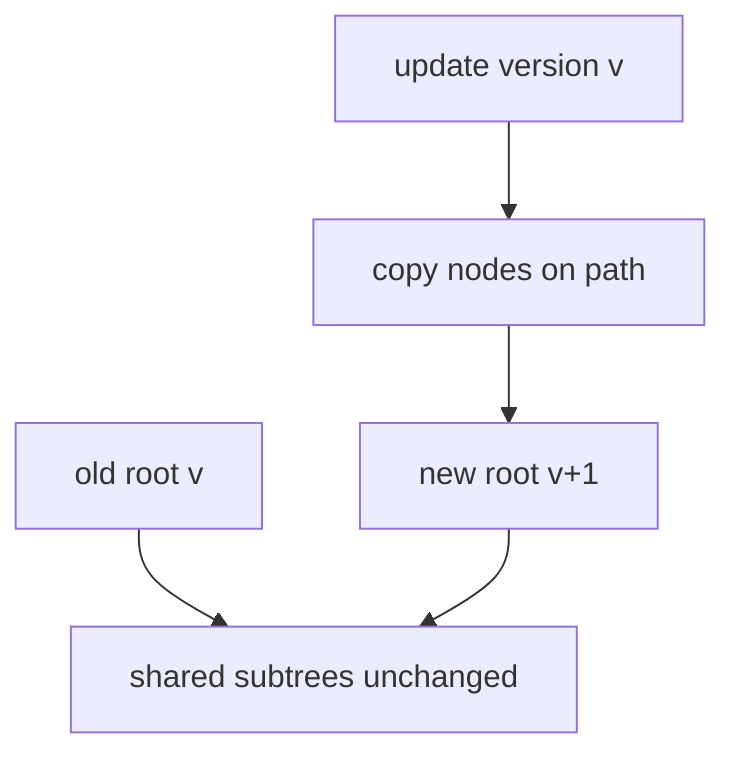
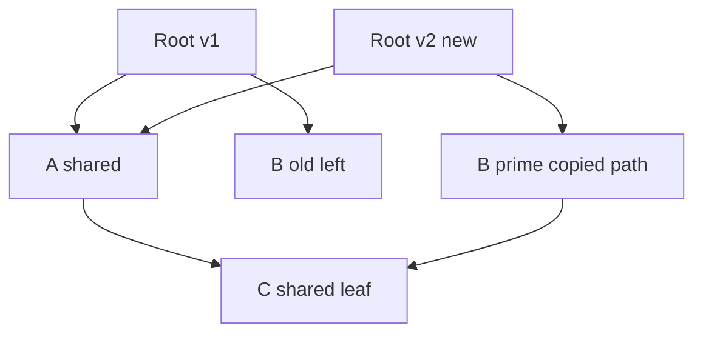
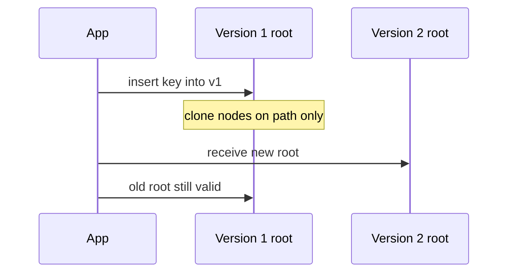

# Persistence Structural Sharing and Path Copying

## Overview

A **persistent** data structure preserves previous versions after update. **Purely functional** persistence never mutates nodes in place; **update** returns a new version while **structural sharing** reuses unchanged subtrees from prior versions.

**Path copying** implements persistence on trees: copy nodes along the search/update path only; shared subtrees off-path remain identical in memory. Contrast with **full copy** O(n) and **mutable** in-place O(1) but no history.

Disk-backed persistence (WAL, B-trees) is [[08-Databases/README|Databases]]. This note is in-memory functional persistence.

## Learning Objectives

- Distinguish persistent vs ephemeral vs mutable structures
- Implement path copying on a persistent BST or linked list
- Analyze time/space of update with sharing vs full clone
- Explain partial persistence, full persistence, confluence
- Connect sharing to [[04-Data-Structures/12-Persistent-and-Immutable/Immutability for Concurrent Readers|Immutability for Concurrent Readers]]

## Prerequisites

- [[04-Data-Structures/05-Trees-and-Ordered-Maps/Binary Search Trees|Binary Search Trees]]
- [[04-Data-Structures/00-Orientation-and-Contracts/Invariants Representation and Debug Assertions|Invariants Representation and Debug Assertions]]

## Difficulty

`advanced`

## Estimated Time

- Reading: 2 hours
- Exercises: 3 hours
- Mini project: 4 hours

## History

Functional languages (Lisp, ML) relied on persistence for semantics. Driscoll, Sarnak, Sleator, Tarjan (1986) classified persistence. Clojure's persistent collections (2007) popularized path copying and trie vectors for mainstream developers.

## Problem It Solves

Undo/redo, snapshots, and concurrent readers need **multiple versions** without O(n) copy per edit. Structural sharing makes version `v+1` cost O(log n) or O(1) for list prepend while retaining `v`.

## Internal Implementation

### Persistent linked list

Prepend new head pointing to old tail—O(1) new version, full share of tail.

### Path copying on tree

Insert into BST:

1. If empty, new leaf
2. Recursively insert; **clone** current node with new left/right child pointers
3. Return new root; old root still valid tree for old version

Only O(h) nodes allocated; height h.

### Fat nodes / node copying

Alternative: store version history in node (complex); path copying simpler for teaching.



## Invariants

- **P1 (Immutability)**: Published nodes never mutate after creation.
- **P2 (Version integrity)**: Old root remains valid representation of old version.
- **P3 (Sharing soundness)**: Shared subtrees are identical for all versions referencing them—no hidden mutation.
- **P4 (Structural equality)**: New version reflects update; unshared parts bitwise/new nodes only on path.
- **P5 (No cycles)**: Copy process preserves acyclic tree/list structure.

## Operation Complexity

| Operation | Path-copy tree | Persistent list prepend |
| --- | --- | --- |
| `update` | O(h) time, O(h) space | O(1) time, O(1) space |
| `lookup` | O(h) | O(n) worst |
| Old version access | O(1) retain root ptr | O(1) |
| Total memory | O(n + m·h) versions | O(n + m) for m prepends |

## Mermaid Diagrams

### Structure: two versions sharing subtree



### Sequence: insert with path copy



## Examples

### Minimal Example

**TypeScript**:

```typescript
type PSTNode = {
  key: number;
  value: string;
  left: PSTNode | null;
  right: PSTNode | null;
};

function clone(n: PSTNode): PSTNode {
  return { ...n, left: n.left, right: n.right };
}

export function pstInsert(root: PSTNode | null, key: number, value: string): PSTNode {
  if (!root) return { key, value, left: null, right: null };
  const n = clone(root);
  if (key < n.key) n.left = pstInsert(n.left, key, value);
  else if (key > n.key) n.right = pstInsert(n.right, key, value);
  else n.value = value;
  return n;
}

export function pstLookup(root: PSTNode | null, key: number): string | undefined {
  if (!root) return undefined;
  if (key < root.key) return pstLookup(root.left, key);
  if (key > root.key) return pstLookup(root.right, key);
  return root.value;
}
```

**Python**:

```python
from dataclasses import dataclass
from typing import Optional

@dataclass(frozen=True)
class PSTNode:
    key: int
    value: str
    left: Optional["PSTNode"] = None
    right: Optional["PSTNode"] = None

def pst_insert(root: Optional[PSTNode], key: int, value: str) -> PSTNode:
    if root is None:
        return PSTNode(key, value)
    if key < root.key:
        return PSTNode(root.key, root.value, pst_insert(root.left, key, value), root.right)
    if key > root.key:
        return PSTNode(root.key, root.value, root.left, pst_insert(root.right, key, value))
    return PSTNode(key, value, root.left, root.right)

def pst_lookup(root: Optional[PSTNode], key: int) -> Optional[str]:
    if root is None:
        return None
    if key < root.key:
        return pst_lookup(root.left, key)
    if key > root.key:
        return pst_lookup(root.right, key)
    return root.value
```

### Production-Shaped Example

Event sourcing in-process: each command returns new state root; store root pointer per sequence number. GC reclaims unreachable versions; retain last N roots for undo. See [[04-Data-Structures/12-Persistent-and-Immutable/Copy-on-Write and In-Process Snapshots|Copy-on-Write and In-Process Snapshots]] for bulk snapshot patterns.

## Trade-offs

| Dimension | Upside | Downside | When it matters |
| --- | --- | --- | --- |
| vs full copy | Cheap versions | Path alloc per update | Undo stacks |
| vs mutable | Safe sharing | Higher constant factors | Concurrent read |
| Path copy vs fat node | Simple | O(h) alloc per update | Deep trees |
| Memory | Sharing saves space | Many versions accumulate | Need retention policy |

### When to Use

- Undo/redo, temporal queries on in-memory state
- Functional state management (Redux reducers, React state)
- Readers holding old version while writers publish new

### When Not to Use

- Single mutable working copy suffices
- Updates extremely frequent and deep copies costly without balanced tree/trie
- Durability required—use database persistence

## Exercises

1. Insert 5 keys into persistent BST; draw shared nodes between v3 and v4.
2. Prove old root unchanged after update (referential transparency).
3. Compare memory: 1000 versions via path copy vs deep clone.
4. Implement persistent **prepend-only** list in O(1).
5. When does path copying degrade to O(n)? (Unbalanced tree.)

## Mini Project

Persistent map with `getVersion(n)` returning root at n-th update.

## Portfolio Project

Immutable state library with structural sharing metrics (nodes allocated vs shared).

## Interview Questions

1. What is structural sharing?
2. Path copying cost on balanced tree?
3. Persistent vs immutable—difference?
4. Why functional React state benefits from persistence?
5. Full persistence vs partial persistence?

### Stretch / Staff-Level

1. Make path copying BST self-balancing persistently—why hard?
2. Retention policy for old versions in memory-constrained service?

## Common Mistakes

- Mutating shared child after "copy" (breaks P1)
- Shallow copy of nested mutable objects inside "immutable" node
- Holding all versions forever—memory leak
- Confusing persistent with durable (disk)

## Best Practices

- Use **frozen** / readonly types at language level
- Deep-freeze nested objects or store immutable values only
- Cap version history or use structural sharing with GC
- Pair with balanced persistent trie (see next note) for large maps

## Summary

Persistent structures preserve old versions by allocating only along the update path and sharing unchanged subtrees. Path copying on trees costs O(height) per update while keeping prior roots valid. This enables cheap snapshots and safe concurrent reads without locks on immutable data.

## Further Reading

- [[00-References/Data Structures/README|Data Structures References]]
- Driscoll et al. — persistence classification
- Clojure persistent data structures talks

## Related Notes

- [[04-Data-Structures/12-Persistent-and-Immutable/Persistent Vectors and Maps Concepts|Persistent Vectors and Maps Concepts]]
- [[04-Data-Structures/12-Persistent-and-Immutable/Copy-on-Write and In-Process Snapshots|Copy-on-Write and In-Process Snapshots]]
- [[04-Data-Structures/12-Persistent-and-Immutable/Immutability for Concurrent Readers|Immutability for Concurrent Readers]]
- [[04-Data-Structures/05-Trees-and-Ordered-Maps/Binary Search Trees|Binary Search Trees]]
- [[04-Data-Structures/13-Concurrency-Aware-Structures/Read-Copy-Update and Epoch Concepts|Read-Copy-Update and Epoch Concepts]]

## Progress Checklist

- [ ] Explained from first principles
- [ ] Drew at least one Mermaid diagram
- [ ] Implemented a minimal version
- [ ] Documented trade-offs and non-goals
- [ ] Completed exercises
- [ ] Practiced interview questions aloud
- [ ] Linked prerequisites and dependents
