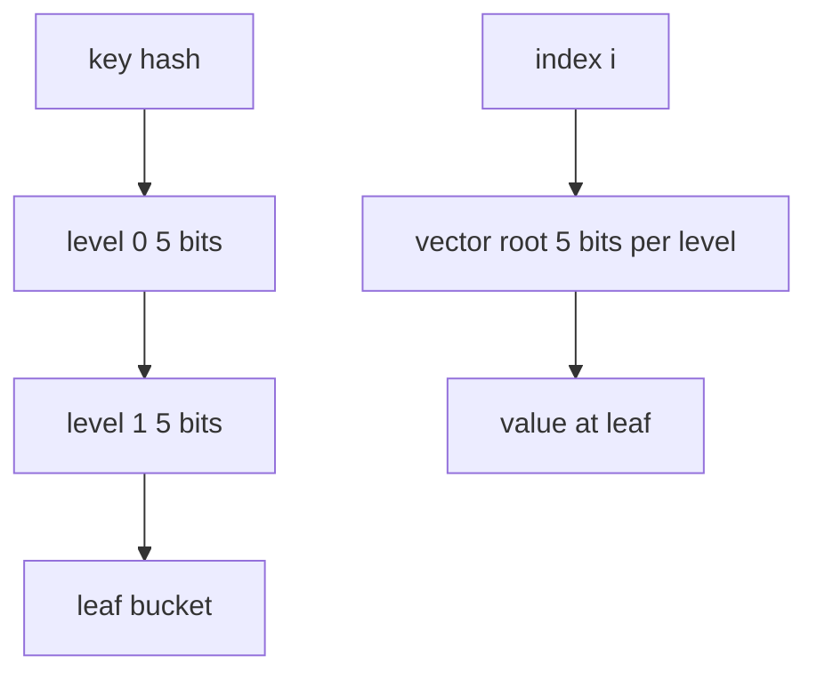
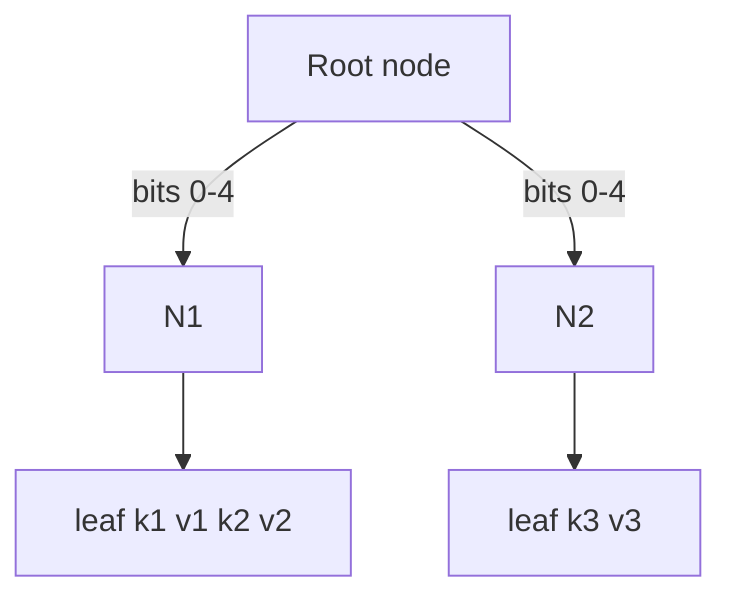
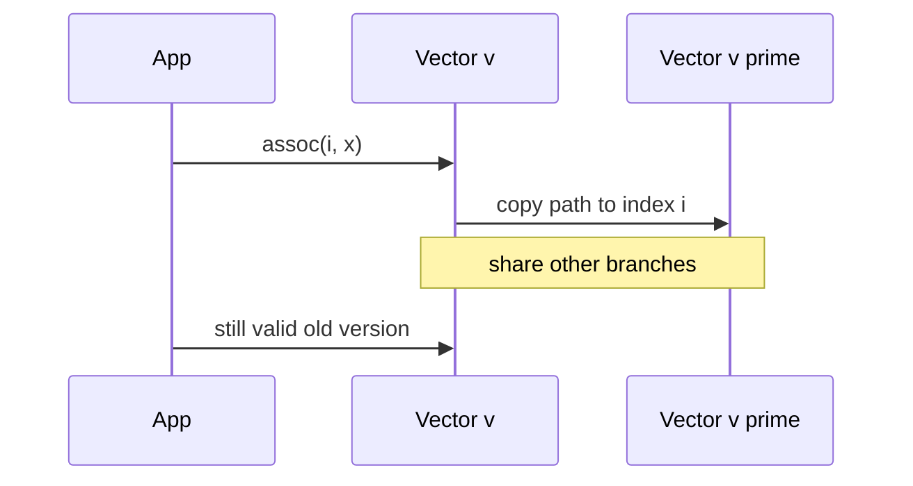

# Persistent Vectors and Maps Concepts

## Overview

**Persistent vectors** (Clojure-style) use **bit-partitioned trie** trees (32-way branching typical) for O(log₃₂ n) index/update with structural sharing. **Persistent maps** often use **Hash Array Mapped Tries (HAMT)**—hash bits navigate trie levels; leaf buckets hold entries.

Concepts note: full HAMT implementation is lengthy; focus on invariants, complexity, and demo slices. Clojure/Immutable.js internals; not disk B-trees ([[08-Databases/README|Databases]]).

## Learning Objectives

- Explain bit-partitioned trie indexing for persistent vectors
- Describe HAMT navigation by hash prefix chunks
- Analyze O(log n) update with 32-way branching as effectively O(1) for practical n
- Compare HAMT vs path-copy BST for associative map
- Relate to [[04-Data-Structures/12-Persistent-and-Immutable/Persistence Structural Sharing and Path Copying|Path Copying]]

## Prerequisites

- [[04-Data-Structures/12-Persistent-and-Immutable/Persistence Structural Sharing and Path Copying|Persistence Structural Sharing and Path Copying]]
- [[04-Data-Structures/04-Hash-Tables-and-Sets/Separate Chaining|Separate Chaining]]

## Difficulty

`advanced`

## Estimated Time

- Reading: 2 hours
- Exercises: 2 hours
- Mini project: 4 hours

## History

Phil Bagwell designed HAMT and bit-partitioned vectors for dynamic functional languages (Ideal Hash Trees, 2000). Clojure's `PersistentVector` and `PersistentHashMap` brought them to production JVM services; JavaScript Immutable.js followed.

## Problem It Solves

Dynamic arrays and hash maps are mutable O(1) but forbid cheap versioning. Persistent vectors/maps offer near-mutable performance with **immutable semantics**—critical for UI state, parallel pipelines, and audit trails.

## Internal Implementation

### Persistent vector

- **Depth**: tree of nodes with fanout 32 (5 bits per level)
- Index `i`: at each level take 5 bits of `i` to choose child
- **Update**: path-copy nodes along depth; leaf holds value
- **Tail buffer**: mutable 32-slot tail for append amortization (production optimization)

### HAMT map

- Hash key; consume 5 bits per level for child index
- Leaf: small array key-value pairs (≤16) or single entry
- **Insert**: path copy; split leaf on collision at depth
- **Bitmap indexed node**: compact sparse children (Bagwell optimization)



## Invariants

- **PV1 (Immutability)**: Nodes immutable after publish; updates return new root.
- **PV2 (Indexable)**: Vector version `v` maps index `i` to correct value if `i < count`.
- **HM1 (Associative)**: Map lookup returns value for key if present in version.
- **HM2 (Hash prefix)**: Navigation uses contiguous hash bit slices—consistent per key.
- **SH1 (Sharing)**: Unchanged subtrees shared between version `v` and `v'`.

## Operation Complexity

| Structure | lookup | update/assoc | append | Space |
| --- | --- | --- | --- | --- |
| Persistent vector | O(log₃₂ n) ≈ O(1)* | O(log₃₂ n) | O(1) amortized* | O(n) shared |
| HAMT map | O(log₃₂ n)* | O(log₃₂ n)* | — | O(n) |

*Effective constant for n < 2³² with 32-way branching.

## Mermaid Diagrams

### Structure: HAMT trie levels



### Sequence: vector assoc with path copy



## Examples

### Minimal Example — vector slice concept

**TypeScript**:

```typescript
type VecNode = { children: (VecNode | unknown)[] };

const WIDTH = 4; // demo: 2 bits per level
const MASK = WIDTH - 1;

function vecAssoc(root: VecNode | null, depth: number, index: number, value: unknown): VecNode {
  if (depth === 0) {
    const leaf: VecNode = root ? { children: [...root.children] } : { children: [] };
    leaf.children[index & MASK] = value;
    return leaf;
  }
  const childIdx = (index >> (depth * 2)) & MASK;
  const child = root?.children[childIdx] as VecNode | null;
  const newChild = vecAssoc(child, depth - 1, index, value);
  const children = root ? [...root.children] : new Array(WIDTH).fill(null);
  children[childIdx] = newChild;
  return { children };
}
```

**Python** — HAMT lookup concept:

```python
from dataclasses import dataclass
from typing import Any, Optional

CHUNK = 5  # 32-way

@dataclass(frozen=True)
class Leaf:
    entries: tuple[tuple[Any, Any], ...]

@dataclass(frozen=True)
class Branch:
    children: tuple[Optional["Node"], ...]

Node = Leaf | Branch

def hamt_get(node: Optional[Node], key: Any, h: int, shift: int) -> Optional[Any]:
    if node is None:
        return None
    if isinstance(node, Leaf):
        for k, v in node.entries:
            if k == key:
                return v
        return None
    idx = (h >> shift) & 31
    child = node.children[idx]
    return hamt_get(child, key, h, shift - CHUNK)

def hamt_assoc(node: Optional[Node], key: Any, value: Any, h: int, shift: int) -> Node:
    if node is None:
        return Leaf(((key, value),))
    if isinstance(node, Leaf):
        for i, (k, v) in enumerate(node.entries):
            if k == key:
                new = list(node.entries)
                new[i] = (key, value)
                return Leaf(tuple(new))
        return Leaf(node.entries + ((key, value),))
    idx = (h >> shift) & 31
    children = list(node.children)
    children[idx] = hamt_assoc(children[idx], key, value, h, shift - CHUNK)
    return Branch(tuple(children))
```

### Production-Shaped Example

Use library implementations (`Immutable.js`, `immer` with structural sharing, Clojure) in services. Profile: persistent update vs mutable copy-on-write for your object size. For TypeScript apps, **Immer** patches draft state into persistent tree—ergonomics without manual path copy.

## Trade-offs

| Dimension | Upside | Downside | When it matters |
| --- | --- | --- | --- |
| vs deep clone | Fast updates | Trie overhead small n | Large state trees |
| vs mutable map | Version safety | Constant factor | Redux/React |
| HAMT vs BST | Near O(1) practical | Implementation complex | Associative memory |
| Bitmap nodes | Memory compact | Bit ops complexity | JVM Clojure scale |

### When to Use

- Immutable app state with frequent small updates
- Parallel transforms forked from shared persistent collection
- Need rollback/time-travel debugging

### When Not to Use

- Hot numeric arrays—use typed arrays mutable
- When Immer/mutable COW wrapper sufficient
- Disk-resident maps—use B-tree engines

## Exercises

1. For n=10⁶, compute trie depth with fanout 32.
2. Trace HAMT insert colliding keys—leaf split behavior.
3. Compare `Object.assign` clone vs HAMT assoc for 1k-key map updates.
4. Why tail buffer helps vector append?
5. Implement 4-way demo vector `assoc` and count allocated nodes.

## Mini Project

Mini persistent vector with `get`, `assoc`, `append` and node allocation counter.

## Portfolio Project

Visualize structural sharing between versions in Structures Workbench.

## Interview Questions

1. How does persistent vector index routing work?
2. HAMT vs separate chaining hash map?
3. Effective complexity for 32-way trie at n=1M?
4. What is path copying in HAMT assoc?
5. Clojure vector tail buffer purpose?

### Stretch / Staff-Level

1. Bitmap-indexed node in Bagwell HAMT—why?
2. Transient mutable batch edits then freeze—when worth it?

## Common Mistakes

- Assuming O(1) strictly—it's O(log n) with tiny base
- Storing mutable objects inside "immutable" map values
- Reimplementing HAMT in app code without need
- Ignoring hash equality contract for keys

## Best Practices

- Use battle-tested libraries for production immutable collections
- Store immutable value types in leaves
- Measure allocation rate vs deep-clone baseline
- Cross-link COW note for hybrid approaches

## Summary

Persistent vectors and HAMT maps achieve immutable associative and indexed access via wide shallow tries and path copying. Practical fanout makes updates effectively constant for application-scale n while preserving old versions through structural sharing. Understand the concepts; rely on mature libraries for production implementations.

## Further Reading

- [[00-References/Data Structures/README|Data Structures References]]
- Bagwell — Ideal Hash Trees
- Clojure PersistentHashMap implementation notes

## Related Notes

- [[04-Data-Structures/12-Persistent-and-Immutable/Persistence Structural Sharing and Path Copying|Persistence Structural Sharing and Path Copying]]
- [[04-Data-Structures/12-Persistent-and-Immutable/Copy-on-Write and In-Process Snapshots|Copy-on-Write and In-Process Snapshots]]
- [[04-Data-Structures/12-Persistent-and-Immutable/Immutability for Concurrent Readers|Immutability for Concurrent Readers]]
- [[04-Data-Structures/05-Trees-and-Ordered-Maps/B-Trees and B-Plus Trees Concepts|B-Trees and B-Plus Trees Concepts]]
- [[04-Data-Structures/04-Hash-Tables-and-Sets/Separate Chaining|Separate Chaining]]

## Progress Checklist

- [ ] Explained from first principles
- [ ] Drew at least one Mermaid diagram
- [ ] Implemented a minimal version
- [ ] Documented trade-offs and non-goals
- [ ] Completed exercises
- [ ] Practiced interview questions aloud
- [ ] Linked prerequisites and dependents
