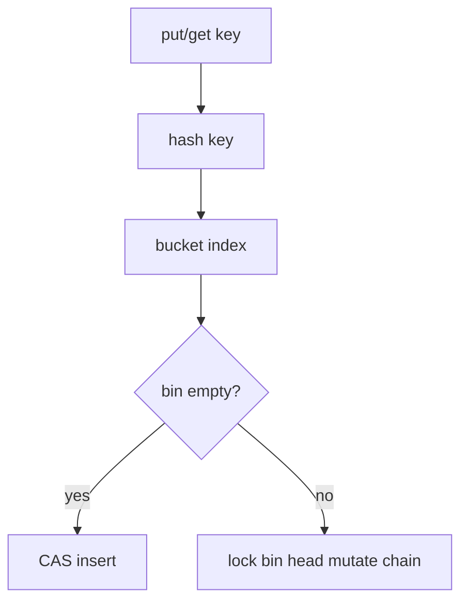
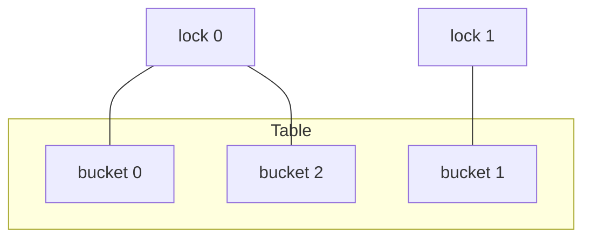
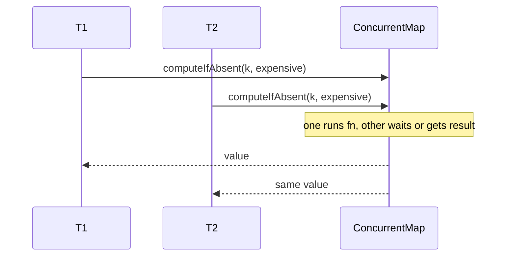

# Concurrent Hash Maps Concepts

## Overview

**Concurrent hash maps** allow parallel `get`/`put`/`remove` without a global mutex. Strategies include:

- **Striped locks**: lock per bucket or lock array segment
- **CAS on bins**: Java 8+ `ConcurrentHashMap` synchronized first node or tree bin
- **Lock-free snapshot**: `ConcurrentHashMap` aggregate ops; weakly consistent iteration

Concepts note—study Java/Guava implementations; don't reimplement lock-free hash map in app code without extreme need.

## Learning Objectives

- Contrast `HashMap` + global lock vs striped vs concurrent built-in
- Explain weakly consistent iterators vs fail-fast
- Describe `computeIfAbsent` atomicity guarantees
- Identify resize/rehash concurrency challenges
- Relate to [[04-Data-Structures/04-Hash-Tables-and-Sets/Hash-Flooding DoS and Randomized Hashing|Hash-Flooding DoS and Randomized Hashing]]

## Prerequisites

- [[04-Data-Structures/04-Hash-Tables-and-Sets/Separate Chaining|Separate Chaining]]
- [[04-Data-Structures/13-Concurrency-Aware-Structures/Thread-Safety Classes|Thread-Safety Classes]]

## Difficulty

`advanced`

## Estimated Time

- Reading: 2 hours
- Exercises: 2 hours
- Mini project: 3 hours

## History

Early `Hashtable` synchronized every method—simple but slow. Java 5 `ConcurrentHashMap` introduced segment locks; Java 8 redesigned with CAS + synchronized bin heads for lower memory and better spread.

## Problem It Solves

Shared caches, session stores, and deduplication tables need parallel access. Coarse lock on entire map limits throughput to one op at a time; fine-grained locking scales with independent keys.

## Internal Implementation

### Striped lock map (concept)

```text
locks[i = hash(k) mod S]
lock(i); operate bucket; unlock(i)
```

Resize: lock all stripes or double-buffer table.

### ConcurrentHashMap-style (concept)

- Array of bin heads; CAS insert empty bin
- Collisions: synchronized on first node or treeify
- `size` approximate or `LongAdder` sum of segment counts

### Atomic compute

`computeIfAbsent(k, fn)`: only one thread runs `fn` for missing key—critical for memoization.



## Invariants

- **CH1 (Per-key atomicity)**: Single-key put/get/remove atomic w.r.t. other ops on same key (API dependent).
- **CH2 (No structural corruption)**: Chains remain valid under concurrent ops—implementation responsibility.
- **CH3 (Weak iteration)**: Iterator reflects state at some point during iteration—not ConcurrentModificationException.
- **CH4 (Hash contract)**: Immutable keys; stable hash during op.
- **CH5 (Compute once)**: `computeIfAbsent` invokes mapping function at most once per key insertion race (Java semantics).

## Operation Complexity

| Op | Average | Under contention |
| --- | --- | --- |
| `get` | O(1) | Scales if different bins |
| `put` | O(1) | Bin lock serializes same bucket |
| `computeIfAbsent` | O(1) | May block on same key |
| Iterate | O(n) | Weak snapshot |

Same asymptotics as sequential map; constant factors and scalability differ.

## Mermaid Diagrams

### Structure: segments / stripes



### Sequence: computeIfAbsent



## Examples

### Minimal Example

**TypeScript** — striped lock map:

```typescript
export class StripedHashMap<K, V> {
  private buckets: Array<Array<[K, V]>> = Array.from({ length: 64 }, () => []);
  private locks: Promise<void>[] = Array.from({ length: 16 }, () => Promise.resolve());

  private stripe(key: K): number {
    return this.hash(key) & 15;
  }
  private bucket(key: K): number {
    return this.hash(key) & 63;
  }

  constructor(private hash: (k: K) => number, private equal: (a: K, b: K) => boolean) {}

  async get(key: K): Promise<V | undefined> {
    const s = this.stripe(key);
    await this.locks[s]; // conceptual mutex per stripe
    const bin = this.buckets[this.bucket(key)];
    for (const [k, v] of bin) if (this.equal(k, key)) return v;
    return undefined;
  }

  async put(key: K, value: V): Promise<void> {
    const s = this.stripe(key);
    const b = this.bucket(key);
    const bin = this.buckets[b];
    for (const entry of bin) {
      if (this.equal(entry[0], key)) {
        entry[1] = value;
        return;
      }
    }
    bin.push([key, value]);
  }
}
```

**Python**:

```python
import threading
from typing import Callable, Generic, List, Optional, Tuple, TypeVar

K = TypeVar("K")
V = TypeVar("V")

class StripedHashMap(Generic[K, V]):
    def __init__(
        self,
        hash_fn: Callable[[K], int],
        eq: Callable[[K, K], bool],
        buckets: int = 64,
        stripes: int = 16,
    ) -> None:
        self._hash = hash_fn
        self._eq = eq
        self._buckets: List[List[Tuple[K, V]]] = [[] for _ in range(buckets)]
        self._locks = [threading.Lock() for _ in range(stripes)]
        self._stripes = stripes
        self._bucket_count = buckets

    def _stripe(self, key: K) -> int:
        return self._hash(key) % self._stripes

    def _bucket(self, key: K) -> int:
        return self._hash(key) % self._bucket_count

    def get(self, key: K) -> Optional[V]:
        with self._locks[self._stripe(key)]:
            for k, v in self._buckets[self._bucket(key)]:
                if self._eq(k, key):
                    return v
            return None

    def put(self, key: K, value: V) -> None:
        with self._locks[self._stripe(key)]:
            bin_ = self._buckets[self._bucket(key)]
            for i, (k, _) in enumerate(bin_):
                if self._eq(k, key):
                    bin_[i] = (key, value)
                    return
            bin_.append((key, value))
```

### Production-Shaped Example

Use `ConcurrentHashMap`, `concurrent.futures` patterns, or `Map` with external sharding only after profiling. For memoization:

```python
# Python 3.9+ dict preserves insertion; use lock for computeIfAbsent pattern
cache: dict[str, object] = {}
lock = threading.Lock()

def get_or_compute(key: str) -> object:
    if key in cache:
        return cache[key]
    with lock:
        if key not in cache:
            cache[key] = expensive(key)
        return cache[key]
```

## Trade-offs

| Dimension | Upside | Downside | When it matters |
| --- | --- | --- | --- |
| vs global lock | Parallel different keys | Same-bin contention | Hot shared map |
| Striped vs CHM | Teachable | Coarser than bin-level | Medium concurrency |
| Weak iterator | No throw on mutate | Non-snapshot exact | Streaming keys |
| Immutable snapshot | Lock-free read | Stale | Read-mostly |

### When to Use

- Shared memoization, rate limit counters, session attribute maps
- Parallel stream aggregation to concurrent map
- Need atomic `computeIfAbsent` for expensive init

### When Not to Use

- Per-request maps (confine instead)
- Keys with poor hash under adversarial input without mitigation
- Iteration requiring strict point-in-time snapshot

## Exercises

1. Race two threads `putIfAbsent` same key—observe duplicate compute without sync.
2. Count lock collisions when stripe count << thread count.
3. Explain Java CHM size() approximation.
4. When does treeified bin help concurrent map?
5. Compare immutable snapshot publish vs concurrent map for read-heavy config.

## Mini Project

Striped map stress test vs `synchronized` wrapper—throughput vs stripe count.

## Portfolio Project

Concurrent memoization service with duplicate-compute metrics.

## Interview Questions

1. Why is HashMap unsafe concurrent?
2. Segment/stripe lock idea?
3. `computeIfAbsent` vs check-then-put?
4. Weakly consistent iteration meaning?
5. Resize problem in concurrent hash table?

### Stretch / Staff-Level

1. Java 8 CHM bin synchronization vs segment locks—trade-off?
2. Design sharded counter map avoiding hot single key.

## Common Mistakes

- Compound ops without atomic API
- Mutable keys changing hash while in map
- Assuming iterator snapshot is exact
- One global lock disguised as "concurrent" wrapper only on get/put individually

## Best Practices

- Use platform concurrent map implementations
- Immutable keys; randomized hashing for untrusted keys
- Prefer `computeIfAbsent` over manual double-checked locking
- Consider immutable publish for read-mostly large maps

## Summary

Concurrent hash maps scale parallel access via striped or per-bin synchronization and CAS where safe. They preserve expected O(1) ops while reducing contention versus global locks. Understand atomic compound APIs and weak iteration semantics—prefer library implementations over custom lock-free tables in application code.

## Further Reading

- [[00-References/Data Structures/README|Data Structures References]]
- Java ConcurrentHashMap javadoc and Doug Lea design notes

## Related Notes

- [[04-Data-Structures/04-Hash-Tables-and-Sets/Separate Chaining|Separate Chaining]]
- [[04-Data-Structures/04-Hash-Tables-and-Sets/Hash-Flooding DoS and Randomized Hashing|Hash-Flooding DoS and Randomized Hashing]]
- [[04-Data-Structures/13-Concurrency-Aware-Structures/Thread-Safety Classes|Thread-Safety Classes]]
- [[04-Data-Structures/13-Concurrency-Aware-Structures/False Sharing Padding and Contended Counters|False Sharing Padding and Contended Counters]]
- [[04-Data-Structures/12-Persistent-and-Immutable/Immutability for Concurrent Readers|Immutability for Concurrent Readers]]

## Progress Checklist

- [ ] Explained from first principles
- [ ] Drew at least one Mermaid diagram
- [ ] Implemented a minimal version
- [ ] Documented trade-offs and non-goals
- [ ] Completed exercises
- [ ] Practiced interview questions aloud
- [ ] Linked prerequisites and dependents
