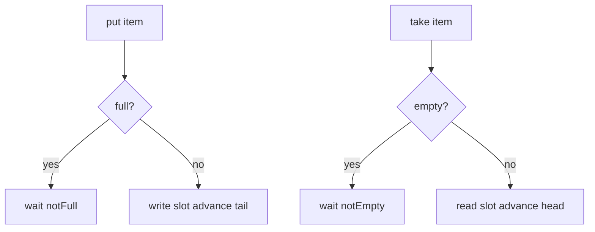
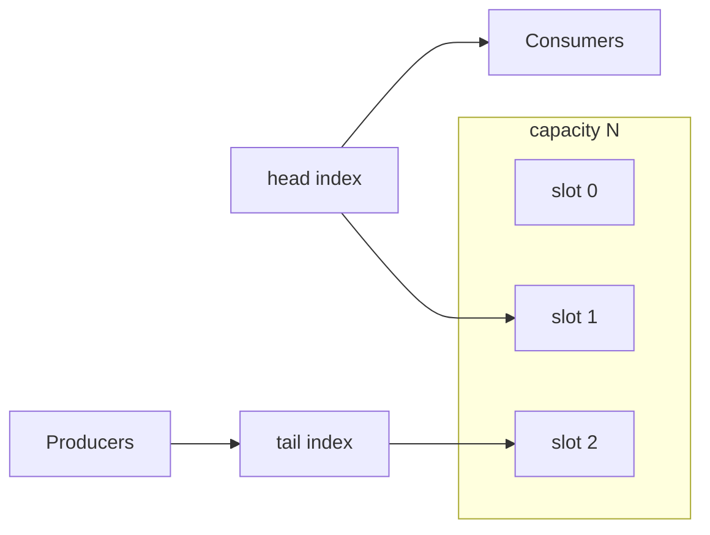
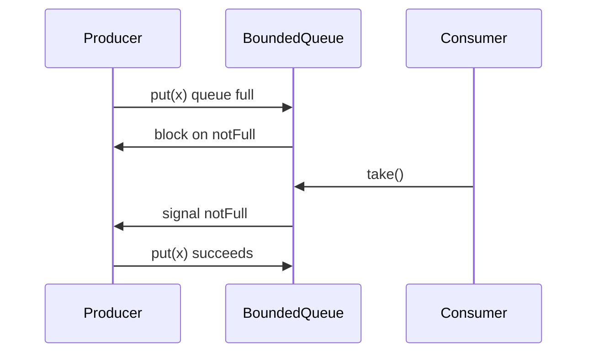

# Concurrent Queues

## Overview

**Concurrent queues** connect producers and consumers across threads with **FIFO** (or priority) ordering and defined **blocking**, **bounded**, or **lock-free** semantics. Patterns span:

- **Mutex + condition variable** bounded buffer (correct baseline)
- **`ConcurrentLinkedQueue`** (Michael & Scott lock-free M&S queue — concept)
- **Disruptor** ring buffer (specialized MPMC)

This note teaches ADT contracts and bounded-buffer implementation; full lock-free MPMC is **concept-level**—see [[04-Data-Structures/13-Concurrency-Aware-Structures/Read-Copy-Update and Epoch Concepts|Read-Copy-Update and Epoch Concepts]] for memory reclamation context.

## Learning Objectives

- Implement bounded blocking queue with mutex and condition variables
- Compare SPSC vs MPMC queue requirements
- Explain wait/notify backpressure semantics
- Identify false sharing risks on head/tail indices
- Choose concurrent queue vs channel (async) in application architecture

## Prerequisites

- [[04-Data-Structures/03-Stacks-Queues-and-Deques/Queues|Queues]]
- [[04-Data-Structures/03-Stacks-Queues-and-Deques/Bounded Buffers and Producer-Consumer Interfaces|Bounded Buffers and Producer-Consumer Interfaces]]
- [[04-Data-Structures/13-Concurrency-Aware-Structures/Thread-Safety Classes|Thread-Safety Classes]]

## Difficulty

`advanced`

## Estimated Time

- Reading: 2 hours
- Exercises: 3 hours
- Mini project: 4 hours

## History

Producer-consumer problem from Dijkstra semaphores; bounded buffers in every OS pipe. Lock-free queues (1990s–) enabled low-latency finance and logging; LMAX Disruptor (2011) optimized cache-friendly ring MPMC.

## Problem It Solves

Threads must exchange work items without data races and with **backpressure** when consumers lag. Naive `push` to shared array races on size and indices.

## Internal Implementation

### Bounded buffer (mutex)

- Ring buffer array, `head`, `tail`, `count` or sacrifice slot to distinguish full/empty
- `put`: wait while full; write slot; signal notEmpty
- `take`: wait while empty; read slot; signal notFull

### Lock-free concept (Michael-Scott)

- Singly linked queue; atomic CAS on `tail` and `head`
- **Dummy node** simplifies empty queue
- ABA and reclamation need epoch/hazard pointers (concept)

### SPSC optimization

Single producer single consumer: **lock-free ring** with memory barriers only—no mutex.



## Invariants

- **Q1 (FIFO)**: Items dequeued in order enqueued (per priority level if priority queue).
- **Q2 (Bounded)**: `count ≤ capacity` always.
- **Q3 (No lost items)**: Successful put eventually visible to take unless explicitly cleared.
- **Q4 (Index wrap)**: Ring indices modulo capacity consistent with count.
- **Q5 (Happens-before)**: Successful put happens-before corresponding take observes item.

## Operation Complexity

| Implementation | put | take | Notes |
| --- | --- | --- | --- |
| Mutex bounded | O(1)* | O(1)* | *May block |
| Lock-free M&S | O(1) | O(1) | CAS retry under contention |
| SPSC ring | O(1) | O(1) | No locks |

## Mermaid Diagrams

### Structure: bounded ring buffer



### Sequence: block on full



## Examples

### Minimal Example

**TypeScript** — async bounded queue (single-threaded event loop pattern; mutex concept via Promise queue):

```typescript
export class AsyncBoundedQueue<T> {
  private buf: (T | undefined)[];
  private head = 0;
  private tail = 0;
  private count = 0;
  private waiters: Array<(ok: boolean) => void> = [];

  constructor(private capacity: number) {
    this.buf = new Array(capacity);
  }

  async put(item: T): Promise<void> {
    while (this.count === this.capacity) {
      await new Promise<boolean>((r) => this.waiters.push(r));
    }
    this.buf[this.tail] = item;
    this.tail = (this.tail + 1) % this.capacity;
    this.count++;
    this.drainWaiters();
  }

  async take(): Promise<T> {
    while (this.count === 0) {
      await new Promise<boolean>((r) => this.waiters.push(r));
    }
    const item = this.buf[this.head]!;
    this.head = (this.head + 1) % this.capacity;
    this.count--;
    this.drainWaiters();
    return item;
  }

  private drainWaiters(): void {
    while (this.waiters.length && this.count > 0 && this.count < this.capacity) {
      this.waiters.shift()!(true);
    }
  }
}
```

**Python** — threading bounded queue:

```python
import threading
from collections import deque
from typing import Deque, Generic, TypeVar

T = TypeVar("T")

class BoundedBlockingQueue(Generic[T]):
    def __init__(self, capacity: int) -> None:
        self._capacity = capacity
        self._buf: Deque[T] = deque()
        self._lock = threading.Lock()
        self._not_empty = threading.Condition(self._lock)
        self._not_full = threading.Condition(self._lock)

    def put(self, item: T) -> None:
        with self._not_full:
            while len(self._buf) >= self._capacity:
                self._not_full.wait()
            self._buf.append(item)
            self._not_empty.notify()

    def take(self) -> T:
        with self._not_empty:
            while not self._buf:
                self._not_empty.wait()
            item = self._buf.popleft()
            self._not_full.notify()
            return item
```

### Production-Shaped Example

Use `java.util.concurrent.ArrayBlockingQueue` or Python `queue.Queue` in thread pools. Pad head/tail counters to separate cache lines if implementing custom SPSC—see [[04-Data-Structures/13-Concurrency-Aware-Structures/False Sharing Padding and Contended Counters|False Sharing Padding and Contended Counters]]. Instrument queue depth p99 for capacity tuning.

## Trade-offs

| Dimension | Upside | Downside | When it matters |
| --- | --- | --- | --- |
| Bounded vs unbounded | Backpressure | Blocking producers | Memory safety |
| Mutex vs lock-free | Simple correct | Contention latency | Finance/logging |
| SPSC vs MPMC | Fastest | Restricted topology | Pipeline stages |
| Deque vs queue | Steal work | Complex | Fork/join pools |

### When to Use

- Thread pool work queues
- Log/event buffering between stages
- Backpressure between fast producer and slow consumer

### When Not to Use

- Cross-process messaging—use message broker ([[07-Backend/README|Backend]])
- When async channels (`asyncio.Queue`) suffice in single-threaded event loop
- Priority ordering needs heap-based concurrent priority queue

## Exercises

1. Implement bounded ring with `Array` and verify Q1–Q4 under stress test.
2. Demonstrate lost wakeup if notify omitted—fix with while loops.
3. Compare `deque`+lock vs `queue.Queue` latency.
4. SPSC ring buffer sketch without mutex.
5. When does unbounded queue OOM the process?

## Mini Project

Producer-consumer benchmark: varying producers/consumors, measure throughput vs bounded capacity.

## Portfolio Project

Worker pool with instrumented bounded queue depth metrics.

## Interview Questions

1. Bounded vs unbounded queue trade-off?
2. Why while-loop around wait, not if?
3. Michael-Scott queue dummy node purpose?
4. SPSC optimization when applicable?
5. Backpressure strategies when queue full?

### Stretch / Staff-Level

1. Disruptor vs `ArrayBlockingQueue` — sequence barriers concept.
2. Lock-free queue memory reclamation problem summary.

## Common Mistakes

- Notifying wrong condition (notFull vs notEmpty)
- Using `if` instead of `while` for spurious wakeup
- Shared head/tail on same cache line—false sharing
- Unbounded queue hiding consumer slowdown until OOM

## Best Practices

- Size bounded queues from consumer throughput × tolerated lag
- Expose queue depth metrics
- Prefer library concurrent queues over custom lock-free initially
- Use SPSC rings between dedicated pipeline stages when proven hot

## Summary

Concurrent queues implement thread-safe FIFO handoff with optional blocking at capacity bounds. Mutex plus condition variables provide the correct baseline; lock-free and SPSC variants optimize hot paths at complexity cost. Define boundedness and backpressure explicitly—unbounded queues defer failure to OOM.

## Further Reading

- [[00-References/Data Structures/README|Data Structures References]]
- Michael & Scott — lock-free queue paper
- LMAX Disruptor technical paper

## Related Notes

- [[04-Data-Structures/03-Stacks-Queues-and-Deques/Queues|Queues]]
- [[04-Data-Structures/03-Stacks-Queues-and-Deques/Bounded Buffers and Producer-Consumer Interfaces|Bounded Buffers and Producer-Consumer Interfaces]]
- [[04-Data-Structures/01-Contiguous-Sequences/Ring Buffers as Contiguous Queues|Ring Buffers as Contiguous Queues]]
- [[04-Data-Structures/13-Concurrency-Aware-Structures/Thread-Safety Classes|Thread-Safety Classes]]
- [[04-Data-Structures/13-Concurrency-Aware-Structures/False Sharing Padding and Contended Counters|False Sharing Padding and Contended Counters]]

## Progress Checklist

- [ ] Explained from first principles
- [ ] Drew at least one Mermaid diagram
- [ ] Implemented a minimal version
- [ ] Documented trade-offs and non-goals
- [ ] Completed exercises
- [ ] Practiced interview questions aloud
- [ ] Linked prerequisites and dependents
