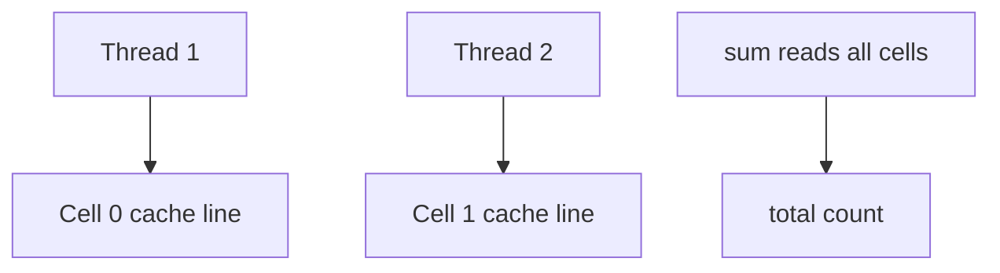
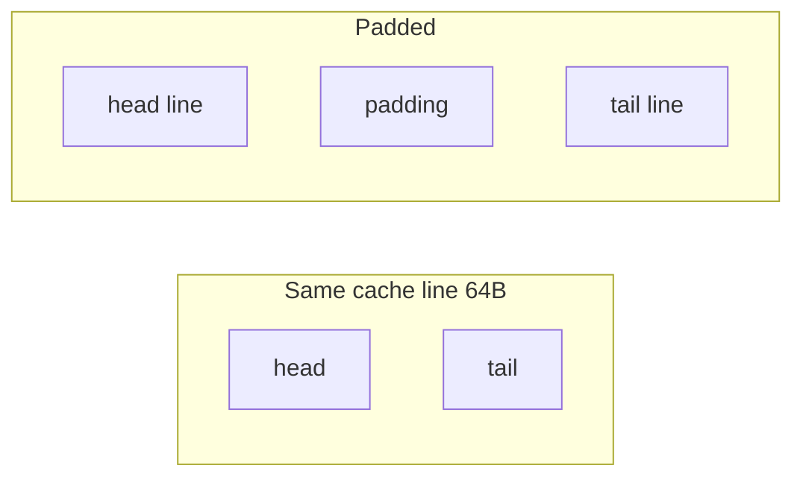
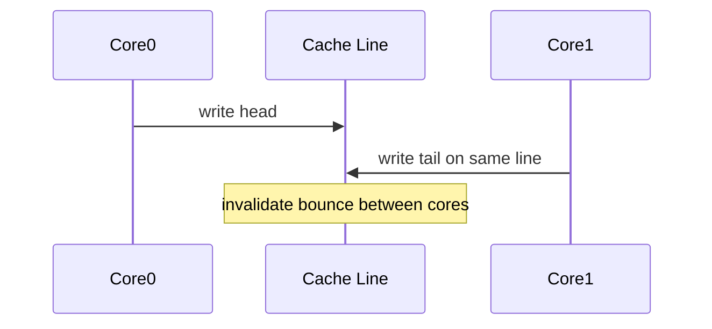

# False Sharing Padding and Contended Counters

## Overview

**False sharing** occurs when independent variables on the **same cache line** (typically 64 bytes) are mutated by different threads—cores invalidate each other's caches despite no logical data race. **Padding** separates hot fields onto distinct lines. **Contended counters** (global `++requests`) serialize cache line ownership; **striped counters** (`LongAdder`, `Striped64`) reduce contention by accumulating per-cell then summing.

Critical for concurrent queue head/tail, metrics, and lock-free structures—not abstract CS trivia.

## Learning Objectives

- Explain cache line coherence and false sharing mechanism
- Pad or align fields to avoid adjacent hot writes
- Replace hot global counter with striped/adder pattern
- Detect false sharing with perf counters (concept)
- Apply to ring buffer indices and statistics in concurrent structures

## Prerequisites

- [[01-Computer-Science/02-Machine-Model/Cache Hierarchy and Locality|Cache Hierarchy and Locality]]
- [[04-Data-Structures/13-Concurrency-Aware-Structures/Thread-Safety Classes|Thread-Safety Classes]]

## Difficulty

`advanced`

## Estimated Time

- Reading: 1.5 hours
- Exercises: 2 hours
- Mini project: 2 hours

## History

Multicore scalability exposed silent performance cliffs—2000s Java `@Contended` and C++ `alignas(64)` patterns. Java 8 `LongAdder` popularized dynamic striped accumulation for metrics.

## Problem It Solves

A logically thread-safe counter can throughput-collapse at millions of ops/sec because every increment fights for one cache line. Separating or sharding counters restores scalability.

## Internal Implementation

### False sharing example

```text
struct { long head; long tail; }  // same 64B line
Thread A increments head, Thread B increments tail → line ping-pong
```

Fix: pad `head` and `tail` to separate cache lines (`alignas(64)` or 8×long padding in Java).

### Striped counter (LongAdder concept)

- Array of `Cell` values indexed by thread hash
- `add(x)`: increment own cell; create cells on contention
- `sum()`: fold all cells—O(cells) not hot path

### Per-thread counters

ThreadLocal accumulators; aggregate on read—zero contention, delayed visibility.



## Invariants

- **FS1 (Logical independence)**: Padded fields logically independent—padding not part of model.
- **FS2 (Counter monotonicity)**: Striped adder sum equals total increments minus explicit resets (within visibility rules).
- **FS3 (Alignment)**: Hot mutable fields intended exclusive per line meet alignment ≥ cache line size.
- **FS4 (Sum staleness)**: `sum()` is snapshot—not atomic with concurrent adds unless quiescent.

## Operation Complexity

| Pattern | Increment | Read total |
| --- | --- | --- |
| Global atomic | O(1) high contention | O(1) |
| Padded separate fields | O(1) low if separate lines | O(1) |
| Striped adder | O(1) low contention | O(stripes) |
| ThreadLocal | O(1) no contention | O(threads) aggregate |

## Mermaid Diagrams

### Structure: false sharing vs padded



### Sequence: cache line invalidation



## Examples

### Minimal Example

**TypeScript** — separate counter objects (conceptual padding):

```typescript
// Avoid: single object { a: 0, b: 0 } mutated by two workers on adjacent fields
class PaddedCounter {
  // In native code use alignment; JS demo uses separate heap objects
  private cells = Array.from({ length: 16 }, () => ({ v: 0 }));

  add(threadId: number, delta = 1): void {
    this.cells[threadId & 15].v += delta;
  }

  sum(): number {
    return this.cells.reduce((s, c) => s + c.v, 0);
  }
}
```

**Python**:

```python
import threading
from typing import List

class StripedCounter:
    def __init__(self, stripes: int = 16) -> None:
        self._cells: List[int] = [0] * stripes
        self._locks: List[threading.Lock] = [threading.Lock() for _ in range(stripes)]
        self._stripes = stripes

    def add(self, thread_id: int, delta: int = 1) -> None:
        i = thread_id % self._stripes
        with self._locks[i]:
            self._cells[i] += delta

    def sum(self) -> int:
        return sum(self._cells)
```

Production Java: `LongAdder`; C++: alignas(64) on atomics.

### Production-Shaped Example

Metrics in hot path: `requests_total` via LongAdder per service instance; scrape `sum()` every 15s. Ring buffer SPSC: pad `head` and `tail` to 64-byte boundaries in native extension. Profile with `perf c2c` (Linux) if suspect false sharing.

## Trade-offs

| Dimension | Upside | Downside | When it matters |
| --- | --- | --- | --- |
| Padding | Restores scalability | Memory waste | MPMC queues |
| LongAdder | Fast increment | Slow/approx sum | Metrics |
| ThreadLocal | Zero contention | Aggregation cost | Per-thread stats |
| Global atomic | Simple exact | Contended | Low QPS counters |

### When to Use

- High-frequency counters (QPS, bytes in/out)
- Adjacent atomic indices (head/tail) updated by different threads
- Microbenchmark shows scalability cliff vs thread count

### When Not to Use

- Low-frequency updates—premature optimization
- When exact instantaneous value required on every read
- Language without alignment control and no native helper

## Exercises

1. Microbench shared vs padded counters with 8 threads (conceptual design).
2. Calculate memory cost padding 8 fields to 64B each.
3. When is ThreadLocal counter better than LongAdder?
4. Ring buffer: which indices to pad for MPMC vs SPSC?
5. Read Java `@Contended` annotation purpose.

## Mini Project

Benchmark global `AtomicLong` vs striped counter under parallel increments.

## Portfolio Project

Add false-sharing detection notes to Structures Workbench perf module.

## Interview Questions

1. What is false sharing?
2. Typical cache line size?
3. LongAdder vs AtomicLong?
4. How to fix head/tail false sharing in queue?
5. Is false sharing a data race?

### Stretch / Staff-Level

1. `@Contended` vs manual padding in JVM object layout.
2. When striped counter sum is acceptable as approximate metric?

## Common Mistakes

- Padding every field blindly—inflates memory without profiling
- Assuming `AtomicLong` scales because "atomic"
- Reading LongAdder sum on hot path every request
- Packing multiple atomics in one struct in C++/Rust without align

## Best Practices

- Profile before padding; verify with hardware counters
- Use library adders (`LongAdder`, Prometheus client patterns)
- Separate producer and consumer index cache lines in custom queues
- Document metric scrape interval vs real-time accuracy

## Summary

False sharing slows concurrent structures when independent hot fields share a cache line. Padding or alignment separates them; contended global counters yield to striped or per-thread accumulation. These microarchitecture effects explain why logically correct concurrent code still fails to scale—and how to fix it in queues, maps, and metrics.

## Further Reading

- [[00-References/Data Structures/README|Data Structures References]]
- Java LongAdder source and `@Contended` JEP
- Herlihy & Shavit — memory consistency and performance

## Related Notes

- [[01-Computer-Science/02-Machine-Model/Cache Hierarchy and Locality|Cache Hierarchy and Locality]]
- [[04-Data-Structures/13-Concurrency-Aware-Structures/Concurrent Queues|Concurrent Queues]]
- [[04-Data-Structures/13-Concurrency-Aware-Structures/Concurrent Hash Maps Concepts|Concurrent Hash Maps Concepts]]
- [[04-Data-Structures/00-Orientation-and-Contracts/Memory Layout Locality and Allocation Patterns|Memory Layout Locality and Allocation Patterns]]
- [[04-Data-Structures/14-Production-Selection/Measuring Structures in Production|Measuring Structures in Production]]

## Progress Checklist

- [ ] Explained from first principles
- [ ] Drew at least one Mermaid diagram
- [ ] Implemented a minimal version
- [ ] Documented trade-offs and non-goals
- [ ] Completed exercises
- [ ] Practiced interview questions aloud
- [ ] Linked prerequisites and dependents
